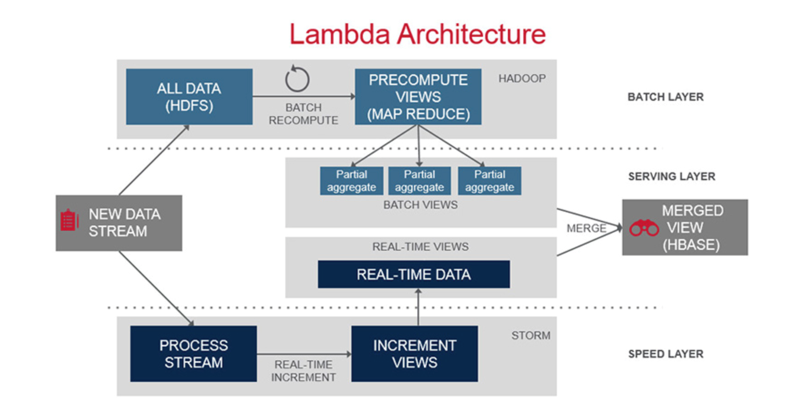
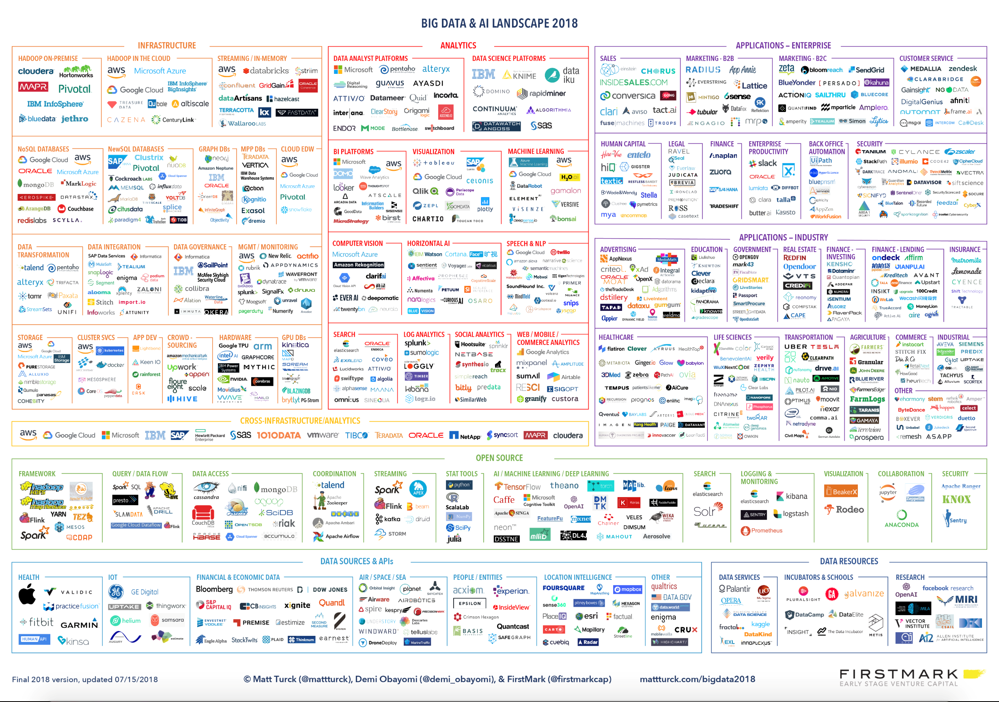
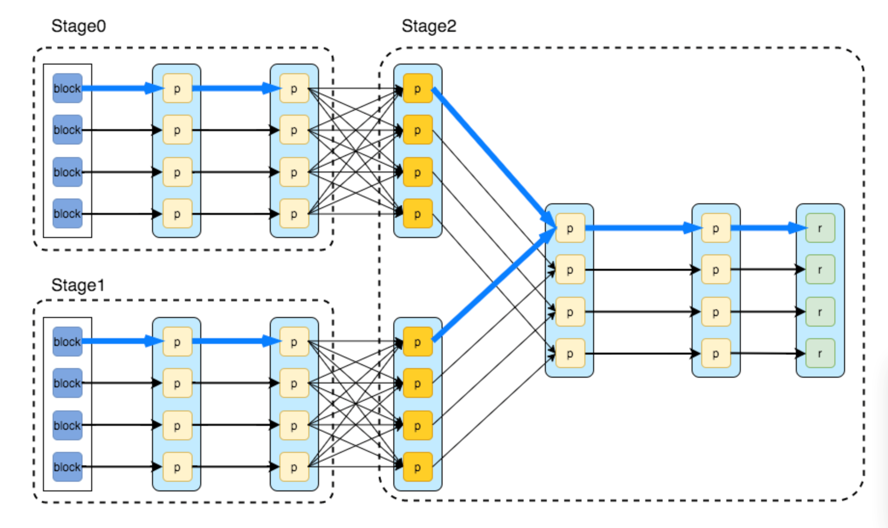
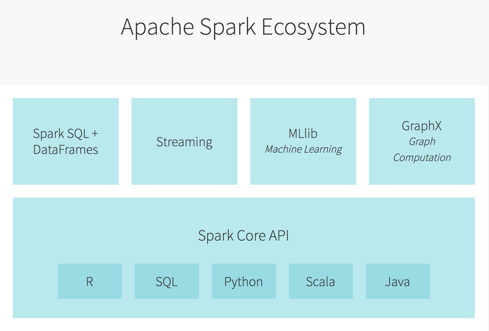
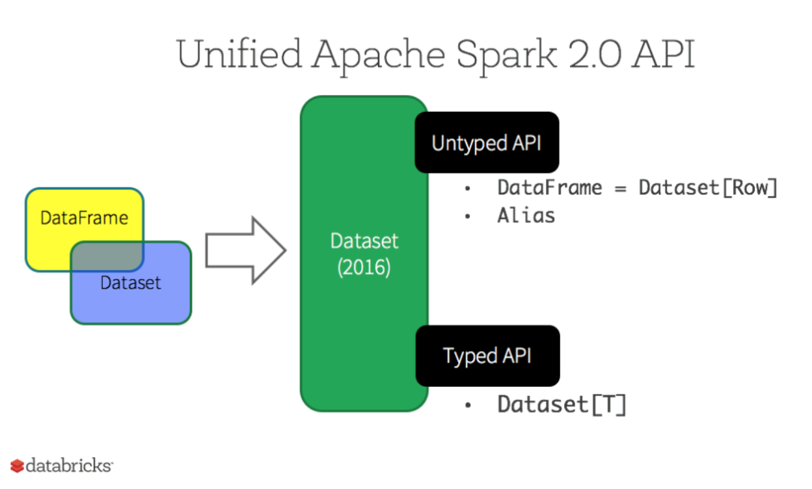
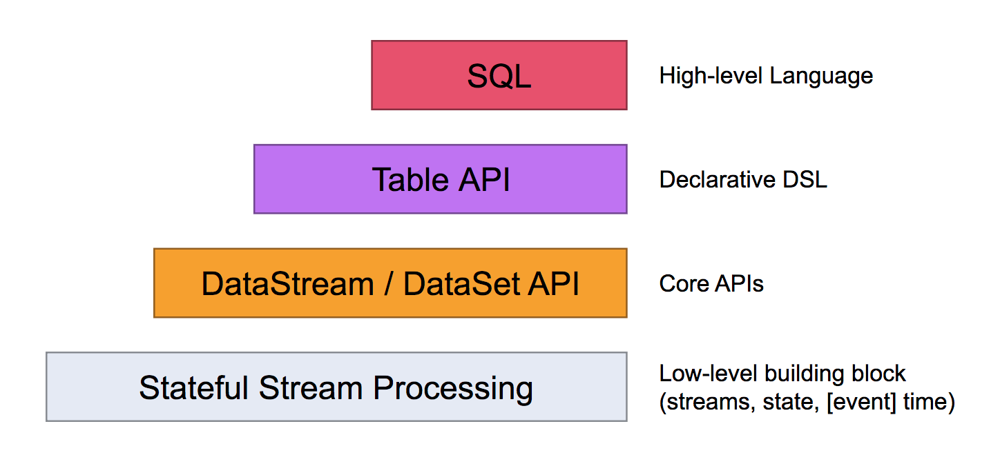

# Spark 与 Flink对比

原文：https://www.infoq.cn/article/spark-vs-flink

## 下一代大数据计算引擎

​        自从数据处理需求超过了传统数据库能有效处理的数据量之后，Hadoop 等各种基于 MapReduce 的海量数据处理系统应运而生。从 2004 年 Google 发表 MapReduce 论文开始，经过近 10 年的发展，基于 Hadoop 开源生态或者其它相应系统的海量数据处理已经成为业界的基本需求。

​        但是，很多机构在开发自己的数据处理系统时都会发现需要面临一系列的问题。从数据中获取价值需要的投入远远超过预期。常见的问题包括：

- 非常陡峭的学习曲线。刚接触这个领域的人经常会被需要学习的技术的数量砸晕。不像经过几十年发展的数据库一个系统可以解决大部分数据处理需求， Hadoop 等大数据生态里的一个系统往往在一些数据处理场景上比较擅长，另一些场景凑合能用，还有一些场景完全无法满足需求。结果就是需要好几个系统来处理不同的场景。

​        上图是一个典型的 lambda 架构，只是包含了批处理和流处理两种场景，就已经牵涉到至少四五种技术了，还不算每种技术的可替代选择。再加上实时查询，交互式分析，机器学习等场景，每个场景都有几种技术可以选择，每个技术涵盖的领域还有不同方式的重叠。结果就是一个业务经常需要使用四五种以上的技术才能支持好一个完整的数据处理流程。加上调研选型，需要了解的数目还要多得多。

​        下图是大数据领域的全景。有没有晕？

- 开发和运行效率低下。因为牵涉到多种系统，每种系统有自己的开发语言和工具，开发效率可想而知。而因为采用了多套系统，数据需要在各个系统之间传输，也造成了额外的开发和运行代价，数据的一致也难以保证。在很多机构，实际上一半以上的开发精力花在了数据在各个系统之间的传输上。
- 复杂的运维。多个系统，每个需要自己的运维，带来更高的运维代价的同时也提高了系统出问题的可能。
- 数据质量难以保证。数据出了问题难以跟踪解决。
- 最后，还有人的问题。在很多机构，由于系统的复杂性，各个子系统的支持和使用落实在不同部门负责。

​        了解了这些问题以后，对 Spark 从 2014 年左右开始迅速流行就比较容易理解了。Spark 在当时除了在某些场景比 Hadoop MapReduce 带来几十到上百倍的性能提升外，还提出了用一个统一的引擎支持批处理，流处理，交互式查询，机器学习等常见的数据处理场景。看过在一个 Notebook 里完成上述所有场景的 Spark 演示，对比之前的数据流程开发，对很多开发者来说不难做出选择。经过几年的发展，Spark 已经被视为可以完全取代 Hadoop 中的 MapReduce 引擎。

​        正在 Spark 如日中天高速发展的时候，2016 年左右 Flink 开始进入大众的视野并逐渐广为人知。为什么呢？原来在人们开始使用 Spark 之后，发现 Spark 虽然支持各种场见场景，但并不是每一种都同样好用。数据流的实时处理就是其中相对较弱的一环。Flink 凭借更优的流处理引擎，同时也支持各种处理场景，成为 Spark 的有力挑战者。

​        Spark 和 Flink 是怎么做到这些的，它们之间又有那些异同，下面我们来具体看一下。

## Spark 和 Flink 的引擎技术

​        这一部分主要着眼于 Spark 和 Flink 引擎的架构方面，更看重架构带来的潜力和限制。现阶段的实现成熟度和局限会在后续生态部分探讨。

### 数据模型和处理模型

​        要理解Spark和Flink的引擎特点，需要先从数据模型开始。

​        **Spark的数据模型是弹性分布式数据集RDD（Resilient Distributed Datasets）**。比起MapReduce的文件模型，RDD是一个更抽象的模型，RDD靠血缘（lineage）等方式来保证可恢复性。很多时候RDD可以实现为分布式共享内存或者完全虚拟化（即，有的中间结果RDD当下游处理完全在本地时可以直接优化省略掉）。这样可以省掉很多不必要的I/O，是早期Spark性能优势的主要原因。

​        Spark用 RDD 上的变换（算子）来描述数据处理。每个算子（如map、filter、join）生成一个新的RDD。所有的算子组成一个**有向无环图**（DAG）。Spark比较简单地把边分为宽依赖和窄依赖。上下游数据**不需要 shuffle 的即为窄依赖**，可以把上下游算子放在一个阶段（stage）里在本地连续处理，这时上游的结果 RDD 可以省略。下图展示了相关的基本概念：

​        **Flink 的基本数据模型是数据流，及事件（Event）的序列。**数据流作为数据的基本模型可能没有表或者数据块那么直观熟悉，但是可以证明是完全等效的。**流可以是无边界的无限流，即一般意义上的流处理；也可以是有边界的有限流，这样就是批处理。**

​        Flink 用数据流上的变换（算子）来描述数据处理。每个算子生成一个新的数据流。在算子，DAG，和上下游算子链接（chaining）这些方面，和 Spark 大致等价。Flink 的节点（vertex）大致相当于 Spark 的阶段（Stage），划分也会和上图的Spark DAG 基本一样。

​        **在 DAG 的执行上， Spark 和 Flink 有一个比较显著的区别。** 在Flink 的流执行模式中，一个事件在一个节点处理完后的输出就可以发到下一个节点立即处理。 这样执行引擎并不会引入额外的延迟。与之相应的，**所有节点是需要同时运行的**。而 Spark 的 micro batch 和一般的 batch 执行一样，处理完上游的 stage 得到输出之后才开始下游的 stage。

​        在 Flink 的流执行模式中，为了提高效率也可以把多个事件放在一起传输或者计算。但这完全是执行时的优化，可以在每个算子独立决定，也不用像 RDD 等批处理模型中一样和数据集边界绑定，可以做更加灵活的优化，同时可以兼顾低延迟需求。

​        Flink 使用**异步的 checkpoint 机制**来达到任务状态的可恢复性，以保证处理的一致性，所以在处理的主流程上可以做到数据源和输出之间数据完全不用落盘，达到更高的性能和更低的延迟。

### 数据处理场景

​        除了批处理之外，Spark 还支持实时数据流处理，交互式查询，和机器学习，图计算等。

- 实时数据流处理和批处理主要区别就是对低延时的要求。Spark 因为 RDD 是基于内存的，可以比较容易切成较小的块来处理。如果能对这些小块处理得足够快，就能达到低延时的效果。
- 交互式查询场景，如果数据能全在内存，处理得足够快的话，就可以支持交互式查询。
- 机器学习和图计算其实是和前几种场景不同的 RDD 算子类型。Spark 提供了库来支持常用的操作，用户或者第三方库也可以自己扩展。值得一提的是，Spark 的 RDD 模型和机器学习模型训练的迭代计算非常契合，从一开始就在有的场景带来了非常显著的性能提升。

​        从这些可以看出来，比起 Hadoop MapReduce， Spark 本质上就是基于内存的更快的批处理。然后用足够快的批处理来实现各种场景。

​        前面说过，在 Flink 中，如果输入数据流是有边界的，就自然达到了批处理的效果。这样流和批的区别完全是逻辑上的，和处理实现独立，用户需要实现的逻辑也完全一样，应该是更干净的一种抽象。后续会在深入对比流计算方面的时候做更深入的讨论。

​        Flink 也提供了库来支持机器学习，图计算等场景。从这方面来说和 Spark 没有太大区别。

​        一个有意思的事情是用 Flink 的底层 API 可以支持只用 Flink 集群实现一些数据驱动的分布式服务。有一些公司用 Flink 集群实现了社交网络，网络爬虫等服务。这个也体现了 Flink 作为计算引擎的通用性，并得益于 Flink 内置的灵活的状态支持。

​        总的来说，Spark 和 Flink 都瞄准了在一个执行引擎上同时支持大多数数据处理场景，也应该都能做到这一点。主要区别就在于因为架构本身的局限在一些场景会受到限制。比较突出的地方就是 Spark Streaming 的 micro batch 执行模式。Spark 社区应该也意识到了这一点，最近在持续执行模式（continuous processing）方面开始发力。 具体情况会在后面介绍。

### 有状态处理（Stateful Processing）

​        Flink 还有一个非常独特的地方是在引擎中引入了托管状态（managed state）。要理解托管状态，首先要从有状态处理说起。如果处理一个事件（或一条数据）的结果只跟事件本身的内容有关，称为无状态处理；反之结果还和之前处理过的事件有关，称为有状态处理。稍微复杂一点的数据处理，比如说基本的聚合，都是有状态处理。Flink 很早就认为没有好的状态支持是做不好留处理的，因此引入了 managed state 并提供了 API 接口。

​        一般在流处理的时候会比较关注有状态处理，但是仔细看的话批处理也是会受到影响的。比如常见的窗口聚合，如果批处理的数据时间段比窗口大，是可以不考虑状态的，用户逻辑经常会忽略这个问题。但是当批处理时间段变得比窗口小的时候，一个批的结果实际上依赖于以前处理过的批。这时，因为批处理引擎一般没有这个需求不会有很好的内置支持，维护状态就成为了用户需要解决的事情。比如窗口聚合的情况用户就要加一个中间结果表记住还没有完成的窗口的结果。这样当用户把批处理时间段变短的时候就会发现逻辑变复杂了。这是早期 Spark Streaming 用户 经常碰到的问题。直到 Structured Streaming 出来才得到缓解。

​        而像 Flink 这样以流处理为基本模型的引擎，因为一开始就避不开这个问题，所以引入了 managed state 来提供了一个通用的解决方案。比起用户实现的特定解决方案，不但用户开发更简单，而且能提供更好的性能。最重要的是能更好地保证处理结果的一致性。

​        简单来说，就是有一些內秉的数据处理逻辑，在批处理中容易被忽略或简化处理掉也能得到可用的结果，而在流处理中问题被暴露出来解决掉了。所以流计算引擎用有限流来处理批在逻辑上比较严谨，能自然达到正确性。主要做一些不同的实现来优化性能就可以了。而用更小的批来模拟流需要处理一些以前没有的问题。当计算引擎还没有通用解决方案的时候就需要用户自己解决了。类似的问题还有维表的变化（比如用户信息的更新），批处理数据的边界和迟到数据等等。

​        Spark 的初衷之一就是用统一的编程模型来解决用户的各种需求。在这方面一直很下功夫。最初基于 RDD 的 API 就可以做各种类型的数据处理。后来为了简化用户开发，逐渐推出了更高层的 DataFrame（在 RDD 中加了列变成结构化数据）和 Datasets（在 DataFrame 的列上加了类型），并在 Spark 2.0 中做了整合（DataFrame = DataSet[Row]）。Spark SQL 的支持也比较早就引入了。在加上各个处理类型 API 的不断改进，比如 Structured Streaming 以及和机器学习深度学习的交互，到了今天 Spark 的 API 可以说是非常好用的，也是 Spark 最强的方面之一。

​        Flink 的 API 也有类似的目标和发展路线。Flink 和 Spark 的核心 API 可以说是可以基本对应的。今天 Spark API 总体上更完备一下，比如说最近一两年大力投入的和机器学习深度学习的整合方面。Flink 在流处理相关的方面还是领先一些，比如对 watermark，window，trigger 的各种支持。

## 小结

​        Spark 和 Flink 都是通用的能够支持超大规模数据处理，支持各种处理类型的计算引擎。两个系统都有很多值得探讨的方面在这里没有触及，比如 SQL 的优化，和机器学习的集成等等。这里主要是试图从最基本的架构和设计方面来比较一下两个系统。因为上层的功能在一定程度上是可以互相借鉴的，有足够的投入应该都能做好。而基本的设计改变起来会伤筋动骨，更困难一些。

​        Spark 和 Flink 的不同执行模型带来的最大的区别应该还是在对流计算的支持上。最开始的 Spark Streaming 对流计算想得过于简单，对复杂一点的计算用起来会有不少问题。从 Spark 2.0 开始引入的 Structured Streaming 重新整理了流计算的语义，支持按事件时间处理和端到端的一致性。虽然在功能上还有不少限制，比之前已经有了长足的进步。不过 micro batch 执行方式带来的问题还是存在，特别在规模上去以后性能问题会比较突出。最近 Spark 受一些应用场景的推动，也开始开发持续执行模式。2.3 里的实验性发布还只支持简单的 map 类的操作。从最近 Spark+AI Summit 大会上的介绍来看（下图），会发展成一个和 Flink 的流处理模式比较相似的执行引擎。不过从下图来看，主要的功能都还在开发中或者待开发。对将来能做到什么程度，和 Spark 原来的 batch 执行引擎怎么结合，我们拭目以待。

