# 流式处理的一些概念（一）：时间域、窗口化

https://www.jianshu.com/p/2a8422f3a467

原文：

https://www.oreilly.com/radar/the-world-beyond-batch-streaming-101/


流式数据处理目前是大数据中的一个重要部分：

* 企业期望更及时的数据，切换到流式处理是实现低延迟的好办法
* 在现代商业中越来越普遍的大量无界数据集，使用为这种永无止境的数据量设计的系统更容易
* 当数据到达时，处理数据将工作负载随时间更均匀的分布，从而产生一致和可预测的资源消耗


### 关键信息描述

#### 什么是“流式”(Streaming)？

考虑到设计良好的流式系统与任何现有的批处理引擎一样能够产生正确的、一致和可重复的结果，将流式这个术语隔离到一个非常特定的含义：一种考虑到无限数据集而设计的数据处理引擎。（*PS：包含真正的流式传输和微批量实现*）

#### “流式系统”(Streaming System) 能做什么？

长期以来，流式系统一直被归类与能提供低延迟、不准确或推理的结果的有利市场，常常与更有能力的批处理系统结合以提供最终正确的结果。例如：Lambda架构，基本思想是，在Batch System旁运行Streaming System，两者执行基本相同的计算。流式系统提供低延迟、不准确的结果，一段时间后，批处理系统继续运行并提供正确的输出，需要构建两套体系。

#### Event-Time 和Processing-Time

在任何数据处理系统中，通常有两个关心的时间域（Time Domain）

* Event Time： 事件实际发生的时间
* Processing Time：在系统中处理的时间

虽然不是所有的场景都关心Event-Time，但很多情况都会关心。例如：描述用户随时间的行为、大多数计费应用程序以及许多类型的异常检测。


在理想的情况下，Event-Time 和Processing-Time是相等的，事件发生时立即处理。然而，现实情况并非如此，事件时间和处理时间之间的偏差不仅仅非零，而且常常受到底层输入源、执行引擎和硬件特性的影响，包括：

* 共享资源限制，例如：网络阻塞、网络分区或非专用环境中的共享CPU
* 软件原因，如分布式系统逻辑、征用等
* 数据本身特征，包括键值分布、吞吐量变化或无序变化

因此，对任何现实系统中的事件时间和处理时间的进展描述，通常都会得到一些类似于下图的理想情况和现实情况的偏差。

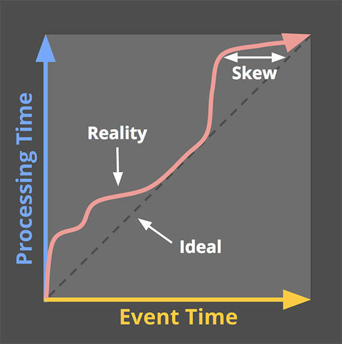


虚线表示理想情况，红线表示现实情况。理想与红线之间的水平距离时处理时间和事件时间之间的偏离。这种偏差主要是由Processing pipeline引入。

**由于事件时间和处理时间之间的映射不是静态的，这意味着如果关心它们的事件时间，就不能只在Pipeline中观察到的情况下分析数据**。大多数现有系统设计用于无界数据的操作方式。为了处理无界数据集的无限特性，这些系统通常提供一些对数据加窗口（window）的概念，本质上意味着沿着时间边界将数据集切成有限快。

如果关心正确性，并且希望在分析事件时间下的结果，就不能基于处理时间定义的时间边界。由于**处理时间和事件时间之间没有一致的相关性**，一些事件时间数据最终将落入错误的处理时间窗口，从而导致失去正确性。而**在无界数据中，无序和可变的偏差会引发事件时间窗口的完整性，因为缺乏处理时间和事件时间之间偏差的可预测映射**。

需要一些工具来描述数据的完整性，新的数据到达，旧的数据会缩回或者更新，并且系统可以自动完成这些操作。

### 通用数据处理模式(Common Data Processing Patterns)

现在我们开始研究在有界和无界数据处理中常用的核心使用模式类型。

#### 有界数据（Bounded Data）

处理有界数据相对简单，在下图中，从左边开始，使用一个数据集(full of entropy)，通过一些数据处理引擎（批处理，如mapReduce），在右边生成一个新的结构的数据集。

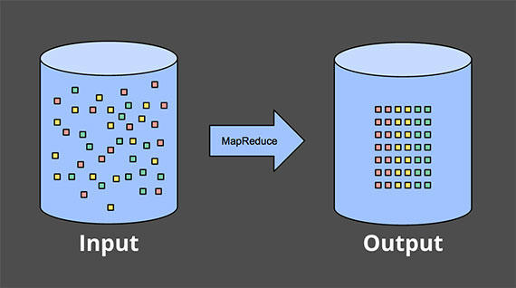


#### 无界数据，微批(Unbounded Data - Batch)

批处理系统一直用于处理无界数据集。这些方法围绕着将无界数据切片成适合于批处理的有界数据集的集合。

##### 固定大小窗口(Fixed Windows)

最常见的方法，就是将输入数据窗口化为固定大小的一些窗口，将每一个窗口作为单独的、有界的数据源进行处理。尤其是对于像日志这样的输入源，事件会被写入结构层次的目录和文件，它们的名称编码就是它们所对应的窗口。

实际上，大多数系统仍然有一些完整性的问题出要处理：如果由于网络分区，一些事件在通往日志的路径上被延迟了怎么办？如果事件是全局收集的，并且必须在处理之前转移到公共路径，该怎么办？如果你的事件来自移动设备呢？这意味着某种缓解措施(sort of mitigation)可能是必要的。例如：延迟处理知道确定已经收集了所有事件，或者每当数据到达较晚时，指定窗口重新处理整个批次。

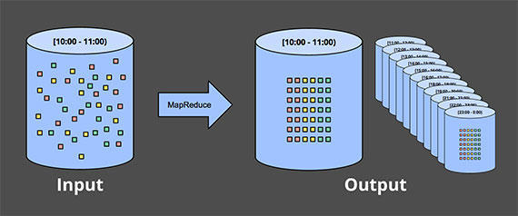


##### 会话(Sessions)

当尝试使用批处理引擎将无界数据处理为更复杂的窗口策略（如用户会话）时，这种方式会更加崩溃。会话通常被定义为由一段不活动的间隙(a gap of inactivity)终止的活动时间段(Period of activity for a specific user)。当使用典型的批处理处理引擎计算会话时，通常以batch split结束会话，如下图中的红色标记所示。可以通过增加批量大小来减少split的数量，但是要以增加延迟微代价。另一个选项，是添加额外的逻辑来拼接之前运行的会话，但代价是更加复杂。无论哪种方式，使用传统的批处理引擎来计算会话都不太理想。

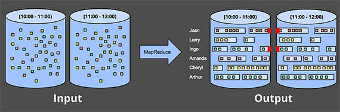


#### 无界数据，流式(Unbouned Data - Streaming)

与大多数基于批处理的无界数据处理方法的特殊性质相反，流式系统针对无界数据构建。对于许多真实世界的分布式输入源，不仅发现在处理无界数据，还要处理以下数据：

* 相对于事件时间高度无序，如果希望在事件时间的上下文中分析数据，需要在pipeline中进行某种基于时间的洗牌(shuffle)
* 对于变化的时间偏斜，意味着不能仅仅假设总在某个时间Y的常量ε内看到给定事件时间X的大多数数据

在处理具有这些特性的数据时，有几种方式可以采用。通常将这些方法分为四类：

```powershell
Time-agnostic
Approximation
Windowing by processing time
Windowing by event time
```

##### 时间不可知论(Time-Agnostic)

**用于时间基本上不相关的情况，即所有相关的逻辑都是数据驱动的。**由于这些用例的所有内容都是由更多**数据的到达**决定的，所以流引擎除了基本数据传递之外，没有什么特别的东西需要支持。因此，基本上现有的所有流系统都支持开箱即用的、与时间无关的用例。批处理系统也非常适合与无界数据源的时间不可知处理，只需要将无界数据源切换成任意的有界数据集序列并独立处理这些数据集。

##### 过滤(Filtering)

假设正在处理Web流量日志，并希望过滤掉非指定域的所有流量。每个记录到达时查看是否属于感兴趣的域，如果没有，则丢弃。由于这类事情在任何时候都只依赖于单个元素，因此数据源是无界的、无序的、以及事件时间偏差变化的事实是不相关的。

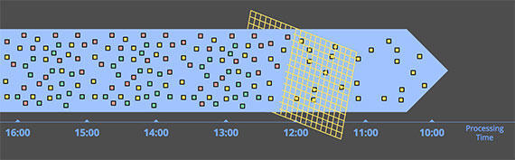

##### 内连接(Inner-Joins)

另一个与时间无关的例子是内部连接（或 hash 连接）。当连接两个无界数据源时，如果只关心来自两个源的元素到达时连接的结果，则逻辑中没有时间元素。当从一个源看到一个值时，可以简单的将其缓冲到持久状态；只需要在另一个源的第二个值到达时进行连接操作。

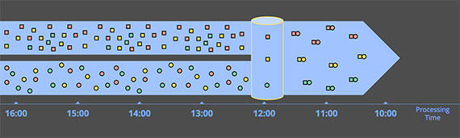

##### 近似算法(Approximation Algorithms)

类似approximate Top-N、streaming K-means等，它们获取无限的输入源，并提供输出数据，这些数据或多或少类似于希望的到的结果。

近似算法的优点在于：通过设计，它们是低开销的，并且是为了无界数据设计的。

缺点是：存在有限的算法集，算法本身通常很复杂（这使得很难产生新算法），它们的近似性质限制了它们的实用性。

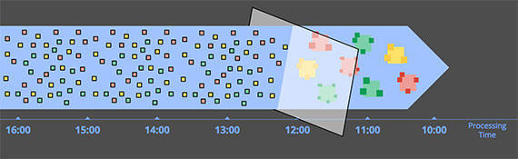

**值得一提的是：这些算法设计中，通常都包含了一些时间元素（如：某种内置的衰变）**。由于它们在到达时处理元素，所以该时间元素通常基于处理时间。这对于在近似上提供某种可证明的误差边界的算法特别重要。如果这些误差边界是以数据按顺序到达为前提的，那么当以变化的事件时间偏移微算法提供无序数据时，它们实际上没有任何意义。

#### 窗口化(Windowing)

剩下的两种无界数据处理方法都是窗口化的变体。Windowing是将数据源（无界或有界）沿着时间边界切成有限块进行处理的概念。下图显示了3种不同的窗口模式：

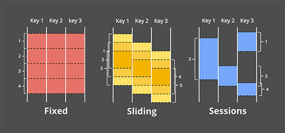


* 固定窗口(Fixed Windows)：固定窗口将时间分割为具有固定大小的时间长度段。固定窗口被均匀地应用于整个数据集，这是对齐窗口的示例。在某些情况下，希望对数据的不同子集（例如：每个键）的窗口进行相位移，以便随着时间更均匀的分布窗口完成负载。
* 滑动窗口(Sliding Windows)：这是一种固定窗口的推广模式，滑动窗口由固定长度和固定周期定义。如果周期小于长度，则窗口重叠。如果周期等于长度，则变为固定窗口。如果周期大于长度，那么就变为一个采样窗口，查看随时间变化的数据子集。与固定窗口一样，滑动窗口通常是对齐的，但是在某些场景中，可能作为性能优化而未对齐。
* 会话(Sessions)：动态窗口的一个例子，会话由一系列事件组成的，以一个超过 inactivity gap 的时间终止。**会话通常用于分析随时间变化的用户行为，通过将一系列与时间相关的事件（例如：一次连续观看的视频序列）分组在一起。**会话的长度不能预先定义，取决于实际数据。会话是为对齐窗口的典型示例，因为会话在不同数据子集（例如：不同用户）之间从不相同。

窗口化在所讨论的两个时间领域（处理时间和事件时间）都有意义。

##### 处理时间窗口(Windowing by processing time)

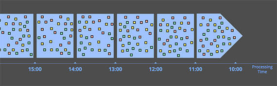

当通过处理时间窗口化湿，系统将传入数据缓冲到窗口中，直到经过了一些处理时间。例如：对于5分钟的固定窗口，系统将缓冲5分钟的处理时间，之后将把在这5分钟观察到的所有数据作为窗口，将它们发送到下游进行处理。

处理时间窗口有以下几个很好的特性：

1. 实现非常简单，不必担心在时间内对数据进行洗牌（shuffle）。只要在数据到达时缓冲它们，并在窗口关闭时将窗口数据发送到下游
2. 判断窗口的完整性很容易。由于系统完全知道是否已经看到窗口的所有收入，所以可以对给定的窗口是否完整做出完美的决策。这意味着在通过处理时间打开窗口时，不需要任何方式处理“延迟”数据
3. 如果你想根据观察结果推断关于源的信息，那么处理时间窗口正合适。许多监控场景都属于此类。想象一下：跟踪每秒发送给全局规模Web服务的请求数量；为了检测停机而计算这些请求的速率是完美利用处理时间窗口

处理时间窗口有一个很大的**缺点**：如果所讨论的数据具有与其相关联的事件时间，那么如果处理时间窗口要反映这些事件实际发生时的真实情况，则这些数据必须按事件时间顺序到达。不幸的是，基于事件时间有序数据在许多真实的分布式输入源中并不多见。

##### 事件时间窗口(Windowing by event time)

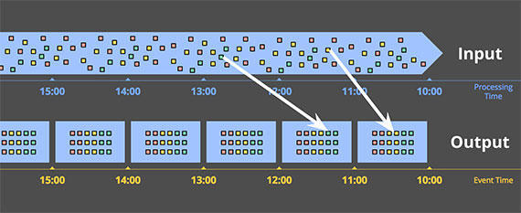

**当需要以有限块观察数据源，反映那些事件实际发生的时间时使用的窗口，就是事件时间窗口。**这是窗口化的最高标准。可是，今天使用的大多数数据处理系统缺乏对它的原生支持。

上图中的实心白线表示两个感兴趣的特定数据。这两个数据到达的处理时间窗口都与他们本该属于的事件时间窗口不匹配。因此，如果对于关心事件时间的场景，这些数据被窗口化到处理时间窗口中，计算的结果是不正确的。只有正确的进入事件时间窗口的分析结果才会是正确的。

事件时间窗口化对于无限数据的另一个好处是，可以创建动态大小的窗口，例如会话（sessions），而不需要在固定窗口上生成会话进行随意的 split，例如之前提到的 batch split。

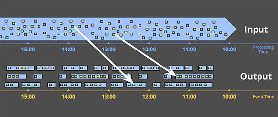

当然，强大的语义都是有代价的，事件时间窗口也不例外。事件时间窗口有两个明显的缺点，因为窗口通常必须（相比处理时间）比窗口本身的实际长度更长：

* 缓冲区：由于窗口寿命延长，需要对数据进行更多的缓冲。幸运的是，持久化存储通常是大多数数据处理系统所依赖的资源类型中最廉价的资源类型（其他主要是CPU、网络带宽和RAM）。因此，当与使用任何具有强一致性持久状态和良好内存缓存层的设计良好的数据处理系统时，这个问题通常没那么严重。而且，许多常用的聚合不需要缓冲整个输入集（例如：求和或平均值），而是可以使用更小的、以持久状态存储的中间聚合，以增量方式执行
* 完整性：通常没有好的方法知道何时已经看到给定窗口的所有数据，如何知道何时该窗口的结果可以具体化？事实上，我们根本不会。对于许多类型的输入，系统可以给出合理的相当准确的估计窗口完成时间，通过类似MillWheel的水印，但是，在要求绝对正确性场景下，唯一的设计选择是提供给pipeline一种方式，表达何时结束窗口，以及如何随着时间推移而细化这些结果。