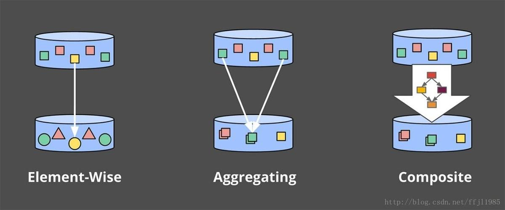

# 流式处理的概念：Watermark、触发器、累积 

来自：https://www.jianshu.com/p/f908ecef79db

在第一篇概念介绍中，首先澄清了一些术语,介绍了有限数据 VS无限数据。有限数据源具有有限的大小，通常被称为“批处理”数据。无限数据源源可能具有无限大小，通常被称为“流”数据。在后边将会尽量避免使用批处理和流式传输来修饰数据源，因为这些名称带有一些令人误解和限制性的含义。

然后，解释了批处理和流处理引擎之间的区别：批处理引擎是设计优先考虑有限数据(现在批处理引擎提供了micro-batch的方式处理流式数据)，而流处理引擎设计用于处理无限数据。目标是在描述执行引擎时使用批处理和流处理。

定义完术语之后，介绍了与处理有限数据有关的两个重要的基本概念。首先阐述事件时间（事件发生的时间）和处理时间（数据在系统中被处理的时刻）之间的关键区别。这为第一篇中提出的主要论文提供了基础：如果关心事件实际发生时间，则必须基于事件的事件时间，而不是处理时间。

接下来介绍了窗口的概念（即沿时间边界切分数据集），这是一种常用的方法，用于应对无限数据源的数据处理，无限数据源理论上永远不会结束。窗口策略的最常见且简单的例子是固定和滑动的窗口，更复杂的窗口类型，例如会话窗口（其中窗口由数据本身的特征决定，捕获每个用户的活动会话窗口，会话窗口之后紧接着是用户的不活动期）也比较广泛的用法。

现在，介绍3个新的概念：

* **Watermark**：Watermark是相对于**事件时间**的输入完整的概念。Watermark表示一个时间X，表示所有“事件时间<X”的所有数据都到齐了。因此，当处理无限数据源时，**Watermark作为进度的度量**。
* **触发器**：触发器是一种由外部条件触发，来表明何时计算窗口结果的机制。触发器可以让我们灵活的选择何时计算结果并发送给下游，而且随着数据的不停的到来，窗口可以产生多次输出。所以，窗口结束前可以先提供近似结果，并且能够灵活应对上游数据的变化（可能是上游发送的数据修正）或者数据延迟到达（例如：移动场景在某人的离线时，某人的电话记录了各种动作及其事件时间，然后在重新获得连接时继续上传这些事件进行处理）。
* **累积**：累积模式指定在同一窗口中观察到的多个结果之间的关系。这些结果可能完全相互之间完全独立，或者他们之间可能存在重叠。不同的累积模式具有不同的语义和与计算成本，适用于不同的场景。

最后，在回答无限数据处理中的4个问题时（what, Where, When, How），更容易搞清楚这些概念和它们之间的关联关系。

## What：计算的结果是什么？

Pipeline中的转换来决定结果。例如：计算总和，构建直方图，训练机器学习模型等等。它也是经典批处理回答的问题。

## Where：在事件时间中的哪个位置计算结果？

这个问题是通过Pipeline中使用事件时间窗口来回答的。这包括从上一篇内容（固定、滑动和会话）窗口的常见示例，似乎没有窗口概念的用例（例如：上一篇中描述的时间不可知处理；经典批处理也通常属于此类别）和其他更复杂的窗口类型，如时间有限的拍卖。还要注意，它可以包括处理时间窗口，如果在记录到达系统时将入口时间指定为记录的事件时间。

## When：在处理时间中的哪个时刻出发计算结果？

通过使用Watermark和触发器来回答这个问题。这个主题有无穷的变化，但最常见的模式是在给定窗口的输入完成时使用Watermark来描绘，触发器允许提前计算结果（对于在窗口完成之前发出的推测性的、部分的结果）和延迟计算结果（Watermark只是预估窗口的数据全部到达，并不是100%确定，在Watermark声明给定窗口的全部达到之后，也有可能会有隶属于该窗口的数据到达）。

## How：如何修正结果

这个问题由所使用的累积类型回答：丢弃（其中结果是相互独立和不同的），累加（后来的结果建立在先前的结果上），累加和撤销（当前的累加值加上次触发的值撤销一起发送）。

后面会一一讨论这些问题，试图让大家清楚哪些概念与what/where/when/how中的哪个问题有关。

## 上一篇回顾

首先，回顾一下上一篇中提出的一些概念，这次还将提供一些具体的例子是这些概念更具体。

### What: Transform(变换)

经典批处理中Transform解决了一下问题：

* 要计算什么结果？

许多人可能已经熟悉经典的批处理，所以我们将以它为基础，添加所有其他概念，更便于理解。

对于这一部分，我们来看一个示例：计算由10个整数值组成的简单数据集中的数的总和。这么说有点儿抽象，在实际中，可以想象一个游戏，10个人组成一个团队，每个人的最终得分相加，就是团队的成绩。也可以想象计费和使用情况的监控这样的场景。

对于每个示例，将包括一个简短的Dataflow Java SDK伪代码片段，以使Pipeline的定义更具体。因为是伪代码，所以有时会省略细节（如具体使用I/O源）、使用简称（Java中的当前触发器名称太冗长）。除了这些（大部分我在Postscript中明确列举）的小事情之外，其他基本上是真实的Dataflow SDK代码。稍后还将提供一个链接到实际代码演练，可以编译和运行自己的类似例子。感兴趣的人，可以实际尝试一下。

如果熟悉像Spark Streaming或Flink这样的计算引擎，那么在看Dataflow示例代码时就会容易一些。接下来开始让人崩溃的旅程，在Dataflow中有两个基本的原语：

#### PCollection

表示可以由PTransaform并行处理的**数据集**，（因此名称开始处的**P**），可以是任意规模的数据集。

#### PTransform变换

处理PCollection并创建新的PCollecton。PTransform可以执行元素转换，它们可以将多个元素聚合在一起，或者它们可以是其他PTransform的组合。

​                                                                  图 1 Transform变换的类型 

