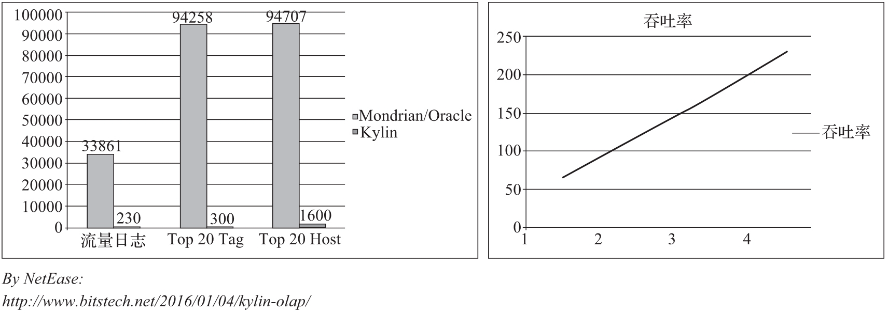

# Kylin技术架构

https://www.infoq.cn/article/LbG0YuQQQVywrdl1aIkT

Kylin系统可以分成**在线查询**和**离线构建**两部分。系统架构图如下图所示。在线查询主要由上半区组成，离线构建在下半区。

​                                                                                图1. Kylin 技术架构图

## 离线构建

从图1可以看到，数据源在左侧，目前主要是Hadoop、Hive、Kafka和RDBMS，其中保存着待分析的用户数据。根据元数据定义，下方构建引擎从数据源种抽取数据，并构建Cube。

数据以关系表的形式输入，并且必须符合星型模型（Star Schema）或者雪花模型（Snowflake Schema）。用户可以选择使用MapReduce或者Spark进行构建。构建后的Cube保存在右侧的存储引擎中，目前HBase是默认的存储引擎。

## 在线查询

完成离线构建后，用户可以从上方查询系统发送SQL进行查询分析。Kylin提供了多样REST API、JDBC/ODBC接口。无论从哪个接口进入，最终SQL都会来到REST服务层，再转交给查询引擎进行处理。

这里需要注意的是，**SQL语句是基于数据源的关系模型书写的**，而不是Cube。

Kylin在设计时，就刻意对查询用户屏蔽了Cube概念，分析师只需要理解简单的关系模型就可以使用Kylin，没有额外的学习门槛，传统的SQL应用也更容易迁移。查询引擎解析SQL，生成基于关系表的逻辑执行计划，然后将其转译为基于Cube的物理执行计划，最后查询预计算生成的Cube产生结果。整个过程不访问原始数据源。

> ***注意：***
>
> *对于查询引擎下方的路由选择，在最初设计时考虑过将Kylin不能执行的查询引导到Hive中继续执行，但在实践后发现Hive与Kylin的执行速度差异过大，导致用户无法对查询的速度有一致的期望，大多语音很可能查询几秒就返回了，而有些要等几分钟到几十分钟，用户体检非常糟糕。最后这个路由功能在发行版本中默认关闭。*

Kylin V1.5版本引入了“可扩展架构”的概念。图1所示为Rest Server、Cube Build Engine和数据源表示的抽象层。

**可扩展**是指Kylin可以对其三个主要依赖模块--数据源、构建引擎和存储引擎，**做任意的扩展和替换**。

在设计之初，作为Hadoop家族的一员，这三者分别是Hive、MapReduce和HBase。但随着Kylin的推广和使用的深入，用户发现它们存在不足。

例如，实时分析可能会希望从Kafka导入数据而不是从Hive；而Spark的迅速崛起，又使我们不得不考虑将MapReduce替换为Spark以提高Cube的构建速度；至于HBase，它的可读性可能不如Cassandra等等。可见，是否可以将某种技术替换为另一种技术已成为一个常见问题。于是，Kylin对V1.5版本进行了**重构，将数据源、构建引擎、存储引擎三大主要依赖模块抽象成接口**，而Hive、MapReduce、HBase只是默认实现。其他实现还有：数据源还可以是Kafka、Hadoop或者RDBMS；构建引擎还可以是Spark、Flink。资深用户可以根据自己的需要做二次开发，将其中的一个或者多个技术替换为更适合自身需要的技术。

可扩展架构也带来了额外的灵活性。比如：它可以允许多个引擎共存。举个例子：Kylin可以同时对接Hive、Kafka和其他第三方的数据源；用户也可以为不同的Cube指定不同的构建引擎或者存储引擎，来达到极致的性能和功能定制。

## Kylin主要特点

主要特点包括：支持表针的SQL接口、支持超大数据集、亚秒级响应、可伸缩性、高吞吐量、BI以及可视化工具集成等。

### 标准SQL接口

虽然Kylin的内部以Cube技术为核心，对外却没有选用MDX（MultiDimensional eXpression）作为接口，而是以标准SQL接口作为对外服务的主要接口。MDX作为OLAP查询语言，从学术上来说，是更为适合Kylin的选择，但是实践表明，SQL是绝大多数分析人员最熟悉的工具，也是大多数应用程序使用的编程接口，它不仅简单易用，也代表了绝大多数用户的第一需求。

SQL需要以**关系型**作为支撑，Kylin使用的查询模型是数据源中的关系模型表，一般而言也就是指Hive表，终端用户像原来查询Hive表一样编写SQL查询语句，就可以无缝的切换到Kylin，几乎不需要进行额外的学习，甚至原本的Hive查询也因为与SQL同源，大多无须修改就能直接在Kylin上运行，标准SQL接口是Kylin能够快速推广的一个关键原因。

当然，Kyliny事实上也有了工具，可以把MDX转化为SQL，从而支持MDX。

### 支持超大数据集

Kylin对大数据的支持能力可能是目前所有技术中最为先进的。2015年的eBey的生产环境中，Kylin就能支持百亿条记录的秒级查询，之后在移动应用场景下又有了千亿条秒级查询的案例。这些都是实际应用的案例。

因为使用了Cube预计算技术，在理论上，Kylin可以支持的数据集大小没有上限，仅受限于存储系统和分布式计算系统的承载能力，并且查询速度不会随数据集的增大而减慢。Kylin在数据集规模上的局限性主要在于维度的个数和基数。它们一般由数据模型决定，不随数据规模的增加而线性增长，也就意味着，Kylin对未来数据增长有着更强的适应能力。

### 亚秒级响应

Kylin有优异的查询响应速度，这得益于预计算，很多复杂的计算，如连接、聚合、在离线的预计算过程中就已经完成，这大大降低了查询时所需的计算量，提高了查询响速度。

根据可查询到的公开资料显示，Kylin在某生产环境中90%的查询可以在3秒内返回结果。这不是说一部分SQL相当快，而是在数万种不同的应用SQL的真实生产系统中，绝大部分的查询非常迅速；在另一个真实案例中，对1000多亿条数据构建了Cube，90%的查询性能在1.18s以内，可见Kylin在超大规模数据集上表现优异。这与一些只在实验室中、在特定查询情况下，采集的性能数据不可同日而语。

当然，并不是使用Kylin就一定能获得最好的性能。针对特定的数据及查询模式，往往需要做进一步的性能调优、配置优化等，性能调优对于充分利用Kylin至关重要。

### 可伸缩性和高吞吐量

在保持高速响应的同时，Kylin 有着良好的可伸缩性和很高的吞吐率。图 2 是网易的性能分享。左图是 Apache Kylin 与 Mondrian/Oracle 的查询速度的对比，可以看到在三个测试查询中，Kylin 的查询速度分别比 Mondrian/Oracle 快 147 倍、314 倍和 59 倍。

右图展现了 Apache Kylin 的高吞吐率和可伸缩性。在一个 Apache Kylin 实例中，Apache Kylin 每秒可以处理近 70 个查询，已经远远高于每秒 20 个查询的一般水平。更理想的是，随着服务器的增加，其吞吐率也呈线性增加，在存在 4 个实例时达到每秒 230 个查询左右，而这 4 个实例仅部署在一台机器上，理论上添加更多的应用服务器后可以支持更高的并发率。

​                                                                                图2. Kylin的高可伸缩性和高吞吐率

这主要还是归功于预计算降低了查询时所需的计算总量，使 Apache Kylin 可以在相同的硬件配置下承载更多的并发查询。

### BI及可视化工具集

Apache Kylin 提供了丰富的 API 与现有的 BI 工具集成，包括：

- ODBC 接口：与 Tableau、Excel、Power BI 等工具集成。
- JDBC 接口：与 Saiku、BIRT 等 Java 工具集成。
- Rest API：与 JavaScript、Web 网页集成。

分析师可以继续使用他们最熟悉的 BI 工具与 Apache Kylin 一同工作，或者在开放的 API 上做二次开发和深度定制。

另外，Apache Kylin 的核心团队也贡献了 Apache Zeppelin 及 Apache Superset 的插件，Strikingly 的工程师为 Redash 贡献了 Apache Kylin 连接器，用户可以使用 Zeppelin、Superset、Redash 等免费可视化工具来访问 Redash Kylin。

