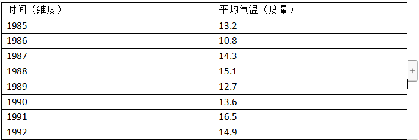
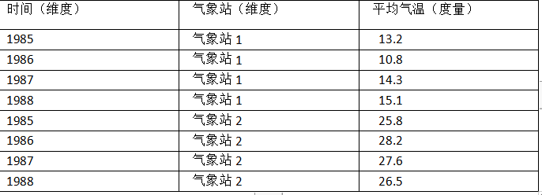

# Kylin核心概念

https://www.infoq.cn/article/T2FTUNOXGHMzq78ikk4u

在使用 Apache Kylin 之前，需要先了解一下 Apache Kylin 中的各种概念和术语，为后续章节的学习奠定基础。

## 数据仓库、OLAP 与 BI

### 数据仓库

数据仓库（Data Warehouse）是一种信息系统的资料存储理论，此理论强调的是利用某些特殊资料储存方式，让所包含的资料特别有利于分析处理，从而产生有价值的资讯并以此作决策。

利用数据仓库方式存放的资料，具有一旦存入，便不随时间变化而变动的特性。此外，存入的资料必定包含时间属性。通常，一个数据仓库会含有大量的历史性资料，并且它利用特定分析方式，从中挖掘出特定的资讯。

### OLAP

OLAP（Online Analytical Process），即联机分析处理，它可以以多维度的方式分析数据，并且能弹性地提供上卷（Roll-Up）、下钻（Drill-Down）和透视分析（Pivot）等操作，是呈现集成性决策信息的方法，其主要功能在于方便大规模数据分析及统计计算，多用于决策支持系统、商务智能或者数据仓库。与之相区别的是联机交易处理（OLTP），联机交易处理侧重于基本的、日常的事务处理，包括数据的增、删、改、查。

* OLAP需要以大量历史数据为基础，配合时间点的差异并对多维度及汇整形的信息进行复杂的分析
* OLAP需要用户有主观的信息需求定义，因此系统效率高

OLAP的概念，在实际应用中存在广义和狭义两种不同的理解。广义上的理解与字面意思相同，泛指一切不对数据进行更新的分析处理，但更多的情况下OLAP被理解为狭义上的含义，即与多维度分析相关，是基于立方体（Cube）计算而进行的分析。

### BI

BI（Business Intelligence），即商务智能，是指用现代数据仓库技术、在线分析技术

、数据挖掘和数据展现技术进行数据分析以实现商业价值。

如今，许多企业已经建立了自己的数据仓库，用于存放和管理不断增长的数据，这些数据中蕴含着丰富的商业价值，但只有使用分析工具对其进行大量筛选、计算和展示后，数据中蕴含的规律、价值和潜在信息才能被人们所发现与利用。分析人员结合这些信息进行商业决策和市场活动，从而为用户提供更好的服务，为企业创造更大的价值。


## 维度建模

维度建模用于决策指定，并侧重于业务如何表示和理解数据。

基本的维度模型由**维度**和**度量**两类对象组成。**维度建模**尝试以逻辑、可理解的方式呈现数据，以使得数据的访问更加直观。维度设计的重点是简化数据和加快查询。

那么，什么是维度和度量呢？

它们是数据分析领域中两个常用的概念。简单的说，维度就是观察数据的角度。比如气象站的采集数据，可以从**时间维度**来观察：



也可以从时间和气象站两个角度**同时**来观察：



### 维度

**维度**，就是观察数据的角度，**一般是离散的值**。它通常是数据记录的一个特征，如时间、地点等。同时，**维度具有层级**概念，可能存在细节程度不同的描述方面，如日期、月份、季度、年等。如上图所示，时间维度上的每一个独立的日期，或者气象站维度上的每一个独立的气象站ID。因此，统计时可以把维度相同的记录聚合在一起，然后应用聚合函数做累加、均值、最大值、最小值等聚合计算。

### 度量

**度量**，就是被聚合的统计值，也就是聚合运算的结果，**它一般是连续的值**，度量是维度模型的核心。通常，可以对度量进行总计、平均、以百分比形式使用等。通常，在单个查询中检索数千个或数百个事实行，其中对结果集执行数学方程。例如上面的两个图中的温度值，或是其他测量点，比如风速、湿度、降雨量等等。通过对度量的比较和分析，就可以对数据做出评估。比如今年平均气温是否在正常范围，某个气象站的平均气温是否明显高于往年平均气温等等。

#### 一个具体例子

在一个SQL查询中，**Group By的属性通常就是维度**，而其**所计算的值则是度量**。如在下面这个查询中，part_dt和lstg_site_id是维度，sum(price)和count(distinct seller_id)是度量：

```sql
select part_dt, lstg_site_id, sum(price) as total_selled, count(distinct seller_id)
as sellers from kylin_sales group by part_dt, lstg_site_id
```


### 维度模型

维度模型是数据仓库的核心。它经过精心设计和优化，可以为数据分析和商业智能（BI）检索并汇总大量的相关数据。在数据仓库中，数据修改仅定期发生，并且是一次性开销，而读取是经常发生的。对于一个数据检索效率比数据处理效率重要得多的数据结构而言，非标准化的维度模型是一个不错的解决方案。

在数据挖掘中，有几种常见的多维度数据模型，如：星形模型（Star Schema）、雪花模型（Snowflake Schema）、事实星座模型（Fact Constellation）等。

#### 星形模型

星形模型中有一个事实表，以及零个或多个维度表，事实表与维度表通过主键外键关联，维度表之间没有关联，就像很多星星围绕一个恒星周围，故名为星形模型。

* 所有的事实都必须保持一个粒度
* 不同的维度之间没有任何关联

这个图简要的呈现了星型模型的样子：


#### 雪花模型

雪花模型基于星型模型。如果将星形模型中的某些维度表再做规范，抽取成更细的维度表，让**维度表之间也进行关联**，那么这种模型称为雪花模型。

* 优点是减少维度表的数据量，在进行join查询时有效提升查询速度
* 缺点是需要额外维护维度表的数量

下图展示了雪花模型的一个样子：


#### 事实星座模型

事实星座表是更为复杂的模型，其中包含多个事实表，而维度表是公用的，可以共享。


## 事实表和维度表

### 事实表

**事实表（Fact Table）**是指存储事实记录的表，如系统日志、销售记录等，并且是维度模型中的主表，代表着键和度量的集合。事实表的记录会不断地动态增长，所以它的体积通常远大于其他表，通常事实表占数据仓库中90%或者更多的空间。

> *换句话说，就是业务数据表。*

### 维度表

**维度表（Dimension Table）**，也称维表或者查找表（Lookup Table），是与事实表相对应的一种表。维度表的目的是将业务含义和上下文添加到数据仓库中的事实表和度量中。维度表是事实表的入口，维度表实现了数据仓库的业务接口，它们基本上是事实表中的键引用的查找表。它保存了维度的属性值，可以与事实表关联，相当于将事实表经常出现的属性抽取、规范出来用一张表进行管理，常见的维度表有：日期表（存储日期对应的周、月、季度等属性）、地点表（包含国家、省、城市等属性）等。使用维度表的好处有：

* 减小了事实表的大小
* 便于维度的管理和维护，增加、删除和修改维度的属性时，不必对事实表的大量记录进行改动
* 维度表可以为多个事实表同时使用，减少重复工作


## 基本概念

#### Table

定义在Hive中，是Data cube（数据立方体）的数据源，在build cube之前，Hive表**必须**同步在Kylin中。

#### Model

用来定义一个Fact Table（事实表）和多个Lookup Table（查找表），及所包含的dimension（维度）列，Messures（度量）列、partition（分区）列和Data（日期）格式

### Cube

Cube（或者叫做 Data Cube），即数据立方体，是一种常用语数据分析与索引的技术，它可以对原始数据建立多维索引，大大加快数据的查询效率。

它定义了使用的模型、模型中的表的维度（Dimensions）、度量（messures）、如何对段分区（segments partitions）、合并段（segments auto-merge）等的规则。

### Cubiod

Cuboid特指Apache Kylin中的某一种维度组合下**所计算的数据**。

### Cube Segment

Cube Segment指针对源数据中的某一片段计算出来的**Cube数据**。通常，数据仓库中的数据数量会随着时间的增长而增长，而**Cube Segment也是按时间顺序构建**的。

它是立方体构建（build）后的数据载体，一个Segment映射HBase中的一张表。Cube实例构建后，会产生一个新的Segment。一旦某个已经构建的Cube的原始数据发生变化，只需要刷新（fresh）变化的时间段所关联的Segment即可。

#### Dimension

维度可以简单理解为观察数据的角度，一般是一组离散的值

#### Cardinality

**维度的基数**。指的是该维度在数据集中出现的不同值的个数。比如“城市”是一个维度，如果该维度下有2000个不同的值，那么该维度的基数就是2000.通常一个维度的基数会从几十到几万个不等，个别维度如id的基数会超过百万甚至千万。

基数超过一百万的维度通常被称为超高基数维度（Ultra High Cardinality, UHC），需要引起设计者的注意。

> Cube中所有维度的基数都可以体现出Cube的复杂度，如果一个Cube中有好几个超高基数维度，那么这个Cube膨胀的概率就会很高。在创建Cube前需要对所有维度的基数做一个了解，这样有助于设计合理的Cube。
>
> 计算基数有多种途径，最简单的方法就是让Hive执行一个count distinct的SQL查询。Lylin也提供了计算基数的方法，Kylin对基数的计算方法采取的是HyperLogLog（应该是BitMap，或者说Bloom FIlter过滤器的方式）的近似算法，与精确值略有误差，但作为参考值已经足够了。

#### Messures

度量就是被聚合的统计值，也是聚合运算的结果，一般指聚合函数（如：sum、count、average等）。比如学生成绩、销售额等。

度量主要用于分析或者评估，比如对趋势的判断，对业绩或者效果的平定等等。

#### Fact table

事实表是指包含了大量不冗余数据的表，其列一般有两种，分别为包含事实数据的列，包含维度foreign key的列。

#### Lookup table

包含了对事实表的某些列扩充说明的字段。

#### Dimenssion Table

维表，有Fact Table和Lookup table抽象出来的表，包含了多个相关的列，以提供对数据不同维度的观察，其中每列的值的数据为Cardinality(基数)。