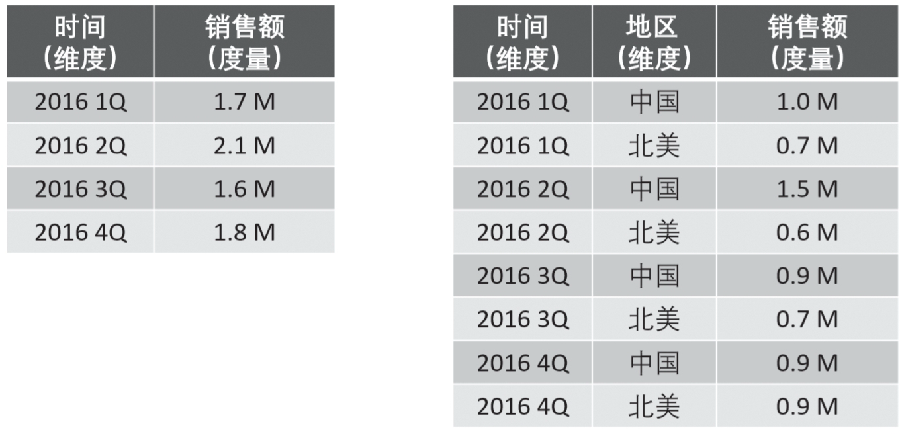
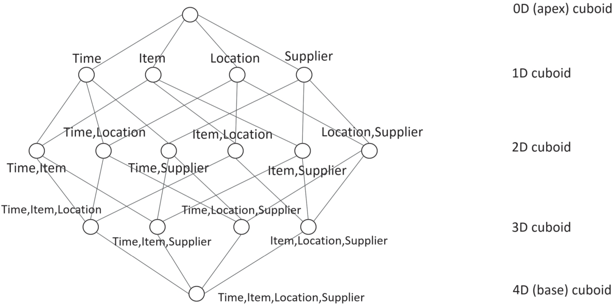

# Apache Kylin 工作原理

https://www.infoq.cn/article/BgVUvlmqNlg8kLCiLkqq

Apache Kylin的工作原理本质上是MOLAP（Multidimensional Onine Analytical Processing）Cube，也就是多维立方体分析。这是数据分析中相当经典的理论，在关系型数据库年代就有广泛应用。

## 维度和度量

这两个概念在Kylin中是非常重要的。

### 维度

维度，就是观察数据的角度。比如电商的销售数据，可以从时间的维度来观察（如图1的左图），也可以进一步细化从时间和地区的维度来观察（如图1的右图）。

维度，一般是一组离散的值，比如时间维度上的每一个独立的日期，或者商品维度上的每一件独立的商品。因此，统计时可以把维度值相同的记录聚合起来，应用聚合函数做累加、平均、去重复等聚合计算。



图1 维度和度量


### 度量

度量就是被聚合的统计值，也就是聚合运算的结果，它一般是连续值，如上图1中的销售额、亦或是销售商品的总件数。通过比较和测算度量，分析师可以对数据进行评估，比如今年的销售额比去年有多大的增长、增长的速度是否达到预期、不同商品类别的增长比例是否合理等等。


## Cube和Cuboid

了解了维度和度量，就可以对数据表或者数据模型上的所有字段进行分类了，它们要么是维度、要么是度量（可以被聚合）。于是，就有了根据维度、度量做预计算的Cube理论。

### Cuboid

给定一个数据模型，可以对其上所有维度进行组合。对于N个维度来说，所有组合性有2N中。对每一种维度的组合，将度量做聚合运算，运算的结果保存为一个物化试图，称为Cuboid。

### Cube

将所有维度组合的Cuboid作为一个整体，被称为Cube。一个Cube就是许多按维度聚合的物化视图的聚合。

### 举例

有一个点上的销售数据集，其中维度有时间（Time）、商品（Item）、地点（Location）和供应商（Supplier），度量有销售额（GMV）。那么，所有维度的组合就有16（含0维度）种（如图2所示）。

比如：

一维度（1D）的组合有四种:     ([Time])、( [Item])、( [Location])、( [Supplier])

二维度（2D）的组合有六种：([Time] [Location])、([Time] [Item])、([Time] [Supplier])、 ([Item] [Location]) 、([Item] [Supplier])、([Location] [Supplier])

三维度（3D）的组合有四种：([Time] [Item] [Location])、([Time] [Item] [Supplier])、([Time] [Location] [Supplier])、([Item] [Location] [Supplier])

思维度（4D）的组合有一种：([Time] [Item] [Location] [Supplier])




图2 思维Cube

计算Cuboid，就是按照维度来聚合销售额（GMV）。如果使用SQL来表达计算Cuboid - [Time] [Location]，那就是如下的SQL：

```sql
select Time, Location, Sum(GMV) as GMV from Sales group by Time, Location
```

将计算的结果保存为物理化视图，所有Cuboid物化试图的总称就是Cube了。

## 工作原理

Kylin的工作原理就是对数据模型做Cube**预**计算，并利用计算结果加速查询，过程如下：

* 指定数据模型，定义维度和度量
* 预计算Cube，计算所有Cuboid并将其保存为物化视图
* 执行查询时，读取Cuboid，进行加工运算生产查询结果

由于Kylin的查询过程不会扫描原始记录，而是通过预计算预先完成表的关连、聚合等复杂运算，并利用预计算的结果执行查询，因此其速度相比非预计算的查询技术一般要快一到两个数量级。并且在超大数据集上其优势更明显。当数据集达到千亿乃至万亿级别时，Kylin的速度甚至可以超越其他非预计算技术1000倍以上。