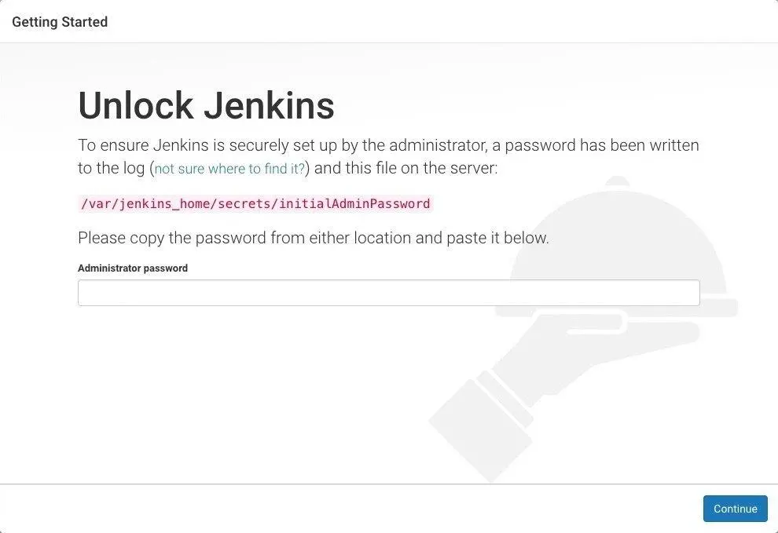

# 使用 Jenkins 构建 CI/CD 之多分支流水线

原文：https://mp.weixin.qq.com/s/od26liGHg8pv83DacId-Iw


## 一. 在 Docker 中安装并运行 Jenkins

​        使用的镜像是 jenkinsci/blueocean，这是一个 Jenkins 的稳定及持续维护的镜像源，本身就集成了 Blue Ocean 等使用插件，非常方便。

​        拉取镜像：

```shell
 docker pull jenkinsci/blueocean
```

​        运行 jenkins：

```shell
docker run -idt --name kmywjenkins -p 9090:8080 -p 60000:50000 -v jenkins-data:/var/jenkins_home -v /data/web-data/docker.sock:/var/run/docker.sock jenkinsci/blueocean
```

​        这是个人的环境：

```shell
docker run -idt --name kmywjenkins -p 9090:8080 -p 60000:50000 -v /Users/jaly/docker/jenkins/jenkins-data:/var/jenkins_home -v /Users/jaly/docker/jenkins/data/web-data/docker.sock:/var/run/docker.sock jenkinsci/blueocean
```

参数说明：

* -idt：以交互式的方式，新建一个模拟终端运行容器
* --name：容器名称
* -p：指定容器映射宿主机的端口 -> 宿主机端口：容器端口
* -v jenkins-data:/var/jenkins_home： Jenkins容器在工作的时候，如果要执行 docker 命令（如 docker ps， docker run等），需要有一个途径能连接到宿主机的docker 服务，此参数就是用来建立容器和宿主机docker服务的连接
* -v /data/web-data/docker.sock:/var/run/docker.sock：将该容器的数据保留在宿主机的目录，这样即使容器崩溃了，里面的配置和任务都不会丢失

需要注意的是，docker 中默认的是以 Jenkins 用户运行的 Jenkins，如需要以 root 用户运行可以加参数 -u root，本实例未指定 root。

### 1.1 访问 Jenkins Docker 容器

​        有时需要进入 Jenkins 容器执行一些命令，可以通过 docker exec 命令访问。例如：*docker exec -it kmywjenkins bash*，

​        如果需要手动重启 Jenkins，可以执行这个命令： *docker restart kmywjenkins*

### 1.2 Jenkins基本配置

​        Docker 启动后，可以通过这个地址访问 Jenkins：*http://localhost:9090* 

### 1.3 解锁 Jenkins

​        输入下面命令获取解锁的token：

```shell
docker exec kmywjenkins cat /var/jenkins_home/secrets/initialAdminPassword
```

然后把得到的 token，输入到浏览器的提示中，用于解锁Jenkins：



### 1.4 创建凭据

​        连接 git 仓库，ssh 连接服务器均需要相应的凭据，可以在凭据管理中先创建好，然后需要使用的地方直接选择凭据即可。这里以连接git、ssh需要的凭据为例：

​        一般公司都使用 gitlab作为版本管理工具。这里选择github。

## 二. 创建一个多分支流水线

## 三. JenkinsFile 基础语法