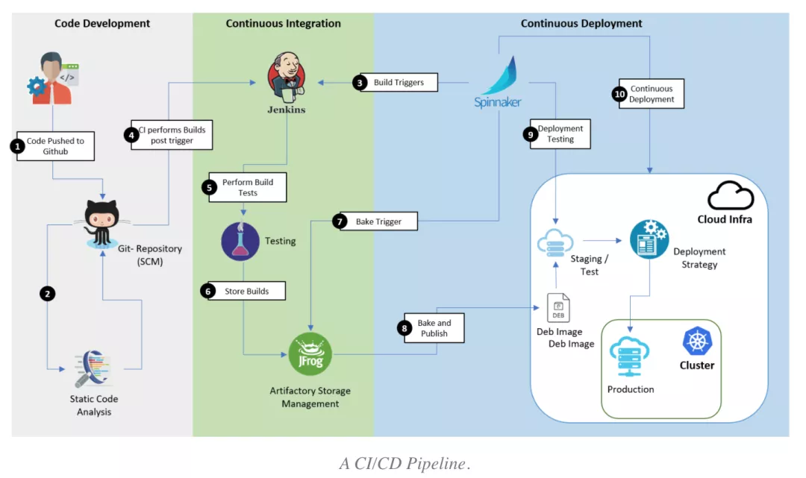
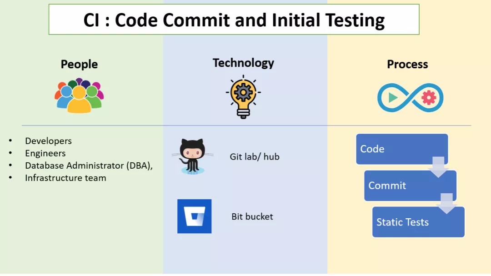
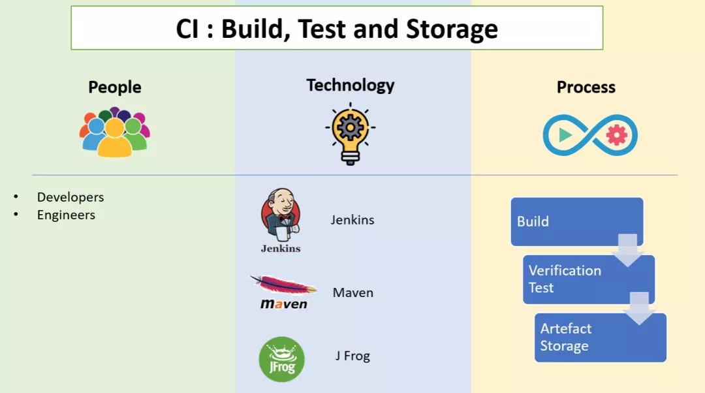
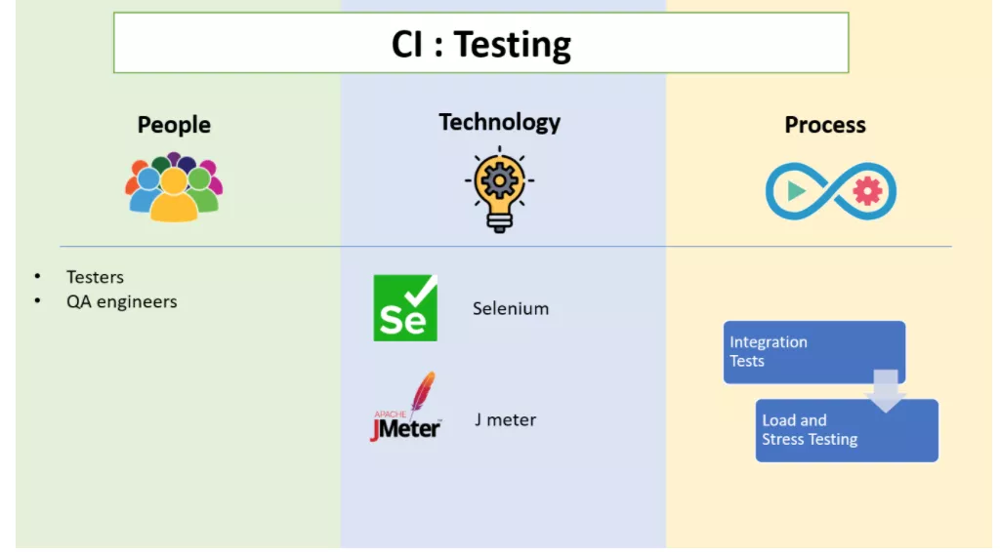
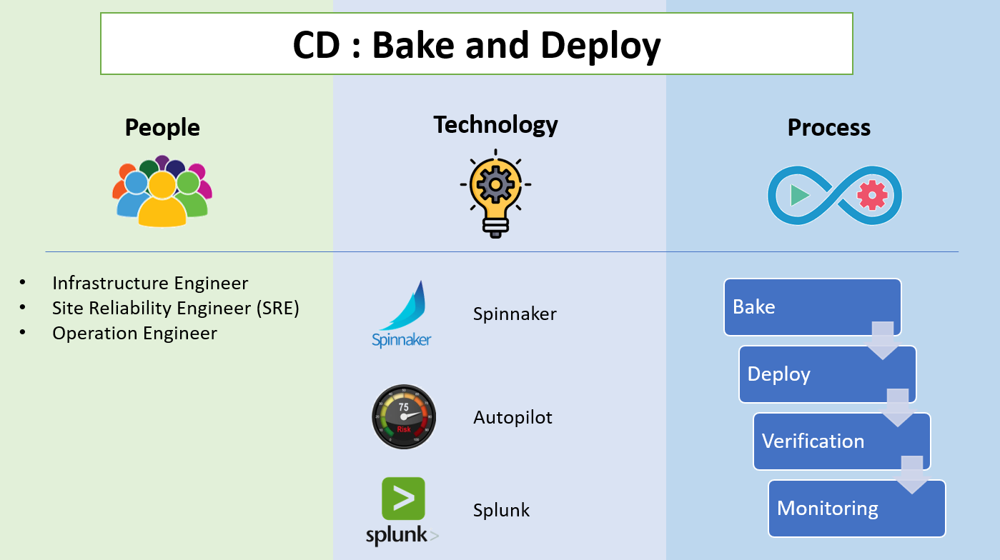
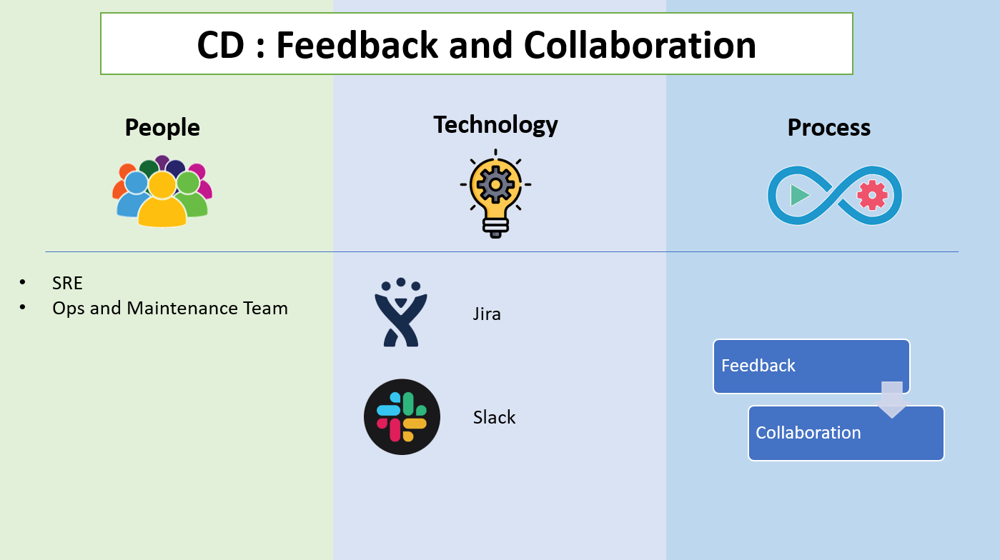

# 六张图搞懂 CI/CD 流水线

原文：https://mp.weixin.qq.com/s/mIb-idqn4bJbTm9BbeoDxg

**持续集成**（CI, Continuous Integration）是借助工具对软件项目进行持续的自动化的**编译、打包、构建、测试、发布**，来检查软件交付质量的一种行为；而**持续部署**（CD, Continuous Deployment）是基于持续交付的优势自动将经过测试的代码推入生产环境的过程。

下面从细节描述了持续集成和持续部署各个阶段的关键步骤。

DevOps 工程师经常会将 CI/CD 各阶段和其 CI/CD 流水线混淆。尽管不同的工具可以将各个复杂阶段自动化完成分阶段的 CI/CD，但是整体 CI/CD 软件链仍然可能由于不可避免的人工干预而中断。因此首先需要了解 CI/CD 流程中各个阶段，以及从**快速、规模交付**的视角探讨为什么 CI/CD 流水线对于组织的必不可少性。

## 一 CI/CD 阶段：理解参与者、流程、技术

企业应用程序开发参与者通常由**开发人员、测试人员/QA工程师，运维工程师以及 SRE（站点可靠性工程师）或 IT 运营团队**组成。他们紧密合作，目标是高质量的软件交付。CI/CD 是两个**独立**过程的组合。下图列出了每个过程的主要步骤：

持续集成（CI）是构建软件和完成初始测试的过程。持续部署（CD）是将代码与基础设置相结合的过程，确保完成所有测试并遵循策略，然后将代码部署到与其环境中。不同的公司有不同的特有流程，但主要步骤是一样的。下面详述。

## 二 CI 阶段

### 2.1 代码提交阶段

* **参与者**

  开发工程师、数据库管理员（DBA）、基础架构团队

* **技术**

  Github、Gitlab、SVM、BitBucket，etc

* **流程**

  代码提交阶段也称为版本控制。**提交**是将开发人员编写的最新代码变更发送到代码仓库的操作。开发人员编写的代码的每个版本都被无限期的存储。在与合作者讨论和审查变更（Code Review）之后，开发人员将编写代码，并在软件需求、特性增强、bug修复或变更请求完成后提交。管理编辑和提交变更的仓库称为源代码管理工具（配置管理工具）。在开发人员提交代码（代码推送请求）后，代码更改被合并到主线代码分支中，这些主线代码分支存储在GitHub这样的中央存储库中

### 2.2 静态代码检查阶段

* **参与者**

  开发人员、数据库管理员（DBA）、基础架构团队

* **技术**

  GitHub、GitLab、SVM、BitBucket，etc

* **流程**

  开发人员编写代码并将其推送到代码仓库，系统将**自动触发**以启动下一个代码分析过程。开发过程中存在这种情况：提交的代码可以构建成功，但是在部署期间构建失败。无论从机器还是人力资源的利用率而言，这都是一个缓慢而昂贵的过程。因此必须检查代码中的静态策略。-- *进行静态检查的原因*

  **SAST**（静态应用程序安全性测试）：SAST 是一种**白盒测试方法**，可以使用 SonarQube、Veracode、Appscan 等SAST工具从内部检查代码，已发现软件缺陷，漏洞和弱点（例如SQL注入等）。这是一个快速检查过程，其中检查代码是否存在语法错误。尽管此阶段缺少检查运行时错误的功能，但是该功能将在以后的阶段中执行。

  此外，额外的策略检查加入自动化流水线中也可以显著减少流程中稍后发现的错误数量

### 2.3 构建

* **参与者**

  开发工程师

* **技术**

  Jenkins、Bamboo CI、Circle CI、Travis CI、Maven、Azure、DevOps

* **流程**

  **持续集成过程的目标是提交的代码持续构建为二进制文件或者构建产物**。通过持续集成来检查添加的新模块是否与现有模块兼容，不仅有助于更快速地发现bug，还有助于减少验证新代码更改的时间。

  构建工具可以根据几乎所有编程语言的源代码创建可执行文件或者包（.ext、.dll、jar 等）。在构建过程中，还可以生成SQL脚本，配合基础设施配置文件一起进行测试。简而言之，**构建阶段就是编译应用程序的阶段**。

  Artifactory 存储、构建验证测试和单元测试，也可以作为构建过程的一部分。

#### 2.3.1 构建验证测试（BVT）/冒烟测试/单元测试

​        创建构建后立即执行冒烟测试。**BVT 将检查所有模块是否正确集成，以及程序的关键功能是否正常运行**。这样做的目的，是为了拒绝严重损坏的应用程序，以使 QA 团队不会在安装和测试软件应用程序步骤浪费时间。

​        完成这些检查后，将向流水线中执行 UT （单元测试），以进一步减少生产中的故障。单元测试可验证开发人员编写的单个单元或者组件是否按预期执行。

#### 2.3.2 构建产物存储

​        一旦构建就绪，程序包就会存储在称为 ***Aritifactory*** 或者 ***Repository*** 工具的中央数据库。随着每天构建量的增加，跟踪所有构建产物也会变得愈发困难。因此，一旦生成并验证了构建产物，就将其发送到存储库进行存储管理。诸如 Jfrog Artifactory 之类的存储库工具可用于存储诸如 .rar、.war、.exe、Ms、.jari 等之类的二进制文件。测试人员可以从此处入手进行选择，并在测试环境中部署构建产物以进行测试。

### 2.4 测试阶段

* **参与者**

  测试人员、QA

* **技术**

  Selenium、Appium、Jmeter、SOAP UI、Tarantula

* **流程**

  发布构建过程后的一系列自动测试将验证代码的准确性。此阶段可帮助避免生成中的错误。根据构建的大小，此检查可能持续数秒至数小时。对于有多个团队提交和构建代码的大型组织，这些检查在并行环境中运行，以节省宝贵的时间并尽早将错误通知开发。

  测试人员（QA）基于用户描述的测试用例和场景设置自动化测试用例。他们执行**回归分析、压力测试**来检查与预期输出的偏差。**测试中涉及的活动有完整性测试、集成测试、压力测试**。这是一个高层次的测试方法。在这个阶段，可以发现开发人员忽视的某些代码问题。

#### 2.4.1集成测试

​        集成测试一般使用 ***Cucumber、Selenium*** 等工具执行。在这些工具中，单个应用程序模块被组合起来并作为一组进行测试，同时评估其是否符合指定的功能需求。在集成测试之后，需要有人批准该组中的更新集应该移到下一个阶段，这通常是性能测试。这个验证过程可能很麻烦，但是它是整个过程的一个重要部分。

#### 2.4.2 性能和压力测试

​        Selenium，JMeter 等自动化测试工具也可以执行性能和压力测试，以检查应用程序在面对高负载时是否稳定和性能良好。该测试流程通常不会在每个更新提交上运行，因为**完整的压力测试是长期运行的**。当发布重要的新功能时，将对多个更新进行分组，并完成完整的性能测试。在单个更新被转移到下一阶段的情况下，流水线可能将金丝雀测试加入作为可选。

## 三 CD阶段

### 3.1 Bake和Deploy

* **参与者**

  基础设施工程师、现场可靠性工程师（SRE）、运维工程师

* **技术**

  Spinnaker、Argo CD、Tekton CD

* **流程**

  测试阶段完成后，清除了标准的代码就可以部署到服务器中，在那里它们将与主应用程序集成。在部署到生产环境之前，它们将被部署到产品团队内部使用的测试/暂存、或者beta环境中。在将构建移动到这些环境之前，**构建必须经过两个子阶段：Bake 和 Deploy。这两个阶段都是 Spinnaker 固有的**。

#### 3.1.1 Bake

​        Bake，是指从源代码中创建一个不可变的映像实例，**该实例在生产环境中具有当前的配置**。这些配置可能是数据库更改和其他基础设施更新之类的内容。Spinnaker 可以触发 Jenkins 来执行这个任务，有些公司则更喜欢使用 Packer。

#### 3.1.2 Deploy

​        Spinnaker 将自动将Bake的映像传递到部署阶段。这是将服务器组设置为部署到集群的位置。与上述测试过程类似，在部署阶段执行功能相同的过程。部署首先转移到测试阶段，最后转移到生产环境，然后进行批准和检查。整个过程有 Spinnaker 之类的工具处理。

#### 3.1.3 Verification

​        这也**是团队优化整个 CI/CD 流程的关键所在**。因为现在已经进行了很多测试，所以失败应该很少。但此时的任何故障都需要尽快解决，以便将对最终客户的影响降低到最低。团队也应该考虑自动化这部分流程。

​        **部署到生产环境是使用部署策略**（如蓝绿部署、金丝雀部署、滚动更新等）执行的。在部署阶段，将监视正在运行的应用程序，以验证当前部署是否正确或者是否需要回滚。

#### 3.1.4 Monitoring

* **参与者**

  SRE、运维团队

* **技术**

  Zabbix、Nagios、Prometheus、Elastic Search、Splunk、Appdynamics、Tivoli

* **流程**

  要使一个软件发行版具有故障安全性和健壮性，在生产环境中跟踪发行版的运行状况是至关重要的。应用程序监控工具将跟踪 CPU 利用率和发布延迟等性能指标。日志分析器将扫描底层中间件和操作系统产生的日志流，以识别行为并跟踪问题的来源。在生产过程中出现任何问题时，都会通知相关人员，以确保生产环境的安全性和可靠性。此外，监视阶段帮助企业收集有关新软件更改如何为收入做出贡献信息，并帮助基础架构团队跟踪系统行为趋势和进行容量规划

### 3.2 持续部署：反馈和协作工具

* **参与者**

  SRE、Ops 和 维护团队

* **技术**

  禅道、ServiceNow、Slack、Email、Hipchat

* **流程**

  DevOps 团队的目标是更迅速、持续地发布，然后不断减少错误和性能问题。这是通过 Slack 或电子邮件等频繁的向开发人员和项目经理反馈新版本的质量和性能，并在 ITSM 工具中及时提高票价来实现的。通常，反馈系统是整个软件交付过程的一部分；因此交付过程中的任何更改都会频繁的记录到系统中，以便交付团队可以对其采取行动。

  