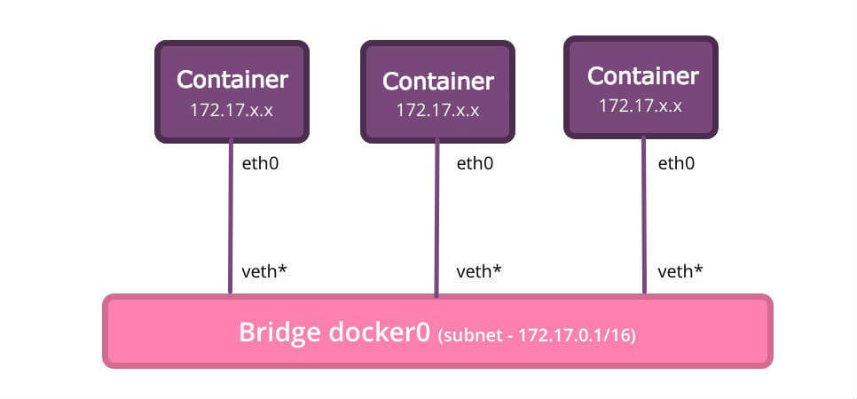
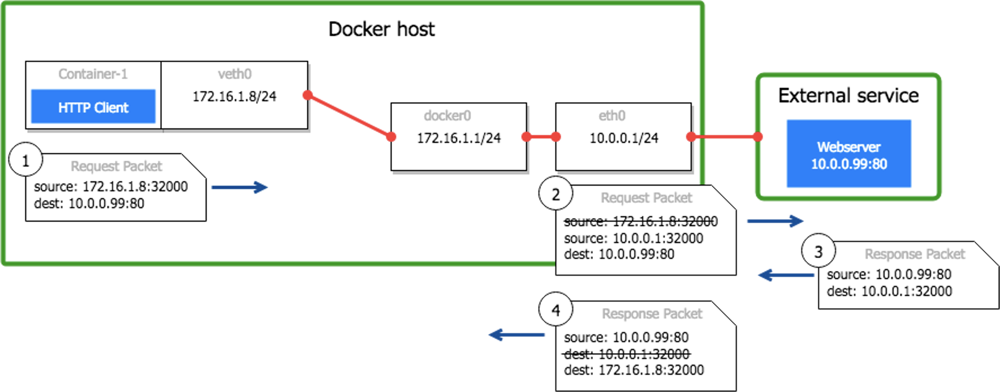

# Docker是如何访问外网的

原文：https://www.toutiao.com/a6992737727947014694/


​        docker 容器通常是网桥模式，容器通过 **veth网卡对**连接到网桥，**veth网卡对**可以理解成一个管道。一端连接网桥，一段连接到容器里面，这样容器出去的流量就可以进入网桥了。



​        当进入网桥后，毕竟是主机上，这个容器内部 IP 如何和外部通信呢？由于外部网络无法识别内部 IP，所以需要将内部 IP 映射成宿主机的 IP。Docker 也是通过 SNAT，将容器IP映射成主机 IP。



​        可以看到，容器出去 172.16.1.8 的源IP，在第二步被修改成主机的 10.0.0.1 后，发送到外部网络，然后返回的数据包的目的 IP 就是10.0.0.1，经过第四步，反向 SNAT，将目的 IP 10.0.0.1 再改成 172.16.1.8，发送到容器里面。

​        Docker的实现，是通过 iptables 的MASQ（动态SNAT）实现的：

```shell
-A POSTROUTING -s 172.16.0.0/16 ! -o docker0 -j MASQUERADE
```

***注：SNAT，是源地址转换，其作用是将ip数据包的源地址转换成另外一个地址。***

