# Docker网络

原文：https://blog.csdn.net/xx8093/article/details/117885345?utm_medium=distribute.pc_feed_v2.none-task-blog-hot-20.pc_personrecdepth_1-utm_source=distribute.pc_feed_v2.none-task-blog-hot-20.pc_personrec

### 目录

* Docker 0
* 原理
* 小结
* --link
* 自定义网络
* 网络连通
* 实战：部署Redis集群


## Docker0

清空所有环境

测试：查看宿主机的IP信息：

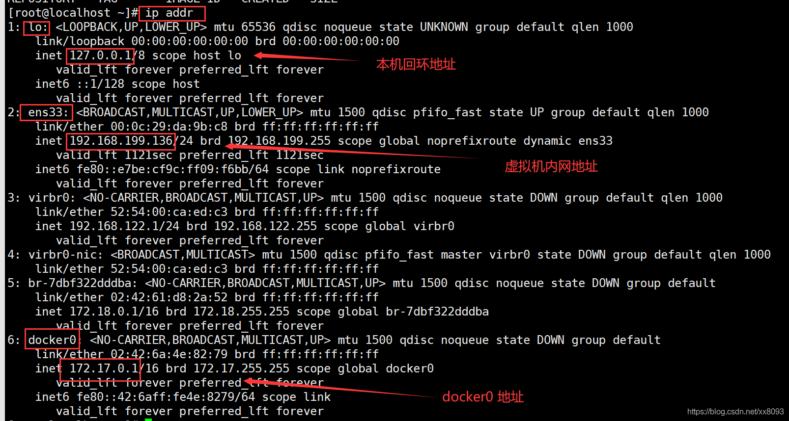

三个网络，分别是：***本地回环地址、虚拟机网络地址、docker0网络地址***

问题：docker 如何处理容器网络访问？

```shell
# 启动一个容器，这个容器运行Tomcat
[root@localhost ~] docker run -d -P --name tomcat01 tomcat

# 查看容器内部网络地址： ip addr ，	容器启动的时候会得到 eth0@if96 ip地址，docker 分配的
[root@localhost ~] docker exec -it tomcat01 ip addr
1: lo: <LOOPBACK,UP,LOWER_UP> mtu 65536 qdisc noqueue state UNKNOWN group default qlen 1000
    link/loopback 00:00:00:00:00:00 brd 00:00:00:00:00:00
    inet 127.0.0.1/8 scope host lo
       valid_lft forever preferred_lft forever
95: eth0@if96: <BROADCAST,MULTICAST,UP,LOWER_UP> mtu 1500 qdisc noqueue state UP group default 
    link/ether 02:42:ac:11:00:02 brd ff:ff:ff:ff:ff:ff link-netnsid 0
    inet 172.17.0.2/16 brd 172.17.255.255 scope global eth0
       valid_lft forever preferred_lft forever

# 思考，Linux 能不能 ping通 容器内部
[root@localhost ~] ping 172.17.0.2
PING 172.17.0.2 (172.17.0.2) 56(84) bytes of data.
64 bytes from 172.17.0.2: icmp_seq=1 ttl=64 time=0.215 ms
64 bytes from 172.17.0.2: icmp_seq=2 ttl=64 time=0.054 ms
64 bytes from 172.17.0.2: icmp_seq=3 ttl=64 time=0.119 ms
```

**linux 可以ping通 docker 容器内部**。

## 原理

​        每启动一个Docker容器，Docker就会给Docker容器分配一个IP。只要安装一个docker，就会有一个网卡docker0桥接模式，使用的是 ***evth-pair*** 技术。

​        再次测试 ip addr：

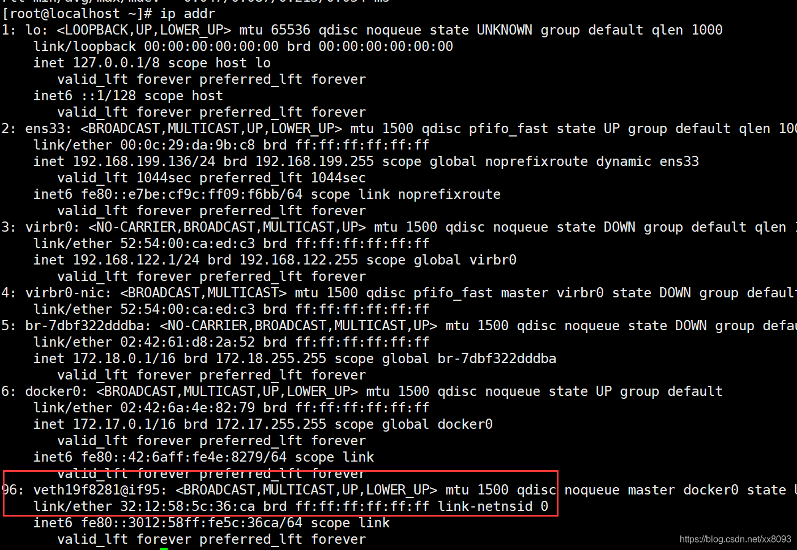

​        再次启动一个容器进行测试，发现再次多了一对网卡：

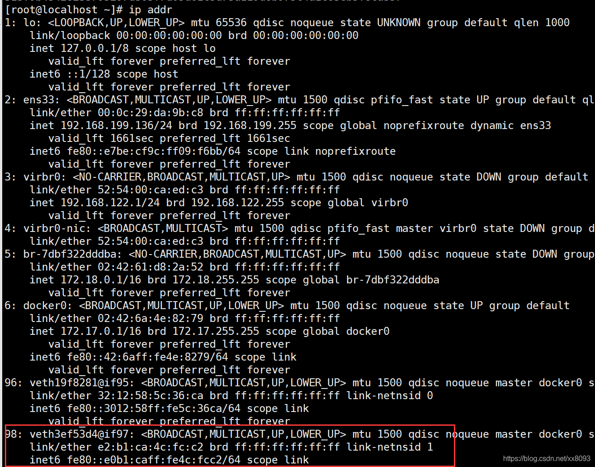

#### 总结

* 容器的网卡，都是一对对的
* evth-pair 就是一对的虚拟设备接口，成对出现，一端连着协议，一端彼此相连
* 正因为有这个特性，evth-pair 充当一个桥梁，连接各种虚拟网络设备
* OpenStac、Docker容器之间的连接，OVS的连接，都是使用 evth-pair 技术

​        现在对 tomcat01 和 tomcat02 进行测试，看看能否使用IP来ping通：

```shell
[root@localhost ~] docker exec -it tomcat02 ping 172.17.0.2
PING 172.17.0.2 (172.17.0.2) 56(84) bytes of data.
64 bytes from 172.17.0.2: icmp_seq=1 ttl=64 time=0.459 ms
64 bytes from 172.17.0.2: icmp_seq=2 ttl=64 time=0.183 ms
```

**容器和容器之间可以ping通的！(ip来ping, 通过服务名需要另外加参数，下面会讲)**

### 网络模型

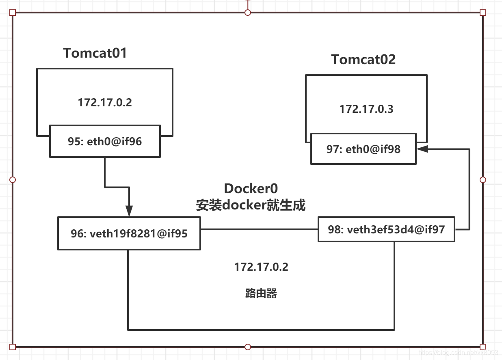

#### 结论：

​        tomcat01 和 tomcat02 是公用一个路由器，docker0

​        所有的容器在不指定网络的情况下，都是 docker0 路由的，docker 会给容器分配一个默认的可用ip

## 小结

​        Docker 使用的是 Linux的桥接，宿主机中 是一个 Docker容器的网桥 docker0


Docker 中所有网络接口都是虚拟的，虚拟的转发效率高！

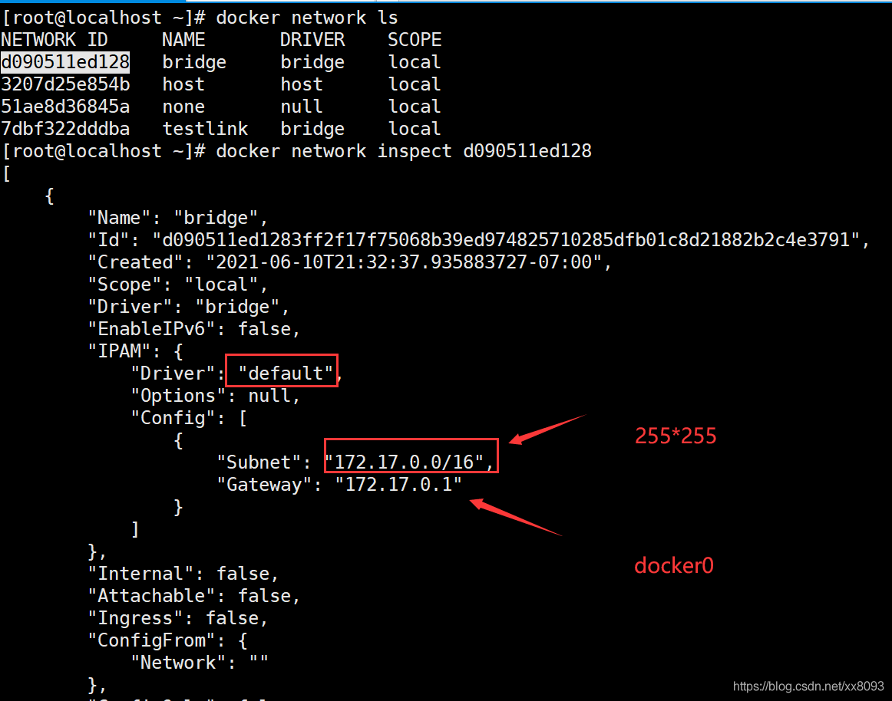

## --link

​        思考一个场景：编写一个微服务，database url=ip，项目不重启，数据库ip换掉，期望：可以通过名字来访问容器。请看下面的操作：

```shell
[root@localhost ~] docker exec -it tomcat02 ping tomcat01
ping: tomcat01: Name or service not known

# 如何解决？？

# 通过 --link 可以解决网络连通问题
[root@localhost ~] docker run -d -P --name tomcat03 --link tomcat02 tomcat
8841a935cafc1d9274e8be8fefa2431e282d458a8aef6ca0dd273619f1173a9b
[root@localhost ~] docker exec -it tomcat03 ping tomcat02
PING tomcat02 (172.17.0.3) 56(84) bytes of data.
64 bytes from tomcat02 (172.17.0.3): icmp_seq=1 ttl=64 time=0.161 ms
64 bytes from tomcat02 (172.17.0.3): icmp_seq=2 ttl=64 time=0.056 ms
64 bytes from tomcat02 (172.17.0.3): icmp_seq=3 ttl=64 time=0.062 ms
```

查看一下Docker的详细信息：

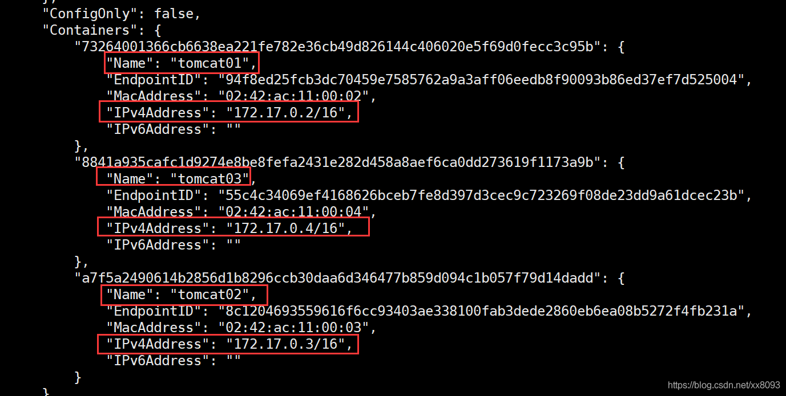

其实，这个tomcat03 在本地配置了 tomcat02：

```properties
# 查看 hosts 配置
[root@localhost ~] docker exec -it tomcat03 cat /etc/hosts
127.0.0.1	localhost
::1	localhost ip6-localhost ip6-loopback
fe00::0	ip6-localnet
ff00::0	ip6-mcastprefix
ff02::1	ip6-allnodes
ff02::2	ip6-allrouters
172.17.0.3	tomcat02 a7f5a2490614
172.17.0.4	8841a935cafc
```

#### 本质

​        --link，就是在hosts配置中，增加了一个 映射。这里的内容是：*172.17.0.3	tomcat02 a7f5a2490614*

但是，不建议使用 --link，因为docker0的问题，不支持容器名连接访问。

## 自定义网络

​        查看所有的docker网络：

```shell
[root@localhost ~] docker network ls
NETWORK ID     NAME       DRIVER    SCOPE
d090511ed128   bridge     bridge    local
3207d25e854b   host       host      local
51ae8d36845a   none       null      local
7dbf322dddba   testlink   bridge    local
```

​        网络模式：

* **bridge**: 桥接docker （默认，自己也用这个模式）
* **none**: 不配置网络
* **host**: 和宿主机共享网络
* **container**: 容器网络联通（用得少，局限性很大）

测试：

```shell
# 直接启动的命令，--net bridge(默认加上) 这个就是docker0
docker run -d -P --name tomcat01  tomcat
docker run -d -P --name tomcat01 --net bridge tomcat

# docker0 ,默认,域名不能访问

# 自定义一个网络
# --driver bridge
# --subnet 192.168.0.0/16 [192.168.0.2,192.168.255.255]
# --gateway 192.168.0.1
[root@localhost ~] docker network create --driver bridge --subnet 192.168.0.0/16 --gateway 192.168.0.1 mynet
2759cac0f23f6d6d7fe158e61e795d8183e26b208a0973b8987abcc82fc4885f
[root@localhost ~] docker network ls
NETWORK ID     NAME       DRIVER    SCOPE
d090511ed128   bridge     bridge    local
3207d25e854b   host       host      local
2759cac0f23f   mynet      bridge    local
51ae8d36845a   none       null      local
7dbf322dddba   testlink   bridge    local
```

自己的网络就创建好了：

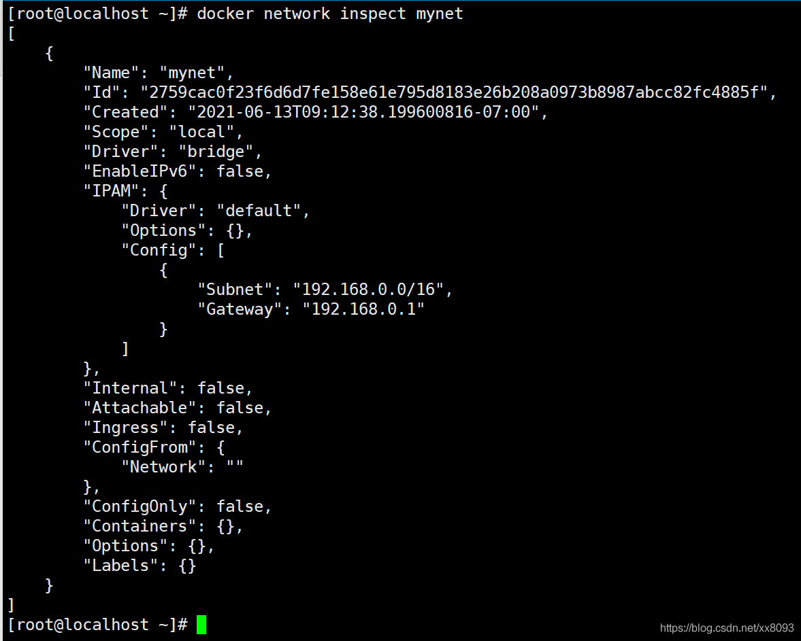


```shell
[root@localhost ~] docker run -d -P --name tomcat-net-01 --net mynet tomcat
7fda601f27fb837182b34a511d8669208f8b2d2192c2f19f5570957644bd435e
[root@localhost ~] docker run -d -P --name tomcat-net-02 --net mynet tomcat
0db47dec3a337acaf4584b247e4640c2acd843b0dc4d4581950f80a3e06d0f63
[root@localhost ~] docker network inspect mynet 
[
    {
        "Name": "mynet",
        "Id": "2759cac0f23f6d6d7fe158e61e795d8183e26b208a0973b8987abcc82fc4885f",
        "Created": "2021-06-13T09:12:38.199600816-07:00",
        "Scope": "local",
        "Driver": "bridge",
        "EnableIPv6": false,
        "IPAM": {
            "Driver": "default",
            "Options": {},
            "Config": [
                {
                    "Subnet": "192.168.0.0/16",
                    "Gateway": "192.168.0.1"
                }
            ]
        },
        "Internal": false,
        "Attachable": false,
        "Ingress": false,
        "ConfigFrom": {
            "Network": ""
        },
        "ConfigOnly": false,
        "Containers": {
            "0db47dec3a337acaf4584b247e4640c2acd843b0dc4d4581950f80a3e06d0f63": {
                "Name": "tomcat-net-02",
                "EndpointID": "d16c2be1aaaa35cd49202c9152c7314cd5b22d83ff963ffbdce0d59a8daeee8f",
                "MacAddress": "02:42:c0:a8:00:03",
                "IPv4Address": "192.168.0.3/16",
                "IPv6Address": ""
            },
            "7fda601f27fb837182b34a511d8669208f8b2d2192c2f19f5570957644bd435e": {
                "Name": "tomcat-net-01",
                "EndpointID": "cfdb9c64e341c06b4abdb22615e761736883a66b4c99735b36580171c48f31c9",
                "MacAddress": "02:42:c0:a8:00:02",
                "IPv4Address": "192.168.0.2/16",
                "IPv6Address": ""
            }
        },
        "Options": {},
        "Labels": {}
    }
]


# 再次测试 ping 连接
[root@localhost ~] docker exec -it tomcat-net-01 ping 192.168.0.3
PING 192.168.0.3 (192.168.0.3) 56(84) bytes of data.
64 bytes from 192.168.0.3: icmp_seq=1 ttl=64 time=0.125 ms
64 bytes from 192.168.0.3: icmp_seq=2 ttl=64 time=0.064 ms
^C
--- 192.168.0.3 ping statistics ---
2 packets transmitted, 2 received, 0% packet loss, time 1ms
rtt min/avg/max/mdev = 0.064/0.094/0.125/0.032 ms

# 现在不使用 --link 也可以 ping 名字
[root@localhost ~] docker exec -it tomcat-net-01 ping tomcat-net-02
PING tomcat-net-02 (192.168.0.3) 56(84) bytes of data.
64 bytes from tomcat-net-02.mynet (192.168.0.3): icmp_seq=1 ttl=64 time=0.047 ms
64 bytes from tomcat-net-02.mynet (192.168.0.3): icmp_seq=2 ttl=64 time=0.062 ms
64 bytes from tomcat-net-02.mynet (192.168.0.3): icmp_seq=3 ttl=64 time=0.054 ms
```

​        自定义的网络Docker已经维护好对应的关系。推荐使用这种方式。

#### 优点

​        不同的集群使用不同的网络，保证集群是安全和健康的。

## 网络连通

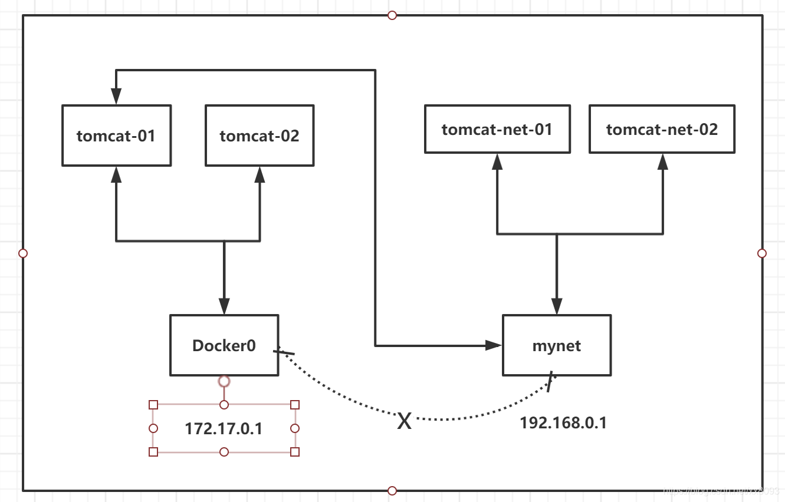

​        两个不同的网络段的容器是无法直接连接的，需要先连接到网卡。

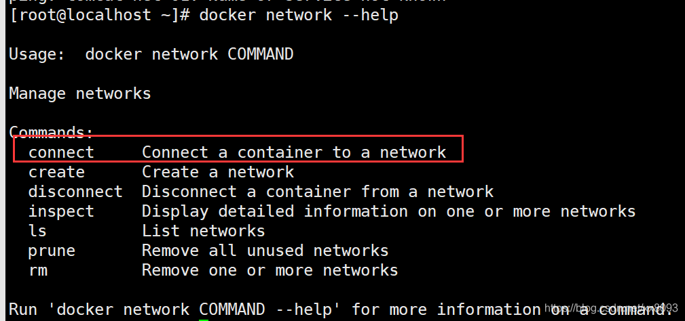


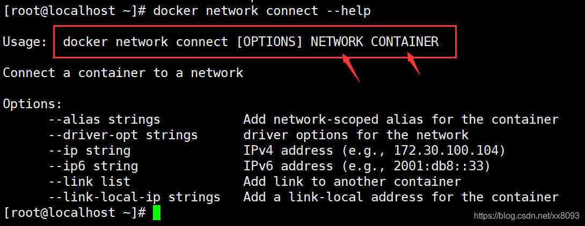


测试：打通 mynet 和 tomcat01 :

```shell
[root@localhost ~] docker network connect mynet tomcat01
[root@localhost ~] docker network inspect mynet

# 连通之后将 tomcat01 放到mynet 网络下

# 一个容器 两个 ip地址
```

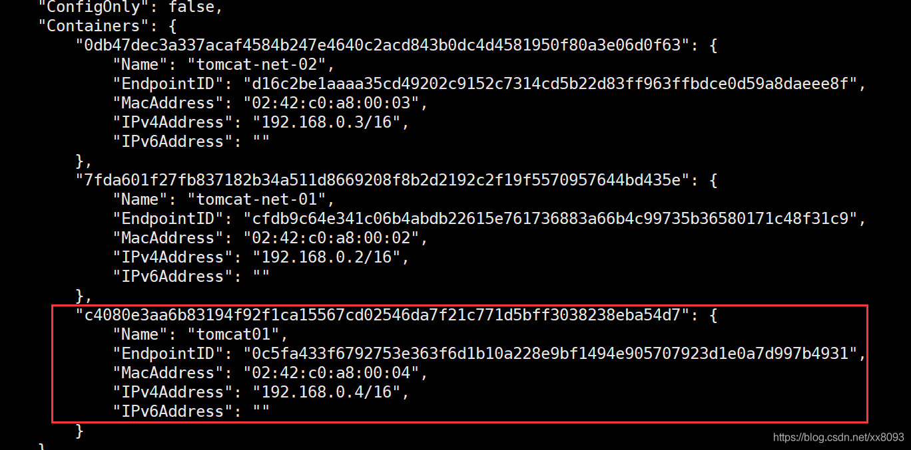


```shell
# tomcat 连通
[root@localhost ~] docker exec -it tomcat01 ping tomcat-net-01
PING tomcat-net-01 (192.168.0.2) 56(84) bytes of data.
64 bytes from tomcat-net-01.mynet (192.168.0.2): icmp_seq=1 ttl=64 time=0.329 ms
64 bytes from tomcat-net-01.mynet (192.168.0.2): icmp_seq=2 ttl=64 time=0.061 ms

# tomcat02 是依旧联不通的
[root@localhost ~] docker exec -it tomcat02 ping tomcat-net-01
ping: tomcat-net-01: Name or service not known
```

#### 结论

​        假设要跨网络操作别的docker，需要使用 docker network connect 连通。

## 实战：部署Redis集群

```shell
docker network create redis --subnet 172.38.0.0/16


for port in $(seq 1 6); \
do \
mkdir -p /mydata/redis/node-${port}/conf
touch /mydata/redis/node-${port}/conf/redis.conf
cat << EOF >/mydata/redis/node-${port}/conf/redis.conf
port 6379
bind 0.0.0.0
cluster-enabled yes
cluster-config-file nodes.conf
cluster-node-timeout 5000
cluster-announce-ip 172.38.0.1${port}
cluster-announce-port 6379
cluster-announce-bus-port 16379
appendonly yes
EOF
done

docker run -p 637${port}:6379 -p 1637${port}:16379 --name redis-${port} \
-v /mydata/redis/node-${port}/data:/data \
-v /mydata/redis/node-${port}/conf/redis.conf:/etc/redis/redis.conf \
-d --net redis --ip 172.38.0.1${port} redis:5.0.9-alpine3.11 redis-server /etc/redis/redis.conf; \

docker run -p 6371:6379 -p 16371:16379 --name redis-1 \
-v /mydata/redis/node-1/data:/data \
-v /mydata/redis/node-1/conf/redis.conf:/etc/redis/redis.conf \
-d --net redis --ip 172.38.0.11 redis:5.0.9-alpine3.11 redis-server /etc/redis/redis.conf

依次2，3，4，5

docker run -p 6376:6379 -p 16376:16379 --name redis-6 \
-v /mydata/redis/node-6/data:/data \
-v /mydata/redis/node-6/conf/redis.conf:/etc/redis/redis.conf \
-d --net redis --ip 172.38.0.16 redis:5.0.9-alpine3.11 redis-server /etc/redis/redis.conf

# 创建集群
redis-cli --cluster create 172.38.0.11:6379 172.38.0.12:6379 172.38.0.13:6379 172.38.0.14:6379 172.38.0.15:6379 172.38.0.16:6379 --cluster-replicas 1

>>> Performing hash slots allocation on 6 nodes...
Master[0] -> Slots 0 - 5460
Master[1] -> Slots 5461 - 10922
Master[2] -> Slots 10923 - 16383
Adding replica 172.38.0.15:6379 to 172.38.0.11:6379
Adding replica 172.38.0.16:6379 to 172.38.0.12:6379
Adding replica 172.38.0.14:6379 to 172.38.0.13:6379
M: 4fb26d56a93cdd47312464652f5a1927e26011a7 172.38.0.11:6379
   slots:[0-5460] (5461 slots) master
M: 1fbe188eaba341dae2a20cfb1fd5321de89d17c7 172.38.0.12:6379
   slots:[5461-10922] (5462 slots) master
M: 18a963f16cf59fb7ba8097e8c1b6cf23c9aeaa4f 172.38.0.13:6379
   slots:[10923-16383] (5461 slots) master
S: 20c5ef6f4f82d1b8a5c6232dfe172473aa5c1a77 172.38.0.14:6379
   replicates 18a963f16cf59fb7ba8097e8c1b6cf23c9aeaa4f
S: 778d4903738451574c329c572d297011db6cc510 172.38.0.15:6379
   replicates 4fb26d56a93cdd47312464652f5a1927e26011a7
S: 3958e20ec48817ad5e880433a085f47142d4f46c 172.38.0.16:6379
   replicates 1fbe188eaba341dae2a20cfb1fd5321de89d17c7
Can I set the above configuration? (type 'yes' to accept): yes
>>> Nodes configuration updated
>>> Assign a different config epoch to each node
>>> Sending CLUSTER MEET messages to join the cluster
Waiting for the cluster to join
....
>>> Performing Cluster Check (using node 172.38.0.11:6379)
M: 4fb26d56a93cdd47312464652f5a1927e26011a7 172.38.0.11:6379
   slots:[0-5460] (5461 slots) master
   1 additional replica(s)
S: 20c5ef6f4f82d1b8a5c6232dfe172473aa5c1a77 172.38.0.14:6379
   slots: (0 slots) slave
   replicates 18a963f16cf59fb7ba8097e8c1b6cf23c9aeaa4f
S: 3958e20ec48817ad5e880433a085f47142d4f46c 172.38.0.16:6379
   slots: (0 slots) slave
   replicates 1fbe188eaba341dae2a20cfb1fd5321de89d17c7
M: 18a963f16cf59fb7ba8097e8c1b6cf23c9aeaa4f 172.38.0.13:6379
   slots:[10923-16383] (5461 slots) master
   1 additional replica(s)
S: 778d4903738451574c329c572d297011db6cc510 172.38.0.15:6379
   slots: (0 slots) slave
   replicates 4fb26d56a93cdd47312464652f5a1927e26011a7
M: 1fbe188eaba341dae2a20cfb1fd5321de89d17c7 172.38.0.12:6379
   slots:[5461-10922] (5462 slots) master
   1 additional replica(s)
[OK] All nodes agree about slots configuration.
>>> Check for open slots...
>>> Check slots coverage...
[OK] All 16384 slots covered.

/data # redis-cli -c
127.0.0.1:6379> cluster info
cluster_state:ok
cluster_slots_assigned:16384
cluster_slots_ok:16384
cluster_slots_pfail:0
cluster_slots_fail:0
cluster_known_nodes:6
cluster_size:3
cluster_current_epoch:6
cluster_my_epoch:1
cluster_stats_messages_ping_sent:118
cluster_stats_messages_pong_sent:118
cluster_stats_messages_sent:236
cluster_stats_messages_ping_received:113
cluster_stats_messages_pong_received:118
cluster_stats_messages_meet_received:5
cluster_stats_messages_received:236
127.0.0.1:6379> cluster nodes
20c5ef6f4f82d1b8a5c6232dfe172473aa5c1a77 172.38.0.14:6379@16379 slave 18a963f16cf59fb7ba8097e8c1b6cf23c9aeaa4f 0 1623642231513 4 connected
3958e20ec48817ad5e880433a085f47142d4f46c 172.38.0.16:6379@16379 slave 1fbe188eaba341dae2a20cfb1fd5321de89d17c7 0 1623642230505 6 connected
4fb26d56a93cdd47312464652f5a1927e26011a7 172.38.0.11:6379@16379 myself,master - 0 1623642230000 1 connected 0-5460
18a963f16cf59fb7ba8097e8c1b6cf23c9aeaa4f 172.38.0.13:6379@16379 master - 0 1623642230908 3 connected 10923-16383
778d4903738451574c329c572d297011db6cc510 172.38.0.15:6379@16379 slave 4fb26d56a93cdd47312464652f5a1927e26011a7 0 1623642230505 5 connected
1fbe188eaba341dae2a20cfb1fd5321de89d17c7 172.38.0.12:6379@16379 master - 0 1623642230000 2 connected 5461-10922
127.0.0.1:6379> set a b
-> Redirected to slot [15495] located at 172.38.0.13:6379
OK
172.38.0.13:6379> get a
^C
/data # redis-cli -c
127.0.0.1:6379> get a
-> Redirected to slot [15495] located at 172.38.0.14:6379
"b"
172.38.0.14:6379> cluster nodes
4fb26d56a93cdd47312464652f5a1927e26011a7 172.38.0.11:6379@16379 master - 0 1623642371095 1 connected 0-5460
1fbe188eaba341dae2a20cfb1fd5321de89d17c7 172.38.0.12:6379@16379 master - 0 1623642372504 2 connected 5461-10922
3958e20ec48817ad5e880433a085f47142d4f46c 172.38.0.16:6379@16379 slave 1fbe188eaba341dae2a20cfb1fd5321de89d17c7 0 1623642371095 6 connected
20c5ef6f4f82d1b8a5c6232dfe172473aa5c1a77 172.38.0.14:6379@16379 myself,master - 0 1623642371000 7 connected 10923-16383
18a963f16cf59fb7ba8097e8c1b6cf23c9aeaa4f 172.38.0.13:6379@16379 master,fail - 1623642307491 1623642306584 3 connected
778d4903738451574c329c572d297011db6cc510 172.38.0.15:6379@16379 slave 4fb26d56a93cdd47312464652f5a1927e26011a7 0 1623642372100 5 connected
172.38.0.14:6379> 
```

docker 搭建redis集群完成：

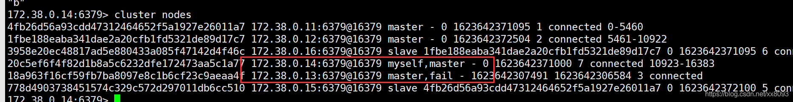