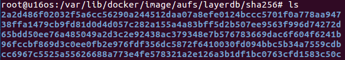

# Docker 镜像之存储管理

https://www.cnblogs.com/sparkdev/p/9121188.html

内容来自：

作者：[sparkdev](http://www.cnblogs.com/sparkdev/)

出处：http://www.cnblogs.com/sparkdev/

================================================

在[《Docker 镜像的技术原理》](./Docker_Theory.md)中介绍了镜像分层、写时复制以及内容寻址存储（Content-addressable storage）等技术特性，为了支持这些特性，docker设计了一套镜像元数据管理机制来管理镜像元数据。另外，为了能够让docker容器适应不同平台不同应用场景对存储的要求，docker提供了各种基于不同文件系统实现的存储驱动来管理实际镜像文件。

本文就来介绍docker如何管理镜像元数据，以及如何通过存储驱动来管理实际的容器镜像文件。

## Docker镜像元数据管理

Docker镜像在设计上将镜像元数据和镜像文件的存储完全隔离开了。Docker在管理镜像层元数据时采用的是从上而下**repository、image**和**layer**三个层次。由于Docker以分层的形式存储镜像，所有repository和image这两类元数据并没有物理上的镜像文件与之对应，而layer这种元数据则存在物理上的镜像层文件与之对应。接下来就介绍这些元数据的管理与存储。

### Repository元数据

Repository是由具有某个功能的docker镜像的所有迭代版本构成的镜像库。Repository在本地的持久化文件存放于/var/lib/docker/image/<graph_driver>/repositories.json中。下图显示了docker使用aufs存储驱动时repositories.json文件的路径：


我们可以通过vi（或cat）指令查看repositories.json的内容：


文件中存储了所有本地镜像的repository的名字，比如ubuntu，还有每个repository下的镜像的名字、标签及其对应的镜像ID。当前Docker默认采用SHA256算法根据镜像元数据配置文件计算出镜像ID。上图中的两条记录本质上是一样的，第二条记录和第一条记录指向同一个镜像ID。其中，*sha256:c8c275751219dadad8fa56b3ac41ca6cb22219ff117ca98fe82b42f24e1ba64e* 被称为镜像的摘要，在拉取镜像时可以看到它：


镜像摘要（Digest）是对镜像的manifest内容计算SHA256得到的。所以可以直接指定一个镜像的摘要进行pull操作：

```shell
$ docker pull ubuntu@sha256:c8c275751219dadad8fa56b3ac41ca6cb22219ff117ca98fe82b42f24e1ba64e
```

这个命令与 `docker pull ubuntu:latest`是一样的（不过，每发行一个新的latest版本，Digest的内容会变化～）。

### Image元数据

image元数据包括了**镜像架构（如x86、amd64）、操作系统（如Linux）、镜像默认配置、构建该镜像的容器ID和配置、创建时间、创建该镜像的Docker版本，构建镜像的历史信息以及rootfs**组成。

其中，构建镜像的历史信息和rootfs组成部分除了具有描述镜像的作用外，还将镜像和构成镜像的镜像层关联了起来。Docker会根据历史信息和rootfs中的diff_ids计算出构成镜像的镜像层的存储索引chainID，这也是docker1.10镜像存储中基于内容寻址的核心技术。

镜像ID与镜像元数据之间的映射关系以及元数据被保存在文件***/var/lib/docker/image/<graph_driver>/imagedb/content/sha256/<image_id>*** 中:


上图显示了存储的位置，以及对应image的镜像ID。其内容如下（摘取重要信息显示）：


它包含所有镜像层信息的rootfs（上图所示的rootfs部分），**docker利用rootfs中的diff_id计算出内容寻址的索引（chainID）来获取layer相关信息**，进而获取每一个镜像层的文件内容。注意，每个diff_id对应一个镜像层。上面的diff_id的排列也是有顺序的，从上到下一次表示镜像层的最低层到最高层：


### Layer元数据

**layer对应镜像层的概念**。

在docker1.10版本以前，镜像通过一个graph结构管理，每一个镜像层都拥有元数据，记录了该层的构建信息以及父镜像层ID，而**最上面**的镜像层会多记录一些信息作为整个镜像的元数据。graph则根据镜像ID（即**最上层**的镜像层ID）和每个镜像层记录的父镜像层ID维护了一个树状的镜像层结构。

在docker1.10版本后，镜像元数据管理巨大的改变之一就是简化了镜像层的元数据。镜像层只包含一个具体的镜像层文件包。用户在docker宿主机上下载了某个镜像层之后，docker会在宿主机上基于镜像层文件包和image元数据构建本地的layer元数据，包括diff、parent、size等。而当docker将在宿主机上产生的新的镜像层上传到registry时，与新镜像层相关的宿主机上的元数据也**不会**与镜像层一块打包上传。

Docker中定义了**Layer**和**RWLayer**两种**接口**，分别用来定义只读层和读写层的一些操作，又定义了**roLayer**（read only Layer）和**mountedLayer**，分别实现了上述两种接口。其中，roLayer用于描述不可改变的镜像层，mountedLayer用于描述可读写的容器层。

#### roLayer

具体来说，roLayer存储的内容主要有索引该镜像层的chainID、该镜像层的校验码diffID、父镜像层parent、graphdriver存储当前镜像层文件的cacheID、该镜像层的size等内容。这些元数据被保存在 **/var/lib/docker/image/<graph_driver>/layerdb/sha256/<chainID>** 文件夹下。

下图展示了/var/lib/docker/image/<graph_driver>/layerdb/sha256/ 目录下的目录，其名称都是镜像层的存储索引chainID：



镜像层的存储索引chainID目录下的内容大致如下：


其中diffID和size可以通过镜像层包计算出来（diff文件的内容即diffID，其内容就是image元素据中对应层的diff_id）。chainID和父镜像层parent需要从所属image元数据中计算得到。而cacheID是在当前docker宿主机上随机生成的一个uuid，在当前的宿主机上，cacheID与该镜像层一一对应，用于标识并索引graphdriver中的镜像层文件：


在layer的所有属性中，diffID采用SHA256算法，基于镜像层文件包的内容计算得到。而chainID是基于内容存储的索引，它是根据当前层与所有祖先镜像层diffID计算出来的，具体算法如下：

* 如果该镜像层是最底层（没有父镜像层），该层的diffID就是chainID
* 该镜像层的chainID计算公式为 chainID(n)=SHA256(chain(n-1) diffID(n))，也就是根据父镜像层的chainID加上一个**空格**和当前层的diffID，再计算SHA256校验码

#### mountedLayer

mountedLayer存储的内容主要为索引某个容器的可读写层（也叫容器层）的ID（也对应容器层的ID）、容器init层再graphdriver中的ID（init ID）、读写层在graphdriver中的ID（mountID）以及容器层的父层镜像的chainID（parent）。相关文件位于 **/var/lib/docker/image/<graph_driver>/layerdb/mounts/<container_id>** 目录下。

启动一个容器，查看 /var/lib/docker/image/<graph_driver>/layerdb/mounts/<container_id> 目录下的内容：


## Docker aufs存储驱动

存储驱动根据操作系统底层的支持提供了针对某种文件系统的初始化操作以及对镜像层的增、删、改、查和差异比较等操作。目前存储系统的接口已经有aufs、btrfs、devicemapper、voerlay2等多种。在启动docker deamon时，可以指定使用的存储驱动，当然指定的驱动必须被底层的操作系统支持。下面以aufs存储驱动为例，介绍其工作方式。

#### aufs

aufs（Advanced multi layered Unification Filesystem）是一种支持联合挂在的文件系统。简单来说，就是支持将不同目录挂载到同一个目录下，这些挂载操作对用户来说是透明的，用户在操作该目录时并不会觉得与其他目录有什么不同。这些目录的挂载是分层次的，**通常来说，最上层是可读写层，下面的层是只读层。**所以，aufs的每一层都是一个普通的文件系统。

* **当需要读取一个文件A时**，会从最顶层的读写层开始向下寻找，本层没有，则根据层之间的关系到下一层开始找，直到找到第一个文件A并打开它（有些Java的双亲委派逻辑）。

* **当需要写入一个文件A时**，如果这个文件不存在，则在读写层新建一个，否则像“读”的过程一样，从顶层开始查找，直到找到最近的文件A，**aufs会把这个文件复制到读写层进行修改**。由此可见，在第一次修改某个已存在的文件时，如果这个文件很大，即使只有修改几个字节，也会产生巨大的磁盘开销。
* **当需要删除一个文件时**，如果这个文件仅仅存在于读写层中，则可以直接删除这个文件，否则就需要先删除它在读写层中的备份，再在读写层中创建一个whiteout文件来标识这个文件不存在，而不是真正的删除底层的文件。
* **当新建一个文件时**，如果这个文件在读写层存在对应的whiteout文件，则先将whiteout文件删除，在新建。否则直接在读写层新建即可。

那么镜像文件在本地存放在哪儿呢？

以aufs驱动为例，先查看/var/lib/docker/aufs目录：

```shell
$ sudo su
$ cd /var/lib/docker/aufs
$ ls
```


其中，**mnt**为aufs的挂载目录，**diff**为实际的数据来源，包括只读层和可读写层，所有这些层最终一起被挂载在mnt下面的目录上，**layers**下为与每层依赖有关的层描述文件。

最初，mnt和layers目录都是空的，文件数据都在diff目录下。一个ocker容器创建与启动的过程中，会在/var/lib/docker/aufs目录下新建出对应的文件和目录。由于docker镜像管理部分与存储驱动在设计上完全分离了，**镜像层或者容器层在存储驱动中拥有一个新的标识ID，在镜像层（roLayer）中称为cacheID，容器层（mountedLayer）中为mountID。**在Linux环境下，mountID是随机生成的并保存在mountedLayoer的元数据mountID中，持久化在image/aufs/layerdb/mounts/<container_id>/mount-id中。下面以mountID为例，介绍创建一个新读写层的步骤：

* 第一步，分别在mnt和diff目录下创建与该层的mountID同名的子文件夹

* 第二步，在layers目录下创建与该层的mountID同名的文件，用来记录该层所依赖的所有的其它层

* 第三步，如果参数中的parent项不为空（这里介绍的是创建容器的情景，parent就是镜像的最上层），说明该层依赖于其它层。GraphDriver就需要将parent的mountID写入到该层的layers下对应mountID的文件里。然后GraphDriver还需要在layers目录下读取与上述parent同mountID的文件，将parent层的所有依赖层也复制到这个新创建层对应的层描述文件中，这样，这个文件才记录了该层的所有依赖。创建成功后，这个新建的层描述文件如下：

  

第三步的图中，“6a2ef0693c2879347cc1a575c1db60765afb0cff47dcf3ab396f35d070fb240b”为mountID。**随后GraphDriver会将diff中属于容器镜像的所有层目录以只读方式挂载到mnt下，然后在diff中生成一个以当前容器对应的<imageID>-init命名的文件夹作为最后一层只读层**，这个文件夹用于挂载并重新生成如下代码段所列的文件：

```shell
   "/dev/pts":"dir",
   "/dev/shm":"dir",
   "/proc":"dir",
   "/sys":"dir",
   "/.dockerinit":"file",
   "/.dockerenv":"file",
   "/etc/resolv.conf":"file",
   "/etc/hosts":"file",
   "/etc/hastname":"file",
   "/dev/console":"file",
   "/etc/mtab":"/proc/mounts",
```

可以看出，这些文件与当前容器内的环境息息相关，但并不适合被打包作为镜像的文件内容（毕竟文件里的内容是属于这个容器特有的），同时这些内容又不应该直接修改在宿主机文件上，所以docker容器文件存储中设计了mountID-init这么一层单独处理这些文件。**这一层只在容器启动时添加，**并会根据系统环境和用户配置自动生成具体的内容（如DNS配置等），只有当这些文件在运行过程中被改动后并且docker commit了才会持久化这些变化，否则保存镜像时不会包含这一层的内容。

**所以严格地说，docker容器的文件系统有3层：可读写层、init层和只读层。**但这并不影响大家传统认识上可读写层 + 只读层组成的容器文件系统。因为init层对于用户而言是完全透明的。接下来会在diff中生成一个以容器对应mountID为名的可读写目录，也挂载到mnt目录下。所以将来用户在容器中新建文件就会出现在mnt下以mountID为名的目录下，而该层对应的世界内容则保存在diff目录下。

#### 总结

所有文件的实际内容均保存在diff目录下，包括可读写层也会以mountID为名出现在diff目录下，最终会整合到一起，联合挂载到mnt目录下以mountID为名的文件夹下。

## mnt目录变化

接下来，做个实验，观察一下mnt对应的mountID下的变化。

#### 创建容器

第一步，创建一个容器：

```shell
$ docker container create -it --name mycon ubuntu bash
```

截图如下：


创建了一个容器，其容器ID是：059a01071ab7f51abdfbe9f78b95be06ad631d0e0d4be3153e4a1bc32ffa453a，此时容器的状态为“Created”。然后在/var/lib/docker/image/aufs/layerdb/mounts目录中，查看059a01071ab7f51abdfbe9f78b95be06ad631d0e0d4be3153e4a1bc32ffa453a目录下mount-id文件的内容：

```shell
819e3e9a67f4440cecf29086c559a57a1024a078eeee42f48d5d3472e59a6c94
```

这就是容器层对应的mountID。接下来查看容器运行前对应的mnt目录：

```shell
$ du -h . --max-depth=1 |grep 819e
```


此时mountID对应的文件夹是空的。

#### 启动容器

通过下列命令启动容器：

```shell
$ docker container start -i mycon
```

然后再看看mnt下对应的目录大小：


容器层变大了，进入到文件夹中可以看到挂载好的文件系统：


#### 容器中创建文件

接着，进入容器，并创建一个大小为1G的文件：


此时再次查看mnt下对应的目录大小：


容器层目录的大小反映了对文件执行的操作。

#### 停止容器

接下来停止容器：

```shell
$ docker container stop mycon
```

停止容器后，/var/lib/docker/aufs/mnt目录下对应的mountID目录被写在（unmount），此时该目录为空。但是/var/lib/docker/aufs/diff目录下对应的目录和文件都还存在。

#### 小结

通过上面的操作，可以通过下图来理解docker aufs驱动的主要存储目录和作用：


最后，当使用docker container commit命令把容器提交成镜像后，就会在diff目录下生成一个新的cacheID命令的文件夹，它存放了最新的差异变化文件，这时一个新的镜像层就诞生了。而原来以mountID为名的文件夹会继续存在，直到对应容器被删除。


## 总结

本文结合实例介绍了 docker 镜像元数据的存储和 aufs 存储驱动下 docker 镜像层的文件存储。由于 docker 镜像管理部分与存储驱动在设计上的完全分离，使得这部分内容初看起来并不是那么直观。