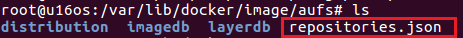
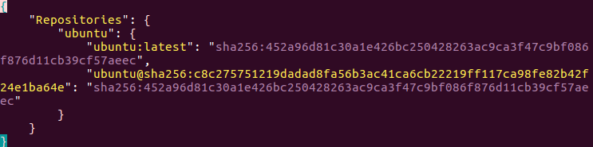
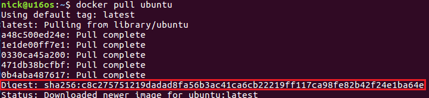
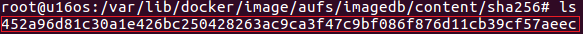
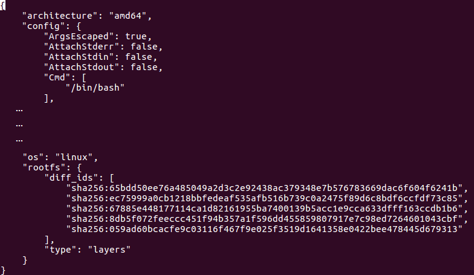
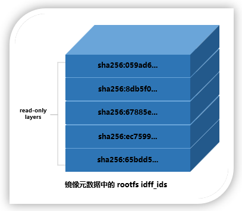

# Docker 镜像之存储管理

https://www.cnblogs.com/sparkdev/p/9121188.html

内容来自：

作者：[sparkdev](http://www.cnblogs.com/sparkdev/)

出处：http://www.cnblogs.com/sparkdev/

================================================

在[《Docker 镜像的技术原理》](./Docker_Theory.md)中介绍了镜像分层、写时复制以及内容寻址存储（Content-addressable storage）等技术特性，为了支持这些特性，docker设计了一套镜像元数据管理机制来管理镜像元数据。另外，为了能够让docker容器适应不同平台不同应用场景对存储的要求，docker提供了各种基于不同文件系统实现的存储驱动来管理实际镜像文件。

本文就来介绍docker如何管理镜像元数据，以及如何通过存储驱动来管理实际的容器镜像文件。

## Docker镜像元数据管理

Docker镜像在设计上将镜像元数据和镜像文件的存储完全隔离开了。Docker在管理镜像层元数据时采用的是从上而下**repository、image**和**layer**三个层次。由于Docker以分层的形式存储镜像，所有repository和image这两类元数据并没有物理上的镜像文件与之对应，而layer这种元数据则存在物理上的镜像层文件与之对应。接下来就介绍这些元数据的管理与存储。

### Repository元数据

Repository是由具有某个功能的docker镜像的所有迭代版本构成的镜像库。Repository在本地的持久化文件存放于/var/lib/docker/image/<graph_driver>/repositories.json中。下图显示了docker使用aufs存储驱动时repositories.json文件的路径：



我们可以通过vi（或cat）指令查看repositories.json的内容：



文件中存储了所有本地镜像的repository的名字，比如ubuntu，还有每个repository下的镜像的名字、标签及其对应的镜像ID。当前Docker默认采用SHA256算法根据镜像元数据配置文件计算出镜像ID。上图中的两条记录本质上是一样的，第二条记录和第一条记录指向同一个镜像ID。其中，*sha256:c8c275751219dadad8fa56b3ac41ca6cb22219ff117ca98fe82b42f24e1ba64e* 被称为镜像的摘要，在拉取镜像时可以看到它：



镜像摘要（Digest）是对镜像的manifest内容计算SHA256得到的。所以可以直接指定一个镜像的摘要进行pull操作：

```shell
$ docker pull ubuntu@sha256:c8c275751219dadad8fa56b3ac41ca6cb22219ff117ca98fe82b42f24e1ba64e
```

这个命令与 `docker pull ubuntu:latest`是一样的（不过，每发行一个新的latest版本，Digest的内容会变化～）。

### Image元数据

image元数据包括了**镜像架构（如x86、amd64）、操作系统（如Linux）、镜像默认配置、构建该镜像的容器ID和配置、创建时间、创建该镜像的Docker版本，构建镜像的历史信息以及rootfs**组成。

其中，构建镜像的历史信息和rootfs组成部分除了具有描述镜像的作用外，还将镜像和构成镜像的镜像层关联了起来。Docker会根据历史信息和rootfs中的diff_ids计算出构成镜像的镜像层的存储索引chainID，这也是docker1.10镜像存储中基于内容寻址的核心技术。

镜像ID与镜像元数据之间的映射关系以及元数据被保存在文件***/var/lib/docker/image/<graph_driver>/imagedb/content/sha256/<image_id>*** 中:



上图显示了存储的位置，以及对应image的镜像ID。其内容如下（摘取重要信息显示）：



它包含所有镜像层信息的rootfs（上图所示的rootfs部分），**docker利用rootfs中的diff_id计算出内容寻址的索引（chainID）来获取layer相关信息**，进而获取每一个镜像层的文件内容。注意，每个diff_id对应一个镜像层。上面的diff_id的排列也是有顺序的，从上到下一次表示镜像层的最低层到最高层：



### Layer元数据


## Docker aufs存储驱动

