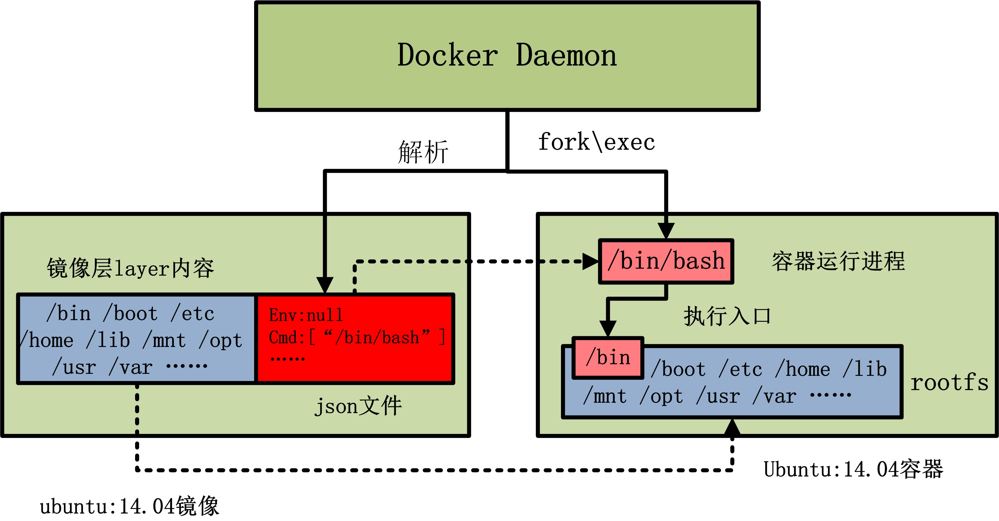
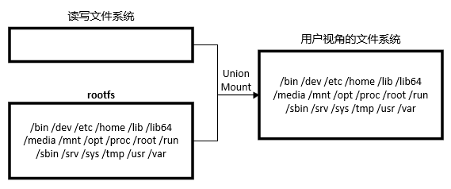
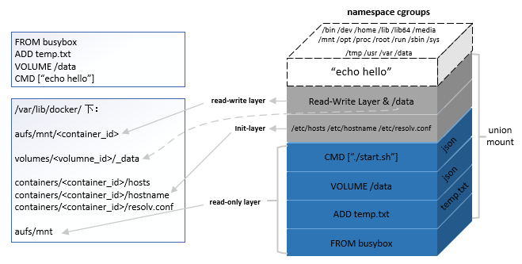

# Docker 镜像的技术原理

https://www.cnblogs.com/sparkdev/p/9092082.html

## 什么是Docker镜像

Docker镜像是一个**只读**的Docker**容器模版**，含有启动Docker容器所需要的文件系统结构及其内容，因此是启动一个Docker容器的基础。

Docker镜像的文件内容以及一些运行Docker容器的配置文件组成了Docker容器的静态文件系统运行环境：rootfs。可以这么理解：Docker镜像是Docker容器的静态视角，Docker容器是Docker镜像的运行状态。

通过下图来理解Docker Daemon， Docker镜像以及Docker容器三者的关系：

从上图可以看到，当由Ubuntu14.04镜像启动容器时，Ubuntu14.04镜像的镜像层内容将作为容器的rootfs。而Ubuntu14.04镜像的json文件，会由Docker daemon解析，并提取出其中的内容执行入口CMD信息，以及容器进程的环境变量ENV信息，最终初始化容器进程。当然，容器京城的执行入口源于镜像提供的rootfs。

### rootfs

rootfs是Docker容器在启动时内部进程可见的文件系统，即Docker容器的根目录。rootfs通常包含一个操作系统运行所需的文件系统，例如可能包含典型的类Unix操作系统中的目录系统，如/dev, /proc, /bin, /etc, /lib, /usr, /tmp及运行Docker容器所需的配置文件、工具等。

在传统的Linux操作系统内核启动时，首先挂在一个只读的rootfs，当系统检测其完整性之后，再将其切换为读写模式。

而在Docker架构中，当Docker Daemon为Docker容器挂载rootfs时，沿用了Linux内核启动时的做法，即将rootfs设为只读模式。在挂载完毕之后，利用联合挂载（union mount）技术在已有的只读rootfs上再挂载一个读写层。这样，可读写的层位于Docker容器文件系统的最顶层，其下可能联合挂载了多个只读的层，只有在Docker容器运行过程中文件系统发生变化时，才会把变化的文件内容写到可读写层，并隐藏只读层中的旧版本文件。

## Docker镜像的主要特点

为了更好的理解Docker镜像的结构，下面介绍一下Docker镜像设计上的关键技术。

### 分层

Docker镜像是采用分层的方式构建的，每个镜像都由一系列的“镜像层”组成。分层结构是Docker镜像如此轻量的重要原因。

具体来说，当需要修改容器镜像内的某个文件时，只对处于最上方的读写层进行变动，不覆写下层已有文件系统的内容，已有文件在只读层中的原始版本依然存在，但会被读写层中的新版本所隐藏。当使用docker commit提交这个修改过的容器文件系统为一个新的镜像时，保存的内容仅为最上层读写文件系统中被更新过的文件。分层达到了在不同容器镜像之间共享镜像层的效果。

### 写时复制

Docker镜像使用了写时复制（Copy-on-Write）的策略，在多个容器之间共享镜像，每个容器在启动的时候并不需要单独复制一份镜像文件，而是将所有镜像层以只读的方式挂载到一个挂载点，再在上面覆盖一个可读写的容器层。

在未更改文件内容时，所有容器共享一份数据，只有在Docker容器运行过程中文件系统发生变化时，才会把变化的文件内容写到可读写层，并隐藏只读层中的老版本文件。“写时复制”配合“分层”机制减少了镜像对磁盘空间的占用和容器启动时间。

### 内容寻址

在Docker 1.10版本后，Docker镜像改动较大，其中最重要的特性便是引入了内容寻址存储（Content-addressable Storage）的机制，根据文件的内容来索引镜像和镜像层。

与之前版本对每个镜像层随机生成一个UUID不同，新模型对镜像层的内容计算校验和，生成一个内容哈希值，并以此哈希值代替之前的UUID作为镜像层的唯一标识。

该机制主要提高了镜像的安全性，并在pull、push、load和save操作后检测数据的完整性。另外，基于内容哈希来索引镜像层，在一定程度上减少了ID的冲突并且增强了镜像层的共享。对于来自不同构建的镜像层，主要拥有相同的内容哈希，也能被不同的镜像共享。

### 联合挂载

通俗的讲，联合挂载技术可以在一个挂载点同时挂载多个文件系统，将挂载点的原目录与被挂载内容进行整合，使得最终可见的文件系统将会包含整合之后的各层的文件和目录。

实现这种联合挂载技术的文件系统，通常被称为联合文件系统（union file system）。

下图所示是运行Ubuntu14.04镜像后的内容中的aufs文件系统：

由于初始挂载时读写层为空，所以从用户的角度看，该容器的文件系统与底层的rootfs没有差别；然而从内核的角度看，则是显示区分开来的两个层次。

当需要修改镜像内的某个文件时，只对处于最上方的读写层进行了变动，不覆写下层已有文件系统的内容，已有文件在只读层中的原始版本依然存在，但会被读写层中的新版本文件所隐藏，当docker commit这个修改过的容器文件系统为一个新的镜像是，保存的内容仅为最上层读写文件系统中被更新过的文件。

联合挂载是用于将多个镜像层的文件系统挂载到一个挂载点来实现一个统一文件系统视图的途径，是下层存储驱动（aufs、overlay等）实现分层合并的方式。所以严格来说，联合挂载并不是Docker镜像的必需技术，比如使用device mapper存储驱动时，其实是使用了快照技术来达到分层的效果。

## Docker镜像的存储组织方式

综合考虑镜像的层级结构，以及volume、init-layer、可读写层这些概念，那么，一个完整的、在运行的容器的所有文件系统结构，可以用下图来描述：

从图中不难看出，除了echo hello进程所在的cgroups和namespace环境之外，容器文件系统其实是一个相对独立的组织。

可读写部分（read-write layer以及volumes）、init-layer、只读层（read-only layer）这3部分结构共同组成了一个容器所需的下层文件系统，它们通过联合挂载的方式巧妙地表现为一层，使得容器进程对这些层的存在一无所知。

## Docker镜像的关键概念

### registry

### repository

### manifest

### image & layer

### Dockerfile

Dockerfile是通过docker build命令构建docker镜像时用到的配置文件。

它允许用户使用基本的DSL语法来定义docker镜像，其中的每一条指令描述一个构建镜像的步骤。想了解更多关于Dockerfile的信息，请参考[《Docker基础：Dockerfile》](./Docker_Basic.md)