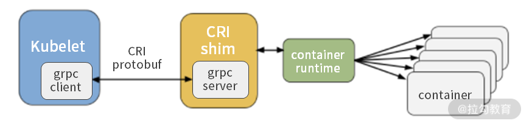

# 容器运行时接口CRI

https://www.toutiao.com/i6921731739765277197/

在K8s启动Pod时，Kubelet需要调用所在节点的容器运行时（Container Runtime）。Container Runtime是非常重要的组件，它负责真正管理镜像和容器的生命周期。

​                                                                                                       Kubelet架构

## 容器运行时接口CRI

CRI（Container Runtime Interface）是K8s定义的一组与Container Runtime进行交互的接口，用于将K8s平台与特定的容器实现解耦，而不是完全依赖于Docker的容器实现。

在K8s早起的版本中，对于容器环境的支持是通过hard code方式直接调用Docker API的，后来为了支持更多的容器运行时，比如CoreOS的rkt容器（rkt项目现已归档和终止），K8s提出了CRI。有了CRI，在K8s扩展容器运行时，用户可以选择自己喜欢的容器引擎。

​                                                       CRI是K8s不仅可以控制Docker容器运行时，也可以控制rkt容器运行时

每个Container Runtime都需要自己完成一个CRI接口的具体实现，通常称为CRI shim。这样Container Runtime就可以接收来自Kubelet的请求。

​                                                                                   Kubelet通过CRI shim来控制容器运行时

Kubelet、CRI shim以及容器运行时都部署在**同一个节点上**。CRI shim是一个gRPC Server，监听本地端口；Kubelet作为gPRC的客户端来调用CRI接口。

Kubelet调用CRI shim的接口，CRI shim响应请求后会调用底层的Container Runtime，完成对容器的相关操作。

​                                                                                  CRI-Containerd架构：基于Containerd的CRI接口实现

CRI定义了Runtime Service接口和ImageService接口：Runtime Service负责管理Pod和容器的生命周期，而Image Service负责镜像的生命周期管理。

## CRI发展历程

CRI 的推出为容器社区带来了新的繁荣，针对不同应用场合，出现了CRI-O、Frakti、CRI-Containerd 等一系列的容器运行时。这些新的容器运行时都可以独立于Docker运行，Docker在容器领域也不再一家独大。

CRI 最早从v1.4 就开始设计讨论和开发，在 v1.5 中发布了第一个测试版。在 v1.6 时已经有了很多外部容器运行时，如 Frakti、CRI-O 的 alpha 支持。v1.7 版本新增了 CRI-Containerd 的 alpha 支持，Frakti 和 CRI-O 则升级到 beta 支持。

> Frakti、CRI-O和CRI-Containerd都是CRI容器运行时，都是不需要Docker的独立存在。
>
> alpha支持相当于内测版本，beta支持相当于公测版本。

gVisor配合 CRI-O 或 CRI-Containerd 可以轻易接入 Kubernetes，将 K8s 扩展到了需要强隔离的多租户场景。