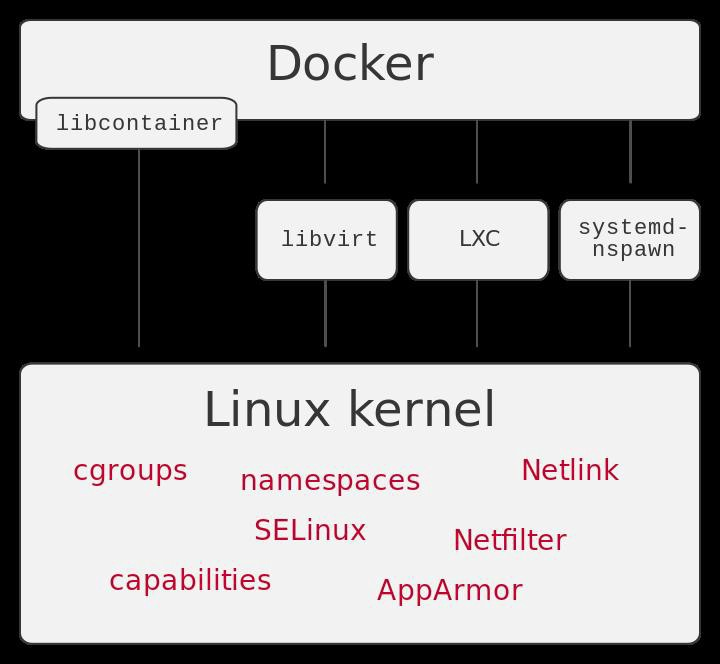
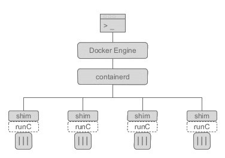
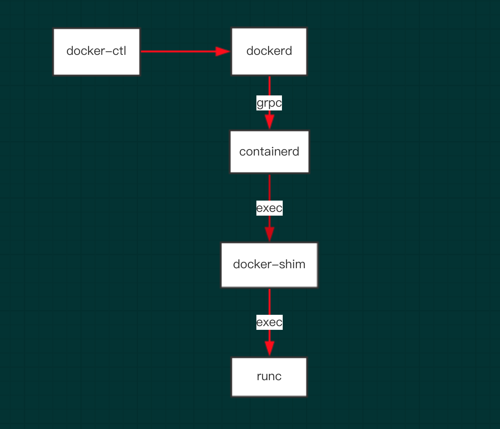
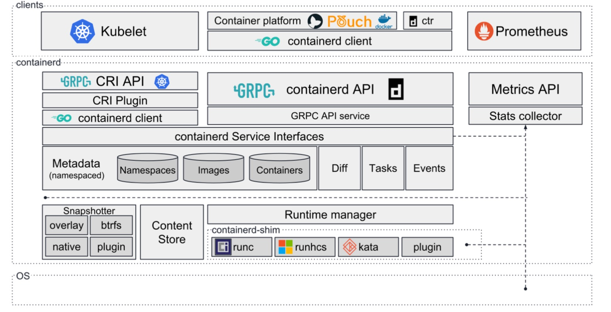
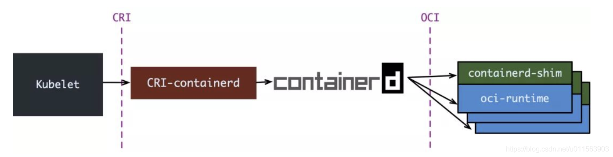
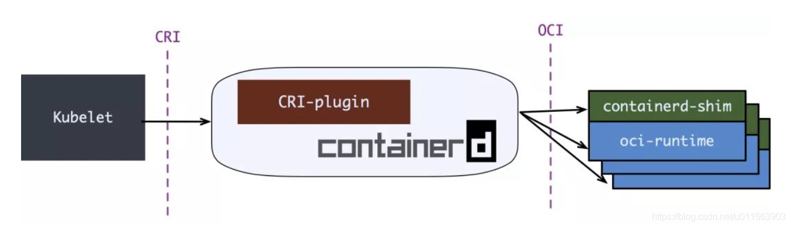
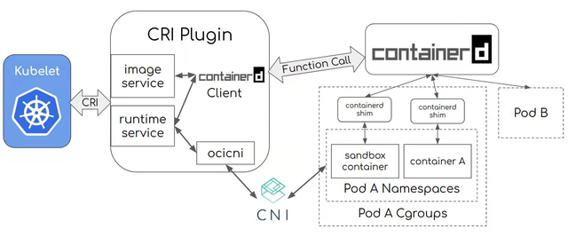

# 从Docker到Containerd

出处：https://www.toutiao.com/i6921731777153679879/?tt_from=weixin&utm_campaign=client_share&wxshare_count=1&timestamp=1611970010&app=news_article&utm_source=weixin&utm_medium=toutiao_ios&use_new_style=1&req_id=202101300926500101351491453230E184&share_token=23C74AF7-DF7B-4D07-ADF5-09071FF18AF6&group_id=6921731777153679879

虽然Docker不是最新的容器技术，但却把容器技术推向了应用的高峰。从Docker中拆分而来的Containerd容器运行时，成为了CNCF毕业的第5个项目（前4个分别是K8s、Prometheus、Envoy和CoreDNS）。

## Docker的拆分

Docker诞生于2013年，Docker最开始的执行环境是LXC（Linux Container），但从版本0.9开始，LXC被libcontainer取代。

> Linux Container容器是一种内核虚拟化技术，可以提供轻量级的虚拟化，以便隔离进程和资源。Libcontainer为Docker封装了Linux提供了基础功能，如cgroups、namespaces、netlink和netfilter等。

​                                                                                     Libcontainer示意图

2016年，Docker拆分了Containerd，并将其捐献给了社区。将这个组件分解为一个单独的项目，使得Docker将容器的管理功能移出Docker引擎，并移入**一个单独的守护进程中，即Containerd**。

Docker拆分后，对于整个容器技术的发展是非常有利的。容器标准成为一个开发标准，给了其他企业或者组织参与的机会。拆分后的Docker，各个组件关系如下图所示：

​                                                      Docker与Containerd的关系

Docker启动容器的过程如下：

1. Docker引擎创建容器映像

2. 将容器映像传递给Containerd

3. Containerd调用containerd-shim

4. containerd-shim使用runC来运行容器

> runC是一个轻量级的跨平台的容器运行时，就是在前面提到的Libcontainer的基础上进化而来的。

​                                                                                     Docker-Containerd-runC的调用链

**实际上，Containerd是Docker管理后台进程dockerd和runC之间的一个中间交流组件。**

> 那么Containerd为什么不直接调用runC，还要通过这个containerd-shim的进程呢？
>
> Containerd之所以通过containerd-shim去操作容器，是因为容器进程需要一个父进程来做诸如收集状态等事情。假如这个父进程是Containerd，每次Containerd挂掉或者升级，整个宿主机上所有的容器都要退出。引入了containerd-shim就规避了这个问题。
>
> **Containerd和Containerd-shim并不是父子进程关系。**

## Containerd的发展

从Docker中独立以后，Containerd走上了独立发展的道路，对K8s的容器运行时接口CRI进行了一系列兼容性改造，使其可以独立与Docker，在K8s体系下工作，与K8s生态紧密结合在一起。

​                                                                                     Containerd架构图

Containerd 1.0版本，通过一个单独的进程CRI-containerd来完成对CRI的适配。

​                                                                                     Containerd 1.0

Containerd 1.1 砍掉了CRI-containerd这个进程，直接把适配逻辑作为插件（CRI-plugin）放进了Containerd主进程中：

​                                                                                     Containerd 1.1

通过CRI plugin，Containerd可以由Kubelet来控制，Containerd创建的容器由K8s以Pod方式来组织和管理：

​                                                                                     K8s与Containerd的对接方式

与Containerd类似，Red Hat也推出了另外一个兼容CRI接口的容器运行时CRI-O。 CRI-O的目标非常纯粹，就是做一个只服务于K8s的容器运行时，兼容CRI和OCI标准。CRI-O可以说是最小的CRI接口实现，遵从Unix只做一件事并把它做好的设计哲学。

CRI-O示意图：

​                                                                                     CRI-O

从上面的几幅图中，可以注意到，Containerd与底层的容器运行时之间还有一个标准接口，这个标准也非常重要，就是OCI（开放容器计划）标准。