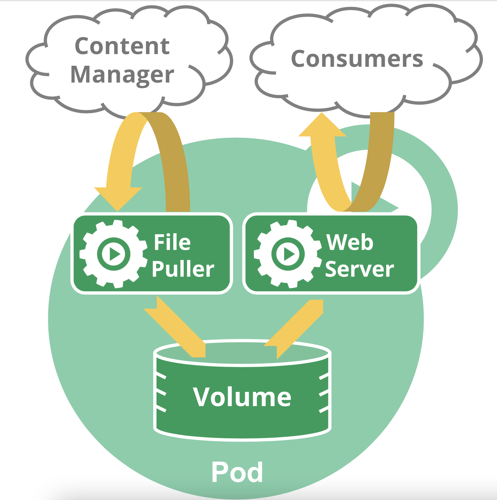

# Pod概述

Pod是Kubernetes创建或部署的最小/最简单的基本单位，一个Pod代表集群上正在运行的一个进程。

一个Pod封装一个应用容器（也可以有多个容器），资源存储、一个独立的网络IP以及管理控制容器运行方式的策略选项。Pod代表部署的一个单位：Kubernetes中单个应用的实例，它可能由单个容器或多个容器共享组成的资源。

> Docker是Kubernetes Pod中最常见的runting， Pods也支持其他容器runtimes。

## K8s使用Pod的方式

K8s使用Pod可分成两种主要方式：

* Pod中运行**一个**容器。 “One-container-per-Pod”模式是Kubernetes最常见的用法。在这种情况下，你可以将Pod视为单个封装的容器，但是Kubernetes是直接管理Pod而不是容器
* Pod中运行**多个需要一起工作的**容器。Pod可以封装紧密耦合的应用，它们需要由多个容器组成，它们之间能够共享之源，这些容器可以形成一个单一的内部service单位 - 一个容器共享文件，另一个“sidecar”容器来更新这些文件。Pod将这些容器的存储资源作为一个实体来管理

每个Pod都是运行应用的单个实例，如果需要水平扩展应用（例如，运行多个实例），则应使用多个Pods，每个实例一个Pod。在Kubernetes中，这样通常称为Replication。Replication的Pod通常由Controller创建和管理。

## Pods如何管理多个容器

Pods的设计可用于支持多进程的协同工作（作为容器），形成一个cohesive的service单位。Pod中的容器在集群中Node上被自动分配，容器之间可以共享资源、网络和相互依赖关系，并同时被调度使用。

请注意，在单个Pod中共同管理多个容器是一个相对高级的用法，应该只有在容器紧密耦合的特殊实例中使用此模式。例如，有一个容器被用作Web服务器，用于共享volume，以及一个单独“sidecar”容器需要从远程获取资源来更新这些文件，如下图所示：

Pod提供两种共享资源：**网络** 和 **存储**

### 网络

每个Pod被分配一个独立的IP地址，Pod中每个容器共享网络命名空间，包括IP地址和网络端口。Pod内的容器可以使用localhost相互通信。当Pod中的容器与Pod外部通信时，它们必须协调如何使用共享网络资源（如端口）。

### 存储

Pod可以指定一组共享存储volumes。Pod中的所有容器都可以访问共享volumes，允许这些容器共享数据。Volumes还用于Pod中的数据持久化，以防其中一个容器需要重新启动而丢失数据。有关Kubernetes如何在Pod中实现共享存储的更多信息，请参考**Volumes**。

## 使用Pod

一般的，很少会直接在Kubernetes中创建单个Pod。因为Pod的生命周期是短暂的，用后即焚的实体。当Pod被创建后（不论是由你直接创建还是被其他Controller），都会被Kubernetes调度到集群的Node上。直到Pod的进程终止、被删掉、因为缺少资源而被驱逐，或者Node故障之前这个Pod都会一直保持在那个Node上。

> 注意：重启Pod中的容器跟重启Pod不是一回事。Pod只提供容器的运行环境并保持容器的运行状态，重启容器不会造成Pod重启。

Pod不会自愈。如果Pod运行的Node故障，或者是调度器本身故障，这个Pod就会被删除。同样的，如果Pod所在Node缺少资源或者Pod处于维护状态，Pod也会被驱逐。

Kubernetes使用更高级的称为Controller的抽象层来管理Pod实例。虽然可以直接使用Pod，但是在Kubernetes中通常使用Controller来管理Pod的。

## Pod和Controller

Controller可以创建和管理多个Pod，提供副本管理、滚动升级和集群级别的自愈能力。例如，如果一个Node故障，Controller就能自动将该节点上的Pod调度到其他健康的Node上。

通常，Controller会提供Pod Template来创建相应的Pod。

## Pod模版

Pod模版是包含了其他对象（如Replication Controller，Jobs和DaemonSets）中的Pod定义。Controller控制器使用Pod模版来创建实际需要的Pod。

Pod模版类似“cookie cutters”，“一旦饼干被切掉，饼干和刀匠没有关系”。随后对模版的后续更改甚至切换到新模版对已创建的Pod没有任何影响。