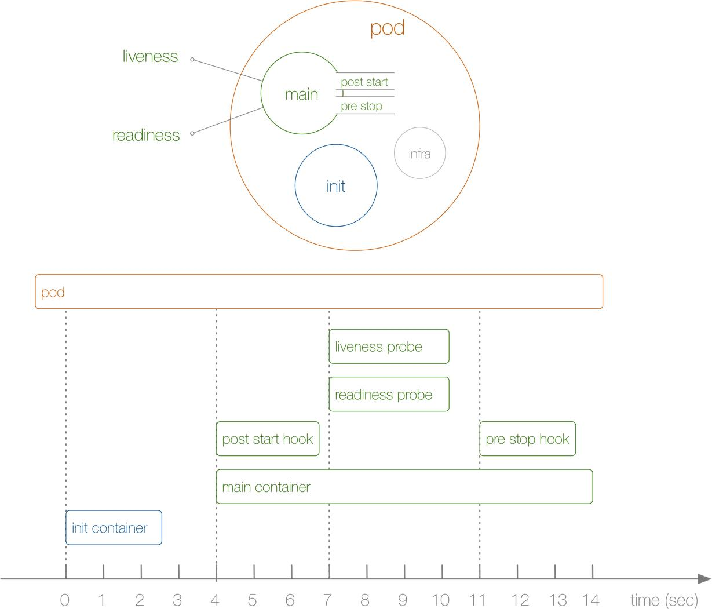

## K8S 深入理解Pod对象 ##

原文：https://www.toutiao.com/article/7181313548780732968/?log_from=4abf87efb8ae5_1674097742857


### Pod资源配置 ###




实际上上面几个步骤就是影响一个Pod生命周期的大部分，但是还有一些细节也会在Pod的启动过程进行设置，比如在容器启动之前还会为当前的容器设置分配的CPU、内存等资源，我们知道可以通过 CGroup 来对容器的资源进行限制，同样的，在 Pod 中也可以直接配置某个容器使用的 CPU 或者内存的上限。那么 Pod 是如何来使用和控制这些资源分配的呢？

首先对于 CPU，计算机里的CPU的资源是按“时间片”的方式来进行分配的，系统里的每一个操作都需要 CPU 的处理，所以，哪个任务要是申请的 CPU 时间片越多，那么它得到的 CPU 资源就越多。这个很容易理解。

然后还需要了解下 CGroup 里对于 CPU 资源的单位换算：

```properties
1 CPU   = 1000 millicpu (1 Core   = 1000m)
0.5 CPU = 500  millicpu (0.5 Core = 500m) 
```

这里的 m 就是毫、毫核的意思，K8s集群中的每一个节点可以通过操作系统的命令来确认本节点的 CPU 内核数量，然后将这个数量乘以1000，得到的就是节点总 CPU 总毫数。比如一个节点有四核，那么该节点的CPU总毫数量为 4000 m，如果要使用 0.5 core，则要求的是 4000 * 0.5 = 2000m。在 Pod 里面可以通过下面的两个参数来限制和请求CPU资源：

* spec.containers[].resources.limits.cpu: CPU上限值，可以短暂超过，容器也不会被停止
* spec.containers[].resources.requests.cpu: CPU请求值，K8s调度算法里的依据值，可以超过

这里需要明白的是，如果 resources.requests.cpu 设置的值大于集群里每个节点的最大 CPU 核心数，那么这个Pod将无法调度，因为没有节点能够满足它。

到这里应该明白了，requests 是用于集群调度使用的资源，而 limits 才是真正的用于资源限制的配置。如果需要保证应用优先级很高，也就是资源吃紧的情况下最后再被杀掉Pod，那么就把requests和limits的值设置成一致，在后面应用的QoS中会有具体讲解。

比如，现在定义一个Pod，给容器的配置如下的资源：

```yaml
# pod-resource-demo1.yaml
apiVersion: v1
kind: Pod
metadata:
  name: resource-demo1
spec:
  containers:
  - name: resource-demo1
    image: nginx
    ports:
    - containerPort: 80
    resources:
      requests:
        memory: 50Mi
        cpu: 50m
      limits:
        memory: 100Mi
        cpu: 100m
```

这里， CPU给的是50m，也就是0.05 core，这0.05core也就是占了 1 CPU 里的 5% 的资源时间。而限制资源设置的是100m，但是需要注意的是 CPU 资源是可压缩资源，也就是容器达到了这个设定上限后，容器性能会下降，但不会终止或者退出。比如直接创建上面这个Pod：

```shell
~ kubectl apply -f pod-resource-demo1.yaml
```

创建完成后，可以看到 Pod 被调度到 node1 这个节点上：

```shell
~ kubectl get pods -o wide
NAME             READY   STATUS    RESTARTS   AGE   IP            NODE    NOMINATED NODE   READINESS GATES
resource-demo1   1/1     Running   0          24s   10.244.1.27   node1   <none>           <none>
```

然后到 node1 节点上去查看 Pod 里面启动的 resource-demo1 这个容器：

```shell
~ crictl ps
CONTAINER           IMAGE               CREATED             STATE               NAME                ATTEMPT             POD ID
1e4ef680a5a88       87a94228f133e       41 seconds ago      Running             resource-demo1      0                   a00af47f2a12e
......
```

然后可以去查看下主容器的信息：

```json
~ crictl inspect 1e4ef680a5a88
{
  "status": {
    "id": "1e4ef680a5a88af7eae88a6901f12eb103dc3f8e1807f26337cd9bfb3704ca05",
    "metadata": {
      "attempt": 0,
      "name": "resource-demo1"
    },
......
      "linux": {
        "resources": {
          "devices": [
            {
              "allow": false,
              "access": "rwm"
            }
          ],
          "memory": {
            "limit": 104857600
          },
          "cpu": {
            "shares": 51,
            "quota": 10000,
            "period": 100000
          }
        },
        "cgroupsPath": "kubepods-burstable-poda194c43a_9551_494b_bd72_ab898afdcc0c.slice:cri-containerd:1e4ef680a5a88af7eae88a6901f12eb103dc3f8e1807f26337cd9bfb3704ca05",
     ......
```

可以看到这个容器的一些资源情况，Pod伤的资源配置最终也还是通过底层的容器运行时去控制CGroup来实现的。进入如下目录查看CGroup的配置，该目录就是CGroup父级目录，而CGroup是通过文件系统来进行资源限制的，所有上面限制容器的资源就可以在该目录下反映出来：

```shell
➜  ~ cd /sys/fs/cgroup/cpu/kubepods.slice/kubepods-burstable.slice/kubepods-burstable-poda194c43a_9551_494b_bd72_ab898afdcc0c.slice
➜  ~ ls
cgroup.clone_children  cpuacct.stat          cpu.cfs_period_us  cpu.rt_runtime_us  notify_on_release
cgroup.event_control   cpuacct.usage         cpu.cfs_quota_us   cpu.shares         tasks
cgroup.procs           cpuacct.usage_percpu  cpu.rt_period_us   cpu.stat
➜  ~ cat cpu.cfs_quota_us
10000
```

其中 cpu.cfs_quota_us就是CPu的限制值，如果要查看具体的容器的资源，也可以进入到容器目录下面去查看即可。

最后了解一下内存资源的控制。

内存的单位换算毕竟简单：

1MB = 1024 KiB，内存这块在K8s里一般用的是Mi单位，也可以使用Ki、Gi甚至是 Pi，看具体的业务需求和资源容量。

#### 单位换算 ####

这里注意的是MiB != MB，MB是十进制单位，MiB是二进制，平时以为MB等于1024KB，其实1MB = 1000KB，1Mi B才等于1024KiB。中间带字母 i 的是国际电工协会（IEC）定的，走1024乘积；KB、MB和GB等是国际单位制，走1000乘积。

这里要注意的是，内存是不可压缩性资源，如果容器泗洪内存资源达到了上限，那么会OOM，造成内存溢出，容器就会终止和退出。这些也可以通过上面的方式去通过查看 CGroup 文件的值来验证资源限制。


#### 静态 Pod ####

在K8s集群中除了经常使用到的普通的Pod外，还有一种特殊的Pod，叫做Static Pod，也就是常说的静态Pod。静态Pod有什么特殊的地方呢？

静态Pod直接由节点上的Kubelet进程管理，不通过master节点上的api server，无法与常用的控制器 Deployment 或者 DaemonSet 进行关联，它由Kubelet进程自己来监控，当Pod崩溃时会重启该Pod，kubelet也无法对他们进行健康检查。静态Pod始终绑定在某一个 kubelet 上，并且始终运行在同一个节点上。Kubelet会自动为每一个静态 pod 在 k8s 的 api server 上创建一个镜像 Pod，因此可以在 api server 中查询到该 Pod，但是不能通过 api server 进行控制（例如不能删除等）。

创建静态 Pod 有两种方式：配置文件和 HTTP API。

##### 配置文件 #####

配置文件就是放在特定目录下的标准的JSON或者YAML格式的 pod 定义文件。用kubelet --pod-manifet-path=<the directory>来启动kubelet进程，kubelet定期去扫描这个目录，根据这个目录下出现或者消失的YAML/JSON文件来创建或者删除静态pod。

比如在 node1这个节点上用静态pod的方式来启动一个nginx服务，配置文件路径为：

```yaml
➜  ~ cat /var/lib/kubelet/config.yaml
......
staticPodPath: /etc/kubernetes/manifests  # 和命令行的 pod-manifest-path 参数一致
......
```

打开这个文件可以看到其中有一个属性为 staticPodPath 的配置，其实和命令行的 --pod-manifest-path 配置是一致的，所以如果通过 kubeadm 的方式来安装的集群环境，对应的 kubelet 已经配置了静态的 Pod 文件的路径，默认地址为 /etc/kubenetes/manifests，所以只需要在该目录下创建一个标准的 Pod 的JSON或者YAML 文件即可，如果 kubelet 启动参数中没有配置上面的 --pod-mainifest-path 参数的话，那么添加这个参数然后重启 kubelet 即可：

```yaml
➜  ~ cat <<EOF >/etc/kubernetes/manifests/static-web.yaml
apiVersion: v1
kind: Pod
metadata:
  name: static-web
  labels:
    app: static
spec:
  containers:
    - name: web
      image: nginx
      ports:
        - name: web
          containerPort: 80
EOF
```


##### 通过HTTP API 创建静态 Pod #####

