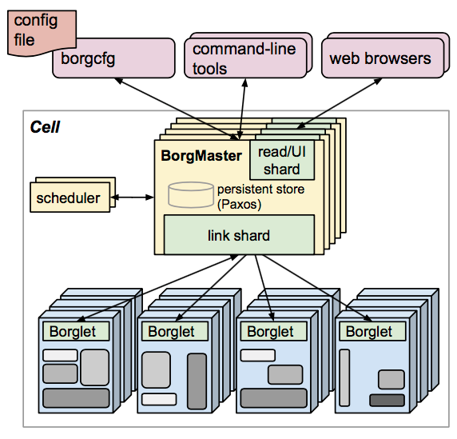
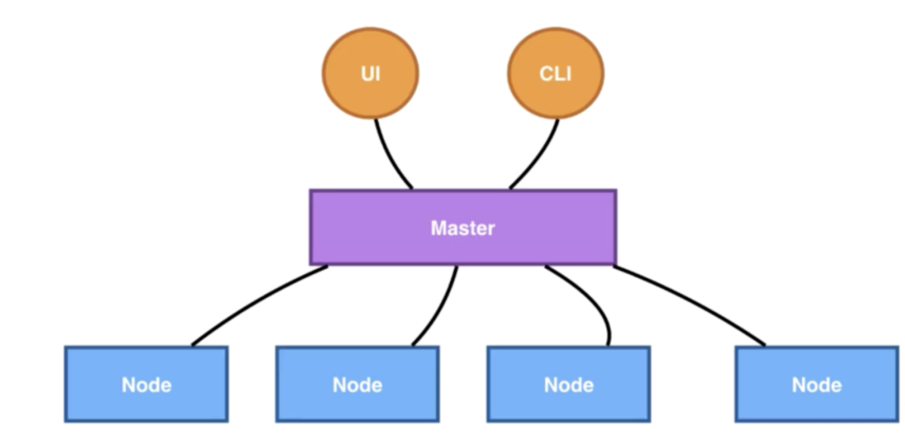
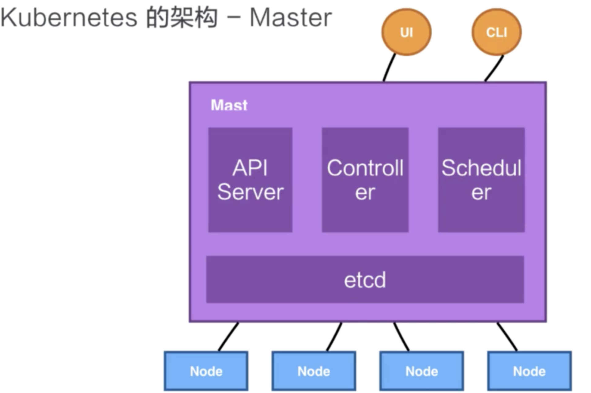
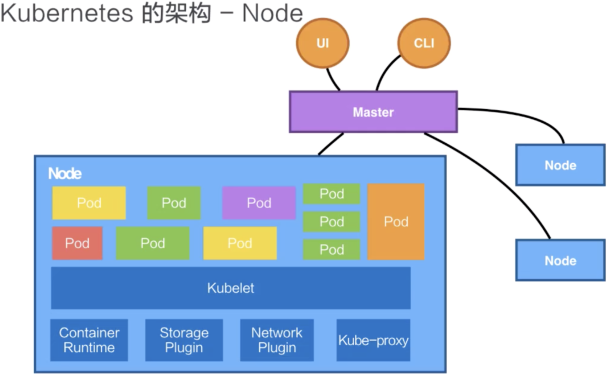
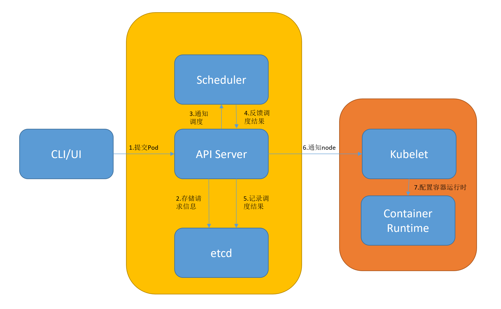

# Kubernetes概述

https://www.toutiao.com/i6921363480624824843/?group_id=6921363480624824843

Kubernetes是CNCF的重要项目，同时也是目前三大主流容器平台之一，另外两个是Docker和Mesos。

## K8s概述

Kubernetes，简称K8s，是一个云平台容器管理的开源应用。谈到Kubernetes，就不能不提到Google的Borg洗头膏。Google的Borg系统负责管理几十万个Jobs，跨多个集群，每个集群有上万个机器。Kubernetes的架构设计基本上是参照Google Borg。

下图是Google Borg的示意图：

​                                                                               Google Borg系统采用的主从架构

K8s是一个比较典型的Server-Client架构，也可以说是主-从架构。Master节点作为中央的管控节点，负责管理各个运行任务负载的Node节点：

​                                               用户侧程序（UI或者命令行）都通过Master下发指令

## K8s Master

Master主要由四部分组成： API Server、Controller、Scheduler以及etcd。

​                                                                                              K8s Master 架构

* **API Server：**K8s所有组件都依赖于API Server进行消息的传递，组件与组件之间一般不进行独立的连接

* **Controller：**控制器负责集群状态的管理，比如自动对容器修复、自动水平扩张，都是由控制器来完成

* **Scheduler：**调度器负责调度操作，比如把一个用户提交的COntainer，依据它的资源需求，选择合适的节点进行放置

* **etcd：**分布式存储系统，API Server中所需要的信息都存在etcd中。K8s通过etcd来保证Master所有组件的高可用

## K8s Node

Kubernetes的Node是真正运行业务负载的节点，业务负载会以Pod的形式运行。Pod相当于一个容器组，一个Pod包含一个或多个容器。

**运行这些Pod的组件叫做Kubelet**，是Node上**最为关键**的组件。Kubelet接受到API Server的指令，需要Pod运行的状态，然后提交到容器运行时（Container Runtime）组件中。

​                                                                                              K8s Node 架构

创建容器所需要运行的环境，需要对存储和网络进行管理。K8s依靠Storage Plugin或者是Network Plugin来配置存储和网络。

**Kube-Proxy**负责为Pod创建代理服务，从API Server获取所有Server信息，并根据Server信息创建代理服务，实现Server到Pod的请求路由和转发，从而实现K8s集群的负载均衡和服务间通讯。

## K8s启动容器的过程

​                                                                                             K8s启动容器的过程

上图展示了K8s启动容器（Pod）的过程：

* **提交Pod：**用户可以通过UI或者CLI提交一个Pod给K8s进行部署，这个请求首先会提交给API Server，下一步API Server会把这个提交信息写入到etcd，之后调度器会通过API Server的watch接口监听到这个信息：有一个Pod需要被调度。

* **调度Pod：**然后调度器会检查所有符合该Pod要求的Node列表，开始执行Pod调度逻辑。在完成这次调度之后，调度器会向API Server同步结果

* **通知Node：**此时API Server接收到这次调度操作之后，会把这次结果再次写到etcd中，然后API Server会通知相应的Node节点，去完成Pod的启动

* **启动运行时：**相应节点的Kubelet会得到这个通知，Kubelet就会调用Container runtime来启动配置这个容器的运行环境，去调度Storage Plugin来去配置存储，Network Plugin去配置网络

这样容器运行起来了。关于容器运行时有不同的类型，如Docker等。