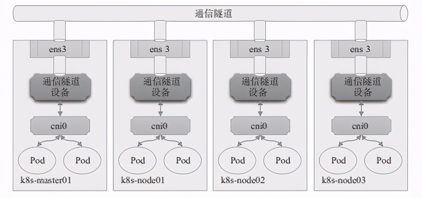
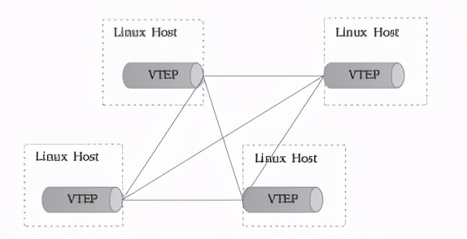
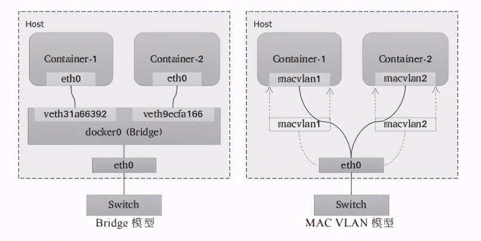
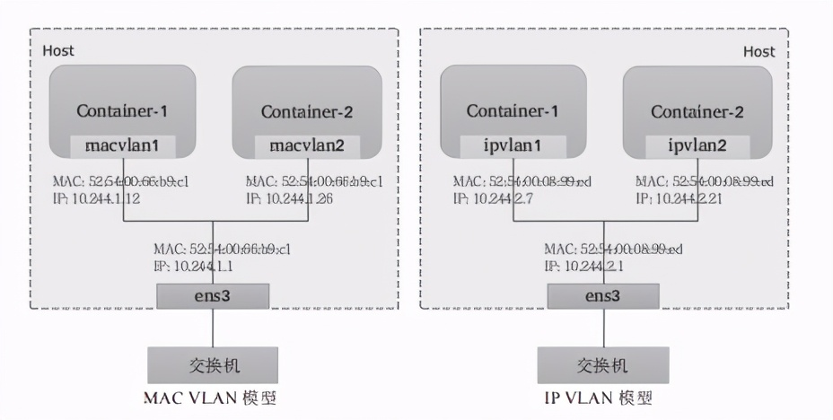
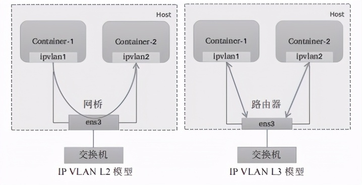
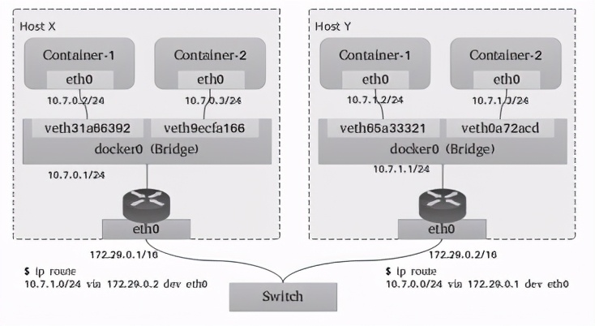

# Kubernetes网络模型：Overlay和Underlay

原文：https://www.toutiao.com/i6969436194325398047/

### 目录

1. Overlay网络模型
2. Underlay网络模型

## 一. Overlay网络模型

物理网络模型中，连通多个物理网桥上的主机的一个简单办法，就是通过媒介直接连接这些网桥设备，各个主机处于同一个局域网（LAN）中，管理员只需要确保各个网桥上每个主机IP的地址不相冲突即可。

类似的，若能够直接连接宿主主机上的虚拟网桥形成一个大的局域网，就能在数据链路层打通各宿主机上的内部网络，让容器可通过自由IP地址直接通信。为避免各容器间IP的地址冲突，一个常见的解决方案就是将各个宿主机分配到同一个网络中的不同子网，各主机基于自有子网向其容器分配IP地址。

显然，主机间的网络通信只能经由主机上可对外通信的网络接口进行，跨主机在数据链路层直接连接虚拟网桥的需求必然难以实现，除非借助宿主机间的通信网络构建的通信“隧道”进行数据帧的转发。这种于某个通信网络之上构建出的另一个逻辑通信网络，就是Overlay网络或者Underlay网络。

下图就是Overlay网络功能示意图：

​        隧道转发的本质，就是将容器双方的通信报文分别封装成各自宿主机之间的报文，借助宿主机的网络“隧道”完成数据交换。这种虚拟网络的基本要求是：各宿主机只需支持隧道协议即可，对于底层网络没有特殊要求。

​        VXLAN协议是目前最流行的Overlay网络隧道协议之一，它也是由IETF定义的NVO3（Network Virtualization over Layer 3）标准技术之一，采用L2 over L4（MAC-in-UDP）的报文封装模式，将二层报文勇三层协议进行封装，可实现二层网络在三层范围内进行扩展，将“二层域”突破规模限制形成“大二层域”。那么，同一“大二层域”就类似于传统网络中VLAN（虚拟局域网）的概念，只不过在VXLAN网络中，它被称作Bridge-Domain，以下简称为BD。类似于不同的VLAN需要通过VLAN ID进行区分，各BD要通过VNI加以标识。但是，为了确保VXLAN机制通信过程的正确性，涉及VXLAN通信的IP报文一律不能分片，这就要求物理网络的链路层实现中必须提供足够大的MTU值，或修改其MTU值以保证VXLAN报文的顺利传输。不过，降低默认MTU值，以及额外的头部开销，必然会影响到报文传输性能。

​        VXLAN的显著的优势之一是对底层网络没有侵入性，管理员只需要在原有网络之上添加一些额外设备即可构建出虚拟的逻辑网络来。这个额外添加的设备称为VTEP（VXLAN Tunnel Endpoints），它工作于VXLAN网络的边缘，负责相关协议报文的封包和解包等操作，从作用来说相当于VXLAN隧道的出入口设备。

VTEP代表着一类支持VXLAN协议的交换机，而**支持VXLAN协议的操作系统也可将一台主机模拟为VTEP**，Linux内核自3.7版本开始通过vxlan内核模块原生支持此协议。于是，各主机上由虚拟网桥构建的LAN便可借助vxlan内核模块模拟的VTEP设备与其他主机上的VTEP设备进行对接，形成隧道网络。同一个二层域内的各VTEP之间都需要建立VXLAN隧道，因此跨主机的容器间直接进行二层通信的VXLAN隧道是各VTEP之间的点对点隧道，如下图所示。对于Flannel来说，这个VTEP设备就是各节点上生成flannel.1网络接口，其中的“1”是VXLAN中的BD标识VNI，因而同一Kubernetes集群上所有节点的VTEP设备属于VNI为1的同一个BD。

类似VLAN的工作机制，相同VXLAN VNI在不同VTEP之间的通信要借助二层网关来完成，而不同VXLAN之间，或者VXLAN同非VXLAN之间的通信则需经由三层网关实现。VXLAN支持使用集中式和分布式两种形式的网关：前者支持流量的集中管理，配置和维护较为简单，但转发效率不高，且容易出现瓶颈和网关可用性问题；后者以各节点为二层或三层网关，消除了瓶颈。

然而，VXLAN网络中的容器在首次通信之前，源VTEP又如何得知目标服务器在哪一个VTEP，并选择正确的路径传输通信报文呢？常见的解决思路一般有两种：多播和控制中心。多播是指同一个BD内的各VTEP加入同一个多播域中，通过多播报文查询目标容器所在的目标VTEP。而控制中心则在某个共享的存储服务上保存所有容器子网及相关VTEP的映射信息，各主机上运行着相关的守护进程，并通过与控制中心的通信获取相关的映射信息。Flannel默认的VXLAN后端采用的是后一种方式，它把网络配置信息存储在etcd系统上。

Linux内核自3.7版本开始支持vxlan模块，此前的内核版本可以使用UDP、IPIP或GRE隧道技术。事实上，考虑到当今公有云底层网络的功能限制，Overlay网络反倒是一种最为可行的容器网络解决方案，仅那些更注重网络性能的场景才会选择Underlay网络。

## 二. Underlay网络模型

​        Underlay网络就是传统IT基础设施网络，由交换机和路由器等设备组成，借助以太网协议、路由协议和VLAN协议等驱动，它还是Overlay网络的底层网络，为Overlay网络提供数据通信服务。容器网络中的Underlay网络是指借助驱动程序将宿主机的底层网络接口直接暴露给容器使用的一种网络构建技术，较为常见的解决方案有MAC VLAN、IP VLAN和直接路由等。

### 2.1 MAC VLAN

​        MAC VLAN支持在同一个以太网接口上虚拟出多个网络接口，每个虚拟接口都拥有唯一的MAC地址，并可按需配置IP地址。通常这类虚拟接口被网络工程师称作子接口，但在MAC VLAN中更常用上层或下层接口来表述。与Bridge模式相比，MAC VLAN不再依赖虚拟网桥、NAT和端口映射，它允许容器以虚拟接口方式直接连接物理接口。下图给出了Bridge与MAC VLAN网络对比示意图。

* **Private**: 禁止构建在同一物理接口上的多个MAC VLAN实例（容器接口）彼此间的通信，即便外部的物理交换机支持“发夹模式”也不行。
* **VPEA**: 允许构建在同一物理接口上的多个MAC VLAN实例（容器接口）彼此间的通信，但需要外部交换机启用发夹模式，或者存在报文转发功能的路由器设备。
* **Bridge**: 将物理接口配置为网桥，从而允许同一物理接口上的多个MAC VLAN实例基于此网桥直接通信，而无须依赖外部的物理交换机来交换报文；此为最常用的模式，甚至还是Docker容器唯一支持的模式。
* **Passthru**: 允许其中一个MAC VLAN实例直接连接物理接口

​        由上述工作模式可知，除了Passthru模式外的容器流量将被MAC VLAN过滤而无法与底层主机通信，从而将主机与其运行的容器完全隔离，其隔离级别甚至高于网桥式网络模型，这对于有多租户需求的场景尤为有用。由于各实例都有专用的MAC地址，因此MAC VLAN允许传输广播和多播流量，但它要求物理接口工作于混杂模式，考虑到很多公有云环境中并不允许使用混杂模式，这意味着MAC VLAN更适用于本地网络环境。

​        需要注意的是，MAC VLAN为每个容器使用一个唯一的MAC地址，这可能会导致具有安全策略以防止MAC欺骗的交换机出现问题，因为这类交换机的每个接口只允许连接一个MAC地址。另外，有些物理网卡存在可支撑的MAC地址数量上限。

### 2.2 IP VLAN

​        IP VLAN类似于MAC VLAN，它同样创建新的虚拟网络接口并为每个接口分配唯一的IP地址，不同之处在于，每个虚拟接口将共享使用物理接口的MAC地址，从而不再违反防止MAC欺骗的交换机的安全策略，且不要求在物理接口上启用混杂模式，如下图所示。

​        IP VLAN有L2和L3两种模型，其中IP VLAN L2的工作模式类似于MAC VLAN Bridge模式，上层接口（物理接口）被用作网桥或交换机，负责为下层接口交换报文；而IP VLAN L3模式中，上层接口扮演路由器的角色，负责为各下层接口路由报文，如下图所示。

​        IP VLAN L2模型与MAC VLAN Bridge模型都支持ARP协议和广播流量，它们拥有直接接入网桥设备的网络接口，能够通过802.1d数据包进行泛洪和MAC地址学习。但IP VLAN L3模式下，网络栈在容器内处理，不支持多播或广播流量，从这个意义上讲，它的运行模式与路由器的报文处理机制相同。

​        虽然支持多种网络模型，但MAC VLAN和IP VLAN不能同时在同一物理接口上使用。Linux内核文档中强调，MAC VLAN和IP VLAN具有较高的相似度，因此，通常仅在必须使用IP VLAN的场景中才不使用MAC VLAN。一般说来，强依赖于IP VLAN的场景有如下几个：

- Linux主机连接到的外部交换机或路由器启用了防止MAC地址欺骗的安全策略；
- 虚拟接口的需求数量超出物理接口能够支撑的容量上限，并且将接口置于混杂模式会给性能带来较大的负面影响；
- 将虚拟接口放入不受信任的网络名称空间中可能会导致恶意的滥用。

​        需要注意的是，Linux内核自4.2版本后才支持IP VLAN网络驱动，且在Linux主机上使用ip link命令创建的802.1q配置接口不具有持久性，因此需依赖管理员通过网络启动脚本保持配置。

### 2.3 直接路由

​        “直接路由”模型放弃了跨主机容器在L2的连通性，而专注于通过路由协议提供容器在L3的通信方案。这种解决方案因为更易于集成到现在的数据中心的基础设施之上，便捷地连接容器和主机，并在报文过滤和隔离方面有着更好的扩展能力及更精细的控制模型，因而成为容器化网络较为流行的解决方案之一。

​        一个常用的直接路由解决方案如下图所示，每个主机上的各容器在二层通过网桥连通，网关指向当前主机上的网桥接口地址。跨主机的容器间通信，需要依据主机上的路由表指示完成报文路由，因此每个主机的物理接口地址都有可能成为另一个主机路由报文中的“下一跳”，这就要求各主机的物理接口必须位于同一个L2网络中。

​        于是，在较大规模的主机集群中，问题的关键便转向如何更好地为每个主机维护路由表信息。常见的解决方案有：

* ①Flannel host-gw使用存储总线etcd和工作在每个节点上的flanneld进程动态维护路由
* ②Calico使用BGP（Border Gateway Protocol）协议在主机集群中自动分发和学习路由信息。与Flannel不同的是，Calico并不会为容器在主机上使用网桥，而是仅为每个容器生成一对veth设备，留在主机上的那一端会在主机上生成目标地址，作为当前容器的路由条目。

​        显然，较Overlay来说，无论是MAC VLAN、IP VLAN还是直接路由机制的Underlay网络模型的实现，它们因无须额外的报文开销而通常有着更好的性能表现，但对底层网络有着更多的限制条件。