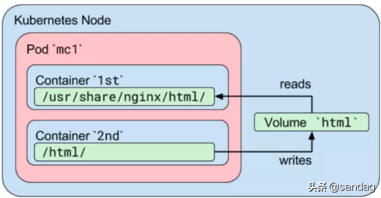
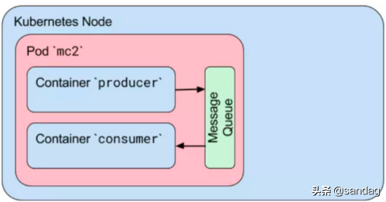
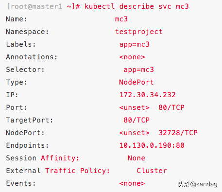
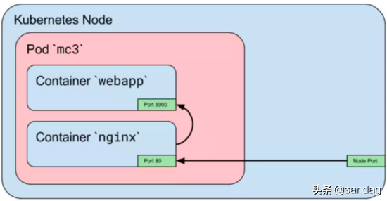

# Kubernetes 中的多容器 Pod 和 

# Pod 内容器间通信

原文：https://www.toutiao.com/a6761594732599575048/?log_from=6c85a1f58cdf7_1633242237445

​        容器（Container）常被用来解决比如微服务的单个问题，但在实际场景中，问题的解决往往需要多容器方案。这里讨论多个容器整合进单个 Kubernates Pod 中，以及 Pod 中的容器间是如何通信的。


## 一. 关于 Kubernates Pod

### 1.1 Kubernates Pod 是什么

​        首先来探讨一下什么是 Pod。 Pod 是 Kubernetes 中**最小的**<font color='red'>可部署和管理单元</font>。换句话讲，如果需要在 Kubernetes 中运行单个容器，那么就得为这个容器创建一个 Pod。同时，一个 Pod 可以包含多个容器，这些容器往往是紧耦合的。

​        怎么个紧耦合法呢？试着想象这样一个场景，一个 Pod 中的多个容器代表需要运行在同一个服务器上的多个进程。这种类比是合理的，**因为在许多方面，Pod 就类似于一台服务器**。比如，通过 ***localhost*** 每个容器可以访问它所在 Pod 中的其它容器。

### 1.2 为什么K8s将 Pod 而不是单个容器作为最小的部署单元呢？

​        尽管直接部署单个容器也许会更容易，但增加 Pod 这个新的抽象层会带来新的好处。容器是一个真实存在的实体，它代表一个具体的东西。这个“东西”可以是一个 Docker 容器，也可以是一个 rkt 容器。每种“东西”都有不同的用途。为了管理容器，K8s 需要更多的信息，比如：重启策略（Restart Policy），它定义了当容器终止时怎么样重启容器；还有活性检测（liveness probe），它定义了如何从应用视角去检测容器中的进程是否活着，比如 Web 服务器进程是否能够响应 HTTP 请求。

​        为了避免在容器这个已有的实体上增加这些新的属性，K8s 架构师们决定使用一个新的实体，那就是 Pod，**它逻辑地包含一个或多个容器**。

### 1.3 为什么K8s允许 Pod 中存在一个或多个容器？

​        Pod 中的容器们运行在一个“**逻辑主机**”上。它们使用同一个网络命名空间（Network namespace，换句话说，就是同样的 ***IP*** 和 ***Port***），以及同样的 IPC（inter-process communication，进程间通信）命名空间，它们还使用共享卷（shared volume）。这些特征使得 Pod 内的容器能互相高效地通信。同时，Pod 使得用户可以将多个紧耦合的应用容器当做一个实体来管理。

​        那么，如果一个应用需要在同一台服务器上运行多个容器，为什么不把所有东西放在一个容器里呢？**首先**，这会违反“***一个容器一个进程***”的规范。这个规范很重要，因为当一个容器中有多个进程时，调试会变得非常困难，因为不同进程的日志会混淆在一起，而且很难去管理这些进程的生命周期；**其次**，为一个应用使用多个容器会更简单、更直接、能解耦软件依赖；**最后**，更细粒度的容器可以在团队间服用。

### 1.4 多容器 Pod 的用例

​        多容器 Pod 的主要目的是为了支持**同时存在的**（co-located）及**同时被管理的**（co-managed）帮助进程（helper process）。帮助进程有以下通用场景：

* **边车容器（SideCar container）**：比如日志或数据变化监视器等。一个团队创建日志监视器（log watcher）后，它可以被各种应用使用。另一个边车容器的例子是，文件或者数据加载器，它负责为主容器产生数据
* **代理（Proxy）、桥（Bridge）和适配器（Adapter）**：它们将主容器连接到外部世界。比如：Apache Http 服务器或 Nginx 会读取静态文件。它们还能被用作主容器中的 web 应用的反向代理（reverse proxy）

​        当在 Pod 中运行**多层应用**（比如 WordPress）时，***推荐的方式是为每层使用单独的 Pod***。最简单的理由是：这样可以独立的扩展每层，并将它们分布在不同节点上。

## 2 Pod 中容器的通信

​        在 Pod 中运行多个容器，使得它们之间的通信非常直接。它们自己的通信有几种方式。

### 2.1 通过共享卷通信

​        在 K8s 中，Pod 中的容器可以将共享卷当作一种简单和高效的共享数据发方式。在大多数场景中，使用主机上的一个目录，并在多个容器间共享，是一种高效的方式。

​        K8s Volume 使得在容器重启后数据能被保存下来。卷具有和 Pod 一样的生命周期。这意味着，只要 Pod 存在，卷就存在。如果 Pod 被删除了，即使一摸一样的 Pod 被创建出来，原来 Pod 的共享卷也会被销毁，一个新的共享卷会被创建出来（数据丢失）。

​        Pod 中的多个容器使用共享卷的一个标准用例是：当一个容器向共享目录写入日志或其他文件时，其它容器从共享目录中读取数据。比如，创建一个下面的 Pod：

```yaml
apiVersion: v1
kind: Pod
metadata:
 name: mc1
spec:
 volumes:
 - name: html
 emptyDir: {}
 containers:
 - name: 1st
   image: nginx
   volumeMounts:
   - name: html
     mountPath: /usr/share/nginx/html
 - name: 2nd
   image: debian
   volumeMounts:
   - name: html
     mountPath: /html
command: ["/bin/sh", "-c"]
  args:
     - while true; do
         date >> /html/index.html;
         sleep 1;
done
```

​        本例中，定义了一个**名为 html 的卷**。它的类型是 ***emptyDir***，这意味着，当 Pod 被分配到一个节点上时，卷会被基于一个空目录创建出来，只要该 Pod 一直运行着，这个卷就会一直存在。 ***1st*** 容器运行 Nginx 服务，它将共享卷挂载到 */usr/share/nginx/html* 目录； ***2nd*** 容器使用 Debian 镜像，它将共享卷挂载到 */html* 目录。每秒钟，***2nd*** 容器会将当前日期和时间写入到共享卷之中的 index.html 文件中。当用户向 Pod 发送 HTTP 请求时，Nginx 读取这个文件的内容并返回给用户。



​        可以通过暴露 nginx 端口或者使用浏览器访问它来检查该 Pod，或者直接查看容器的共享目录：

```shell
$ kubectl exec mc1 -c 1st -- /bin/cat
/usr/share/nginx/html/index.html
...
Fir Aug 25 18:36:06 UTC 2017

$ kubectl exec mc1 -c 2nd -- /bin/cat /html/index.html
 ...
 Fri Aug 25 18:36:06 UTC 2017
 Fri Aug 25 18:36:07 UTC 2017
```

### 2.2 进程间通信( Inter-process Communication, IPC)

​        Pod 中的容器共享同一个 IPC 命名空间，这意味着它们可以使用标准的进程间通信方式来相互通信，比如 SystemV 信号量 和 POSIX 共享内存。

​        在下面的例子中，定义一个包含了两个容器的 Pod，它们使用同样的镜像。第一个容器时生产者（Producer），它会创建一个标准的 Linux 消息队列，并向该队列写入一些随机字符串，最后写入一个特定的推出字符；第二个容器是消费者（Consumer），它打开同一个队列，读取字符，直到读到特殊的推出字符为止。

​        将 Pod 的重启策略设置为“Never”，因此在两个容器都终止后 Pod 会停止。

```yaml
apiVersion: v1
kind: Pod
metadata:
 name: mc2
spec:
 containers:
 - name: producer
   image: allingeek/ch6_ipc
   command: ["./ipc", "-producer"]
 - name: consumer
   image: allingeek/ch6_ipc
   command: ["./ipc", "-consumer"]
 restartPolicy: Never
```

​        Pod 运行后，查看每个容器的日志，确认 consumer 容器收到了 producer 容器的全部消息，包括铁定的推出消息：

```shell
$ kubectl get pods --show-all -w
NAME READY STATUS RESTARTS AGE
mc2 0/2 Pending 0 0s
mc2 0/2 ContainerCreating 0 0s
mc2 0/2 Completed 0 29
```



​        默认情况下，Pod 中的所有容器都是并行启动的，因为没有办法指定一个容器在另一个容器启动后才启动。比如，在 IPC 例子中，有可能第二个容器在第一个容器启动完成并创建消息队列前就启动完毕了。此时，第二个容器会失败，因此它需要消息队列在其启动时就已经存在了。

​        有一些方法去控制容器的启动顺序，比如 Kubernetes Init Containers （初始化容器），初始化容器会被首先启动。但是在云原生环境中，最好能为所有不可控的失败都做好准备。比如，要修复上述问题，最好的办法是修改应用去等待，直到消息队列被创建出来为止。

### 2.3 容器间的网络通信

​        Pod 中的容器可以通过 “***localhost***” 来互相通信，因为它们使用同一个网络命名空间。而且，对容器来说，hostname 就是 Pod 的名称。因为 Pod 中的所有容器共享同一个 IP 地址和 Port 空间，需要为每个需要接收连接的容器分配不同的端口，也就是说，Pod 中的应用需要自己协调端口的使用。

​        下面的例子，会创建一个多容器 Pod，其中一个容器中运行 Nginx，它作为另一个容器中运行的 Web 应用的反向代理。

1. 步骤一，为 nginx 配置文件创建一个 ConfigMap，从 80 端口进来的 HTTP 请求都会被转发到 localhost 上的 5000 端口：

   ```yaml
   apiVersion: v1
   kind: ConfigMap
   metadata:
    name: mc3-nginx-conf
   data:
    nginx.conf: |-
    user nginx;
    worker_processes 1;
   
    error_log /var/log/nginx/error.log warn;
    pid /var/run/nginx.pid;
   
    events {
      worker_connections 1024;
    }
   
    http {
      include /etc/nginx/mime.types;
      default_type application/octet-stream;
   
      sendfile on;
      keepalive_timeout 65;
   
      upstream webapp {
         server 127.0.0.1:5000;
      }
   
      server {
         listen 80;
         
         location / {
            proxy_pass http://webapp;
            proxy_redirect off;
          }
       }
    }
   ```

   

2. 步骤二，创建一个两容器的 Pod，一个容器运行Nginx，一个运行简单的 web 应用。注意，只为 Pod 定义了 80 端口。端口 5000 不能被从 Pod 外部访问到：

   ```yaml
   apiVersion: v1
   kind: Pod
   metadata:
    name: mc3
    labels:
    app: mc3
   spec:
    containers:
    - name: webapp
      image: training/webapp
    - name: nginx
      image: nginx:alpine
    ports:
    - containerPort: 80
    volumeMounts:
    - name: nginx-proxy-config
    mountPath: /etc/nginx/nginx.conf
    subPath: nginx.conf
    volumes:
    - name: nginx-proxy-config
    configMap:
      name: mc3-nginx-conf
   ```

   查看 Pod 中的端口空间，能看到有 80 和 5000 端口。

3. 步骤三，将 Pod 暴露为一个 NodePort 服务

   ```shell
   $ kubectl expose pod mc3 --type=NodePort --port=80
   service "mc3" exposed
   ```

4. 步骤四，确认服务

   

   现在可以使用浏览器或者 curl 工具来访问这个 web 应用了。

   Nginx 容器的 80 端口上收到的 HTTP 请求会被转发到 Web 应用容器的 5000 端口。

   


​        上面的例子只展示了在 Pod 中一个容器去访问其他容器，实际上，更常见的是 Pod 中的多个容器会在不同的端口上监听，所有这些端口都会被暴露出去。要实现这种形式，要么创建一个暴露多个端口的服务，要么为每个要被暴露的端口创建一个服务。


## 三. 小结

​        通过创建Pod概念，Kubernetes为编排容器的行为以及容器间互相通信都提供了极大的便利。容器们可以共享存储卷，以及可以通过网络甚至IPC互相通信。