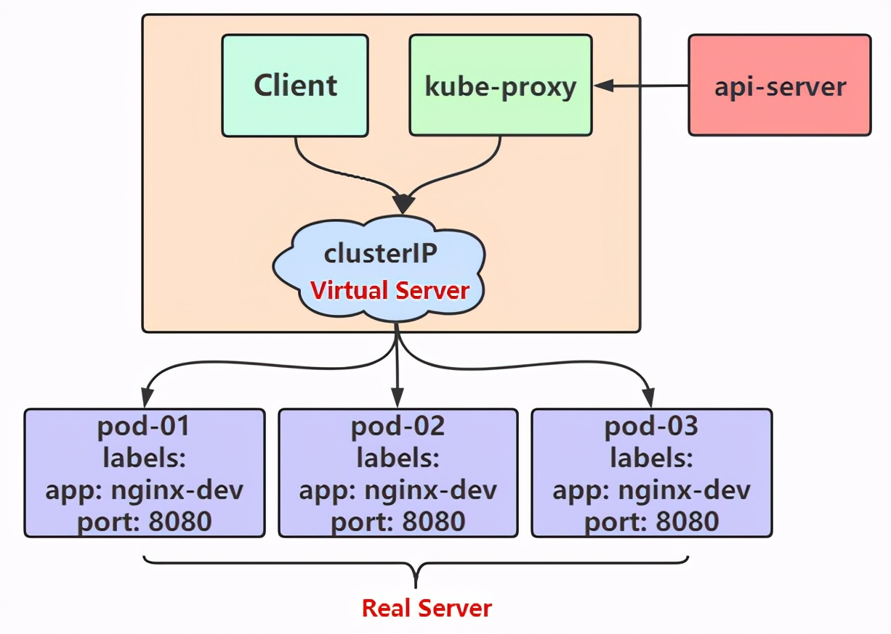
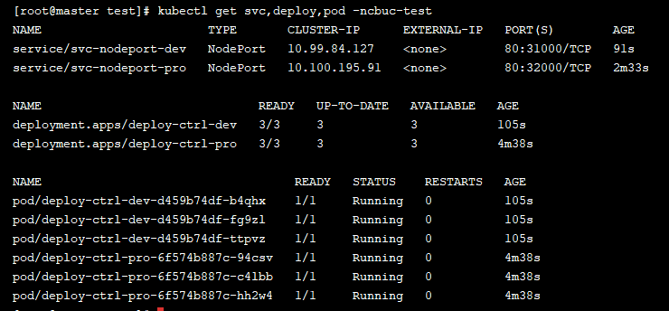

# Service和Ingress

原文：https://www.toutiao.com/a6970912799304335908/


​        K8s中的Service和Ingress，就是介绍搭建完成K8s后，如何进行访问。

​        首先，需要搞清楚什么是 **Service** 和 **Ingress**。简单而言，这两个组件都是用来做流量负载的。什么是“流量负载”呢？当在集群内部已经通过 pod 部署了应用服务，下一步干啥呢？就是让用户访问到这些应用服务。


## 1. Service

​        在 K8s中，pod 是应用程序的载体，可以通过 pod 的 IP 来访问应用程序，但是 pod 是有生命周期的，一旦 pod 出现问题，pod 控制器就会将 pod 销毁并进行重新创建。那么这个时候， pod 的 IP 就会发生变化，因此利用 pod IP 访问应用程序的方式是行不通的。要解决这个问题，K8s 引入了 service 的资源概念，通过这个资源，可以整合多个 pod，提供一个统一的入口地址，通过访问 servie 的入口地址就能访问到后面 pod 的服务。


​        Service 不是凭空出现的，来看看 **Node** 节点上的一个关键组件 **Kube-Proxy**：


这张图显示，Kube-Proxy 在这里启动了关键性的作用，每个 **Node** 节点上都运行着一个 **Kube-proxy** 服务进程，当创建 **Servcie** 的时候，会通过 api-server 向 etcd 写入创建的 service 的信息，而 kube-proxy 会基于监听的机制发现这种 Service 的变动，然后，**它会将最新的Service信息转换成对应的访问规则**。


​        到这里，应该对 Servcie 有了大概的了解，至少知道它是干啥的了。接下来再深入了解一下。

### 1.1 工作模式

​        **Kube-proxy** 支持3种工作模式，如下：

#### 1.1.1 userSpace

​        这个模式**比较稳定，但是效率比较低**。在 userSpace 模式下，kube-proxy 会为每一个 Service 创建一个监听端口，当有请求发往 cluster IP 的时候，会被 IPtables 规划重定向到 kube-proxy 监听的端口上，kube-proxy 会根据 **LB 算法** 选择一个 pod 提供服务并建立连接。

​        这个模式下，kube-proxy 充当的角色是一个“**四层负载均衡器**”，由于 kube-proxy 运行在 userSpace 模式下，在进行转发处理的时候，会增加内核和用户空间之间的数据拷贝，因此效率比较低。


#### 1.1.2 iptables

​        在这种模式下，kube-proxy 会为 Service 后端的每个 pod 都创建对应的 iptable 规则，直接将发往 Cluster IP 的请求重定向到一个 pod IP 上。该模式下 Kube-proxy **不承担**“四层负载均衡器”的角色，只负责创建 iptables 的规则。该模式的优点，就是相较于 userSpace 模式效率更高，但是**不能提供**灵活的 LB 策略。当后端 Pod 不可用的时候无法进行重试。


#### 1.1.3 ipvs

​        这种模式与 iptables 模式相似，kube-proxy 会监控 pod 的变化并创建相应的 ipvs 规则。但是 ipvs 规则相对于 iptables 来说转发效率更高，而且**支持更多的 LB算法**。



### 1.2 实践

​        了解了3种模式后，现在简单试一下 ipvs 模式。首先准备一份资源清单：


这份清单上半部分是创建一个 pod 控制器，下半部分是创建一个 service。

​        然后输入 ipvsadm -Ln 命令，即可以看到 ipvs 的规则策略：


​        其中，**10.108.230.12**，是 service 提供的访问入口，当访问这个入口时，可以发现后面三个 pod 的服务在等待调用， kube-proxy 会基于 rr （轮询）的策略，将请求分发到其中一个 pod 上去，这个规则会同时在集群的所有节点上都生成，所以在任何一个节点上访问都可以。

> 此模式必须安装 ipvs 内核模块，否则会降低为 iptables。
>
> 开启 ipvs：
>
> ​        kubectl edit cm kube-proxy -n kube-system
>
> 编辑后保存退出
>
> ​        kubectl delete pod -l k8s-app=kube-proxy -n kube-system
>
> ​        Ipvsadm -Ln

### 1.2 Service 使用

​        上面介绍完 Service 的几种工作模式，下面进入 Service 的使用阶段。上面也做了简单的实践，创建了一个 **Deploy**，一个 **Service**，然后可以通过 ***serviceIp + targetPort*** 或者 ***nodeIp + nodePort*** 访问资源。


Service又分为 5 种类型。下面分别介绍。

#### 1.2.1 ClusterIP

​        先看下 **ClusterIP** 类型的 Service 的资源清单：


​        通过创建后测试访问 **clusterIP + port**：


​        再查看下 ipvs 规则，可以看到该 Service 已经可以转发到对应的 3 个 pod 上：


​        接下来可以通过 describe 指令查看该 service 有哪些信息：


​        扫了一遍发现， Endpoints 和 Session Affinity 都是之前没有见过的，这两个又是什么呢？

##### Endpoint

​        Endpoint 是 k8s 中的一个资源对象，存储在 eted 中，用来记录一个 service 对应的所有 Pod 的访问地址，它是根据 Service 配置文件中 selector 描述产生的。一个 service 由一组 Pod 组成，这些 Pod 通过 Endpoint 暴露出来，可以说，**Endport** 是实际实现服务的端口的集合。通俗来说，Endpoint 是 service 和 pod 之间的桥梁：


​        既然是一个资源，就可以获取到。

##### 负载分发

​        上面已经成功的实现了通过 service 访问到 pod 资源，那么再做一些修改，分别进入3个pod，编辑文件 /usr/share/nginx/index.html：

```shell
#pod01
Pod01: ip - 10.244.1.73
#pod02
Pod02: ip - 10.244.1.73
#pod03
Pod03: ip - 10.244.1.73
```

然后再次尝试通过 *curl 10.96.10.10:80*  命令查看结果：


看，发现没，这种负载分发策略不就是轮询吗？！对于 Service 的访问，k8s 提供了两种负载分发策略：

* 如果未定义分发策略，默认使用 kube-proxy 的策略，比如随机、轮询
* 基于客户端地址的会话保持模式，即来自同一个客户端发起的所有请求都会转发到固定的一个pod上。这里就需要用到上面提到的 sessionAffinity

​        之前用 ***ipvsadm -Ln*** 命令查看分发策略的时候，里面有个 **rr** 字段，这个 **rr** 就是轮询：


##### Sesson Affinity

​        如果想开启会话保持的分发策略，那么只需要在 **spec** 中添加 **sessionAffinify:ClientIP**：


​       再次通过 ipvsadm -Ln 查看分发策略，就会发现已经变化了：


​       再简单测试一下：


这样就已经完成了会话保持的分发策略。

> 注意：ClusterIP 的 Service，不支持外部访问。也就是说，通过浏览器访问是不生效的，只能在集群内部访问

### 1.2.2 HeadLiness

很多服务都需要支持定制化，如果将产品定位为服务，那么这个产品毋庸置疑是成功的。在某些场合中，开发人员不想要使用 service 提供的负载均衡功能，而是希望自己来控制负载均衡策略。针对这种情况，k8s 也是很好的支持了，引入了 ***HeadLiness Service***，这类 service 不会分配 ClusterIp，如果想要访问 service，只能通过 service 域名进行查询。

来看下 HeadLiness 的资源清单模版：


唯一跟 ClusterIp 不同的便是 ***clusterIP: None*** 属性的变化。


通过创建后可以发现，ClusterIP并为分配，继续查看 Service 的详情：


通过详情发现，Endpoints已经生效了，然后任意进入到一个 Pod 中，查看域名解析的情况：


可以看到，域名解析也已经完成，默认域名为: ***service名称.命名空间.svc.cluster.local*** ：


### 1.2.3 NodePort

上面的两个 Service 类型，都是只能在集群的内部才能访问，但是部署服务（应用）肯定是想让用户通过集群，让外部可以使用的。这个时候，就需要用到创建的Service类型：**NodePort** servcie

这种类型的 servcie 的**工作原理**也不难，其实**就是将 service 的端口映射到 Node 的一个端口上**，然后通过 ***NodeIP + NodePort*** 进行访问。


看了原理图，瞬间的明白了。那么看看如何通过资源清单来创建：


然后访问：


可以看出，通过两种方式都可以访问的，也可以在浏览器中访问了。

### 1.2.4 LoadBalancer

LoadBalancer 听名字就知道跟负载均衡有关。这个类型与 NodePort 很相似，目的都是向外暴露一个端口，主要的区别在于 **LoadBalancer** 会在集群的**外部**再做一个负载均衡器，而这个设备是需要外部环境支持的，外部环境发送到这个设备的请求，会被设备负载之后转发到集群中：


> 图中有个 Vip 的概念，这里的 Vip 指的是 Vitual IP，也就是虚拟IP，外部用户通过访问这个虚拟IP，可以负载到不同的Service上，达到负载均衡和高可用的特点。

### 1.2.5 ExternalName

**ExternalName** 类型的 service 是用于引入集群外部的服务，它通过 externalname 属性指定外部一个服务的地址，然后在集群内部访问此 service 就可以访问到外部服务了。


​       资源清单：


创建后可以查看域名解析，发现已经能够成功解析：

```shell
dig @10.96.0.10 svc-externalname.cbuc-test.svc.cluster.local
```


## 2 Ingress

### 2.1 工作模式

上面介绍了 Service 几种类型的用法，已经了解了，如果想让外部用户访问到 Pod 中的服务，有两种类型的 Service 是支持的，分别是 NodePort 和 LoadBalancer。但是认真分析一下，不难发现，这两种 Service 有这些缺点：

* **NodePort**：会占用集群机器的很多端口，当集群服务变多的时候，这个缺点就越发明显了
* **LoadBalancer**：每个 Service 都需要一个 LB，比较麻烦，且浪费资源，并且需要 K8s 之外的负载均衡设备支持

这些缺点，K8s 团队早发现了，于是推出了 **Ingress** 。Ingress 仅需要一个 NodePort 或者 LB 就可以满足暴露多个 Service 的需求：


​        实际上，**Ingress 就相当于一个<font color='red'>七层</font> 的负载均衡器**，是 K8s 对反向代理的一个抽象，它的工作原理类似于 Nginx，可以理解成在 Ingress 里建立诸多的隐射规则，然后 **Ingress Controller** 通过监听这些配置规则转化成 Nginx 的反向代理配置，然后对外提供该服务。这边涉及到了两个重要概念：

*  **Ingress**：K8s 中的一个资源对象，作用是定义请求如何转发到 service 的规则
* **Ingress Controller**：具体实现反向代理及负载均衡的程序，对 Ingress 定义的规则进行解析，根据配置的规则来实现请求转发，有很多实现方式，如 Nginx、Contor、HAproxy 等

​        Ingress Controller，有很多可以实现请求转发的方式，通常会选择自己比较熟悉的Nginx作为负载。下面就以 Nginx 为例，了解一下其工作原理：


1. 用户编写 Ingress Service 规则，说明每个域名对应 K8s 集群中的哪个 service
2. Ingress 控制器会动态感知到 Ingress 服务规则的变化，然后生成一段对应的 Nginx 反向代理配置
3. Ingress 控制器会将生成的 Ngnix 配置写入到一个运行中的 Nginx 服务中，并动态更新
4. 然后客户端通过访问域名，实际上 Nginx 会将请求转发到具体的 Pod 中，到此就完成了整个请求的过程

​        了解了工作原理，就来落地实现一下。

### 2.2 Ingress 使用

#### 2.2.1 环境搭建

##### 步骤一

拉取需要的资源清单：

```shell
wget https://raw.githubusercontent.com/kubernetes/ingress-nginx/nginx-0.30.0/deploy/static/mandatory.yaml

wget https://raw.githubusercontent.com/kubernetes/ingress-nginx/nginx-0.30.0/deploy/static/provider/baremetal/service-nodeport.yaml
```

##### 步骤二

创建资源：

```shell
kubectl apply -f ./
```

##### 步骤三

查看资源是否创建成功

到这里，就已经准备好了 Ingress 环境，接下来是测试环节。准备两个 Service，两个 Deployment， 和创建 6 个副本的 Pod：



完成后，大致的结构如下：


现在，需要添加一个 **Ingress** 来达到下图的目标结果：


准备 Ingress 的资源清单：

```yaml
apiVersion: extensions/v1beta1
kind: Ingress
metadata:
  name: ingress-htpp
  namespace: cbuc-test
spec:
  rules:
  - host: dev.cbuc.cn
    http: 
      paths:
      - path: /
        backend:
          serviceName: svc-nodeport-dev
          servicePort: 80
  - host: pro.cbuc.cn
    http:
      paths:
      - path: /
        backend:
          serviceName: svc-nodeport-pro
          servicePort: 80
```

通过创建后，还需要在电脑的本地 **hosts** 添加域名映射：


然后在网页上通过 ***域名+nodePort*** 的方式就可以访问到了：


这就实现了 Ingress 的访问方式了。
