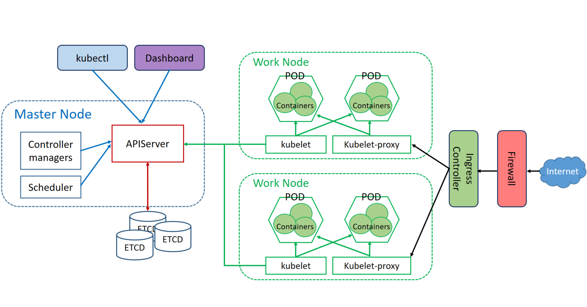

# K8s系列文章 - 什么是K8S

原文：https://cloud.tencent.com/developer/article/1429218

### 目录

- 什么是Kubernetes?
- Kubernetes技术架构
- Kubernetes解决了什么？

## 一. 什么是Kubernetes

### 1.1 kubernetes的基本概念

来自维基百科的解释：**Kubernetes**（常简称为K8S）是用于自动部署、扩展和管理容器化（containerized）应用程序的开源系统。该系统由Google设计并捐赠给Cloud Native Computing Foundation（CNCF，今属Linux基金会）来使用。

如果之前了解学习过OpenStack，那么你应该知道管理VM虚拟机资源可以用OpenStack。那么管理容器是否有对应的开源平台呢？有的，Kubernetes就是。当然，Kubernetes火爆之前也出现过很多管理平台，有docker自己出的Swarm，也有apache推出的Mesos。这跟当年OpenStack推出的时候很像，与之竞争的cloudstack、opennebula、easystack等等。不过，最终还是OpenStack胜出了。这样的结果，你说是其他的平台不好吗？其实个人觉得某项技术也有它自己的命运，时代选择了它，那就是它！Kubernetes也是如此，虽然晚推一步，但是走得还是很顺（更何况它有个好爹)。

### 1.2 kubernetes的诞生历史

Kubernetes的logo是一个蓝色的轮船方向盘，希腊语的意思为“舵手”或“驾驶员”。英语大部分受希腊语的影响，而且希腊神话在西方国家文化中占据非常重要的地位，所以很多名词都会采用希腊语（显得逼格高，类似咱们的文言诗词）。

容器技术的管理其实在google内部早就玩得非常成熟了，2000年左右开始就有了，当时算是内部顶级技术和技术机密。随着最近几年外界容器技术的火爆，google觉得是时候出来装个13，公布下玩了十几年的技术，顺带做下这个领域的老大，引领风骚。

Google内部这项技术叫Brog。在谷歌内部，Kubernetes的原始代号曾经是Seven，即星际迷航中的Borg(博格人，星际旅行系列中最大的反派，通过“同化”来繁衍)。

另外，选择这个“舵手” 方向盘还有另外一个原因是这个舵手有七个轮辐，意思是代表着项目最初的名称“Project Seven of Nine"。关于kubernetes的详细历史，可以看看官网自己的讲述：https://cloud.google.com/blog/products/gcp/from-google-to-the-world-the-kubernetes-origin-story

### 1.3 kubernetes当前生态发展态势

CNCF于2017年宣布首批Kubernetes认证服务提供商（KCSPs），包含IBM、华为、MIRANTIS、inwinSTACK迎栈科技等服务商。

## 二. Kubernetes技术架构

### 2.1 Kubernetes基本组成

K8S是分布式架构，因此它是由多个组件组成的。学习什么组件组成后，还需要了解这些组件之间的关联关系是怎么样的。了解关联关系非常重要，这关乎到运维当中的一些排障，还有一些架构上的优化。

#### Pod

Pod这个单词，英文里有“吊舱”、“豆荚” 之意，所以很容易想到它是一个微型的小空间。K8S是容器资源管理调度平台，它本身是不会创建出运行时容器（真正创建容器的是docker），它只负责管理容器资源。 那么管理容器资源，总得在最底层有个规纳收整容器的机制吧（可以把容器想象成豆子，Pod就是包住它们的豆荚）。 这个Pod就是K8S里最小的管理单元，里面存放着一组**有关联关系**的容器；然后这组容器都一起共用着相同的网络和存储资源。

#### Node

Node就是节点的意思，因为K8S是分布式架构，所以K8S一样有master 和slave 的区分。master 就是主节点，可以理解为K8S的核心大脑，里面跑着api server、scheduler、replication controller等关键服务。slave（K8S里一般叫work节点，负责干活的） 就是从节点，里面跑着一个或者多个Pod、kubelet、kube proxy。如果了解过openstack，那么理解K8S的node角色就非常简单了，在openstack里有控制节点和计算节点，控制节点对应着master，计算节点对应work。

#### Cluster

Cluster就是集群的意思，分布式系统必然少不了集群的概念。“一个和多个master + 一个和多个slave” 就组成了一个集群。集群一般会根据资源、地域、业务等几个维度来区分和划分，它是一个逻辑概念。

#### ETCD

一个集群运行当中必然会产生一些数据，比如K8S的一些状态信息。那么这些状态信息肯定是需要有个数据库持久化存储的，ETCD 就是提供了这个功能。ETCD 是一个开源的、分布式的键值对数据存储系统，同时它提供共享配置和服务的注册发现功能。至于为什么K8S会选择它来做数据存储方案而不是mysql或者其他数据库，后续会写文章详细讲述。

#### API Server

API Server 运行在master节点里面，它提供了K8S各类资源对象的CURD及HTTP REST接口，可以理解为它就是K8S的神经系统。**集群内部组件的交互通信需要通过它**，然后它会把交互的信息持久化到ETCD里。另外，假如发送指令或者自己开发程序操作K8S，那么就需要跟API Server打交道。

#### Scheduler

Scheduler英文直译就是调度的意思。在分布式计算系统里面，调度是非常重要的，因为在有限的资源池里要做合理的划分。学习调度可以从两方面入手，简单的看它的规则、流程，深入的话就学习它的算法。最基本的，学习K8S先要了解的是它的调度规则和流程。

总体来讲有两点，一个是“预选调度过程”，另外一个是“确定最优节点”。

* 预选调度过程：遍历所有目标Node，筛选出符合要求的候选节点，K8S目前内置了多种预选策略供用户选择。
* 确定最优节点：在预选调度过程基础上，采用优选策略计算出每个候选节点的积分，积分最高者胜出。

后续会详细讲解scheduler的策略，策略的了解，对于对资源的规划和把控有很大的帮助。

#### Replication Controller

Replication Controller 简称RC，它是K8S里非常重要的一个概念，大家日后使用K8S的话得经常跟它打交道。Replication 是复制、副本的意思，Controller 大家都明白是控制器，连起来就是“副本控制器” 。**在K8S里，注意一点，创建、控制、管理Pod都不是直接的**（不像管理虚拟机那样），都得通过各种控制器来实现，其中RC就是控制器的一种（后面还会提到ReplicaSet）。

那么，这里说的控制器到底是控制Pod什么呢？一般来说可以通过RC来控制Pod的数量，确保Pod以指定的副本数运行。比如，RC里设置Pod运行数量是 4 个，那么如果集群里只有3个，那么它会自动再创建出一个来；如果集群里有 5 个，多了一个，那么它也会把多余的回收。除此之外，假如4个当中有个容器因为异常自动退出，它也会自动创建出一个正常的容器。**确保Pod数量、健康、弹性伸缩、平滑升级是RC的主要功能**。

RC机制是K8S里一个重要的设计理念，有了它才实现了K8S的高可用、自愈、弹性伸缩等强大功能。

#### ReplicaSet

ReplicaSet简称RS，中文翻译成“副本集”。在新版本的k8s里，官方是建议使用ReplicaSet替代Replication Controller。RS跟Replication Controller都是属于控制器，没有本质的区别，可以理解为RS是Replication Controller的升级版，唯一的区别在于ReplicaSet支持集合式的selector（标签选择器），而Replication Controller只支持等式（**集合式就是标签可以有多个值，等式就只能选择一个或者不选**）。

#### Deployment

RC和RS控制器是如何去操作呢？那就是通过Deployment了，Deployment中文意思为部署、调度。**通过Deployment能操作RC和RS，可以简单的理解为它是一种通过yml文件的声明**，在Deployment 文件里可以定义Pod数量、更新方式、使用的镜像，资源限制等等。

但是一定要编写正确格式的Deployment yml文件，不然会部署失败。

#### Label

Label就是标签的意思，标签有什么作用？很简单，它肯定是**为了区分某种事物**。在K8S里，资源对象很多种，前面提到的Pod、Node、RC都可以用 label 来打上标签。打上了标签后，用户就可以更好的区分使用这些资源。另外，label是以 key/values （键值对）的形式存在的。用户可以对某项资源（比如一个Pod）打上多个label，另外，一个label也可以同时添加到多个资源上。- ***与Pod的关系，是多对多***

#### Selector

Selector是标签选择器的意思。前面讲 label 的时候提到K8S里面有很多资源，而且各种资源都能打上各种标签。所以一个集群里，标签label 估计会很多。Label多了，就难于认为管理，必然需要有一种机制来管理和筛选label，那么这个selector 就是做这个的。**通过标签筛选，能快速找到所需要的资源对象**。

#### Kubelet

kubelet运行在***work***节点上面，它是work节点的关键服务，负责与master节点的沟通。master里的APIServer会发送一些Pod的配置信息到work节点里，那么**kubelet负责接收**。同时，kubelet还得**定期向master汇报work节点的使用情况**，比如节点的资源使用情况、容器的状态等等。

#### Kube-Proxy

Kube-proxy也是运行在work节点上面的，带有proxy的字眼，很快能感觉到它跟代理、转发、规则等方面有关。是的，它的作用就是生成iptables和ipvs规则，处理一些访问流量做相关的转发。

#### Service

Service在K8S里是后端服务的一种体现。Pod是一个或者多个有关联关系的容器，那么这些容器生成的服务通过什么方式对外提供？Service就是做这个的。

举个例子，假如一个A服务运行3个Pod，B服务怎么访问A服务的Pod？通过IP肯定不行，因为 Pod 的 IP 都是重启之后会变化的。这时候只要通过 **Selector** 把某个 **service** 跟 A服务的Pod绑定就可以了，这样，无论 A 的 Pod 如何变化，对B来说只要访问确定的 service 即可。另外，前面提到的 kube-proxy，它的作用主要是负责 Service 的实现。

#### KubeDNS

把“KubeDNS”中的 kube 去掉，光看 DNS 应该知道这个组件是做什么用的。是的，kubeDNS就是**K8S内部的域名解析器**。那K8S内部有域名需要去做解析的吗？是的，有。简单的理解 DNS 解析就是把域名跟实际的IP对应上，那么在K8S里**kubeDNS的作用就是把service和IP对应上，直接使用服务名来做交互**，而不用关心它的实际IP地址。

#### Ingress

Ingress英文直译是“入口”。很明显，K8S创造这个机制是为了**让外部能很好的访问k8s所提供的服务**。那么上面的service不就是提供服务的吗？为何还要弄个Ingress？这个问题问的好！

Ingress是从K8S的v1.1版本开始添加的，可以理解它就是一种 **“转发规则**” ，而且Ingress的后端是一个或者多个service。

前面提到过，**service的后端是一组Pod**。假如Pod A提供service A，Pod B提供service B，这两个service又是同一组业务支撑的话，如果没有Ingress，那么service A和service B就只能单独直接暴露给外部，并且做不了业务关联。有了Ingress，它能提供一个**全局的负载均衡器**，站在多个service的前端，扮演“**智能路由**”的角色，把不同的http/https请求转发到对应的service上。

#### Ingress Controller

前面说了Ingress的作用，它是一种规则。那么这个规则由谁来控制和使用呢？那就是通过Ingress Controller了，中文意思就是Ingress控制器。它的主要作用就是**负责解析 Ingress 的转发规则**，如果Ingress 里面的规则有改动，Ingress controller都会及时更新，然后它根据这些最新的规则把请求转发到指定的service上。

#### KubeCtl

一套集群做相关管理和操作，最基本能想到的就是通过命令，那么kubectl就是干这个的。它是用于运行k8s集群命令的管理工具。想运维操作集群，以后直接敲kubectl --help就知道了。

#### Dashboard

很容易理解，这是K8S的控制面板webui。它是一个独立的组件，集合了所有命令行可以操作的所有命令。你搭建好了K8S后，这个组件可以选择装和不装。官方源码地址是：[https://github.com/kubernetes/dashboard ](https://github.com/kubernetes/dashboard)。

### 2.2 Kubernetes组件关联关系

上面分别讲了K8S各个组件的作用和概念，对于它们之间的关系也能有个大概印象。这里用一张图来更加形象的表示下各个组件的关系。

​                                                                                K8S结构图

1. 首先外网进入到K8S集群要通过一道防火墙；
2. 紧接着是Ingress Controller，它负责执行ingress的转发规则，让请求转发到对应的Service上（图里直接到kubelet-proxy），前面提到过Service的实现靠的是kubelet-proxy；
3. 接着kubelet-proxy把流量分发在对应的Pod上；
4. 每个work node里面都运行着关键的kubelet服务，它负责与master节点的沟通，把work节点的资源使用情况、容器状态同步给APIServer；
5. Master节点的APIServer是很重要的服务，图中可以看到控制器、调度、ETCD等都需要跟APIServer交互。由此可见，在运维K8S集群的时候，APIServer服务的稳定性要加固保障，做好HA高可用。

## 三. Kubernetes解决了什么

### 3.1 技术角度

​        Kubernetes无疑给PAAS平台的完善带来了巨大的变化，与docker的配合，让容器云很容易落地。同时，kubernetes也推动了云原生、SOA等技术理念和架构的演进。

​        单纯从 Kubernetes 运用来讲，可以达成以下目标：

- 跨多台主机进行容器编排（容器资源集中式管理）。
- 更加充分地利用硬件，最大程度的运用企业现有的IT资源（成本最大化）。
- 有效管理和控制应用的部署和更新，并实现自动化操作（CICD，蓝绿发布简单高效）。
- 挂载和增加存储，用于运行有状态的应用。
- 快速、按需扩展容器化应用及其资源（易操作）。
- 对服务进行声明式管理，保证所部署的应用始终按照部署的方式运行（易管理）。
- 利用自动布局、自动重启、自动复制以及自动扩展功能，对应用实施状况检查和自我修复（自愈能力非常强）。

### 3.2 商业角度

​        技术的更新必然带动IT生产力的提高。

​        K8S出现后，各种PAAS云平台和产品出现，创业公司也层出不穷；各大云厂商也推出基于K8S的容器云产品。

​        K8S是趋势，自然能直接或者间接带来很大的商业价值。

