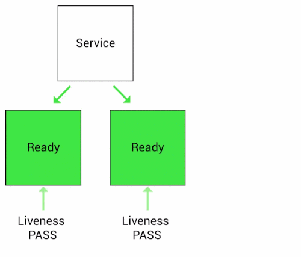
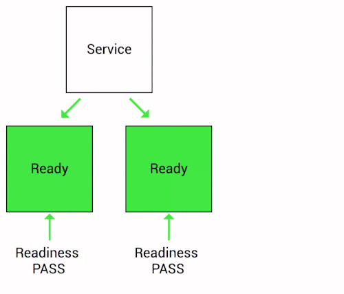

# K8s系列文章 - Pod的深入理解

原文：https://cloud.tencent.com/developer/article/1443520


## 目录

1. 什么是Pod
2. Pod内部机制
3. Pod基本操作


## 一. 什么是Pod

### 1.1 Pod是什么

​        Pod可以想象成一个“豆荚”，然后里面包着一组有关联的“豆子”（容器）。如下图所示：


​        一个豆荚里的豆子，它们共同吸收着同样的养分，Pod也是如此，里面的容器共有着同一组资源。K8s官方文档对Pod的描述如下：A Pod is the basic building block of Kubernetes - the **smallest and sinplest unit** in the Kubernetes object model that you create or deploy. A Pod represents **processes** running on your Cluster. 翻译就是：Pod是K8s的基本构建模块，它是K8s集群里能创建或部署的**最小和最简单的单元**。

​        刚学习K8s的人一般会认为容器Docker是最小的单元，其实不是。Pod才是K8s里最小的单元。如果把Pod想象成虚拟机，然后把容器想象成虚拟机里面的应用，就很容易理解了。如果K8s和OpenStack做对比，也容易理解：

<table>
  <tr>
    <td>K8s</td>
  	<td>OpenStack</td>
  </tr>
	<tr>
    <td>Pod</td>
    <td>VM</td>    
	</tr>
	<tr>
    <td>Docker</td>
    <td>application应用、进程</td>    
	</tr>
</table>

OpenStack管理的VM，可以说是OpenStack里最小单元，虚拟机具有**隔离性**，里面部署的应用只能跑在虚拟机里，它们共享这个VM的CPU、Mem、网络、存储资源等。那么Pod也是如此，Pod里面的容器共享着Pod里面的CPU、Mem、网络和存储资源等。那么Pod如何做到的呢？下面继续介绍。

### 1.2 Pod的特点

#### 集群里的最小单元

​        注意，K8s集群的最小单元是Pod，而不是容器；K8s直接管理的也是Pod，不是容器。

#### Pod里可以运行一个或多个容器

​        如果Pod里只运行一个容器，那就是 “One-Container-per-Pod” 模式。也可以把一组有关联关系的容器放在一个Pod里，这些容器共享着同一个网络命名空间和存储卷。比如K8s官网文档里举的例子：把一个 web server 的容器跟 File PUller 的容器放在一起（Web Server 对外提供web服务，File Puller 负责内容存储和提供），然后它们就形成一个Pod，，构成一个统一的服务单元。如下图所示：


​        另外，也可以想得复杂些。比如在传统运维里搭建的LAMP环境，如果把它们容器化部署在K8s集群里，会是怎么样的模式呢？ **IAAS** 层里部署LAMP环境，如果是规模小的话，用一个虚拟机就可以把apache + mysql + php 环境搭建起来；规模大的话，用几个VM，然后做分布式。那么，如果是 **PAAS** 层Pod容器化部署呢？是否是Apache + mysql + PHP 分别跑一个 docker，然后打包放在一个Pod里，然后规模大了就多起几个Pod呢？

### Pod里的容器共用相同的网络和存储资源

​        K8s里，每个Pod会被分配唯一的 IP 地址，然后里面的容器都会共享着这个网络空间，这个网络空间包含了 IP 地址和网络端口。 Pod容器内部通信用的是 localhost ，如果要和外面通信，就需要用到共享的那个 IP 和端口。

​        Pod 可以指定共享的存储Volume，然后Pod里的所有容器都有权限访问这个Volume。Volume是持久化数据用的，Pod的重启不会影响Volume里的数据。

### Pod里的容器共用相同的依赖关系

​        有关联关系的容器可以放在一个Pod里，那么这里的**关联关系怎么理解呢**？通常，会把**有紧耦合的服务**部署到一个Pod里，比如LAMP应用栈。这样做的目的，就是**能够做到共同调度和协调管理**。所以，没有关联的容器最好不要放到一个Pod里，没有规则的乱放，你将无法体会到K8s的强大之处-编排。


## 二. Pod内部机制

### 2.1 Pod实现原理

​        容器之所以能够出现，是因为Linux提供了 Namespace 和 Cgroup 这两种机制。**Namespace 用于进程之间的隔离， Cgroup 用于控制进程资源的使用**。Namespace 由 hostname、PID、filesystem、network，IPC组成。在K8s里，Pod的生成也是基于 Namespace 和 Cgroup的，所有Pod內的架构合成，可以用下图表示：


​        这些要素是通过什么机制组合到一起的呢？

​        这里，通过一个叫做 **Pause** (gcr.io/google_containers/pause-amd64) 的容器完成的。 K8s在初始化一个Pod的时候，会先启动一个叫做Pause的容器，然后再启动用户自定义的业务容器。这个Pause容器，认为是一个“**根容器**”，它主要有两方面的作用：

* 扮演 ***PID 1*** 的角色，处理僵尸进程
* 在Pod里为其他容器共享Linux Namespace 的基础

​        首先，了解下Linux系统下的 ***PID 1*** 的进程的作用和意义。在Linux里，PID 为 **1** 的进程，叫做超级进程，也叫根进程，它是系统的第一个进程，是其他进程的父进程，所遇的进程都会被挂在这个进程下。如果一个子进程的父进程退了，那么这个子进程会被挂到 PID 1 下面。

​        其次，容器本身就是一个进程。在一个 Namespace 下，Pause 作为 PID 为 1 的进程存在于一个Pod里，其他的业务容器都会挂载到这个Pause进程下面。这样，一个 Namespace 下的进程就会以Pause作为根，呈树状的结构存在一个Pod下。

​        最后，Pause 还有个功能是负责处理僵尸进程的。僵尸进程：一个进程使用fork函数创建子进程，如果子进程退出，而父进程并没有来得及调用wait或者waitpid获取其子进程的状态信息，那么这个子进程的描述符仍然保存在系统中，其进程号会一直存在被占用（而系统的进程号是有限的），这种进程称之为僵尸进程（Z开头）。

​        Pause 这个容器代码是用C写的，其中Puase的代码里，有个无限循环的 for(;;)函数，函数里面执行的是 *pause()* 函数。*pause()* 函数本身是在睡眠状态的，直到被信号（signal）所中断。因此，正是因为这个机制，Pause容器会一直等待 **SIGCHLD** 信号，一旦有了SIGCHLD信号（进程终止或者停止时会发出这种信号），Pause 就会启动 *sigreap* 方法，*sigreap* 方法里就会调用 *waitpid* 获取其子进程的状态信息，这样自然就不会在Pod里产生僵尸进程了。

```c
## Pause代码
static void sigdown(int signo) {
  psignal(signo, "Shutting down, got signal");
  exit(0);
}

static void sigreap(int signo) {
  while (waitpid(-1, NULL, WNOHANG) > 0);
}

int main() {
  if (getpid() != 1)
    /* Not an error because pause sees use outside of infra containers. */
    fprintf(stderr, "Warning: pause should be the first process\n");

  if (sigaction(SIGINT, &(struct sigaction){.sa_handler = sigdown}, NULL) < 0)
    return 1;
  if (sigaction(SIGTERM, &(struct sigaction){.sa_handler = sigdown}, NULL) < 0)
    return 2;
  if (sigaction(SIGCHLD, &(struct sigaction){.sa_handler = sigreap,
                                             .sa_flags = SA_NOCLDSTOP},
                NULL) < 0)
    return 3;

## 关注这下面的for循环代码
  for (;;)
    pause();
  fprintf(stderr, "Error: infinite loop terminated\n");
  return 42;
}
```

### 2.2 Pod生命周期

​        在K8s官方文档里，分别通过phase、Conditions、Container Probes、Container States、Pod readiness gate、Restart policy、Pod lifetime等几方面来描述。

#### Pod的状态值 - Phase

​        Pod的状态是PodStatus对象里的***phase***字段来表示的。这个phase字段有以下一些值：

<table>
  <tr>
  	<td>阶段名</td>
    <td>描述</td>
  </tr>
  <tr>
  	<td>Pending</td>
    <td>K8s集群里已经发起创建Pod请求，里面的Pod还没有容器。这个阶段一般是发生在Pod被调用之前，或者Pod里的镜像正在下载。</td>
  </tr>
  <tr>
  	<td>Running</td>
    <td>Pod已经调度落地在一个Node里，并且里面的容器已经创建好了。里面至少一个容器正在运行或者正在启动或者重新启动。</td>
  </tr>
  <tr>
  	<td>Succeeded</td>
    <td>Pod里面的所有容器成功运行，也没有发生重启等行为。</td>
  </tr>
  <tr>
  	<td>Failed</td>
    <td>Pod里的所有容器终止，至少有一个容器以失败方式终止。也就是说，这个容器要么已 非0 状态退出，要么被系统终止。</td>
  </tr>
  <tr>
  	<td>Unknown</td>
    <td>由于一些原因，Pod的状态无法获取，通常是与Pod通信时有出错。</td>
  </tr>
</table>

#### Pod Conditions

​        PodStatus对象里也包含了Pod Conditions，这是一个数组，里面包含的属性有：

<table>
  <tr>
  	<td>字段</td>
    <td>描述</td>
  </tr>
  <tr>
  	<td>lastProbeTime</td>
    <td>最后一次探测 Pod Condition 的时间戳</td>
  </tr>
  <tr>
  	<td>lastTransitionTime</td>
    <td>上次 Condition 从一种状态转换到另一种状态的时间</td>
  </tr>
  <tr>
  	<td>message</td>
    <td>上次 Condition 状态转换的详细描述</td>
  </tr>
  <tr>
  	<td>reason</td>
    <td>Condition 最后一次转换的原因</td>
  </tr>
  <tr>
  	<td>status</td>
    <td>Condition 状态类型：可以是 Ture、False 和 Unknown</td>
  </tr>
  <tr>
  	<td>type</td>
    <td>
      Condition 类型，包括以下方面：<br>
      <li> PodScheduled (Pod已经被调度到其他Node里) </li>
      <li> Ready（Pod能够提供服务请求，可以添加到所有可匹配服务的负载均衡池中）</li>
      <li> Initialized（所有的Init containers 已经启动成功）</li>
      <li> Unschedulable（调度程序现在无法调度Pod，例如由于缺乏资源或者其他限制）</li>
      <li> ContainersReady （Pod里的所有容器都是ready状态）</li>
    </td>
  </tr>
</table>

### Container Probes

​        **Probes** 中文意思就是“探针”，所以container probes翻译成中文就是“容器探针”。这是K8s的一种诊断容器状态的机制。Node里会运行 **Kubelet** 进程，它有一个作用是收集容器的状态，然后汇报给master节点。“容器探针”这种机制就是通过 Kubelet 来实现的。那么 Kubelet 是怎么知道节点里容器状态信息的呢？具体的抓哟是 Kubelet 调用容器提供的 Handler（钩子）三种处理程序：

* ExecAction：在容器内执行指定的命令。如果命令以状态代码 0 退出，则认为争端成功，容器是健康的
* TCPSocketAction：通过容器的IP地址和端口号执行TCP检查。如果端口存在，则认为诊断成功，容器是健康的
* HTTPGetAction：通过容器的IP地址和端口号以及路径调用HTTP GET方法，如果相应状态码大于等于200且小于400，则认为容器状态是健康的

​        每个Container probes都会获得三种结果：

* 成功：容器通过诊断
* 失败：容器未通过诊断
* 未知：诊断失败，不应采取任何措施

​         另外，Kubelet 可以在运行Containers（容器）里，有两种探针方式：

* livenessProbe：存活探针，是为了表明容器是否正在运行，服务是否正常。如果LivenessProbe探测到容器不健康，则Kubelet会杀死Container，并且根据Container的重启策略来重启。如果Container未提供livenessProbe，则默认状态为 *Success*
* readinessProbe：就绪探针，是为了表明容器是否已经准备好提供服务（是否启动成功）。如果readinessProbe探测失败，则Container的Ready将为False，控制器将此Pod的Endpoint从对应的service的Endpoint列表中移除，从此不再将任何请求调度此Pod上，直到下次探测成功。如果Container未提供readinessProbe，则默认状态是 Success

​        为什么会有这两种探针机制？主要是Pod的生命周期会受到很多环境条件的影响，比如Pod内部各个容器的状态、容器依赖的上游或者周边服务的状态等等。所以需要一个机制来根据容器不同的状态来决定Pod是否健康。所以，livenessProbe和readinessProbe就是为了解决这个问题。

​        下面两张图介绍这两种探针具体的工作方式：

​        比如有个Pod通过LivenessProbe探测发现无法再提供服务了，那么LivenessProbe会根据容器重启策略判断它是否重启，策略通过后，执行新Pod的替代操作：



​        有时候一些应用需要一段时间来预热和启动，比如后端项目的启动需要先启动消息队列，或者数据库等才能够提供服务，那么这种情况，可以使用 ReadinessProbe：



​         那么在生产环境中，什么时候用Liveness？什么时候用Readiness？这里总结一下，供参考：

1. Liveness跟 Readiness 应该直接探测程序，不要走间接探测方式
2. LIveness 探测的程序里**不要做任何其他逻辑**，它很简单就是探测服务是否正常。如果主线程是正常的，那就直接返回200，不是就返回5xx。如果有其他逻辑存在，则探针程序会把握不准
3. Readiness 探测的程序里**有相关的处理逻辑**。Readiness 主要是探测判断容器是否已经准备好对外提供服务，因此实现一些逻辑来检测目标程序后端所有依赖组件的可用性非常重要。实现Readiness探测时，需要清楚的知道所探测的应用依赖于哪些功能，并且这些依赖的功能什么时候准备好。例如，如果应用程序需先建立与数据库的连接才能提供服务，那么在“Readiness”的处理程序中就必须检查是否已建立与数据库连接才能最终确认程序是否就绪
4. Readiness **不要嵌套使用**。也就是说，某个程序已经使用了 Readiness 做探测，那么外面不要再套一层Readiness

​        最后，LIveness和Readiness的YAML配置语法上是一样的，也就是说，同样的YAML配置文件，把Liveness设置成Readiness就可以使用。

#### Container States

​        一旦Pod落地Node被创建了，Kubelet就会在Pod里面创建容器了。容器在K8s里有三种状态：*waiting、Running和Terminated*。如果要检查容器的状态，可以使用命令 *kubectl describe pod [POD_NAME]*，这个命令会显示该Pod里每个容器的状态。另外，K8s在创建资源对象时，可以使用lifecycle来管理容器在运行前和关闭前的一些动作。Lifecycle有两种回调函数：

* PostStart：容器创建成功后，运行前的任务，用于资源部署、环境准备等
* PreStop：在容器被终止前的任务，用于优雅关闭应用程序、通知其他系统等等

​        以下是容器三种状态的介绍：

* Waiting：这是容器默认状态。如果容器**未处于**“正在运行”或“已终止”状态，则它就是“Waiting”状态。处于Waiting状态的容器仍然可以运行其所需要的操作，例如：拉镜像、密钥等。在这个状态下，*Reason* 字段将显示一些原因表示为什么会是*Waiting*状态，如：

  ```yaml
  ...
    State:          Waiting
     Reason:       ErrImagePull
    ...
  ```

* Running：表示容器正在运行。一旦容器进入Runing，如果有*postStart*的话，将会执行。另外，Started字段会显示容器启动的具体时间：

  ```yaml
     ...
        State:          Running
         Started:      Wed, 30 Jan 2019 16:46:38 +0530
     ...
  ```

* Terminated：表示容器已经终止运行。容器在成功完成执行或由于某种原因失败就出现此状态。容器终止的原因、退出代码以及容器的开始和结束时间都会一起显示出来（如下示例所示）。另外，在容器进入Terminated之前，如果有 *preStop* 的话，则会执行：

  ```yaml
     ...
        State:          Terminated
          Reason:       Completed
          Exit Code:    0
          Started:      Wed, 30 Jan 2019 11:45:26 +0530
          Finished:     Wed, 30 Jan 2019 11:45:26 +0530
      ...
  ```

#### Pod生命周期控制方法

​        一般情况下，Pod如果不被人为干预或者被某个控制器删除，它是不会消失的。不过，例外情况就是处于“***Succeeded***”或者“***Failed***”的Pod。如果处于此种状态超过一定的时间，比如 *terminated-pod-gc-threshold* 设定值，就会被垃圾回收机制清除。

​        注：terminated-pod-gc-threshold 在 master 节点里，它的作用是设置 ***gcTerminated*** 的阈值，默认值是12500s

​        三种类型的控制器控制Pod的生命周期的方法：

* Job：适用于一次性任务，如批量计算。任务结束后Pod会被此类控制器清除。Job的重启策略***只能***是“OnFailure”或者“Never”
* ReplicationController，ReplicaSet，Deployment：此类控制器希望Pod一直运行下去，它们的重启策略只能是“always”
* DaemonSet：每个Node一个Pod，这类控制器的重启策略应该是“always”

### 2.3 Pod资源使用机制

​        Pod就像是一个虚拟机，虚拟机是能分配固定的CPU、Mem、Disk、网络资源的。同理，Pod也是如此，那么Pod如何使用和控制这些分配的资源呢？

#### CPU资源

​        首先，来了解一下CPU资源的分配模式：计算机的CPU资源是按“*时间片*”的方式分配给请求的。系统里的每一个操作都需要CPU的处理。CPU的单位是Hz，GHz（1Hz = 1/s，即在单位时间内完成振动的次数，1GHz = 1_000_000_000 Hz = 1_000_000_000 次/s），频率越大，单位时间内完成的处理次数就越多。所以，哪个任务要是申请的CPU时间片越多，它得到的CPU资源就越多。

​        其次，再了解Cgroup里资源的换算单位。

* 1 CPU = 1_000 millicpu (1 Core = 1_000m)
* 0.5 CPU = 500 millicpu (0.5 Core = 500m)

这里的 m 就是毫、毫核的意思，K8s集群中的每一个节点可以通过操作系统的指令来确认本节点的CPU内核数量，然后将这个数量乘以1000，得到的就是节点总CPU总豪数。比如：一个节点有四核，那么该节点的CPU总豪数是4000m。如果要使用0.5 core，则得到CPU的毫数为 4000m * 0.5 = 2000m。

​        K8s里是通过以下两个参数来限制和请求CPU的资源的：

* spec.containers[].resources.limits.cpu：CPU上限值，可以短暂超越，容器也不会被停止
* spec.containers[].resources.requests.cpu：CPU请求值，K8s调度算法里的依据值，可以超过

这里需要明白的是，如果resources.requests.cpu设置的值大于集群里每个Node的最大CPU的核心数，那么这个Pod将**无法调度**（因为没有Node能满足它）。例如，在YAML里定义一个容器CPU资源如下：

```yaml
resources:
  requests:
    memory: 50Mi
    cpu: 50m
  limits:
    memory: 100Mi
    cpu: 100m
```

文件中，CPU定的是50m，也就是0.05Core，这0.05 Core也就是站了 1 CPU里的5%的资源时间。

​        另外，K8s的CPU资源是一个**可压缩的资源**。如果容器达到了CPU设定值，就会开始限制，容器性能会下降，但是不会终止和退出。

#### Mem资源

​        再来了解下Mem的资源控制。单位换算如下：

* 1 MiB = 1024 KB，注：这里，<font color='red'>MiB != MB</font>。MB是十进制单位，而MiB是二进制的。一般都认为 1MB = 1024 KB，其实 1MB = 1000 KB， 而 1 MiB = 1024 KiB。中间带字母 i ，是国际电工协会（IEC）定的，走1024 乘积， KB，MB，GB是国际单位制，走1000乘积。

​        内存在K8s里一般用的是Mi单位，也可以使用Ki，Gi甚至是Pi，看具体业务需要和资源容量。

​        注意，内存是<font color='red'>不可以</font>**压缩资源**，如果容器使用内存资源达到了上限，那么会OOM，造成内容溢出，容器就会被终止和退出。


## 三. Pod基本操作命令

<table>
  <tr>
  	<td>说明</td>
    <td>具体命令</td>
  </tr>
  <tr>
  	<td>创建</td>
    <td>kubectl create -f xxx.yaml</td>
  </tr>
  <tr>
  	<td>查询</td>
    <td>kubectl get pod PodName / kubectl describe pod PodName</td>
  </tr>
  <tr>
  	<td>删除</td>
    <td>kubectl delete pod PodName</td>
  </tr>
  <tr>
  	<td>更新</td>
    <td>kubectl replace /path/to/newPodName.yaml（当然，也可以加 --force 强制替换）</td>
  </tr>
  <tr>
  	<td>查看logs输出</td>
    <td>kubectl logs PodName</td>
  </tr>
</table>
