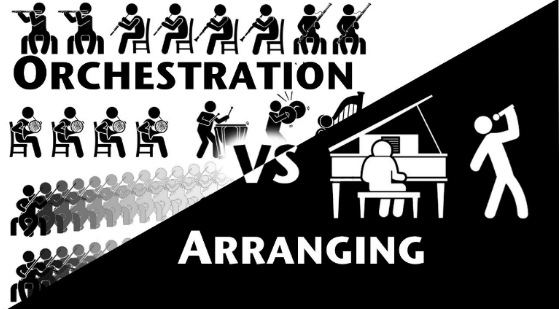
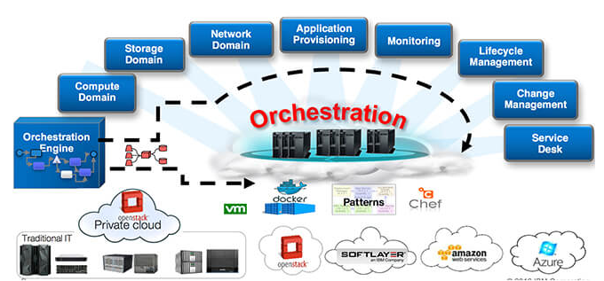
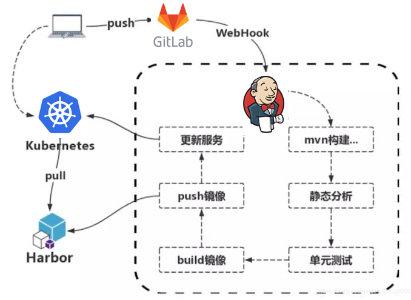

# K8s系列文章 - 如何理解编排

原文：https://cloud.tencent.com/developer/article/1484774

## 目录

1. 通俗的理解编排

2. K8s与编排

## 一. 通俗的理解编排

### 1.1 编排是什么

编排这个词，去搜google翻译，推荐的是Orchestration这个单词。但是你反过来搜Orchestration中文意思，它的翻译是“管弦乐编曲”。在管弦乐曲里，要完成多种乐器之间的协调配合肯定需要一种方法，这种方法也叫编排。由此可感受到，有编排的场景存在多种组件事务，而且这些组件事务具有一定的独立性。个人理解，编排是按照某种机制让各种组件自动化配合运作，然后得到你想要的结果。

### 1.2 编排与自动化

不要单纯的把自动化理解为编排，其实这两个概念是有区别的。编排，注重的是组建配合产生出良好的结果；而自动化注重的是组件运行的方式和效率。但是，在IT领域，编排是离不开自动化的，没有自动化的编排只是一种工作流，虽然每个人一丝不苟，按部就班，但是这仅仅也是体现工作流的完美，没有体现出高效。

编排会贯穿整个IT环境。例如，横穿web服务器、数据库、中间件、负载均衡器等等。这里涉及多个层次，不同的技术领域，IT管理者需要站在一个高纬度去认识生产系统，设计出一套复杂的编排机制。

### 1.3 编排意义

有些人或许会疑问，编排的意义在哪？它能带来什么收益？

通过上面两点的讲解，编排或许可以理解为一种IT工作流，它能把IT系统都串接起来，然后自动化运作。那不是一劳永逸了？如果是输入和输出要求都不变的情况下或许真的能一劳永逸。但是现实的情况往往不是这样。公司的业务更新迭代，IT支撑环境也是会不停的更新迭代，没有一种IT环境能一直保持不变的支撑下去。但是，编排的思想却是贯彻着整个IT阶段发展，每一个发展阶段都有不一样的编排思路。

物理机时代，人们用人肉运维“编排”（搬、挪）物理机；虚拟机时代，人们用脚本、CMDB、openstack heat等“编排”虚拟机；最新容器时代，人们用K8S、微服务编排容器。

套用网上一句话：编排旨在简化并优化重复性的频发流程，以确保准确、快速的软件部署。因为企业知道产品上市速度越快、成功几率越大。只要流程是重复性的，便可通过自动执行相关任务来优化该流程，以消除重复操作。

## 二. K8s与编排

### 2.1 实现完美编排的先决条件

其实编排的对象越“原子”、越轻量那么对于编排的操作就更加的灵活。前面提到，业务会随时改变，那么支撑的生产系统也需要随之变化。如果编排的工作流程组件耦合度太高，那么变更就很困难。想想过去没有虚拟化的时代，应用直接跑在物理机里，那么应用的安装、迁移都会显得费劲。到了虚拟机时代，会简单很多，但是虚拟机本身还是显得有些重，迁移也受底层硬件条件的影响。可幸的是，容器时代这些问题得到了很好的解决，直接能操作“进程”了，通过容器能轻松部署、迁移、交付... 容器真是为良好的编排打好了基础。

在当前云原生时代，应用一般由单独容器化的组件（通常称为微服务）组成，且必须按顺序在网络级别进行组织，以使其能够按照计划运行。以这种方法对多个容器进行组织的流程即称为容器编排。

在现代开发当中，整体式的应用早已成为过去时，如今的应用由数十乃至数百个松散结合的容器式组件构成，而这些组件需要通过相互间的协同合作，才能使既定的应用按照设计运作。容器编排是指对单独组件和应用层的工作进行组织的流程。

虽然诸如 Apache Mesos、Google Kubernetes 以及 Docker Swarm 等平台均有其特定的容器管理方法，但所有的容器编排引擎均可让用户控制容器启动和停止的时间、将其分组合到群集中，以及协调应用组合的流程。容器编排工具允许用户指导容器部署与自动更新、运行状况监控以及故障转移等步骤。

### 2.2 K8s如何实现编排

K8S是容器资源管理、调度平台，换句话说它就是容器资源的编排系统。那么容器编排都有哪些动作和流程呢？总体来讲有六大部分：

- 资源调度
- 资源管理
- 服务发现
- 健康检查
- 自动伸缩
- 更新升级

那么K8S这里是如何实现这六点的呢？

#### 资源调度

在分布式系统里，资源的调度是非常重要的，K8S是通过scheduler组件来对Pod进行调度的。Scheduler调度器做为K8S的三大核心组件之一， 承载着整个集群资源的调度功能，其根据特定调度算法和策略，将Pod调度到最优工作节点上，从而更合理与充分的利用集群计算资源，使资源更好的服务于业务服务的需求。资源的调度是一套分布式系统最基本的核心指标。设想，如果连资源都无法调度好，那么上层的服务将没法玩。

#### 资源管理

资源，一般分为计算资源、网络资源、存储资源。计算资源通常是CPU、MEM（当然现在还有[GPU](https://cloud.tencent.com/product/gpu?from=10680)资源），对于这块K8S通过可压缩和不可压缩的机制来做区分，这里CPU资源是可压缩的，内存是不可压缩的。这里K8S主要是通过Requests和Limits参数来灵活控制Pod对资源的使用。

#### 服务发现

所有资源的分配、支撑都是为了跑服务。由于Pod的IP不是固定的，所以外在的程序或者内部的程序如何访问K8S里面的某个Pod，肯定需要一种固定的访问方式，那么这种方式叫做service。所有创建的服务只有轻松简单的被发现、被访问，这样才能更加的高效。

#### 健康检查

计算机世界里没有任何一种服务能一直保持正常运行。所以，总有各种内在、外在因素影响着服务的稳定运行。那么监控检测服务是否正常运行非常重要，**在K8S里一般用liveness和readiness探针机制来做健康检查**。

#### 自动伸缩

在运维环境里，资源的扩容和管理是比较头疼的一件事。工程师一般会比较难的精确把握业务需要多少资源，多了少了都会一定的影响成本和平台的稳定性。所以，假如有套机制能根据当前的负载高低，动态的、精准的扩容资源那么对工程师来说是一个很大的福音。虚拟机时代之前，这个都非常难实现，因为涉及到环境的快速迁移和复制。容器化时代很自然的解决了这个问题，K8S里使用Horizontal Pod Autoscaling（Pod横向扩容机制）来保证资源的按需扩容。

#### 更新升级

程序会随着业务的发展而不断的迭代，所以我们都会架设一套完整的CICD来完善程序的发布、更新机制。K8S目前在CICD里占了很重要的角色（如图）。另外，K8S的内部控制器ReplicationController与Deployment也为服务的滚动和平滑升级提供了很好的机制。这样实现什么蓝绿发布，K8S可以协助轻松做到。

