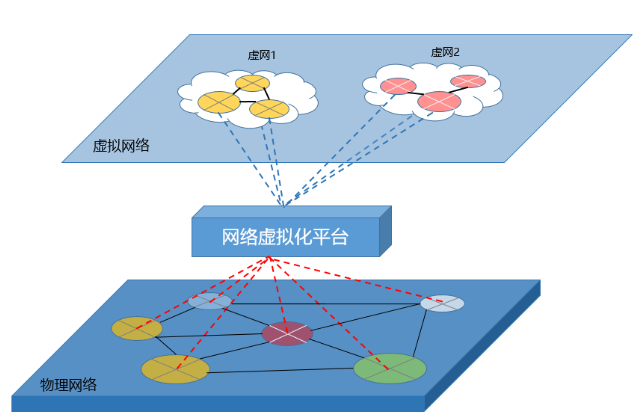
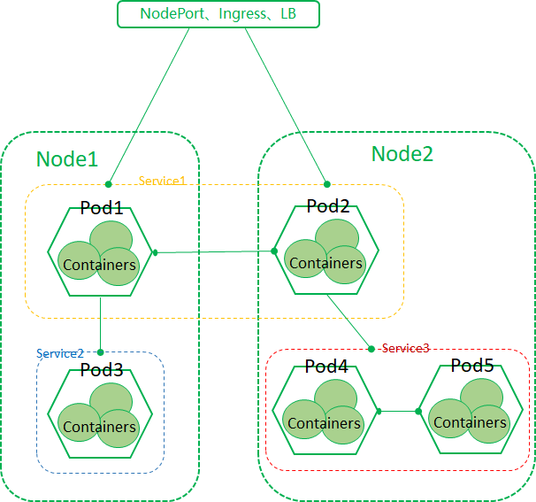
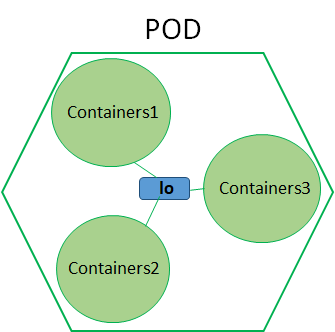
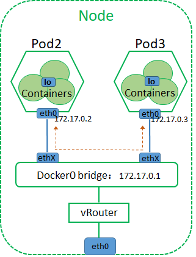
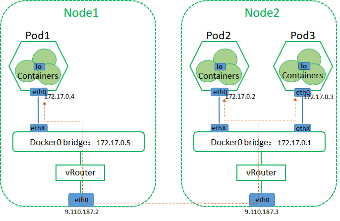
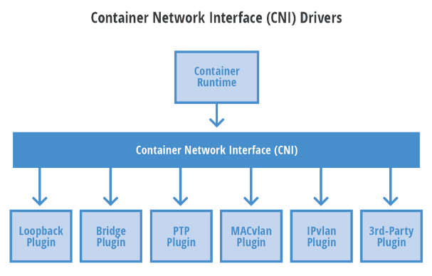
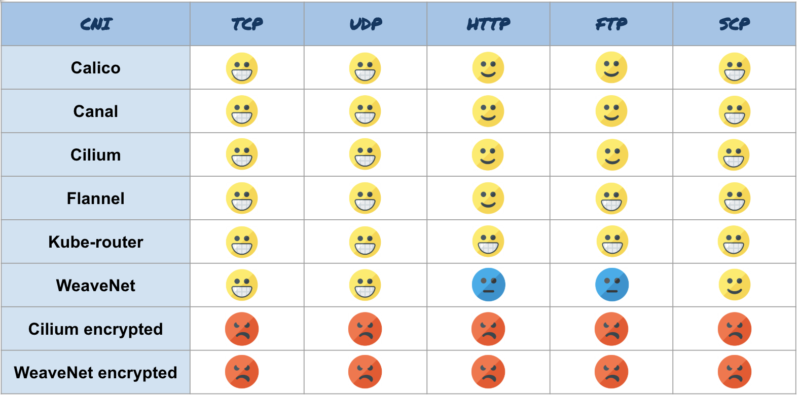
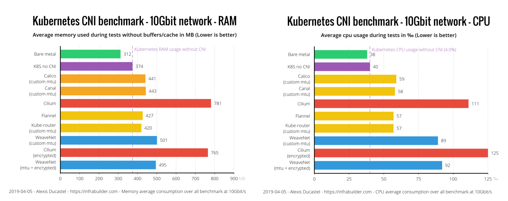

# K8s系列文章 - 网络实现

原文：https://cloud.tencent.com/developer/article/1580326

### 目录

1. 虚拟化网络基础
2. Docker的网络
3. K8s的网络

## 一. 虚拟化网络基础

​        虚拟化网络，是因为现在的CPU有VT-X技术，存储也可以虚拟化，比如Ceph技术。同样的，网络也有虚拟化，一般称为SDN技术（Software Defined Network），软件定义网络。

​        传统网络里有网线、网口、交换机、路由器、防火墙等概念，其实在虚拟化网络里同样也有对应的概念。同时，虚拟网络低层也需要物理网络来支撑（好比计算里需要物理CPU支撑，存储底层需要实实在在的硬盘），中间通过网络虚拟化平台把物理层网络软件定义成了虚拟组网，如下图。网络虚拟化的出现，促进了云计算的发展，毕竟每一种IT资源都需要具备弹性的优点。

​        网络虚拟化平台是通过哪些技术手段让物理网络变成虚拟网的呢？通过下表，可以简单的了解一些要点：

| 物理层面设备 | 虚拟层面设备                      | 实现技术原理            |
| :----------- | :-------------------------------- | :---------------------- |
| 网线         | veth pair                         | Linux net/veth.c 驱动   |
| 网卡网口     | vNIC                              | Linux TAP 驱动          |
| 交换机       | Linux Bridge/MACVTAP/Open vSwitch | Linux网络驱动/OVS-DPDK  |
| 路由器       | iptables NAT                      | Linux Netfilter内核组件 |
| 防火墙       | iptables                          | Linux Netfilter内核组件 |

上表很多虚拟层的技术都是Linux本身提供的。有些高并发场景直接用Linux自带的实现技术，性能是达不到要求的，需要开源项目，如Open vSwitch、DPDK、NFV等等。

## 二. Docker的网络

​        在物理机环境下，传统的网络机制的接入和理解都相对简单些，因为网线、网卡还有交换机这样的设备都是实实在在看得到的。但是在虚拟环境下，虚拟机模式和容器模式相对难理解些，因为这比较抽象，而且虚拟机模式和容器模式也不太一样。

​        容器网络这块主要以docker为代表，docker从v1.7开始，为了能更好的支持网络各种功能，独立创建了一个项目叫libnetwork。通过这个项目，docker希望统一容器这块的网络层标准。有想详细了解docker网络方面情况的，可以阅读这篇文章：[https://cloud.tencent.com/developer/article/1359581](https://cloud.tencent.com/developer/article/1359581?from=10680)

## 三. K8s的网络

​        K8S的技术架构，它的组成是Master + Node的方式。Node里面运行着Pod，而Pod又是K8S里最小的控制单元。 因此，学习K8S的网络可以从Pod、Node、Service、外界这几个对象间的网络连接关系来下手。可以先通过下面这张图有个大概的整体认识和了解：

​        上图中Pod1和Pod2在不同的Node节点上，然后它们是一个Service1里，内部之间存在网络连接；Pod3在一个Service2里，然后Service2与Pod1进行着连接；Pod4和Pod5同时在一个Node里，内部也连通着，同时Pod2跟Service3又存在连接；最后，Service1又与外部LB存在着连接。这是一个K8S基本的网络连接图，涵盖了通用的网络连接情况，下面我们具体说说每种连接具体的实现机制。

### 3.1 Pod里容器的互通

​        Pod内部的容器是共享一份网络和存储资源的，因此K8S给Pod分配的IP地址和网络端口，内部的容器都能一起享受和使用。Linux除了像 *eth0* 这样的网口，还有 *lo*(本地环路接口)，这个 *lo* 其实就是 *localhost* 的缩写，在Linux系统里，如果进程之间需要相互发包通信，那么就走这个lo。同样的道理，Pod内部的容器如果需要互联，那么走的也是 *lo*（localhost），然后加上容器用到的端口。

### 3.2 Pod之间的互通

​        Pod之间要进行互通，那么存在两种情况：

* 一种是同一个Node节点里Pod间的互通
* 另外一种是不同Node节点里的Pod之间相互连通

#### 3.2.1 同一个Node，Pod间的互通

​        安装部署了K8S的node节点，如果使用了docker作为运行时，默认会创建一个叫 *docker0* 的网桥，这个docker0就是 *Linux Bridge* 模式。每个Pod都会分配一个固定的IP，这个IP跟这个docker0是同一个网段，而且每个Pod都会通过 *veth-pair* 方式连接到这个docker0上。把每个Pod想象成一个VM虚拟机，然后每个虚拟机连接在了这个 *docker0* 的*二层交换机*上，如下图所示：

#### 3.2.2 不同Node，Pod间的互通

​        Pod A 要跟另外一Node节点的Pod B通信，那么很显然这两个Node之间要网络互通，这是先决条件。其次，每个Pod的数据要确保能从每个节点的网卡出去。最后，从整个K8S集群来看，每个Pod的IP不能有冲突。所以，总结起来有三点需要确认：

- Node之间网络需要保证互通
- Pod发送的数据包能通过本Node节点的网卡走出去
- K8S集群里的每个Pod分配的IP不能有冲突

​                                                               *注意橙黄色的虚线就是网络数据的传输路线*

​        在上面条件的第三点中，为了保证K8S集群的网络规划有条理又不失性能，那么通常需要一些网络插件来实现。上面这个例子中是两个Node节点3个Pod之间的互联关系，如果是N个节点N个Pod的话，加上业务场景那么网络的关系就复杂了，这就需要一种更为专业的管理软件来主导。关于K8S的一些专业网络插件，本文后面会提到。

#### 3.2.3 Pod与Service之间的互通

​        K8S里Pod是不稳定的，随着业务量的增加与减少，必然会有扩容和缩容，因此Pod随时可以创建和销毁。Pod销毁了，那么它上面的IP肯定会变，因此通过访问Pod的IP来获取服务资源肯定是不可行的。

​        K8S有 Service的概念，可以理解为Service是Pod的前端，标签Selector可以把某个Service跟Pod绑定，这样无论Pod如何变化，对需要访问其服务的客户端都不受影响，客户端只要访问确定的Service就行。

​        Service也是一个抽象的实体概念，分配给Service的都是虚拟的IP，client对其访问的请求转发都是靠kube-proxy来实现的。所以，Pod跟Service之间的互通，真正的操作者是kube-proxy，那么kube-proxy都是通过哪些方式来做请求转发的呢？总的来说有三种模式：userspace、iptables、ipvs。

##### userspace模式

​        转发机制：在这个模式下kube-proxy会实时监控Service和Endpoints的添加和删除操作，如果发现有创建Service的操作，kube-proxy会随机开发一个代理端口，然后为其新建一个对应的iptables规则，这个iptables就会对Service的<IP：端口>与代理端口之间的流量转发，最后再从Endpoints里选择后端的一个Pod，把代理端口的流量转给这个Pod。

##### iptable模式

​        转发机制：在这个模式下，创建Service的时候会同时建立两个iptables规则，一个是给Service用，另一个是给Endpoints。给Service用的是为了转发流量给后端，给Endpoints用的是为了选择Pod。

##### ipvs模式

​        转发机制：ipvs全名叫“IP Virtual Server”，也就是IP虚拟服务器。这个模式下，node节点必须安装好ipvs内核模块，不然默认使用iptables模式。ipvs模式采用的是调用netlink接口来创建相应的ipvs规则，同时会定期跟Service和Endpoints同步ipvs规则，以保证状态一致。流量访问Service后会重定向到后端某一个Pod里，这个重定向过程ipvs有多种算法来选择实现（算法有轮询调度算法、最少连接数调度算法、目的地址散列调度算法、源地址散列调度算法等等），因此效率和性能都很高。

​        下面我们总结一张表来区分它们的优劣：

| 模式名称  | 性能     | Pod选择机制                          | 适用场景         |
| :-------- | :------- | :----------------------------------- | :--------------- |
| userspace | 缓慢、差 | 依次循环                             | 测试学习         |
| iptables  | 稳定较好 | 采用readiness probes探测器           | 生产，Pod数<1000 |
| ipvs      | 性能高   | 重定向选择，并且结合多种负载均衡算法 | 生产，Pod数>1000 |

​        从表可以看出，生产环境应该采用ipvs或者iptables，那么这两种该如何选择？我们可以看下它们之间的性能测试对比，可以参考下这篇文章：https://www.projectcalico.org/comparing-kube-proxy-modes-iptables-or-ipvs/

#### 3.2.4 Service与外部的互通

​        Pod作为后端提供资源服务给外界使用，那么都是通过Service来访问。如果是集群内部访问，直接访问Service的ClusterIP即可。如果是外部访问，那么K8S有Ingress组件，这个组件可以结合一些LB（负载均衡器）做服务的外部暴露。另外还有NodePort模式，外界能通过node节点的外部端口直接访问服务。总结起来有下面几种方式：

- ClusterIP：通过内部IP地址暴露服务的方式，这个只能在集群内访问，这也是默认类型。
- NodePort ：通过<NodeIP>:<NodePort>在集群外访问Service。
- LoadBalancer：结合负载均衡器，给服务分配一个固定的外部地址。目前很多云厂商用这个方式。
- ExternalName：这里结合用kube-dns来做到相关资源映射成域名的形式，然后相互之间通过域名访问。

#### 3.2.5 Kubernates CNI

​        Docker为了规范网络，出了一个模型叫CNM，CNM提供了用于开发的多种网络驱动。这模型里面定义很多标准的接口，这让开发者能很规范的使用。同样的，K8S的CNI也是类似的效果和作用。CNI的全称叫：Container Network Interface 。它的推出让K8S更加关注自己内部原生机制的实现，而外部的一些网络规范设计和开发交给专业的网络产商和开源社区去做，CNI只提供一套标准的接口。

针对CNI，目前有很多种流行的插件，主要有下几种：

##### Flannel

​        Flannel是CoreOS公司开源的CNI网络插件，它的功能是让K8S集群中的不同节点创建的容器都具有全集群唯一的虚拟IP地址。它基于Linux TUN/TAP，使用UDP封装IP包来创建overlay网络，IP分配信息会存于ETCD中。我们上面在聊“不同Node，Pod间的互通”的时候就提到过Node间的Pod如何通信，Flannel设计目的就是为了很好的解决这个问题，它使不同Node节点上的Pod能够获得"同属一个内网"且"不重复的"IP地址。Flannel也是目前生产中用的比较多的插件之一，简单而且性能也不错。

##### Calico

​        Calico这个插件也是用得很多的一个插件，功能丰富，性能也不错。它的官网是这么介绍的：Free and open source, Project Calico is designed to simplify, scale, and secure cloud networks. 在大型的K8S集群里，Calico会采用最新的技术和过去积累的经验去持续优化K8S网络，它是一个主打三层BGP路由的解决方案，路由模式不需要封包解包，Flannel是隧道模式需要封包解包。更多关于Calico的介绍其实可以直接关注其官网https://www.projectcalico.org/（个人认为Calico的官网是开源界里内容比较精彩丰富的）。

##### Canal

​        Canal不是某个组件的名称，它其实是Tigera跟CoreOS一起合作的一个项目。它出现的原因是当时看中了Flannel的性能和Calico的网络策略管理功能，于是有开源志愿者把它们的优点集合了在一起，开发了这个项目。但是随着时间的发展，Calico和Flannel都在不断完善和更新，目前Calico的性能也是很不错了。不过如果有需求，你想同时一起用Flannel和Calico，那么就选择使用Canal。https://github.com/projectcalico/canal

##### Cilium

​        Cilium也是开源的软件，它的基础是一种名为BPF的新Linux内核技术，BPF这项技术可以保证API和进程级别实现安全性，以保护容器或pod内的通信。更多关于它的介绍可以关注其官网：https://cilium.readthedocs.io/en/stable/

##### WeaveNet

​        WeaveNet在安全性方面能够提供企业级的服务级别，这个在金融银行领域下可以参考采用。如果采用了它的网络加密模式，安全上能得到很大的保证，但是性能方面会降低很多，下面有相关的数据测试对比，大家可以参考下。WeaveNet官网文档：https://www.weave.works/docs/

​        这些CNI插件各有优劣，目前用的比较多的是Calico和Flannel。有的读者会问它们的性能到底如何？下面有几张性能测试结果大家可以参考下：

​        首先是各种连接方式下的性能测试对比。龇牙笑脸是性能非常好的意思，普通微笑的是性能还行，蓝色的是一般，红色的是很差。

​                                                                            各种连接方式下的性能测试对比

​        其次除了性能，也要考虑资源消耗（毕竟消耗意味着成本），下面是内存和CPU两种资源消耗情况对比。最上面的绿色条是裸金属环境条件（用作基准对比），紫色的那条是没用任何CNI插件的数据（也是用于基准测试对比）。

​        可以看出内存消耗这块Flannel最小427M（排除kube-router来看），Calico也还不错441M；CPU这块Flannel跟Calico也不相上下，Flannel:5.7%，Calico:5.9%。 从性能和资源消耗来看Flannel和Calico都不相上下，选择哪个都OK。Flannel的优势就是精简，但是不支持NetworkPolicies（网络策略），而Calico就是功能齐全，但是不支持自动设置MTU值（MTU值对网络性能影响还是很大的，如果没设置对的话）。

​        如果对于安全要求非常高，不在乎性能和资源消耗的话可以选择Cilium和WeaveNet插件，它们有加密模式。这两个如果要从它们俩选择一个，从资源消耗这块来看，WeaveNet会更有优势。

​        上面测试结果都来自ITNEXT的文章《Benchmark results of Kubernetes network plugins (CNI) over 10Gbit/s network (Updated: April 2019)》，这篇文章做了专业的压测分析（测试时间是2019.4月），大家可以仔细阅读看看：https://itnext.io/benchmark-results-of-kubernetes-network-plugins-cni-over-10gbit-s-network-updated-april-2019-4a9886efe9c4（貌似需要访问外国网站）

