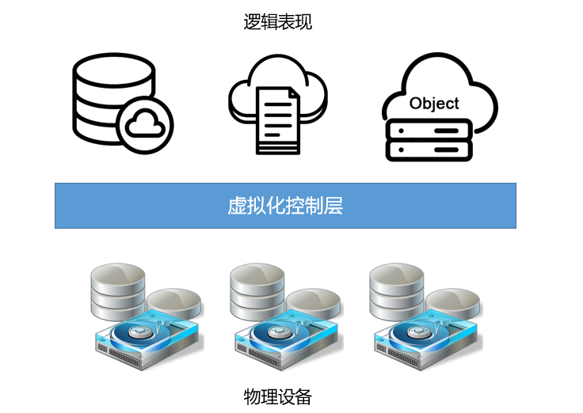
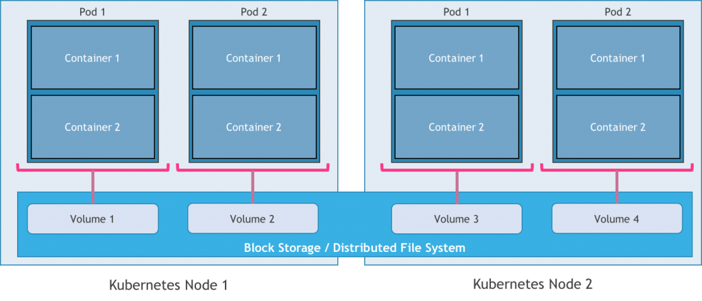
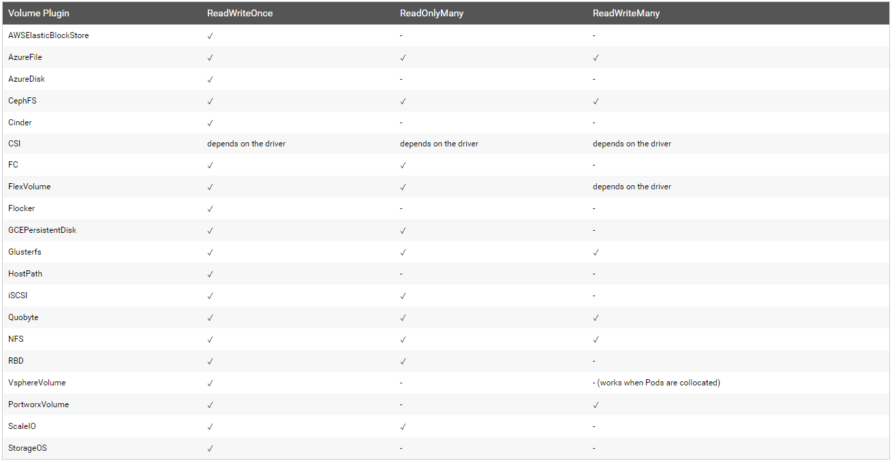
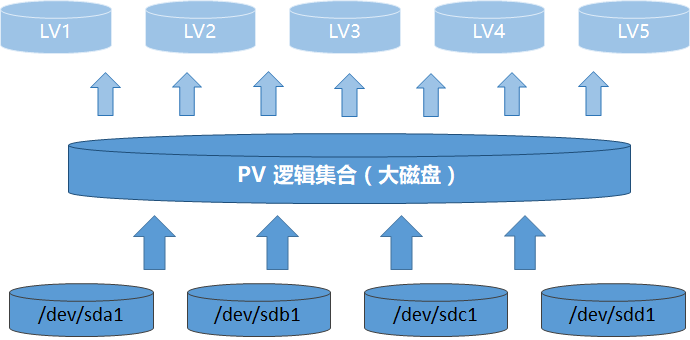
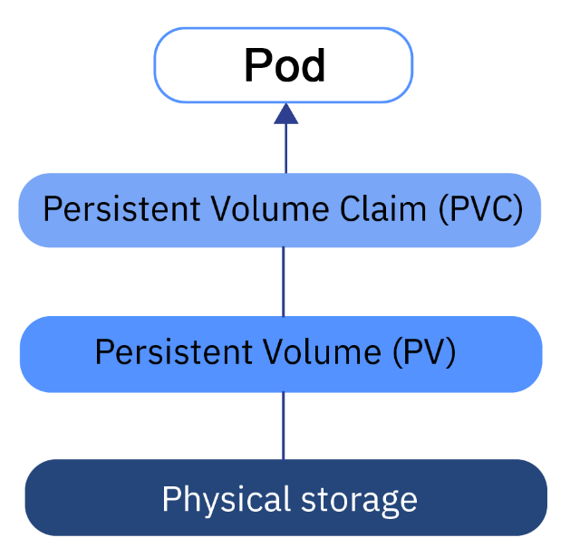
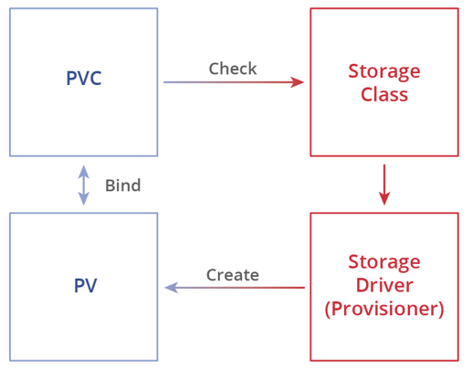
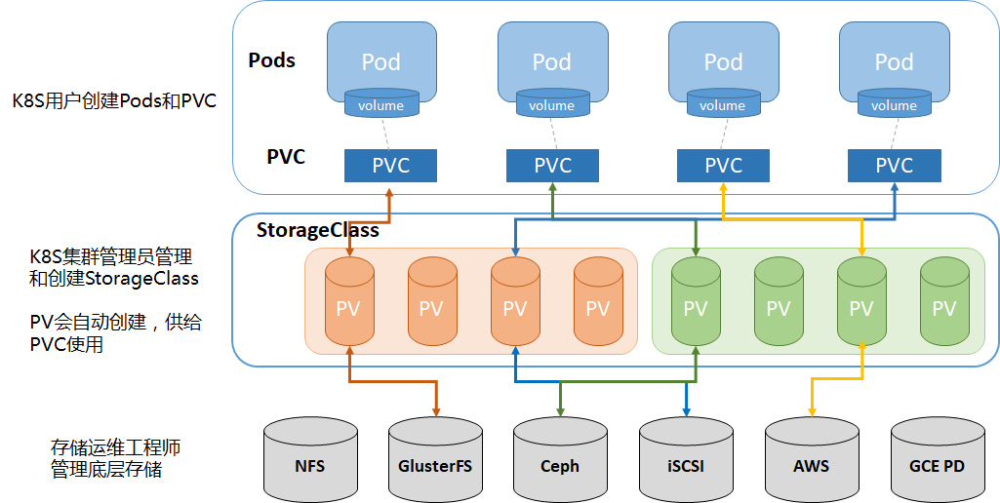
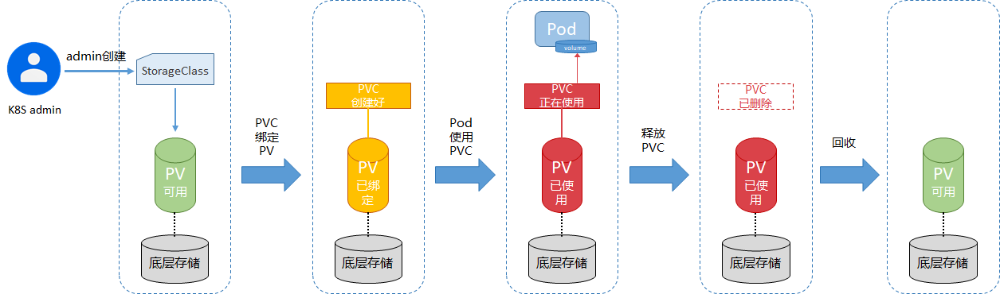
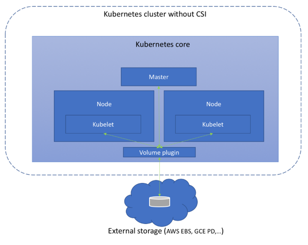
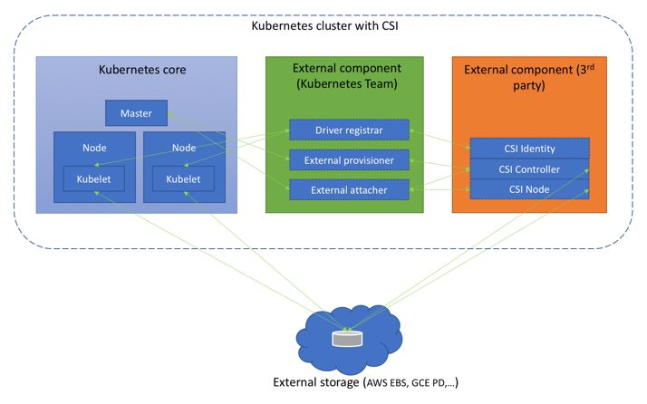

# K8s系列文章 - 存储实现

原文：https://cloud.tencent.com/developer/article/1609512


### 目录

- 一、存储虚拟化介绍
  - 存储I/O虚拟化
  - 当前主流存储虚拟化方式
  - 存储虚拟化的价值
- 二、Kubernetes存储机制设计
  -  PV
  - PVC
  - StorageClass
  - PV、PVC、StorageClass之间关系
- 三、Kubernetes CSI
  - 为什么要发展CSI
  - CSI 架构
  - CSI新特性
  - 总结


## 一. 存储虚拟化介绍

在虚拟化领域有这么一个故事：一个好的虚拟化解决方案就好像游历一个虚拟现实的主题公园。当游客想象他正在城市上空滑翔时，传感器就会把相应的真实感觉传递给游客，并同时隐藏真实的力学环境。这好比黑客帝国里，虚拟世界里的人完全感受不到我是在虚拟的环境中。

基于上面的故事，存储的虚拟化要解决的是上层的用户对底层硬盘、磁带完全不可知。屏蔽掉底层复杂的物理设备后，把零散的硬件存储资源抽象成一个“存储池”，这个“存储池”能灵活的分配给用户。



SNIA(存储网络工业协会，非盈利行业组织)对存储虚拟化的定义：通过对存储(子)系统或存储服务的内部功能进行抽象、隐藏或隔离，进而使应用、服务器、网络等资源进行分离，从而实现这些资源的独立管理。

目前这个定义是相对权威和中立的，里面说的“抽象”可以理解为是对底层硬件存储资源的共同属性的整合，把所有存储资源抽象成一个虚拟的存储池；“隐藏”意思是对于上层用户底层的硬件需要屏蔽掉，让用户不需要关心底层；“隔离”的意思是虚拟的存储池资源需要根据上层用户的需求划分成小块，块与块之间相互独立相互不影响。

抽象->隐藏->隔离，这三步是存储虚拟化机制要达到的最基本要求，实现了这三步能实现设备使用效率提升、实现统一数据管理、实现设备构件化、实现数据跨设备流动、提高可扩展性、降低数据管理难度等功能。

### 1.1 存储I/O虚拟化

I/O虚拟化是存储虚拟化的基石，I/O虚拟化的优劣将直接影响整体存储虚拟化方案的好坏。I/O的虚拟化跟CPU虚拟化一样经历过全虚拟、半虚拟、硬件辅助虚拟的过程。全虚拟化模式，全部处理请求要经过VMM，这就让I/O路径变得很长，造成的结果就是性能大大降低。所以，后面改进出现了半虚拟化I/O技术 -- virtio（Virtual I/O Device）。Virtio是前后端架构，相关请求路径减少了很多，但还是需要经过VMM和Kernel的，性能或多或少还是会损耗。到最后，英特尔推出了硬件辅助式的VT-D技术，这项技术极大的减少了VMM参与I/O请求操作，让路径变得更短，而且还提供了专门的内存空间处理I/O请求，性能得到了最大的提升。

### 1.2 当前主流存储虚拟化方式

目前存储虚拟化方式主要有三种，分别是：基于主机的存储虚拟化、基于网络的存储虚拟化、基于存储设备的存储虚拟化。这三种存储虚拟化方式各有优劣，我们可以用下面的表格来清晰的观察：

|     名称     | 定义                                                       | 实现方式                                                     | 优势                                                         | 劣势                                                         |
| :----------: | :--------------------------------------------------------- | :----------------------------------------------------------- | :----------------------------------------------------------- | :----------------------------------------------------------- |
|   基于主机   | 安装在一个或多个主机上，实现存储虚拟化的控制和管理。       | 一般是操作系统下的逻辑卷管理软件实现，不同操作系统下，逻辑卷管理软件也不同。 | 支持不同架构的存储系统。                                     | 占用主机资源、可扩充性较差、性能不是很好、存在操作系统和存储管理应用之间兼容性问题、需要复杂的数据迁移过程、影响业务连续性。 |
|   基于网络   | 基于网络的虚拟化方法是在网络设备之间实现存储虚拟化功能。   | 通过存储网络（一般是SAN网络）中添加虚拟化引擎实现。          | 与主机无关，不占用主机资源；支持不同主机、不同存储设备；有统一的管理平台、扩展性好。 | 厂商之间不同存储虚拟化产品性能和功能参差不齐，好的产品成本高、价格贵。 |
| 基于存储设备 | 基于存储设备的存储虚拟化方法依赖于提供相关功能的存储模块。 | 在存储控制器上添加虚拟化功能。                               | 与主机无关，不占用主机资源；数据管理功能丰富。               | 不同厂商间的数据管理功能不相互兼容；多套存储设备需要多套数据管理软件，成本高。 |

### 1.3 存储虚拟化的价值

据统计，存储的需求量年增长率达50%~60%。面对新的技术应用以及不断增加的存储容量，企业用户很需要虚拟化技术来降低管理的复杂性，同时提高效率。据有关报告表明，过早的采用存储虚拟化能在原来的存储成本上降低至少50%的成本。但是，从目前企业对存储掌握形式来看，很多企业还遇到很多问题，总结起来有三点：

* 一是存储数据的成本在不断地增加；
* 二是数据存储容量爆炸性增长；
* 三是越来越复杂的环境使得存储的数据无法管理

存储虚拟化首先要解决的难题就是不同架构平台的数据管理问题。数据管理没有有效便捷的方法，那么对数据的安全性会产生很大的威胁。当前云时代背景下，大部分客户已选择上云（公有云or私有云），这也是让存储走向虚拟化的一个表现。云环境下，公有云厂商有自己很强的存储虚拟化技术体系来支撑用户需求，私有云下当前的ceph和glusterfs技术也很好的解决了这个问题。

## 二. Kubernetes存储机制设计

前面有提到过，企业选择虚拟化技术能大大的降低IT成本。K8S是容器资源调度管理平台，因此它也是虚拟化资源的管理平台。存储虚拟化资源在K8S下是如何运作和管理的，接下来加以讲述。

在传统虚拟机模式下，存储可以分配块存储、文件存储挂载到VM里面供给使用。同理，在容器K8S模式下，Pod也需要存储资源来实现数据的持久化。在K8S里，**存储资源是以数据卷volume的形式与Pod做绑定**。底层通过块存储和分布式文件系统来提供数据卷volume，而块存储和分布式文件系统上面第一点提到过，这些需要更底层的存储虚拟化机制来实现。



那么K8S到底是通过什么机制方式把底层块存储或分布式文件系统做成一份份的volume给到Pod使用呢？接下来通过PV、PVC、StorageClass等概念给出说明。

### 2.1 PV

PV是 Persistent Volume 的缩写，Persistent是持续的意思，因此PV可以解释为“持久化的数据卷”。PV是对底层共享存储资源的抽象，它能对接多种类型的存储实现类型，主要有：Ceph、Glusterfs、NFS、vShpereVolume（VMWare存储系统）、Local（本地存储设备）、HostPath（宿主机目录）、iSCSI、FC（光纤存储设备）、AWSElasticBlockStore（AWS弹性块设备）、AzureDisk（微软云Disk）、AzureFile（微软云文件）、GCEPersistentDisk（谷歌云永久次盘）。

​        PV代表着K8s对存储能力、访问模式、存储类型、回收策略、后端存储类型等机制体现。定一个PV，可以参考：

```yaml
apiVersion: v1
kind: PersistentVolume
metadata:
  name: pv0003                               //定义PV的名字
spec:
  capacity:
    storage: 5Gi                             //定义了PV为5GB
  volumeMode: Filesystem                     //定义volume模式类型
  accessModes:
    - ReadWriteOnce                          //定义读写权限, 并且只能被单个node挂载
  persistentVolumeReclaimPolicy: Recycle     //定义回收策略
  storageClassName: slow                     //定义storageClass名字
  mountOptions:
    - hard                                   //定义NFS挂载模式，硬挂载
    - nfsvers=4.1                            //定义NFS的版本号
  nfs:
    path: /tmp                               //定义NFS挂载目录
    server: 172.17.0.2                       //定义NFS服务地址
```

同样的，当第一次写PV的YAML可能不清楚到底有哪些关键参数，因此下面整理了PV的关键配置参数，读者可以参考：

|    类型    |     参数名     | 说明                                                         |
| :--------: | :------------: | :----------------------------------------------------------- |
|  存储能力  |    Capacity    | 描述存储设备具备的能力，目前仅支持对存储空间的设置 （storage=xx），未来可能加入IOPS、吞吐率等指标的设置。 |
| 存储卷模式 |  Volume Mode   | Kubernetes从1.13版本开始引入存储卷类型的设置 （volumeMode=xxx），可选项包括Filesystem（文件系统）和Block（块 设备），默认值为Filesystem。 |
|  访问模式  |  Access Modes  | 对PV进行访问模式的设置，用于描述用户的应用对存储资源的访 问权限。                                                                                                 ReadWriteOnce（RWO）：读写权限，并且只能被单个Node挂 载。                                                                                                         ReadOnlyMany（ROX）：只读权限，允许被多个Node挂载。 ReadWriteMany（RWX）：读写权限，允许被多个Node挂载。                                                                  这里要注意，不同的存储类型，访问模式是不同的，具体可以参考下面的表 |
|  存储类别  |     Class      | PV可以设定其存储的类别，通过storageClassName参数指定一个 StorageClass资源对象的名称（StorageClass会预先创建好，指定一个名字）。具有特定类别的PV只能与请求了该类别的PVC进行绑定。未设定类别的PV则只能与不请求任何类别的PVC进行绑定。 |
|  回收策略  | Reclaim Policy | 通过PV定义中的persistentVolumeReclaimPolicy字段进行设置，可 选项如下： Retain 保留：保留数据，需要手工处理。 Recycle 回收空间：简单清除文件的操作（例如执行rm -rf /thevolume/* 命令）。 Delete 删除：与PV相连的后端存储完成Volume的删除操作。 目前，只有NFS和HostPath两种类型的存储支持Recycle策略；AWS EBS、GCE PD、Azure Disk和Cinder volumes支持Delete策略。 |
|  挂载参数  | Mount Options  | 在将PV挂载到一个Node上时，根据后端存储的特点，可能需要设 置额外的挂载参数，可以根据PV定义中的mountOptions字段进行设置。 |
| 节点亲和性 | Node Affinity  | 可以设置节点亲和性来限制只能让某些Node访问Volume，可 以在PV定义中的nodeAffinity字段进行设置。使用这些Volume的Pod将 被调度到满足条件的Node上。 |

每种存储类型的访问模式是否支持是不同的，不支持的需要看“ depends on the driver” 意思是取决具体的驱动能力。



另外，PV的生命周期也是需要关注，这个在问题排障查看相关PV那时的状态非常有用。

|  状态名   | 描述                                               |
| :-------: | :------------------------------------------------- |
| Available | 可用状态，还未与某个PVC绑定。                      |
|   Bound   | 已与某个PVC绑定。                                  |
| Released  | 绑定的PVC已经删除，资源已释放，但没有被集群 回收。 |
|  Failed   | 自动资源回收失败。                                 |

### 2.2 PVC

PVC是Persistent Volume Claim 的缩写，多了一个Claim（声明、索要、申请）。**PVC实则是在PV基础上的资源申请**。那么有了PV为何还要用PVC呢？因为PV一般是由运维人员设定和维护，PVC则是由上层K8S用户根据存储需求向PV侧申请，可以联想下Linux下的LVM，***K8S里的PV好比LVM的物理卷（PV），K8S里的PVC好比LVM里的逻辑卷（LV）***。



​                                                                                                LVM逻辑架构



​                                                                                                PV与PVC的关系

PVC的申请也是配置YAML，举例如下：

```yaml
apiVersion: v1
kind: PersistentVolumeClaim
metadata:
  name: myclaim              //设置PVC的名字
spec:
  accessModes:
    - ReadWriteOnce          //设置访问模式
  volumeMode: Filesystem     //定义volume模式类型
  resources:
    requests:
      storage: 8Gi           //设置PVC的空间大小
  storageClassName: slow     //设置存储类别为slow，注意PVC这里一般跟storageClass结合
  selector:
    matchLabels:
      release: "stable"      //匹配标签stable
    matchExpressions:
      - {key: environment, operator: In, values: [dev]}  //同时包含environment环境有[dev]的标签
```

PVC是用户对存储空间请求、访问模式、PV选择、存储类别等信息设定的机制，它的YAML关键参数如下：

|           类型            |       参数名        | 说明                                                         |
| :-----------------------: | :-----------------: | :----------------------------------------------------------- |
|         资源申请          |      Resources      | 描述对存储资源的请求，申请多大的资源空间大小，目前仅支持request.storage的设置。 |
|         访问模式          |    Access Modes     | 设置访问模式，用于设置app对存储资源的访问权限：ReadWriteOnce（RWO）：读写权限                                                    ReadOnlyMany（ROX）：只读权限 ReadWriteMany（RWX）：读写权限 |
|        存储卷模式         |    Volume Modes     | PVC也可以设置存储卷模式，用于描述希望使用的PV存储卷模式，两种选择：文件系统Filesystem和块设备Block。 |
|        PV选择条件         |      Selector       | 通过对Label  Selector的设置，可使PVC对于系统中已存在的各种PV进行过滤筛选。目前有两种方式：matchLabels（该卷必须带有此值的标签）；matchExpressions（通过指定key，值列表以及与键和值的运算符得出的要求列表。 运算符包括In，NotIn，Exists和DidNotExist） |
|         存储类别          |        Class        | 通过设置storageClassName指定StorageClass的名称来请求特定的StorageClass。 只能将所请求类的PV（具有与PVC相同的storageClassName的PV）绑定到PVC。 |
| 未启用DefaultStorageClass |  storageClassName   | 等效于PVC设置storageClassName 的值为空（storageClassName=""），即只能选择未设定Class的PV与之 匹配和绑定。 |
|  启用DefaultStorageClass  | DefaultStorageClass | 要求集群管理员已定义默认的StorageClass。如果在系统中不存在默认的StorageClass，则等效于不启用DefaultStorageClass的情况。如果存在默认的StorageClass，则系统将自动为PVC创建一个PV（使用默认StorageClass的后端存储），并将它们进行绑定。集群管理员设置默认StorageClass的方法为，在StorageClass的定义中加上一个annotation“storageclass.kubernetes.io/is-default-class= true”。如果管理员将多个StorageClass都定义为default，则由于不唯一，系统将无法为PVC创建相应的PV。 |

PVC目前一般会跟StorageClass一起结合使用，关于StorageClass的讲解，具体请看接下来的第2.3。

### 2.3 StorageClass

在K8S里，**存储资源的供给分为两种模式，一种是静态模式，另外一种是动态模式**。静态模式是K8S集群管理员（一般是运维人员）手工创建和设置好后端存储特性的PV，然后PVC再申请使用。动态模式是集群管理员无需手工创建和设置好PV，这里集群管理将定义好不同类型的StorageClass，StorageClass会早早的与后端存储类型做好关联；待用户创建PVC后，系统将自动完成PV的创建还有PVC的绑定。在自动化成熟趋势发展的今天，基本上手动不灵活的方式都会被替代舍弃，静态模式在集群规模小、架构简单的测试环境下可以采用，但是面对规模宏大、架构复杂的环境，就需要动态的管理方式。

下面是定义一个StorageClass的YAML文件：

```yaml
apiVersion: storage.k8s.io/v1
kind: StorageClass      
metadata:
  name: standard                     //定义StorageClass的名字为standard
provisioner: kubernetes.io/aws-ebs   //定义后端存储驱动，这里用的是AWS的ebs盘
parameters: 
  type: gp2                          //aws的磁盘有5种类型，gp2是其中一种，这里定义的类型是gp2
reclaimPolicy: Retain                //设置PV的数据回收策略，默认DELETE，这里设置的是Retain（保留，K8S 1.8版以后才支持）
allowVolumeExpansion: true           //设置只有从StorageClass中创建的PVC才允许使用卷扩展
mountOptions:
  - debug
volumeBindingMode: Immediate         //设置何时应进行卷绑定和动态预配置，Immediate（立即的）
```


集群管理员预先定义好StorageClass，后面创建PVC的时候，有符合条件的StorageClass将自动创建好PV与PVC绑定使用。

* StorageClass的YAML关键参数关键有两大块，一个是Provisioner，另外一个是Parameters。

* Provisioner：K8S底层存储资源的提供者，其实就是后端存储的类型；这里定义的时候需要以kubernetes.io开头，后面接上存储类型。

* Parameters：后端存储的类型的具体参数设置，这里不同的存储类型参数也不一样。

* StorageClass YAML文件Parameters参数那块定义比较复杂，想清楚了解具体怎么设置，比如Glusterfs、Ceph RBD 、Openstack Cinder的StorageClass参数是怎样的，可以参考官网文档的YAML例子：https://kubernetes.io/docs/concepts/storage/storage-classes/

### 2.4 PV、PVC、StorageClass之间关系

前面我们详细了解了PV、PVC、StorageClass的相关信息，那么它们三者之间的关系通过几张图从高维度来整体认识下。

首先是它们之间相互依赖的关系，可以通过下面的一张图很清晰的了解它们的关系。



其次是它们总体的架构层次关系，可以看下面的图来理解：



​        

最后是它们的生命周期，这个也需要了解：



K8S里只要掌握了StorageClass、PVC、PV的定义和设置，搞清楚它们之间的内在关系和生命周期，那么K8S存储这块基本就了解了。当然，关于这块的一些性能上的优化，具体还得看底层存储的能力。当前云环境下，底层存储各具特色，各大云厂商有自己的实现机制和性能特色；私有云下，在完善底层硬件性能的同时，通常IAAS层都会采用ceph来做分布式存储，进而再给PAAS层使用。

## 三. Kubernetes CSI

学习K8S网络的时候有了解过CNI，那么在存储这一块，K8S也有一套接口管理规范机制，那就是CSI。CSI是“Container Storage Interface” 的缩写，中文意思就是“容器存储接口”。CNI是为了统一网络规范接口的，CSI自然是想统一标准化存储方面的接口，方便管理。

### 3.1 为什么要发展CSI

CSI v1.0版本是在2017年12月发布的。在没有CSI之前，K8S已经提供了功能强大的卷插件机制（In-tree Volume Plugin 和 Out-of-tree Provisioner），但由于In-tree的这种模式代码主要是K8S维护，这意味着插件的代码是Kubernetes核心代码的一部分，并会随核心Kubernetes二进制文件一起发布。 此外，第三方插件代码在核心Kubernetes二进制文件中可能会引起可靠性和安全性问题，由于代码的审核和测试又是K8S侧人员做的，对于第三方插件代码因为不熟等原因，有些错误是很难发现的。



​                                                                                                *没CSI之前的K8S集群*

因此，CSI的出现非常有必要。CSI的设计目的是定义一个行业标准，该标准将使第三方存储提供商能够自己实现、维护和部署他们的存储插件。借助CSI，第三方存储提供商而无需接触K8S的核心代码。这为K8S用户提供了更多的存储选项，并使系统更加安全可靠。

### 3.2 CSI架构

CSI目前包括三部分：Identity、Controller、Node

- CSI Identity的主要功能是负责认证插件的状态信息。
- CSI Controller的主要功能是对存储资源和存储卷进行管理和操作。
- CSI Node的主要功能是对Node上的Volume进行管理和操作。



​                                                                                                *有CSI下的K8S集群*

### 3.3 CSI新特性

CSI目前已经GA，目前CSI有如下几点功能的改进：

- Kubernetes当前与CSI的规范v1.0和v0.3版本兼容（取代CSI v0.2）。 CSI v0.3.0跟v1.0.0之间有重大的变化，Kubernetes v1.13同时支持这两个版本； 随着CSI 1.0 API的发布，K8S不在支持低于和等于v0.3的CSI API的驱动程序，K8S v1.15后会彻底不支持； CSI v0.2和v0.3之间没有重大变化，因此v0.2驱动程序可以跟K8S v1.10.0+ 集合使用； CSI v0.1和v0.2之间有重大变化，因此，在使用K8S v1.10.0+ 之前的版本，必须将非常老的CSI 0.1的驱动程序更新为至少兼容0.2。
- Kubernetes VolumeAttachment 对象（在storage v1alpha1 group v1.9中引入，并已添加到v1beta1 group v1.10）已添加到storage v1 group v1.13中。
- Kubernetes CSIPersistentVolumeSource 卷类型已提升为GA。
- kubelet发现新的CSI驱动程序方法：“Kubelet设备插件注册机制”，已在Kubernetes v1.13中GA。