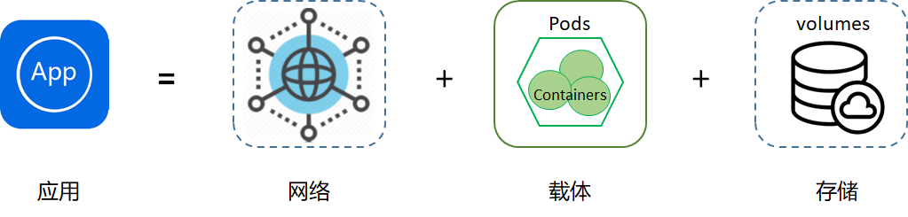

# K8s系列文章 - 五种控制器

原文：https://cloud.tencent.com/developer/article/1493250

### 目录

1. 为什么要有控制器
2. K8s有哪些控制器


## 一. 为什么要有控制器

​        K8s是容器资源管理和调度平台，容器跑在Pod里，Pod是K8s里最小的单元。所以，这些Pod作为一个个单元，肯定需要操作它们的状态和生命周期。那么如何操作呢？就是用到了控制器。

​        这里有一个通俗的“公式”：***应用APP = 网络 + 载体 + 存储***



​        应用一般分成这么几种：无状态、有状态、守护型、批处理型。

* **无状态应用**：应用实例不涉及事物交互，不产生持久化数据存储在本地，并且多个应用实例对于同一个请求响应的结果完全一致。例如：Nginx
* **有状态应用**：有状态服务可以说是需要数据存储功能的服务或者多线程类型的服务、队列等。例如：mysql、kafka、redis等
* **守护型应用**：类似守护进程一样，长期保持运行、监听，持续提供服务。例如：Ceph、logstash等
* **批处理应用**：工作任务型的服务，通常是一次性的。例如：批量修改文件名

​        这些类型的应用服务如果是安装在传统的物理机或者虚拟机上，那么一般会通过人肉方式或自动化工具去管理编排。但是这些服务一旦容器化跑到了Pod里，就应该按照K8s的控制方式来管理。

## 二. K8s有哪些控制器

​        既然应用的类型有上面说的这些无状态、有状态的，那么K8S肯定要实现一些控制器来专门处理对应类型的应用。总体来说，K8S有五种控制器，分别对应处理无状态应用、有状态应用、守护型应用和批处理应用。

### 2.1 Deployment

​        Deployment中文意思为部署、调度，通过Deployment能操作RS（ReplicaSet），可以简单的理解为它是一种通过yml文件的声明，在Deployment 文件里可以定义Pod数量、更新方式、使用的镜像，资源限制等。**无状态应用都用Deployment来创建**，例：

```yaml
apiVersion: extensions/v1beta1
kind: Deployment   # 定义是Deployment
metadata:
  name: nginx-deployment
spec:
  replicas: 2
  template:
    metadata:
      labels:
        app: nginx
    spec:
      containers:
      - name: nginx
        image: nginx:1.8.0
        ports:
        - containerPort: 80
```

### 2.2 StatefulSet

​        StatefulSet的出现是K8S为了解决 “有状态” 应用落地而产生的，Stateful这个单词本身就是“有状态”的意思。之前大家一直怀疑有状态应用落地K8S的可行性，StatefulSet很有效解决了这个问题。有状态应用一般都需要具备一致性，它们有固定的网络标记、持久化存储、顺序部署和扩展、顺序滚动更新等等。总结两个词就是需要：**稳定、有序**。

​        那么StatefulSet如何做到Pod的稳定、有序？具体有了哪些内在机制和方法？主要概况起来有这几个方面：

- 给Pod一个唯一和**持久**的标识（例:Pod name）
- 给予Pod一份**持久化存储**
- 部署Pod都是顺序性的，[0, N)
- 扩容Pod**必须**前面的Pod还存在着
- 终止Pod，**后面Pod也一并终止**

​        举个例子：创建了zk01、zk02、zk03 三个Pod，zk01就是给的命名，如果要扩容zk04，那么前面01、02、03必须存在，否则不成功；如果删除了zk02，那么zk03也会被删除。

### 2.3 DaemonSet

​        Daemon本身就是守护进程的意思，那么很显然DaemonSet就是K8S里实现守护进程机制的控制器。比如要在每个node里部署fluentd采集容器日志，那么完全可以采用DaemonSet机制部署。它的作用就是能确保全部（或者指定的node数里）运行一个fluentd Pod副本。当有 node加入集群时，也会为他们新增一个 Pod 。当有 node从集群移除时，这些 Pod 也会被回收。删除 DaemonSet 将会删除它创建的**所有** Pod。

​        所以，DaemonSet 特别适合运行那些静默后台运行的应用，而且是连带性质的，非常方便。

### 2.4 Job

​        Job就是任务，如果用批处理，则批处理的运行一些自动化脚本或者跑下ansible也是经常的事儿。而在K8S里运行批处理任务，用Job即可。执行一次的任务，它保证批处理任务的一个或多个Pod成功结束。

### 2.5 CronJob

​        在IT环境里，经常遇到一些需要定时启动运行的任务。传统的Linux里、执行定义crontab即可。在K8S里就可以用到CronJob控制器。其实它就是上面Job的加强版，带时间定点运行的。

​        例子：每一分钟输出一句，2019-08-25 08:08:08 Hello K8S！

```yaml
apiVersion: batch/v1beta1
kind: CronJob  # 定义CronJob类型
metadata:
  name: hello
spec:
  schedule: "*/1 * * * *"   # 定义定时任务运行
  jobTemplate:
    spec:
      template:
        spec:
          containers:
          - name: hello
            image: busybox
            args:
            - /bin/sh
            - -c
            - date; echo Hello K8S!
          restartPolicy: OnFailure
```

### 2.6 总结

​        以上就是K8S五种控制器的介绍，这五种控制器的存在对标的就是四种类型应用的编排处理。有人会问这五种控制器到底怎么用呢？很简单，还是通过编写运行YAML文件来操控。网上有很多控制器运行的YAML例子，你参考一个部署一个，基本其他的也会了。