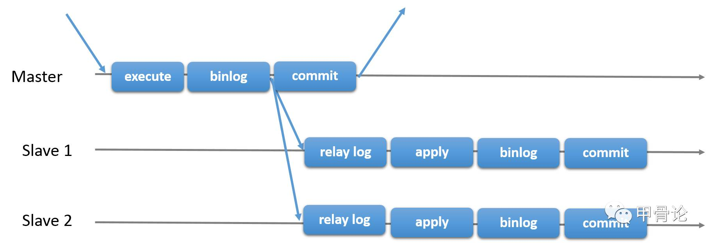
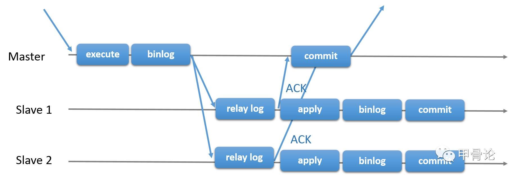
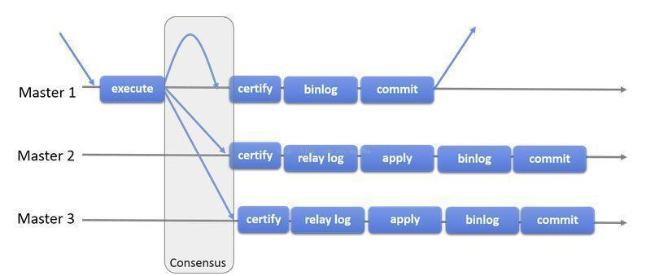
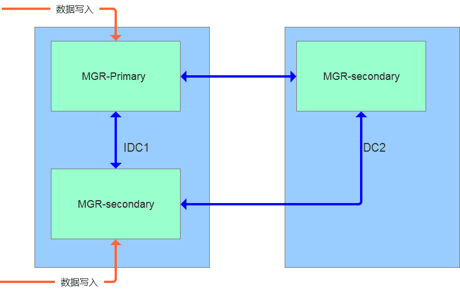
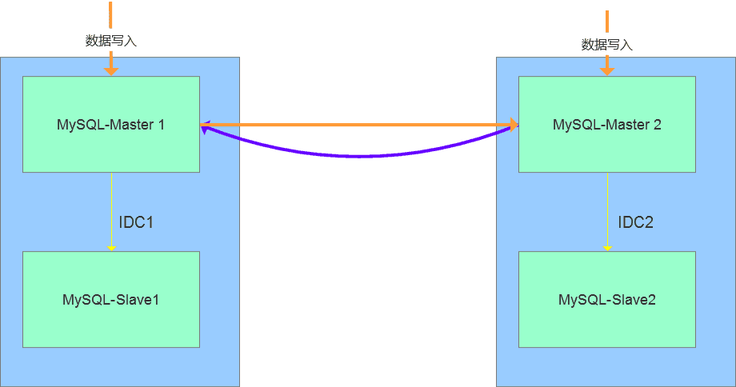
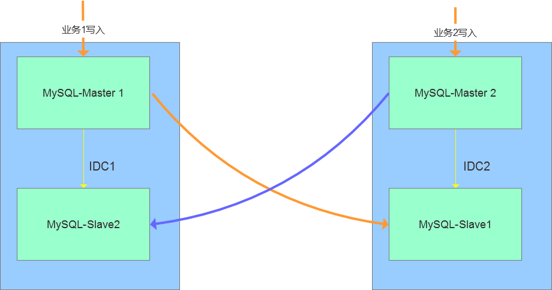

# MySQL MGR 集群原理

原文：https://www.jianshu.com/p/b9831f15e10c

## 一、MGR简介

MGR全称MySQL Group Replication（Mysql组复制），是MySQL官方于2016年12月推出的一个全新的高可用与高扩展的解决方案。MGR提供了高可用、高扩展、高可靠的MySQL集群服务。在MGR出现之前，用户常见的MySQL高可用方式，无论怎么变化架构，本质就是Master-Slave架构。MySQL 5.7版本开始支持无损半同步复制（lossless semi-syncreplication），从而进一步提示数据复制的强一致性。

MySQL Group Replication（MGR）是MySQL官方在5.7.17版本引进的一个数据库高可用与高扩展的解决方案，以插件形式提供。**MGR基于分布式paxos协议，实现组复制，保证数据一致性**。**内置故障检测和自动选主功能**，只要不是集群中的大多数节点都宕机，就可以继续正常工作。**提供单主模式与多主模式，多主模式支持多点写入**。

> 捷信采用的是“多主模式”，支持多点写入。

## 二、MGR原理

在MySQL 5.7.17版本正式推出组复制(MySQL Group Repliation MGR)，用来解决异步复制和半同步复制可能产生数据不一致的问题，组复制依靠分布式一致性协议(Paxos协议变体)来实现"数据最终一致性"，并提供单主模式下自动选主的高可用解决方案。

### 2.1 异步复制数据同步方式

### 2.2 半同步复制数据同步方式（After Sync）

### 2.3 组复制数据同步方式

组复制是一种可用于实现容错系统的技术。复制组是一个通过消息传递相互交互的 Server 集群。复制组由多个 Server 成员组成，如下图的 Master1、Master2、Master3，所有成员独立完成各自的事务。

当客户端发起一个更新事务时，该事务先在本地执行，执行完成之后就要发起对事务的提交操作。在还没有真正提交之前，需要将产生的复制写集广播出去，复制到其他成员。如果冲突检测成功，组内决定该事务可以提交，其他成员可以应用，否则就回滚。

最终，所有组内成员以相同的顺序接收同一组事务。因此，组内成员以相同的顺序应用相同的修改，保证组内数据强一致性。

## 三、MGR特点

* **高一致性**。基于原生复制及 Paxos 协议的组复制技术，并以插件的方式提供，提供一致数据安全保证
* **高容错性**。只要不是大多数节点坏掉就可以继续工作。有自动检测机制，当不同节点产生资源争用冲突时，不会出现错误，按照先到者优先原则进行处理，并且内置了自动化脑裂防护机制
* **高扩展性**。节点的新增和移除都是自动的，新节点加入后，会自动从其他节点上同步状态，直到新节点和其他节点保持一致。如果某个节点被移除了，其他节点自动更新组信息，自动维护新的组信息
* **高灵活性**。有单主模式和多主模式。单主模式下，会自动选主，所有更新操作都在主上进行；多主模式下，所有 server 都可以同时处理更新操作。

## 四、使用限制

### 4.1 仅支持 InnoDB引擎

为什么需要使用 InnoDB 引擎呢？在 MySQL Group Replication 中，事务以乐观形式执行，但是在提交时检测冲突，如果存在冲突，则会在某些实例上回滚事务，保持各个实例的数据一致性，那么就需要使用到事务存储引擎，同时 InnoDB 提供一些额外的功能，可以更好的管理和处理冲突，所以建议业务使用 InnoDB 存储引擎，类似于系统表格mysql.user 使用。MyISAM 引擎的表格，因为极少修改及添加，极少出现冲突情况。

### 4.2 主键

每个需要复制的 Table 都必须顶一个显式主键，注意，跟隐式主键区分（使用 InnoDB 引擎的Table，如果没有指定主键，默认选择第一个非空的唯一索引作为主键；如果没有，则自动创建一个 6 个字节的 rowid 隐式主键）。这个主键能在冲突发生时启动极其重要的作用，同时，能够有效提高 relay log 的执行效率。

### 4.3 隔离级别

官网建议使用 **READ COMMITTED** 级别，除非应用程序依赖于 REPLEATABLE。

READ，RC模式下没有 GAP LOCK，比较好支持 InnoDB 本身的冲突检查机制和组复制的内容分布检测机制一起协同工作。

不支持 SERIALIZABLE 的隔离级别。

### 4.4 外键

不建议使用**级联**外键。如果旧库本身有外键，业务上无法去除并且使用的是多主模式，那么，请配置 group_replication_enforce_update_everywhere_check，强制检查每个组成员的级联检查，避免多主模式下执行级联操作造成的检测不到的冲突 。

## 五、参数规范

因前期创建实例大多采取默认配置 导致开发，测试，生产等环境间数据库参数不同 对程序运行有一定的影响。 以后创建实例将会参数规范化 对已有的实例后续也会慢慢修正。

下面简单解释下几个改动的参数

sql_mode 去除了ONLY_FULL_GROUP_BY, STRICT_TRANS_TABLES,NO_ZERO_IN_DATE, NO_ZERO_DATE等限制 采取了较为宽松的模式

lower_case_table_names 统一设置为1 即不区分大小写 有些实例还没更改 大家建表建库的时候不要大写

character-set-server 统一设置为utf8 不要用latin1字符集

wait_timeout和interactive_timeout参数控制空闲连接的时长 当连接空闲时间超过此参数则会被断开 以后会统一设置为1800s即30分钟

transaction_isolation 事务隔离级别 MySQL官方默认是可重复读（repeatable-read）目前单实例及主从架构的mysql采用了此级别，MGR集群将采取读已提交（read-committed）级别。Oracle默认是读已提交 。

## 六、两地三中心

随着互联网业务快速发展，多IDC的业务支撑能力和要求也逐步提升，行业内的“两地三中心”方案较为流行。其中**两地**是指同城、异地；**三中心**是指生产中心、同城容灾中心、异地容灾中心。

两地三中心方案中，基于设定的短期目标可以明确同城双活和异地容灾的方案组合。设计重点为同城双活，即在同城的数据中心之间，一般通过高速光纤相连，在网络带宽有保障的前提下，网络延迟一般在可接受范围内，两个机房之间可以认为在同一个局域网内。

在设计上可以和应用层结合起来，有两种部署模式：分为**应用层双活和数据库双活，应用层双活和数据库单活**。

### 6.1 MGR 集群多活架构

基于 MGR 的多活特性，数据的写入可以在多个节点之间进行复制，实现数据强一致性需求，并且在节点间通信出现延迟的情况下，会自动实现服务降级。对于此类方案，可以采用同机房多写，同城异机房只读的方案。

### 6.2 双主模式的多活

两个节点均可以写入数据，可以实现跨机房的数据复制，延迟较低，**在业务层需要做隔离**，在故障发生时能够快速切换到同机房的 Slave 节点。此方案对于两个 IDC 机房的场景中较为实用，但是机房多活的场景不适合。

### 6.3 业务交叉的双活方案

此方案是双活技术的变通实现，即存在两类业务A和B，数据存储在 database 级别（schema 层级），分别在不同的 IDC 节点完成数据写入，比如业务A在 IDC1 完成写入，业务B在 IDC2 完成写入。两个节点之间存在跨机房的复制节点，在出现问题时，能够通过域名的方式切换到指定的 IDC 节点。此方案对于业务的依赖较高，不适合机房的多活的场景。

