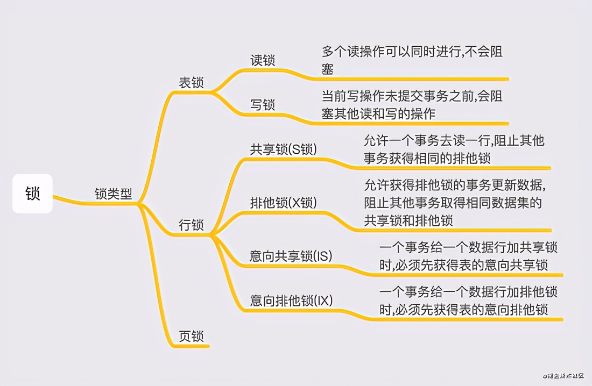

# MySql并发事务处理细节

原文： https://www.toutiao.com/a6936183596617204257/

## 事务的特性与隔离级别

在讲锁之前，必须要先聊聊 **「 事务的特性与隔离级别 」** ，因为锁机制的存在是为了保证事务对应隔离级别下的特性。

### 事务的特性

事务具有以下几个特性：

### 事务隔离级别

#### RU(读-未提交)

顾名思义，在这种隔离级别下，当多个事务并行对同一数据进行操作时，会读取未提交的数据，也被称之为 **「 脏读 」** 。

这种隔离级别因为会出现脏读现象，所以在实际场景中很少用。

#### RCI(读-提交)

一个事务只能看见已经提交事务所做的改变。

但这种隔离级别会出现 **「 不可重复读 」** 现象，即在一个事务内，多次读同一数据，在这个事务还没有结束时，如果另一个事务恰好修改了这个数据，那么，在第一个事务中，两次读取的数据就可能不一致。

#### RR(可重复读)

这是MySQL的 **「 默认事务隔离级别 」** ，在这种隔离级别下，解决了RCI存在的不可重复读问题，确保在同一事务中，会看到同样的数据行。

但可能会出现 **「 幻读 」** ，即当一个事务在执行读取操作，第一次查询数据总量后，另一个事务执行了新增数据的操作并提交后，这个时候第一个事务读取的数据总量和之前统计的不一样，就像产生幻觉一样。

#### SERIALIZABLE (串行化)

此隔离级别是四种隔离级别中最高的级别，解决了 **「 脏读、可重复读、幻读 」** 的问题。

但是性能最差，它将事务的执行变为顺序执行，与其他三个隔离级别相比，在并行事务执行过程中，后一个事务的执行必须等待前一个事务结束。

## MySql中各种类型的锁

#### 在MySQL中，按锁类型划分，有以下种类

提到锁到种类，需要提一下MySQL到存储引擎，MySQL常用引擎有 **「 MyISAM和InnoDB 」**，而InnoDB是mysql默认的引擎。**MyISAM是不支持行锁的**，而InnoDB支持行锁和表锁。

### MyISAM 存储引擎下表锁

MyISAM在执行查询语句（SELECT）前，会自动给涉及的所有表加读锁，在执行更新操作（UPDATE、DELETE、INSERT等）前，会自动给涉及的表加写锁；

读锁会阻塞对同一张表的写操作，而写锁既会阻塞对同一张表的写操作，也会阻塞此表的读操作。

#### 排他锁、共享锁、意向锁 是什么东东？

##### 排他锁

通常在InnoDB存储引擎中对表执行一个更新操作，针对这一行数据会持有排他锁；

**持有排他锁时，不允许再在数据行上添加写锁与读锁**，其他事务对此行数据的读、写操作都会被阻塞，只有当前事务提交了，锁释放了才允许其他事务进行读写，达到避免 ***脏读*** 的效果。

##### 共享锁

主要是为了支持并发的读取数据而出现的，当一个事务持有某一数据行的共享锁时，允许其它事务可以再获取共享锁，但不允许其它事务在此基础上获取排他锁；

也就是说，在持有共享锁时，**多个事务可以同时读取当前数据**，但是不允许任何事务同时对当前数据进行修改操作，阻塞添加排它锁。

##### 意向锁

首先需要明白一点，**意向锁的作用是在 *表上* 的**，当一个事务需要获取共享锁或排他锁时，**首先要获取对应的意向锁**；

为什么要这样做呢？举个例子，假设在事务A中，对某一行数据添加共享锁，这一行只能读，不能写；此时事务B申请获得表的写锁，假如加锁成功，那么事务B将能够对整个表的数据进行读写，与事务A冲突，这种操作肯定是不允许的呢；

所以MySQL会在申请共享锁或者排他锁的时候，先获取对应的意向锁，也就是说，你要操作表中的某一行锁数据，先要看看整个表能不能被操作；**意向锁的申请是由数据库完成的，不需要人为申请**。

### Innodb 存储引擎下的行锁

上文对几种锁类型进行了简要分析，其实平时工作开发中接触到**最多的还是行锁**，行锁的实现有以下几种：

***注意：在Innodb 存储引擎中，行锁的实现是基于索引的***

#### Record Lock(记录锁)

它是会锁住索引记录，比如 update table where id = 1， id 是主键，然后在聚簇索引上对 id=1 的个索引记录进行加锁；

#### Gap Lock(间隙锁)

实质上是对索引前后的间隙上锁，不对索引本身上锁,目的是为了防止幻读。

当使用范围条件查询而不是等值条件检索数据，并请求排他锁、或共享锁时，对于该范围内不存在的记录，不允许其修改插入。

举个例子：当表中只有一条id=101的记录，一个事务执行select * from user where user_id > 100 for update；此时另一个事务执行插入一条id=102的数据是会阻塞的，必须等待第一个事务提交后才能完成。

间隙锁是针对事务隔离级别为可重复读或以上级别的。