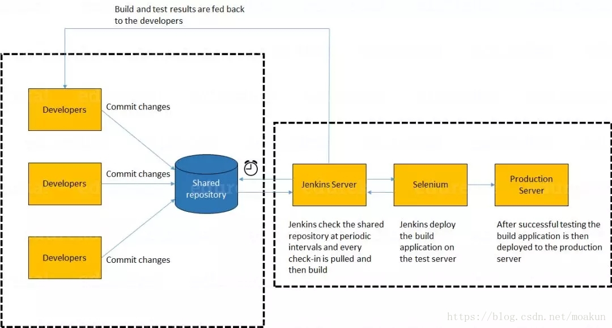

# DevOps面试题

原文一：https://blog.csdn.net/lyfqyr/article/details/84137421

​        DevOps是一组过程、方法与系统的统称，用于促进开发（应用程序/软件工程）、技术运营和质量保障（QA）部门之间的沟通、协作与整合。

## 持续集成相关

### 问题一：持续集成是什么意思？

​        这个问题建议通过给出持续集成（CI）的小定义开始。

​        CI，是一种开发实践，要求开发人员每天多次将代码集成到共享存储库中，然后通过**自动构建**验证每个签入，允许团队**尽早发现问题**。

​        接下来，介绍在现在工作中，具体如何实施的。下面是一个参考示例：

​        上图中，开发人员将代码签入私有工作区；完成后，他们将更改提交到共享存储库（版本控制存储库）。CI服务器监视存储库并在发生更改时签出更改；然后，CI 服务器将提取这些更改并构建系统，并运行单元测试和集成测试。

​        如果构建、单元测试、集成测试全部运行成功，则通过邮件等形式通知团队成功构建；如果构建或者测试失败，则向研发团队发送警报。这个过程不断重复。

### 问题二：为什么需要开发和测试的持续集成？

​        这个问题需要关注**持续集成的需求**。可以这样解释：
​        开发和测试的持续集成通过在完成所有开发之后替换传统的测试实践来**提高软件质量，并减少交付时间。它允许开发团队尽早检测和定位问题**，因为开发人员需要每天多次（或者更为频繁地）将代码集成到共享存储库中。然后自动测试每次登记入住。

### 问题三：持续集成的成功因素是什么？

​        这个问题，需要提到**持续集成的要求**。大致包含以下几点：

* 维护代码存储库
* **自动化构建**
* 是构建自我测试
* 每个人每天承诺到基线应该构建每个提交（到基线）
* 保持快速构建
* 在生成环境的克隆中进行测试
* **轻松获得最新的可交付成功**
* **每个人都可以看到最新版的结果**

### 问题四：解释如何将Jenkins从一台服务器迁移或复制到另一台？

​        核心：**通过将 jobs 目录从一台服务器复制到新服务器**。有多种方法可以做到这点：

* 只需要复制相应的作业目录，即可将作业从一个Jenkins安装移动到另一个。通过使用其他名称克隆作业目录来制作现有作业的副本
* 通过重命名目录来重命名现有作业。请注意：如果更改作业名称，则需要更改尝试调用重命名作业的任何其他作业。

### 问题五：解释如何在Jenkins中创建备份和复制文件？

​        要创建备份，需要做的就是定期备份 JENKINS_HOME 目录。这里包含所有构建作业配置，从属节点配置和构建历史记录。要创建Jenkins设置的备份，只需要复制此目录即可。还可以复制作业目录以克隆或者复制作业或者重命名目录。

### 问题六：解释如何设置Jenkins工作？

​        

### 问题七：如何保护Jenkins？

## 持续测试相关

### 问题一：什么是持续测试？

​        持续测试是执行自动化测试的过程，作为软件交付管道的一部分，**以获得与最新构建相关的业务风险的即时反馈**。

​        通过这种方式，每个构建都会持续测试，允许开发团队获得快速反馈，以便他们可以防止这些问题进入软件交付生命周期的下一阶段。这大大加快了开发人员的工作流程，因为无需手动重建项目并在进行更改后重新运行所有测试。

### 问题二：什么是自动化测试？

​        自动化测试或测试自动化，是自动化手动过程，以测试被测应用程序/系统的过程。自动化测试涉及使用单独的测试工具，使得可以创建重复执行的测试脚步，而无需任何手动干预。

### 问题三：自动化测试有哪些好处？

