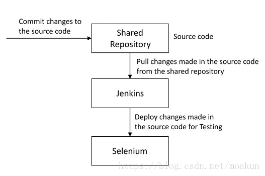

# DevOps面试题

原文一：https://blog.csdn.net/lyfqyr/article/details/84137421

DevOps是一组过程、方法与系统的统称，用于促进开发（应用程序/软件工程）、技术运营和质量保障（QA）部门之间的沟通、协作与整合。

## 持续集成相关

### 问题一：持续集成是什么意思？

这个问题建议通过给出持续集成（CI）的小定义开始。

CI，是一种开发实践，要求开发人员每天多次将代码集成到共享存储库中，然后通过**自动构建**验证每个签入，允许团队**尽早发现问题**。

接下来，介绍在现在工作中，具体如何实施的。下面是一个参考示例：

上图中，开发人员将代码签入私有工作区；完成后，他们将更改提交到共享存储库（版本控制存储库）。CI服务器监视存储库并在发生更改时签出更改；然后，CI 服务器将提取这些更改并构建系统，并运行单元测试和集成测试。 

如果构建、单元测试、集成测试全部运行成功，则通过邮件等形式通知团队成功构建；如果构建或者测试失败，则向研发团队发送警报。这个过程不断重复。

### 问题二：为什么需要开发和测试的持续集成？

这个问题需要关注**持续集成的需求**。可以这样解释：
开发和测试的持续集成通过在完成所有开发之后替换传统的测试实践来**提高软件质量，并减少交付时间。它允许开发团队尽早检测和定位问题**，因为开发人员需要每天多次（或者更为频繁地）将代码集成到共享存储库中。然后自动测试每次登记入住。

### 问题三：持续集成的成功因素是什么？

这个问题，需要提到**持续集成的要求**。大致包含以下几点：

* 维护代码存储库
* **自动化构建**
* 是构建自我测试
* 每个人每天承诺到基线应该构建每个提交（到基线）
* 保持快速构建
* 在生成环境的克隆中进行测试
* **轻松获得最新的可交付成功**
* **每个人都可以看到最新版的结果**

### 问题四：解释如何将Jenkins从一台服务器迁移或复制到另一台？

核心：**通过将 jobs 目录从一台服务器复制到新服务器**。有多种方法可以做到这点：

* 只需要复制相应的作业目录，即可将作业从一个Jenkins安装移动到另一个。通过使用其他名称克隆作业目录来制作现有作业的副本
* 通过重命名目录来重命名现有作业。请注意：如果更改作业名称，则需要更改尝试调用重命名作业的任何其他作业。

### 问题五：解释如何在Jenkins中创建备份和复制文件？

要创建备份，需要做的就是定期备份 JENKINS_HOME 目录。这里包含所有构建作业配置，从属节点配置和构建历史记录。要创建Jenkins设置的备份，只需要复制此目录即可。还可以复制作业目录以克隆或者复制作业或者重命名目录。

### 问题六：解释如何设置Jenkins工作？

​        

### 问题七：如何保护Jenkins？

这是很多方法中的一个：

确保 Jenkins 与公司的用户目录与适当的插件集成。

* 确保启用矩阵/项目矩阵 以微服务方式访问
* 使用自定义版本控制脚本自动化在 Jenkins 中设置权限/特权的过程
* 限制对Jenkins 数据/文件夹的物理访问
* 定期对其进行安全审核

## 持续测试相关

### 问题一：什么是持续测试？

持续测试是执行自动化测试的过程，作为软件交付管道的一部分，**以获得与最新构建相关的业务风险的即时反馈**。

通过这种方式，每个构建都会持续测试，允许开发团队获得快速反馈，以便他们可以防止这些问题进入软件交付生命周期的下一阶段。这大大加快了开发人员的工作流程，因为无需手动重建项目并在进行更改后重新运行所有测试。

### 问题二：什么是自动化测试？

​        自动化测试或测试自动化，是自动化手动过程，以测试被测应用程序/系统的过程。自动化测试涉及使用单独的测试工具，使得可以创建重复执行的测试脚步，而无需任何手动干预。

### 问题三：自动化测试有哪些好处？

* 支持执行重复的测试用例
* 有助于测试大型测试矩阵
* 启用并行执行
* 鼓励无人看管的执行
* 提高准确性，从而减少人为产生的错误
* 节省时间和金钱

### 问题四：如何在DevOps生命周期中自动化测试？

​        以下是一个通用的流程，仅供参考：在DevOps中，开发人员需要将源代码中的所有更改提交到共享存储库。像Jenkins这样的持续集成工具每次在代码中进行更改时都会从存储库中提取代码，并将其部署到Selenium等工具进行连续测试中，如下图所示。通过这种方式，与传统方法不同，代码中的任何更改都会不断进行测试。

### 问题五：为什么持续测试对 DevOps 很重要？

​        避免了在周期结束时进行“大爆炸”测试所产生的问题，例如发布延迟和质量问题。通过这种方式，持续测试可以促进更频繁和更好的质量发布。

### 问题六：连续测试工具的关键要素是什么？

* **风险评估**：它涵盖风险缓解任务，技术债务，质量评估和测试覆盖范围优化，以确保构建准备好下一个阶段发展
* **策略分析**：确保所有流程符合组织不断发展的业务和合规性要求
* **可追溯性**：确保满足真正的要求，不需要返工。对象评估用于确定哪些需求存在风险，按预期工作或需要进一步验证
* **高级分析**：它在静态代码分析，变更影响分析和范围评估/优先级划分等领域，使用自动化，以便首先防止缺陷并在每次迭代中完成更多任务
* **测试优化**：它确保测试产生准确的结果并提供可操作的结果。方面包括测试数据管理、测试优化管理和测试维护
* **服务虚拟化**：它确保访问真实的测试环境。服务可视化能够访问所需测试阶段的虚拟表单，从而缩短测试环境设置和可用性的浪费时间

## 配置管理面试题

### 问题一：配置管理流程的目标是什么？

​        配置管理（CM）的目的是通过使开发或部署过程可控和可重复，确保产品或系统在其整个生命周期中的完整性，从而创建更高质量的产品或系统。CM 流程允许有序管理系统信息和系统更改，以便：

* 具有修改能力
* 提高性能
* 可靠性或可维护性提高
* 延长寿命
* 降低成本
* 降低风险
* 责任或正确的缺陷

### 问题二：资产和配置项有什么区别？

​        先说说什么是“资产”。资产，具有财物价值以及附加的折旧率。IT资产只是它的一个子集。任何具有成本的组织和组织都将其用于资产价值计算和税收计算中的相关收益属于资产管理，此类项目称为资产。另一方面，配置项可能有，也可能没有分配给它的财务值。它不会有任何与之相关的折旧。因此，它的生命不依赖于其财物价值，而是取决于该项目对该组织过时的时间。

​        “资产”和“配置项”的相似性和差异：

* **相似性**：服务器 - 它既是资产又是 CI
* **差异**：构建- 这是一种资产，但不是 CI

### 问题三：IAC 如何适用于 DevOps 方法？它实现了什么目的？
