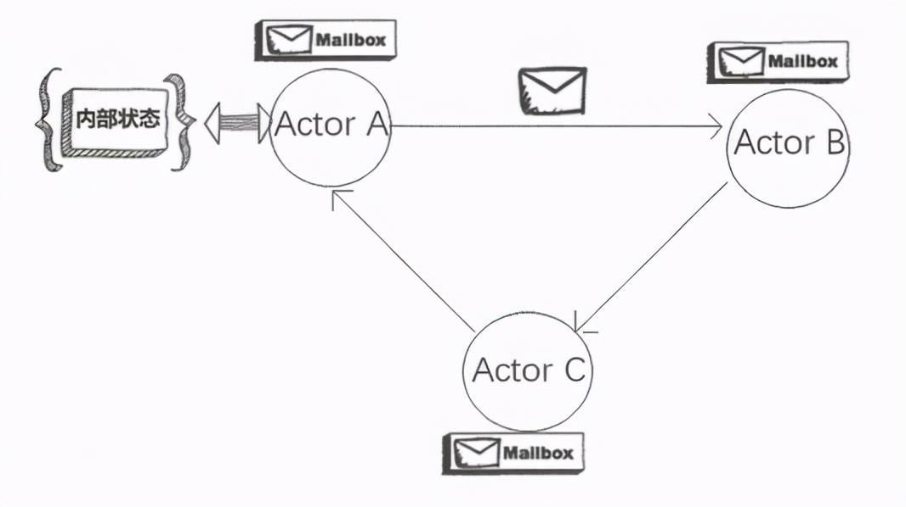
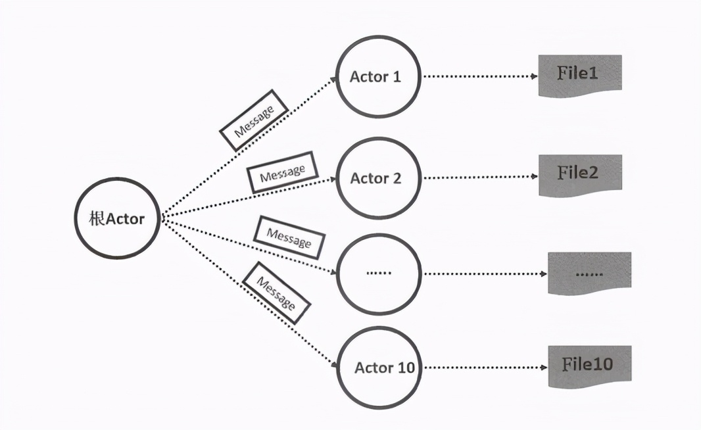

# 解密分布式到微服务：聊聊分布式计算，不得不说的Actor模型

原文：https://www.toutiao.com/article/6933116708081418763/?log_from=8ba9fdc667234_1657767082774

### 1. 分布式计算

不管是网络、内存还是存储的分布式，它们的最终目标都是实现计算的分布式:数据在各个计算机节点上流动，同时各个计算机节点都能以某种方式访问共享数据，最终分布式计算后的输出结果被持久化存储和输出。分布式计算作为分布式系统里最重要的一个能力和目标，也是大数据系统的关键技术之一。经过多年的发展与演进，目前业界已经存在很多成熟的分布式计算开源编程框架和平台。作为架构师，应该尽可能地了解和掌握这些框架和平台。

### 2. Actor模型

Actor模型于1970年年初被提出，为并行计算而生，理念非常简单：所有对象皆Actor，在Actor之间仅通过发送消息进行通信，所有操作都是异步的，不同的Actor可以同时处理各自的消息，使整个系统获得大规模的并发能力。但是，该理念在当时有些超前，因此很快被人遗忘。

直到 Erlang 这种基于 Actor 模型设计的面向并发编程的新语言横空出世，在并发领域竖起一座丰碑，Actor 模型才再次成为分布式计算领域的恶热点技术之一。

目前，几乎所有主流开发平台都有了 Actor 模型的实现：Java平台下Scala的Actor类库和Jetlang；.NET 平台下的MS CCR和Retlang；F#平台下的 MailboxProcessor；微软基于 MSCCR 构建的新语言Axum。

Smalltalk的设计者、面向对象编程之父 AlanKay 曾经这样描述面向对象的本质：

> 很久以前，我在描述“面向对象编程”时使用了“对象”这个概念。很抱歉这个概念让许多人误入歧途，他们将学习的重心放在了“对象”这个次要的方面，而忽略了真正主要的方面---“消息”。创建一个规模宏大且可水平扩展的系统的关键，在于各个模块之间如何交流，而不在于其内部的属性和行为如何表现。

这段话也概括了 Actor 模型的精髓 -- 可以认为 Actor 模型是面向对象模型在并发编程领域的一个扩展。Actor 模型精心设计了消息传输和封装机制，强调了面向对象。可以将一个 Actor 类比为一个对象，对象提供了方法以供其他对象调用，等价于一个 Actor 可以处理某些类型的消息并进行响应，但与方法调用不同，Actor 之间的消息通信全部是异步模式，避免了同步方法调用可能产生的阻塞问题，因此很适合高度并行的系统。但是，异步编程这种思维模式大大增加了在编程中所耗费的脑力劳动，很难被习惯了CRUD的大众程序员所接受，所以注定 Actor 模型曲高和寡的命运。

从另一方面考虑，Actor 模型大大简化了并发编程的复杂度。通常，对象一般都有属性（状态），但如何高效、安全地处理对象的可变性属性，成为了多线程并发编程领域中公认的编程难题。比如 Java 为了解决这一难题，先后设计了 Volatile 变量、Atomic 变量、基于 Atomic 的 CAS 原子计数器指令、轻型的 Lock 锁，最后祭出了 Java 并发领域专家 Doug Lea 教授潜心数年编写的难度极高的并发集合框架--- Java Concurrent Collection。 但是即使从业多年，大部分人依然难以写出一段工业级质量的多线程代码。Actor之父--Carl Hewitt 很早就敏锐的意识到了这个问题，于是定义了 **Actor 的第二个重要特性：Actor 模型的内部状态不能被其他 Actor 访问和改变，除非发送了消息给它**。那么这个消息是否可变呢？显而易见，Actor 发出的消息也是不可变的。

Actor模型舍弃了共享变量和共享内存这种常规编程模式，虽然失去了一定的灵活性，却让任意两个 Actor 都具备了跨越网络实现分布式计算的天然基因，从而成就了其在大规模分布式计算领域的“不老传说”。

下图所示是 Actor 模型的原理图：

从上图可以看到，每个Actor都有一个Mailbox（邮箱），Actor A 发送消息给 Actor B，就好像Actor A写了一封信，收件人地址填写 Actor B的邮箱地址，随后平台负责投递邮件。在邮件抵达 Actor B的邮箱之后，平台就通知 Actor B收取邮件并做回复。如果有多封邮件，则 Actor B **依次按顺序**处理。越是简单的技术，就越有强大的力量，Actor 模型让大家再次验证了这个道理。那么，Actor B 在收到消息后可能会做出哪些处理呢？

* 创建其他 Actor
* 向其他 Actor 发送消息
* 指定下一条消息到来时的行为，比如修改自己的状态

一个 Actor 在什么情况下会创建子 Actor呢？通常的情况是并行计算，比如有10个10GB的大文件要分析和处理，就可以在根 Actor 里创建 10 个子 Actor，让每个 Actor 都分别处理一个文件，为此根 Actor 给每个子 Actor 都发送一条 Message（消息），消息里包含分配给它的恶文件编号（或位置），子 Actor 在完成处理后，就把处理好的结果封装为应答消息返回给根 Actor，然后根 Actor 进行最后的汇总和输出。如下图所示，是其流程示意图：

一个 Actor 与其所创建的 actor 形成父子关系，比如上面的例子。在实际编程过程中，父 Actor 应该监督其所创建的所有子 actor 的状态，原因是父Actor 知道可能会出现哪些失败情况，知道如何处理它们，比如重新生产一个子 Actor 重新做失败的任务，或者某个 actor 失败后通知其他 Actor 终止任务。

Actor 模型的优点很明显，即将消息收发、线程调度、处理竞争和同步的所有复杂逻辑都委托给了 Actor 框架本事，而且对应用来说是透明的。在实际编程中，可以认为 Actor 只是一个实现了 Runnable 接口的对象，在关注多线程并发问题时，只需要关注多个 Actor 之间的消息流即可。此外，符合 Actor 模型的程序也很容易被测试，因为任意一个 Actor 都可以被单独进行单元测试。如果测试案例覆盖了该 Actor 所能响应的所有类型的消息，就可以确定该 Actor 的代码十分可靠。

那么，Actor 模型的缺点有哪些呢？如下：

* Actor 完全避免共享并且仅通过消息传递进行交流，使得程序员失去精细化并发调控能力，所以不太适合实施细粒度的并行且可能导致系统响应延时的增加。如果在 Actor 程序中引入一些并行框架，就可能导致系统的不确定性。
* 尽管使用 Actor 模型的程序比使用线程与锁模型的程序更易调试，Actor模型仍会出现死锁这一类共性问题，也会出现一些 Actor 模型独有的问题，例如信箱溢出等。

此外，Actor平台实现起来较为复杂，而且平台的性能取决于其实现原理与底层机制，比如分布式情况下的消息传输机制、网络通信机制及消息到Actor 的派发机制，在这些方面如果有处理不好的地方，就会导致整体性能和稳定性问题。比如某个Actor因为某个错误陷入死循环，疯狂地消耗CPU，基本上整个系统就瘫痪了，其他Actor很难有机会正常工作，此时Java上的Akka平台由于根本做不到公平调度，在出现这种问题时什么也调度不了，只能等待操作系统切换线程。而Erlang尽力实现了“可抢占的公平”调度，比较好地解决了这一难题。