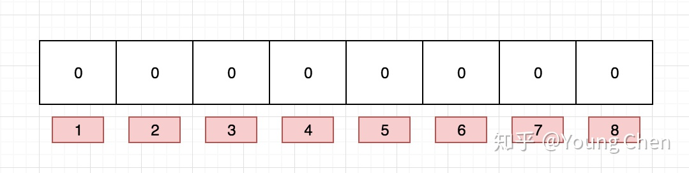
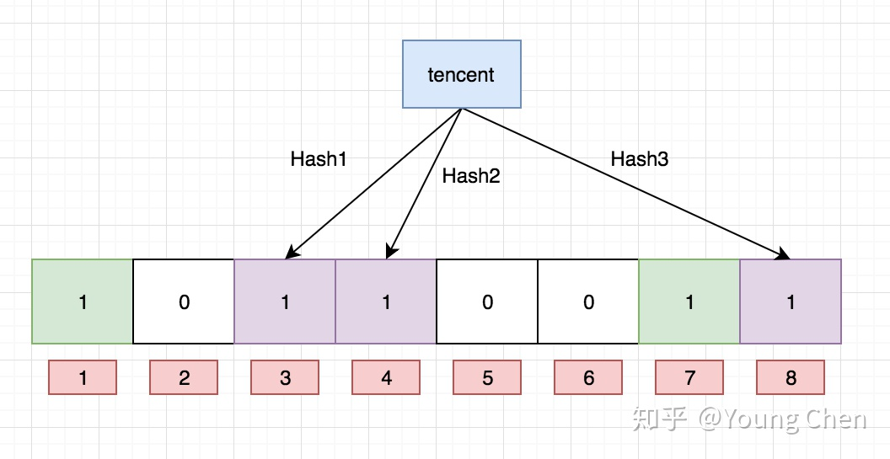

# 布隆过滤器原理、使用场景

原文：https://zhuanlan.zhihu.com/p/43263751

​       一段关于数据的描述：

> Data structures are nothing different. They are like the bookshelves of your application where you can organize your data. Different data structures will give you different facility and benefits. To properly use the power and accessibility of the data structures you need to know the trade-offs of using one.

## 一. 什么是布隆过滤器

​        布隆过滤器本质上是一种数据结构。它比较巧妙的概率型数据结构（probabilistic data structure），特点是高效的插入和查询，可以用来告诉使用者“**某种东西一定不存在或者可能存在**”。

​        相较于传统的 List、Set、Map 等数据结构，它更高效、占用空间更少，但是缺点是其返回的结果是概率性的，而不是确切的。

## 二. 实现原理

### 2.1 HashMap的问题

​        讲述布隆过滤器的原理之前，需要先思考一下：通常判断一个元素是否存在，一般用什么样的数据结构？很多人应该回回答“HashMap”吧。确实，使用 HashMap 可以做到，把要查询的值映射成 HashMap 的 Key，然后在 $O(1)$ 的时间复杂度内返回结果，效率奇高。但是 HashMap 的实现也有缺点，例如：存储容量占比高，考虑到负载因子的存在，通常空间是不能被用满的，而一旦要存储的值很多很多，比如上亿，那 HashMap 占据的内村大小就变得很可观了。

​        还比如，数据集存储在远程的服务器上，本地服务接受输入，而数据集非常大，不可能一次性读进内存构建 HashMap 的时候，也会存在问题。

### 2.2 布隆过滤器数据结构

​        布隆过滤器是一个 bit 向量或者说 bit数组，下图是一个可视化的示意图：

​        如果要映射一个值到布隆过滤器中，需要使用**多个不同的哈希函数生成多个哈希值**，并对每个生成的哈希值指向的 bit 位置设置值 1。例如，针对值“baidu”和三个不同的哈希函数分别生成了哈希值1、4、7，那么上面的图加入数据后，就变成如下的形式：

​        现在再存储一个值 “tencent”，如果哈希函数返回 3、4、8 的话，图变为：

​        值得注意的是，4 这个 bit 位由于两个值的哈希函数都返回了这个bit位，因此它被覆盖了。如果现在要想查询“dianping”这个值是否存在，哈希函数返回了 1、5、8 三个值，结果发现 5 这个bit 位上的值位 0，说明**没有任何一个值映射到这个bit位上**，因此可以**很确定**的说“dianping”这个值不存在。而如果要查询 “baidu” 这个值是否存在，那么哈希函数必然会返回 1、4、7，然后检查发现这三个 bit 位上的值均为 1，那么可以说“baidu”存在了吗？答案是不可以，只能说“baidu”这个值可能存在。

​        这是为什么呢？答案很简单，因为随着增加的值越来越多，被置为 1 的 bit 位也越来越多，这样某个值“taobao”即使没有被存储过，但是万一哈希函数返回的是三个 bit 位都被其他值设置了 1，那么程序还是会判断“taobao”这个值存在。

## 三. 支持删除吗？

​        传统的布隆过滤器是不支持删除操作的。但是一个叫做“Counting Bloom Filter”的变种可以用来测试元素计数个数是否绝对小于某个阈值，它支持元素删除。可以参考 [Counting Bloom Filter 的原理和实现](https://link.zhihu.com/?target=https%3A//cloud.tencent.com/developer/article/1136056)

## 四. 如何选择哈希函数个数和不隆过滤器长度

​        很显然，过小的布隆过滤器，所有的bit位会很快都设置成 1，那么查询任何值都会返回“可能存在”，起不到过滤的目的了。布隆过滤器的长度会直接影响误报率，布隆过滤器越长其误报率越小。

​        另外，哈希函数的个数也需要权衡。个数越多布隆过滤器 bit 位置为 1 的速度越快，且布隆过滤器的效率越低；但是如果太少的话，误报率又会变高。

​        k：哈希函数个数

​        m：布隆过滤器的长度

​        n：插入的元素个数

​        p：误报率

​        如何选择合适业务的 K 和 M 值呢？这里有一个公式：
$$
m = - \frac{nlnp}{(ln2)^2}
\\
k = \frac{m}{n} ln2
$$
​        根据这个公司，K 次哈希函数某一 bit 位未被置为 1 的概率是：
$$
(1 - \frac{1}{m})^k
$$
插入 n 个元素后，依旧为 0 的概率和为 1 的概率分别是：
$$
(1 - \frac{1}{m})^{nk}
\\
1- (1 - \frac{1}{m})^{nk}
$$
表（标）明某个元素是否在集合中所需的 k 个位置都按照如上的方法设置为 1，但是该方法可能会使算法错误的认为某一原本不在集合中的元素却被检测为在该集合中（False Positives），该概率由下面这个公式确定：
$$
[1 - (1 - \frac{1}{m})^{nk}]^k \approx (1 - e^{-kn/m})^k
$$

## 五. 最佳实践

​        常见的适用场景有：

* 利用布隆过滤器，减少磁盘I/O或者网络请求，因为一旦一个值必定不存在的话，可以不用进行后续昂贵的查询请求。
* 既然使用了布隆过滤器来加速查询和判断是否存在，那么性能很低的哈希函数不是个好选择，推荐使用 MurmurHash，Fnv 这些

### 5.1 大 Value 拆分

​        Redis 因为支持 setbit 和 getbit 操作，且纯内存性能高等特点，因此天然就可以作为布隆过滤器来使用。但是，布隆过滤器的不当使用极易产生大 Value，增加 Redis 阻塞风险，因此生产环境中建议对体积庞大的布隆过滤器进行拆分。

​        拆分的形式方法多种多样，但是本质是不要将 ***Hash(Key)*** 之后的请求分散在多个节点的多个小 bitmap 上，而是应该拆分成多个小 bitmap 之后，对一个 key 的所有哈希函数都落在这个小 bitmap 上。

## 六. 相关面试题

### 6.1 哈希切割

* **题**：

  ​        给一个超过 100G 大小的log 文件，log 中存着 IP 地址。问：

  * 设计一个算法，找到出现次数最多的 IP 地址。
  * 如何找到 top K 的IP 地址？
  * 如何直接用 Linux 命令实现？

* **答**：

  * 第一问，**使用哈希桶**：将 100G 的内存分为 65535 个 65535 大小的内存，在每个 65535 大小的桶中，找到出现次数最多的，然后将 65535 个桶继续找到它们中的最多的，就得到了总体最多的
  * 第二问：方法与第一问类似，不同的一点是，在上面桶里面的最多的拿出来比较，在最小的那个桶里找到它的第K个（使用堆），然后在其他桶里将大于这个数的都找到，进行排序，取前 K 个即可
  * 第三问： sort | uniq -c | sort -nr | head -10

### 6.2 位图应用

* **题**一：

  ​        给定 100 亿个整数，设计算法找到只出现一次的整数。

* **答**：

  ​        找到两个位图，出现第一次，第一个位图置 1，第二次第二个位图置 1，最后遍历结束找到第一个位图是 1，第二个位图是 0 的数字即可。

* **题二**：

  ​        给两个文件，分别有 100 亿个整数，但是只有 1G 内存，如何找到两个文件交集

* **答**：

  ​        同样两个位图，出现一次第一个置1，出现第二次第二个置1，遍历结束，找到两个位图对应位置都是 1 的数字即可。

* 

### 6.3 布隆过滤器

* **题**：
          给两个文件，分别是 100 亿个 query，只有1G内存，如何找到两个文件交集？分别给出精确算法和近似算法。

* **答**：

  * **精确算法**：

    使用位图，两个位图，出现一次第一个置1，出现第二次第二个置1，遍历结束，找到两个位图对应的位置都是 1 的数字即可

  * **近似算法**

    使用布隆过滤器，由于布隆过滤器只能判断哪些可能存在或者一定不存在的，所以就是近似算法。首先遍历一遍，将每个 query 放进去，然后再一次遍历就能判断出可能出现的那些 query，就可能是交集

### 6.4 倒排索引

* **题**：

  ​        给上千个文件，每个文件大小为 1k - 100M 不等。给 n 个词，设计算法对每个词找到素有包含它的文件。 只有100K 内存。

* **答**：

  ​        将 100M 文件切成 1024 块，然后直接遍历一遍，将每个文件出现的情况做成一个表就可以了。就成了一个倒排索引。然后找到需要查找的单词，然后再将后面的文件名全部输出就可以了。