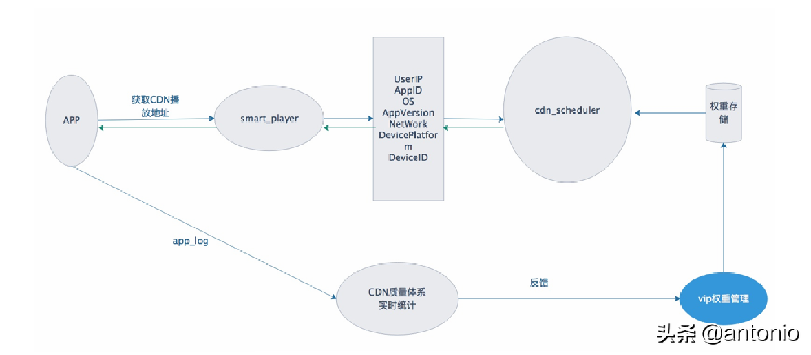

# CDN系统的架构设计

原文：https://www.toutiao.com/i6901834019227320846/


目前市面上可以进行商用的CDN，大部分以流媒体CDN为主，其余的还有一部分是WEB-CDN。近些年，流媒体与CDN的结合使得流媒体业务发展迅猛，也带动了一批又一批的视频业务的发展。流媒体结合CDN中的**存储分发、路由管理、负载均衡**等关键技术，为视频业务创造了一个良好的发展环境。

CDN 架构图原理如下：


1. 发起DNS请求
2. DNS递归查询
3. 返回最佳接入IP，同时 Local DNS 缓存
4. 用户获得最合适IP
5. 用户再次发起请求
6. **CDN内部路由**
7. 转发请求，到合适的服务器，如源站
8. 服务器返回数据
9. 边缘节点获取数据
10. 用户接收数据

## 1. 流媒体服务器需求分析

流媒体服务器是流媒体应用系统的核心部分。具体而言，在现有的流媒体业务基础上，提升流媒体服务器**抗斗性能**，**增强**服务器**抗压能力**，**减小**网络拥塞下的**丢包率**是研究的重点内容。并研究了**流媒体协议**选取，**服务器选型**以及**流量整形算法**选取等内容，基于 Niginx-Web 服务器，进行二次开发和功能优化，期望设计出一个高性能且便于维护便于管理的流媒体服务器系统。

期望对所设计的流媒体系统的功能做如下总结：

1. 能够实现各种媒体形式的**分发、存储**等操作
2. 支持 HLS 协议，并且提供对各类协议的解析
3. 在高并发的环境中提升稳定性，实现服务高可用
4. 能够自适应网络抖动，对于抗抖性有一定的性能要求

## 2. 流媒体服务器框架设计

​        列举一些目前市场上主流流媒体服务器系统。还有一些其它流媒体系统。如下表：


​        传统的流媒体服务器存在有一些弊端。例如，服务器会将流切割器切割的 TS 文件**存到磁盘上**，每次读取文件时都要对磁盘进行一次操作，这样的机制，一是会**影响读取效率**，而是**磁盘寿命会大大降低**。传统的流媒体服务器在高并发方面处理的不太理想，尤其在应对突发流量时容易产生网络拥塞、性能严重下降等问题。

​        Nginx 服务器在应对高并发时有着较优的性能，Nginx 可以分为以下四大模块：**核心模块**、**HTTP模块**、**邮件服务模块**和**第三方模块**。

1. Nginx的**模块划分**：

   * **核心模块**：这是Nginx服务器最为重要的一大模块，提供Nginx最为核心的服务，如**进程管理**、日志管理以及权限控制等。
   * **HTTP 模块**：可以分为**标准**HTTP模块和**可选**HTTP模块。这两个模块主要负责实现HTTP请求。可选HTTP模块在标准HTTP模块功能的基础上进行了拓展，较于标准的HTTP模块新增支持处理Nginx的一些**特殊服务**的功能。
   * **邮件服务模块**：这为Nginx的邮件服务提供支持。
   * **第三方模块**：用于拓展Ngnix服务的应用，开发者可以根据自己的业务场景将要开发的模块业务添加于其中。

2. Nginx采用**高并发**的服务框架，使用**多进程机制**和**异步机制**。Ngnix在其每个工作进程中的异步机制都采用**异步非阻塞方式**（master-worker）。这是其可以处理多个客户端请求的重要原因。异步非阻塞模式是当工作进程收到客户端请求，可能没有立即作出处理，而是**先将其挂起**，去处理其他客户端请求，然后当此请求处理完成后会**通知该进程**从而**响应客户端**。

3. 当Nginx启动后，会产生**一个主进程Master**。主进程Master主要负责与**外界通信**和对**内部进程的管理**，包括**读取配置文件**、**建立绑定或关闭socket**、**实现平滑重启**以及**开启日志文件**等工作。在主进程完成监听、绑定套接字等操作后，会**创建若干Worker进程**。

   Worker 进程是彼此**相互独立**的，用来**处理多个客户端的动态站点请求**。Worker进程还会与后端服务器进行通信，交互方式有HTTP、FASTCGI（快速通用网关接口），MEMCACHE（分布式高速缓存系统）。通常，用户通过HTTP/HTTPS协议进行Web服务请求，Worker 进程收到来自客户端的请求后会转发到后端服务器，后端服务器的相应模块会**依次**对用户请求进行处理。Ngnix还设有**缓存机制**，每个Worker进程还时刻保持与代理缓存的交互，从而方便下次的快速访问。整个Ngnix的请求服务框架如下图所示：

   

   在图中，Nginx服务器的Master-Worker模型，涉及两种交互方式，分别是Master和Worker之间的交互以及Worker与Worker，这两类交互都是使用**管道机制**通讯。具体如下：

4. **Master-Worker 交互**：主进程和工作进程的交互式**单向**的。主进程与外界通过信号进行通讯，主进程向工作进程发出**指令以及工作进程ID**等信号。

5. **Worker-Worker交互**：Worker之间的通信与上述Master-Worker交互原理相同，区别在于每个工作进程是**相互隔离**的，当 worker1 向 worker2 发送指令时需将 worker1 的进程ID 写入 worker2 的通道以供 worker2 收到信号后进行后续工作（使用管道通信）。

## 3. CDN网络架构设计

### 3.1 CDN 网络拓扑

​        实际应用中，大型互联网公司会将数以万计的CDN节点--**Cache服务器集群**在互联网中进行部署，通过与各大网络运行商的合作，将这些节点服务器置于**靠近用户的区域机房中**。在某些集群的分布式模式下，CDN**事先**会将流媒体内容**从源站复制到各个节点服务器上**，当流媒体数据提供商进行数据更新时，CDN也会同步进行内容更新并重新向各个节点服务器进行内容分发。对于每个用户的内容请求，CDN都会为其选择一个最优的节点服务器，这个节点**要么是离用户最近**，**要么**是与用户之间**有一条最佳通讯路径**。CDN寻找**最优节点**的过程称为**负载均衡**。

​        **云服务层**可以分为两大模块（分别是**OOS，CDN**），其中**对象存储OOS**是云对象的一项存储服务（Object Storage Service，简称OSS），数据可靠性较高。CDN 在接收到来自中断的请求后，首先会在**边缘节点服务器**寻找对应文件，如**未找到**，则会一层层**回源**进行查找。在 OSS 寻找对应文件内容后，OSS 的 ALB 网络接入层向 CDN 进行文件传输，CDN 的调度系统将文件进行整合转发给下游终端设备。当请求**在 OSS 没有找到文件，会自动到源站抓取对应文件保存到 OSS**，并将内容直接返回给用户。CDN 在云服务中的架构如下图所示：


### 3.2 CDN 负载均衡

​        CDN 的负载均衡技术是 CDN 的关键技术之一。负载均衡是对批量用户请求进行**动态平衡、分摊、寻找**距离用户**最近**、**性能最佳**的 CDN 节点，目的是为了提高服务器响应速率和利用率。负载均衡在多个节点之间按照一定的算法策略进行计算，对网络节点进行分配。CDN 负载均衡常用的算法有**轮询算法、最小连接数算法**和**快速响应优先算法**，这些算法基本信息如下：

* **轮询算法**

  轮询的处理原则是对待所有负责负载均衡的服务器一视同仁，内部服务器**循环对用户的请求**做处理，这种算法**不关心**服务器上的连接数以及用户响应速率，因此在代码设计上较为简洁。

* **最小连接数算法**

  最小连接数算法在集群内部服务器上**设置 flag 计数器**，用来记录当前服务器的实时连接数目，通过比对各个服务器上的连接数，**优先**选择当前**连接数最少的**服务器执行任务。

* **快速响应优先算法**

  快速响应优先算法对集群中的**节点状态**进行审计，选择适合当前请求状态的节点进行任务分配。

​        整个文件传输过程中，用户**App端**发起请求，根据发起请求的内容，播放器首先会**获取CDN**的播放**地址**，网络服务端通过此地址在**本地边缘节点**进行查找，将其内**容放在CDN上**，CDN从**权重存储器**中获取数据，CDN质量体系实施统计系统向**VIP权重管理模块**进行反馈。CDN负载均衡架构图如下：




### 3.3 流媒体CDN的关键技术选取

**流媒体协议选取**

​        将针对各个协议的使用方式及特点进行比较分析，探索适合的流媒体服务器协议进行服务器系统设计。

​        在流媒体服务器中，处理流媒体文件时，需要将流媒体文件切为若干 TS 分片，通过一个扩展的 mu3u8 列表文件将这些 TS 分片集中起来提供给客户端的播放器进行播放。 **HLS** 协议的优势在于：

1. HLS 协议在流媒体文件切分完成后，分发过程只需使用**普通的网络服务器**即可完成，而不再额外使用其它任何专门软件来进行分发

2. HLS 协议是基于 HTTP 协议实现的，而 HTTP 协议是当下发展较为成熟的协议之一

3. 对于非实时视频，如果要实现在长视频中跳转功能，HLS 协议不需要额外 for 循环遍历每个用户的请求，只需要依据文件中的时间轴对 TS 片段进行下载，时间复杂度大大降低。 **SEEK**效率高效。

4. HLS 协议有**自适应码率**的特点，会根据用户请求时的网络状况为用户自动选择合适的码率文件。若当前用户连接数较小，则可选择高码率媒体文件，当网络较为繁忙时，选用低码率媒体文件。 在 HLS 写一下的服务器首先会提供**多码率的视频流**，同时会在媒体文件列表中对码率进行标注，方便播放器对播放和下载进度进行自动调整，这种特性在应对移动设备网络状况较差时效果极为明显。

5. HLS 协议代码格式简单、容易开发，便于维护且易用性强，可操控性强。

   对于封装格式来说，TS 与 MP4 的编码格式不同。将 TS 和 MP4 进行比较后发现， MP4 协议的使用具有一定的局限性。

6. MP4 一般只能用在点播业务中，如果选择 MP4 协议，播放器需分别针对点播业务与直播业务进行开发，而 TS 同时支持点播和直播，解析方使用一套代码即可完成解析。

7. MP4 在解析文件时需要先解析 MOOV 时长，首包响应较慢（首包响应是指用户从发起GET请求到播放器展示第一张画面的响应时间，是流媒体服务器的指标），这可能会影响质量评判。

所以选择使用 HLS 和 TS 作为开发流媒体服务器的主要媒体协议，支持直播、点播录制。

**注意**：协议没有好坏之分，每个协议都有它的优缺点，只要适配合适的场景，每种协议就有它的用武之地。

### 3.4 服务器选型

​        服务器的发展经理了很多变革，例如，服务器经历了从单进程多线程到多进程单线程再到多进程多线程的演变，服务器在稳定性方面也发生了质的飞跃。当前市场上流行的服务器主要有 Adobe FMS、Red5、Nginx 等。

1. **FMS**（Flash Media Server）：FMS是 Adobe 公司开发的一款多媒体实时通讯平台，在 2002 年被 Adobe 收购并更名为AMS。FMS 集成了多媒体交互的特性，提供了一套功能强大、拓展性强的对象模型和组件架构模型。基于 FMS 可以快速开发通讯相关的应用程序，并在代码执行和数据处理方面相对高效。
   * 优点：专业厂商产品，性能优良、稳定，支持多平台，可实现 P2P 通信。
   * 缺点：**费用较高、**代码实现复杂。
2. **Red5**： Red5 提供的媒体服务器是基于 **JAVA** 进行开发的，Red5采用 RTMP 作为流媒体传输协议，且与 FMS 可以做到完全兼容，即客户端在更改服务器后不会受到任何影响。
   * 优点：**代码开源**，与 FMS 完全兼容，有着 FMS 的优点，通常用在**开发较小型网站**。
   * 缺点：性能与稳定性较差，在处理**高并发、大容量数据**等场景上有一定缺陷。
3. **Nginx**：Nginx 是目前市场上主流的具有**较高性能**的 HTTP 和反向代理服务器，采用**高并发服**务器框架，因其架构本身的高稳定性受到开发者的青睐。Nginx 提供丰富的功能集合和示例配置文件，适用于多种开发场景，并且，其在资源的消耗上也较低。
   * 优点：部署方便，性能较高，采用 **HTTP 渐进式下载，支持进度拖拽、防盗链**等功能，直播点播使用一套服务器，管理更加便捷。
   * 缺点：需要二次开发

​        Nginx 服务器性能高，稳定性强，且在当前应用领域比较广泛，具有相对成熟性。而其他几类服务器虽本身支持流媒体传输，但在业务方面，与业务并不兼容，对其中的一些模块仍需要二次开发，所以这里选择Nginx作为服务器。

### 3.5 流量整形算法选取

​        对于流媒体服务器来说，**限流**是一个很重要的环节。限流，即**限制**系统的**输入或输出**，当输入或输出达到了服务器流量限制的阈值，通过延迟处理，**拒绝处理**或者**部分拒绝处理**等方式进行限流，从而达到**保证系统稳定运行的目的**。常用的限流算法有**漏桶算法**（leaky bucket）和**令牌桶算法**（token bucket）。

#### 3.5.1 漏桶算法

​        思路，是在一个固定容量的漏桶中，水流（用户请求）以任意速率流入到漏桶中，漏桶以固定速率流出（响应速度）。因此，漏桶算法是通过**强行限制数据的传输速率**来实现线限流的。

​        待处理的数据放在队列中，数据**入桶前会对桶是否已满做出判断**。如果漏桶为空或者没有满，则数据入桶。这个过程称为入流。如果入流速度过大而导致流入的水流超过了桶的容量，水流将会溢出。这意味着要传输的数据包会被直接丢弃。出流的速率可以根据业务场景进行人为调节，但**漏桶算法**本身并**不能**对出流速率进行**自适应调节**。这也就是网盘限速的基本原理。漏桶算法原理如下图所示：


#### 3.5.2 令牌桶算法

​        原理是，以一个**恒定的速率**在桶里添加令牌，当新的请求来临时，需要从桶里获取一个令牌才能进行发送。当桶里的令牌满了，则暂停添加令牌；当桶里没有令牌时，则阻塞或者拒绝服务。对于令牌桶算法来说，拿到令牌是数据可以进行传输的前提条件。令牌桶的原理如下图：


#### 3.5.3 两种桶的比较

​        **相同点**：这两个算法都是通过**限制流量速率**来对流量进行**管控达到限流**的目的。

​        **不同点**：在速率管控方面，漏桶算法较令牌桶算法具有一定的局限性。对比上面2张图可以看到，**漏桶**的**出流速率**是一定的，而**令牌桶**通过**令牌机制**可以有效地对出流速率进行控制，只有**拿到了令牌**才可进行后续服务。在遇到突发流量的状况时，**漏桶算法**将**面临**着数据包**被大批丢弃**，而**令牌桶算法则可以保持阻塞状态，等待新的令牌**。因此，漏桶算法与令牌桶算法的不同点**在突发性流量的场景中表现极为明显。**

### 3.6 添加限流模块示例

​        Nginx 提供了一个单独的模块进行流量控制，即 ngx_http_limit_req_module 模块，在service.pconf 配置文件中的配置如下：

```properties
location /Service  
{ 
  try_files   $uri = 404; 
  proxy_pass   http://127.0.0.1:8080/Service/1.jsp; 
  limit_req zone = ten burst = 1 nodelay;  
  limit_req_ status 503; 
  keepalive_requests 120 //单连接请求上限次数
} 
```

​        **注意**：传统的 Nginx 在流量控制上采用的**限流算法是漏桶算法**而非令牌桶算法，这是为了**应对**一种特殊访问——**恶意访问 DDos**（Distributed Denial of Service）。这种访问是通过一台或几台机器，**不断向服务器发起访问请求，造成其他用户无法得到响应**。Nginx 使用漏桶算法限制用户单位时间内的访问次数，相比于令牌桶算法，漏桶算法的代码更为简化，便于二次开发。本文这里设计讲解的就是从提升服务器性能的角度考虑，**令牌桶算法**在应对突发流量有着**较优的性能**，可以对每一路的发送数据进行**速率平滑**，因此，本系统将令牌桶算法应用在 Nginx 的数据发送模块上，在此模块上设计开发了**基于令牌桶算法的流量控制模式**。


