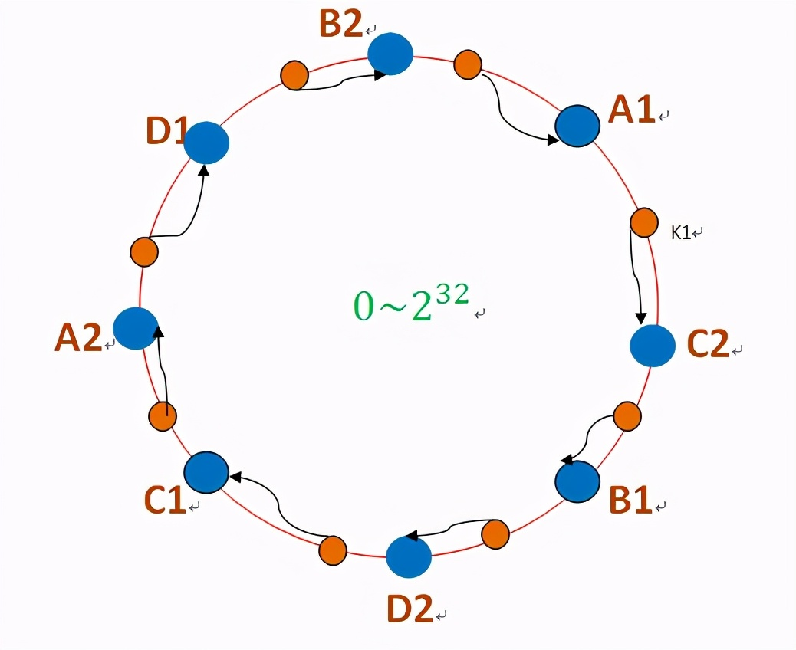

# 一致性哈希原理

原文：https://www.toutiao.com/i6965129463814275595/

## 问题来源

有这样一个场景：现在有超大规模的数据集（对象），请问如何把它们存储在有限的存储节点上？这里的存储节点可以是某台服务器或者某个 vm（虚拟机）等。

首先，肯定是要采取哈希存储的，否则无法高效查找。那使用简单的哈希函数，比如 hash（对象）% 存储节点总个数，可行吗？**答案是不行，因为如果添加新的存储节点或者删除某个存储节点，那么很多原有的数据就无法找到了。**于是麻省理工学院在 1997 年提出了一种分布式哈希（DHT）实现算法。

## 设计方法

**一致性哈希的本质是通过某个 hash 函数把 key 映射到一个很大的空间里**。

如图所示，存储某个数据时，先计算一个 hash 值，对应到这个环中的某个位置，如 k1，那这个数据存放到哪个存储节点上呢？

沿顺时针找到第一个存储节点，也就是 B，然后将 k1 存储到 B 这个节点中。有同学会问：“节点 B 的位置是怎么确定的呢？”不着急，后面会给出答案。

如果节点 B 宕机了，则 B 上的数据就会被迁移到 C 节点上，如下图所示：

显而易见，节点 B 宕机只会影响 C 节点，而对其他节点 A，D 的数据都不会造成影响。但是这样做依然还有问题：就是会很容易造成 **“雪崩”** 的情况，即 C 节点由于承担了 B 节点的数据，导致其负载飚升，C 节点很容易也宕机，形成恶性循环，整个集群都会挂了。

为此，引入了“虚拟节点”的概念：想象在这个环上有很多“虚拟节点”，数据的存储是沿着环的顺时针方向找一个虚拟节点，每个虚拟节点都会关联到一个真实节点，如下图所示：

图中的 A1、A2、B1、B2、C1、C2、D1、D2 都是虚拟节点，A1、A2 上的数据都在机器 A 上存储，机器 B 负责存储 B1、B2 的数据，机器 C 负责存储 C1、C2 的数据。由于这些虚拟节点数量很多，均匀分布，因此不会造成“雪崩”现象。

## 代码实现

从一致性哈希的原理来看，实现过程主要有两步：

* **step 1 ：**插入存储节点，也就是虚拟节点（上图中 A1、A2、B1、B2、C1、C2），这里需要记录两个信息：
  * 每个虚拟节点属于哪个真实的物理存储节点
  * 哈希环上每个哈希值对应哪个虚拟节点

* **step 2:** 给每个数据分配存储节点。先是通过哈希函数计算 hash value，然后就可以找到对应的虚拟节点，从而映射到真实的存储节点上。

哈希算法有很多种，比如 MurMurHash（非加密）、CRC32、MD5（加密）等等，这里采用 32 位的 Fowler-Noll-Vo 哈希算法。