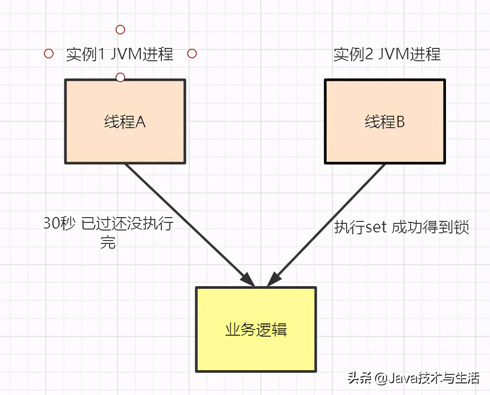

# 分布式锁

https://www.toutiao.com/a6888181072912187915/

## 什么是分布式锁呢？

分布式锁，就是在分布式系统中，用来解决共享资源的串行化的问题，解决单机锁在分布式系统中失效的问题。

那为什么单机锁在分布式系统中会失效呢？在JVM环境下，单机锁的实现是通过Synchronized，Lock来实现的。而分布式系统中，一个系统由多个节点的有机整合来实现，（即使是同一个节点的）不同的JVM实例是相互隔离的，无法锁住其他JVM实例的数据。

下面简单介绍一下分布式系统下的几个重要概念

* 单机锁

  单进程的系统中，存在多线程同时操作一个公共变量，此时需要加锁对变量进行同步操作，保证多线程的操作线性执行，消除并发修改，从而解决单进程中多线程的并发问题。

* 分布式锁

  应用场景是在集群模式的多个相同服务，可能会部署在多个不同的机器上，解决进程间安全问题，防止多进程同时操作一个变量或者数据库。解决的是多进程的并发问题。

* 事务

  **一次**会话过程中，用户的行为对所有**数据库**表的修改操作，要么全部成功，要么全部失败。

* 分布式事务

  分布式解决一个联动操作。具体内容，请参考[分布式事务原理](./Distributed_Transaction.md)。

## 分布式锁的基本概念

### 概念

* 只用于多任务环境中
* 多个任务都需要对**同一个资源进行写操作**
* 对资源的访问是互斥的（串行化）

### 状态

* 任务通过竞争获取锁才能对该资源进行操作（竞争锁）
* 当有一个任务在对资源进行更新时（占有锁）
* 其他任务都不可以对这个资源进行操作（任务阻塞）
* 知道该任务完成更新（释放锁）

### 特点

* 排他性：在同一时间只会有一个客户端能获得锁，其他客户端无法同时获取
* 避免锁死：这把锁在一段有限的时间之后，一定会释放（正常释放或异常释放）
* 高可用：获取或释放锁的机制必须高可用且性能佳

## 为什么需要分布式锁

#### 业务场景1: 数据库出现重复数据的问题

* 表单重复提交

* 刷单

* App重复请求

  

#### 业务场景2:用户下单库存超卖问题


当只有一个实例的时候，如上图，可以通过单机的Lock（多线程的各种同步机制）来解决串行化下单的问题，避免出现重复下单，重复和减库存问题。

当同一个服务多个节点部署时：


两次（或多次）请求达到不同的节点（实例），当两个（多个）用户对同一个商品下单的时候，如上图，会出现扣减两次（多次）库存。假如此时库存数量为1，那么扣减两次（多次）库存之后就会变为-1（-x，x>1），就出现了超卖的情况。

那么如何能防止超卖的场景发生呢？


假如两个节点获取的是同一把锁，就可以解决上面的问题。如上图，通过一个外部的存储存放一把“锁”，每次请求过来都需要先获得锁。假如我们通过一个变量A来获得锁，获得锁之后将值设置为1，释放锁时设置值为0。当有另外一个请求过来的时候，需要获得锁，当A的值为1时就要等待，直到A的值变为0（即别的节点释放了该锁）。

这样真能彻底地解决问题吗？如图所示，我们假设使用Redis来实现这个“锁”。看看相关的实现代码：

```java
public boolean getLock(Jedis jedis,String lockKey,String requestId,int expireTime){
        Long result = jedis.setnx(lockKey, requestId);
        if(result == 1){
            //若程序在这里崩溃，则会出现死锁
            jedis.expire(lockKey,expireTime);
            return true;
        }
        return false;
    }
```

假如在设置过期时间之前，程序奔溃了，出现了死锁，那么如何解决呢？这里出现该问题的原因就是：这里的“设置锁”和“设置锁过期时间”这两步操作不是**原子操作**。

改成如下形式：

```java
public boolean tryGetLock(Jedis jedis,String lockKey,String requestId,int expireTime){
        SetParams setParams = new SetParams();
        setParams.nx().px(expireTime);
        String result = jedis.set(lockKey, requestId,setParams);
        if("1".equals(result)){
            return true;
        }
        return false;
    }
```

原子操作问题解决了，貌似没有问题了。

我们再分析一下：


实际上还有会错误的删除锁的情况出现。如上图所示，节点A的请求成功获得了锁，设置了30秒的过期时间。



但是节点A执行的可能稍微慢了些，30秒过了还没有执行完，此时Redis就会自动“释放”此锁，而节点B就成功了获得了锁。


如果节点B刚刚获得了锁，节点A也刚刚好执行完，就会执行Del指令来“释放”该锁。不巧的是，节点B刚刚获得锁，正在执行。可想而知，节点A释放的是B的锁。

如何解决错误删除锁的问题呢？就是通过设置锁ID来避免。示例代码如下：

```java
public boolean tryGetLock(Jedis jedis,String lockKey,int expireTime){
        SetParams setParams = new SetParams();
        setParams.nx().px(expireTime);
        long threadId = Thread.currentThread().getId();
        String result = jedis.set(lockKey,String.valueOf(threadId),setParams);
        if("1".equals(result)){
            return true;
        }
        return false;
    }
```

```java
/**
 * 释放锁
 * @param jedis
 * @param lockKey
 */
public void  delLock(Jedis jedis,String lockKey){
    long threadId = Thread.currentThread().getId();
    if(String.valueOf(threadId).equals(jedis.get(lockKey))){
        jedis.del(lockKey);
    }
}
```
当然，使用Redis的话，可使用redisson作为客户端，已经封装好了分布式锁的实现。