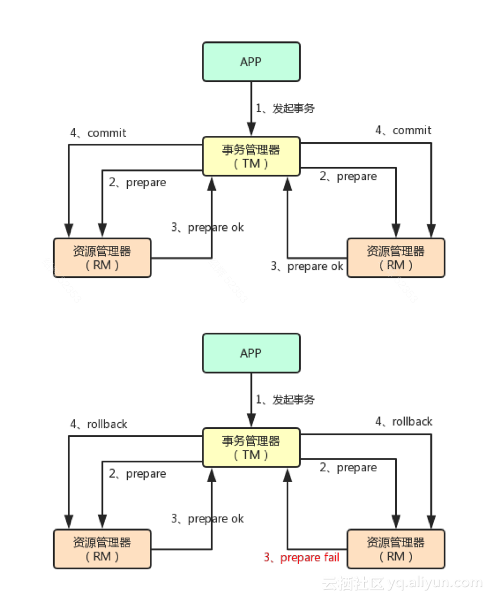
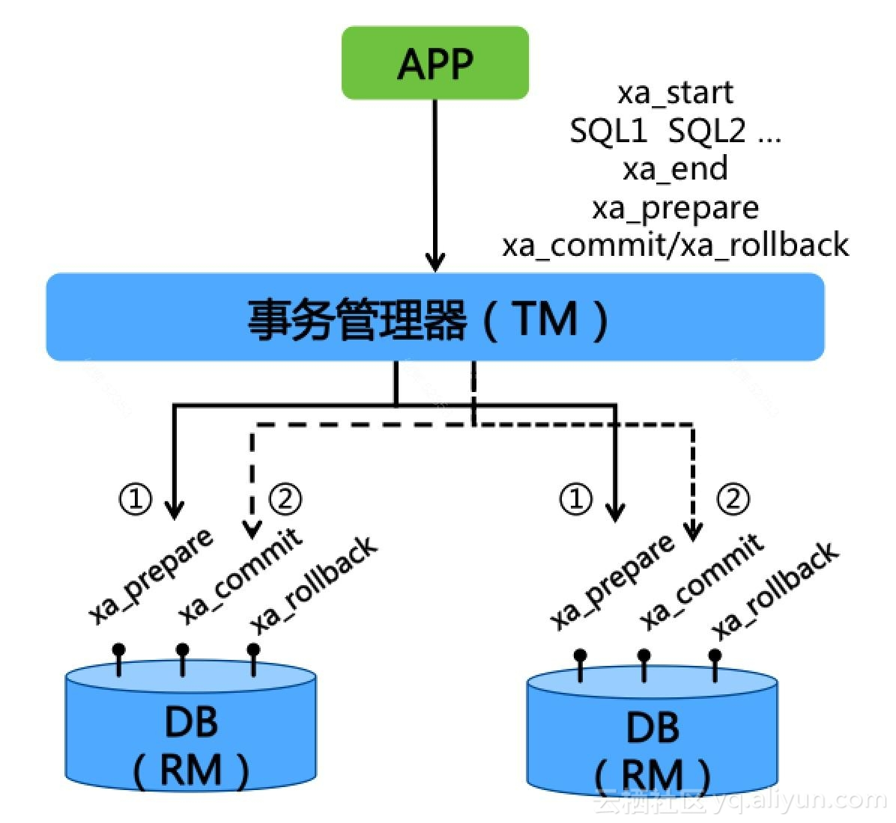
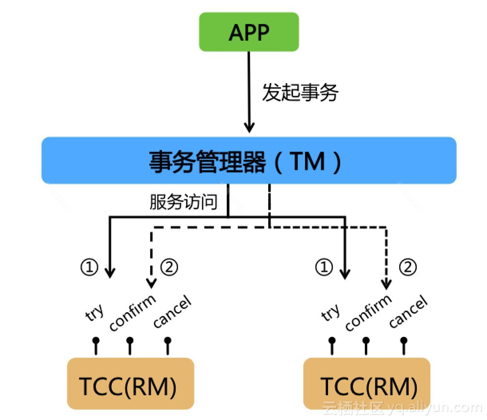

# 分布式事务原理

## 什么事分布式事务

分布式事务，就是指同一个事务的资源分别位于分布式系统的不同的节点上

## 分布式事务产生原因

### 数据库分库分表

由于业务量的扩展，数据量急剧扩张，原来的单库单表已经达到了使用数据库系统的极限。这种情况下，采取了分库、分表的方案来解决大数据量极限问题。

分库分表后，引入的新问题就是，原来单库单表下的事务操作，变成课跨库操作。每个数据库对事务的处理又是相对独立的。如何保证在多个库中完成一次“事务”操作，这就产生了分布式事务。

### 业务（微）服务化

随着业务的复杂度的提升，原来的单体服务变得越来越复杂，维护越来越艰难。这种情况下，就需要对原来的单体服务进行拆分，分解成多个相对独立的子服务。

拆成多个子服务后，原来的一个次事务操作，就需要跨越多个服务节点了。而每个服务节点对于请求的发起和结束又有各自独立的生命周期。如何保证一次事务请求在多个节点之间完成原来单体的效果，就产生了分布式事务，

## 分布式事务原理

### 事务的特性

一个事务，不论什么形式，都需要满足一下几个特性：

* 原子性（Atomicity）

  整个事务中的所有操作，要么成功，要么失败。从外界看来，操作只有“一个操作（动作）“。

* 一致性（Consistency）

  数据库中的数据，从一种一致性状态变换到另一种一致性状态。

* 隔离性（Isolation）

  事务的各个操作在执行过程中，不能被其他的事务（的操作）干扰。换句话说，一个事务内部的操作及使用的数据，对于其他的并行的事务是相互不可见的，使用的数据不会被其他并行的事务篡改，更改的数据也不应该影响到并行的其他事务。

* 持久性（DUrability）

  事务成功执行后，被事务修改的数据应该持久的保存在数据库中。

这四个特性，使用英文字母首位表示，就是我们常常提到的**ACID**。

### 实现方式

不论是单节点的事务，还是分布式事务，**都应该具备ACID**。

分布式事务为了实现**ACID**，通常的实现方式采取**两端提交**方式，英文缩写为**2PC**（Two Phase Commitment Protocol）。

2PC是分布式事务的基础协议。下面就来描述一下2PC。

#### 2PC

2PC协议需要一个**事务协调器**（缩写：TM, Transaction Manager），一个**资源管理器**（缩写：RM， Resource Manager）。后面使用这2个名词的缩写来表示。

TM和RM的关系如下：

一个TM协调管理多个RM的活动：

* 在第一阶段，所有的RM向TM汇报自身活动状态
* 在第二阶段，TM根据各个RM汇报的状态，来决定各RM是提交操作还是回滚操作。

可以通过一下的图来帮助理解：

1. 应用程序向TM提交请求，发起分布式事务；
2. 第一阶段，TM联络所有RM，通知它们执行“准备操作”；
3. RM返回“准备成功“的状态；或者”准备失败“的状态（响应超时也算失败）；
4. 第二阶段，如果所有RM均”准备成功“，TM会通知所有RM执行提交；如果有其中一个RM准备失败，TM会通知所有RM回滚；

可以看到，TM通过二个阶段的协调，使得所有RM的状态最终保持了一致：要么全部提交，要么全部回滚。

下面介绍一两个2PC协议的具体实现。

#### XA

XA是X/Open组织提出的，定义了TM与RM之间通讯的接口协议。XA协议由数据库实现，目前支持XA协议的RDMS有：Oracle，MySQL等。

XA定义了一些列的接口：

* xa_start: 启动XA事务
* xa_end: 结束XA事务
* xa_prepare: 准备阶段，XA事务预提交
* xa_commit: 提交XA事务
* xa_rollback: 回滚XA事务

1. 一个RDMS实现XA协议后，它可以作为一个RM参与到分布式事务中；

2. 在第一阶段，TM协调所有RDMS执行XA事务（xa_start, 用户SQL, xa_end），并完成XA事务与提交（xa_prepare）；

3. 在第二阶段，如果所有RDMS上XA的事务预提交均成功，那么TM协调所有RDMS提交XA事务（xa_commit）；如果有任何一个RDMS上XA的事务预提交失败，那么TM协调RDMS回滚XA事务（xa_rollback）；

##### TCC

TCC又是一个2PC方案的具体实现，TCC即： Try, Confirm, Cancel：

* Try操作对应2PC的第一阶段Prepare；

* Confirm对应2PC的第二阶段Commit；

* Cancel对应2PC的第二阶段Rollback；

TCC不像XA由系统实现，而是需要开发人员编码实现：

* Try：检测、预留资源；
* Confirm：业务系统执行提交；默认Confirm阶段是不会出错的，只要Try成功，Confirm一定成功；
* Cancel：业务取消，预留资源释放；

开发人员通过编码实现TCC并发布成服务，这个TCC服务就可以作为资源（RM）参与到分布式事务中；TM分2阶段协调所有TCC资源，使得所有TCC资源状态最终都一致：要么全部提交，要么全部回滚。

TCC自编码的特性决定TCC（RM）可以跨DB、跨应用实现资源管理，将对不同的DB访问、不同的业务操作通过编码方式转换成一个原子操作，解决了复杂业务场景下的事物问题；

同时TCC的每一个操作对于DB来说，都是一个本地的DB事务，操作结束则本地DB事务结束，数据库的资源也就释放了。这也就规避了数据库层面的2PC对资源占用导致的性能降低问题。

### 柔性事务 

前面提到的ACID规范，需要**同时满足**四项要求，要求非常严格，归属于“刚性事务”。从上面的介绍了解到，要让分布式事务要完全遵循ACID规范就比较困难了。

于是，人们在实际的工作总，总结了一套不那么严格的事物处理原则，大家称为“柔性事务”。那么这个“柔性事务”有什么特性呢？

对应于ACID，柔性事务的原则被称为**BASE理论**：

* BA：Basic Availability 基本业务可用性
* S： Soft state 柔性状态
* E： Eventual Consistency 最终一致性

BASE理论与ACID的对比：

* 原子性： 严格遵守
* 一致性： 事务**完成后**的一致性严格遵守；事务过程中的一致性适当放宽；
* 隔离性：并行事务不可影响；事务**中间结果可见性**允许安全放宽；
* 持久性：严格遵守

由此可知，BASE理论，遵循“基本可用，最终一致”原则。

#### 柔性事务分类

一般的，柔性事务分成一下几种：

* 两阶段型
* 补偿型
* 异步确保型
* 最大努力通知型

分别做个简约说明：

1. 两阶段型

   分布式事务两阶段提交，对应上面提到的XA，还有后来兴起的JTA/JTS。这是典型的模式。

2. 补偿型

   上面提到的TCC就是补偿型的代表。TCC的思路是，尽早释放锁；在Try成功的情况下，如果事务要回滚，Cancel将作为一个补偿机制，回滚Try操作；

   TCC各操作事务本地化，且尽早提交（放弃两阶段约束）；当全局事务要求回滚时，通过另一个本地事务实现“补偿”行为；

   TCC是将资源层的两阶段提交协议转换到业务层，成为业务模型中的一部分；

3. 异步确保型

   将一些同步阻塞的事务操作变为了异步，避免对数据库事务的争用；

4. 最大努力通知型

   通过通知服务器（消息通知）进行，允许失败，有补偿机制

### 附录：CAP原则

在1998年，加州大学的计算机科学家Eric Brewer提出分布式系统的三个指标：

* 一致性（Consistency）

  在分布式系统中，所有数据备份，在同一时刻是否同样值（即：所有节点访问同一份最新的数据副本）

* 可用性（Availability）

  在集群中一部分节点故障后，集群整体是否还能响应客户端的读写请求（对数据更新具备高可用性）

* 分区容错性（Partition Tolerance）

  以实际效果而言，分区相当于对通讯的限时要求。系统如果不能在时限内达到数据一致性，就意味着分生了分区的异常情况，必须就当前操作在C和A之间做出选择。

他认为，这3个指标不能同时满足，主要矛盾在于Consistency和Availability之间。

CAP原则的精髓就是：要么AP，要么CP，要么AC。但是，**不存在CAP**。

如果在某个分布式系统中数据无副本，那么系统必须满足强一致性条件，因为只有独一份数据，不会出现数据不一致的情况，此时具备了C和P两个要素，但是，如果系统发生了网络分区故障，那么必然导致某些服务（数据）不可访问。此时可用性条件就不能被满足，即此情况下只获得了CP系统。

而上面提到的BASE理论，就是CAP的一种解决方案。

