## 深度剖析 Apache EventMesh 云原生分布式事件驱动架构

原文：https://www.toutiao.com/article/7190652252108472835/?log_from=c22a55f1ee06c_1674697007963

### 一. 前言

近年来，随着微服务、云原生和 Serverless 概念的普及以及容器化技术的发展，事件驱动也再次成为热点，引起 IT 界广泛的关注。事件驱动架构是一种用于设计应用的软件架构和模型。**对于事件驱动系统而言，事件的捕获、通信、处理和持久保留是解决方案的核心结构**。事件驱动架构可以最大程度减少耦合度，很好地扩展与适配不同类型的服务组件，因此是现代化分布式应用架构的理想之选。

本文会从以下几个方面来剖析 Apache EventMesh 云原生分布式事件驱动架构：

- 什么是 EventMesh
- 云原生生态下的事件驱动架构模型
- EventMesh 架构
- EventMesh 的相关特性以及应用场景
- 总结回顾
- 未来规划与发展

### 二. 什么是EventMesh

Apache EventMesh 是一个用于解耦应用和后端中间件层的动态云原生事件驱动架构基础设施。它支持广泛的用例，包括复杂的混合云、使用了不同技术栈的分布式架构。

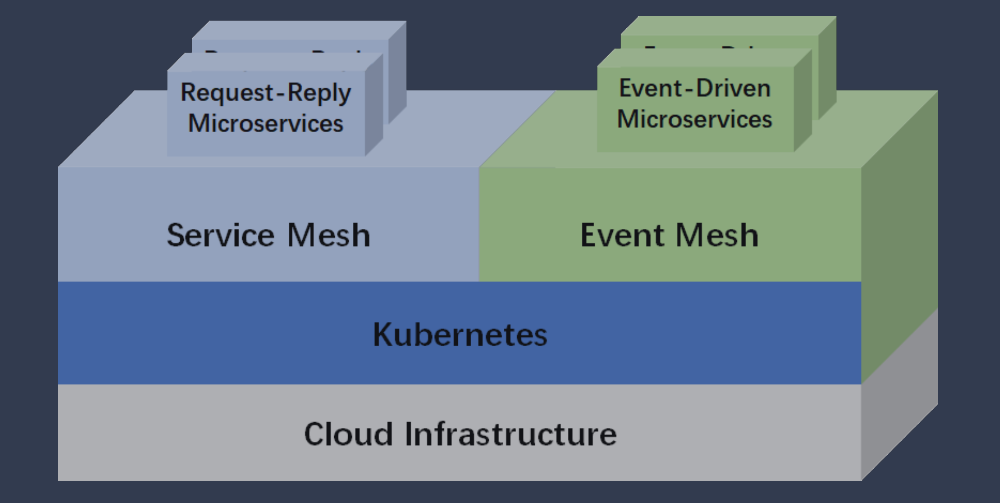

上图可以看到 EventMesh 所处的位置就是连接云应用和基础设施的一个中间层，EventMesh 与 Servcie Mesh 具有同等的定位，而且它本身支持云原生的部署方式并且可以在K8s上运行。

Servcie Mesh 更多的是继承RPC的服务，是同步调用，可能存在一定的耦合度。而对于 Event Mesh 来说，更多的是集成的事件驱动的微服务，这种微服务的特性就是松耦合和异步的。

### 三. 云原生生态下的事件驱动架构模型

#### 3.1 事件编排和计算

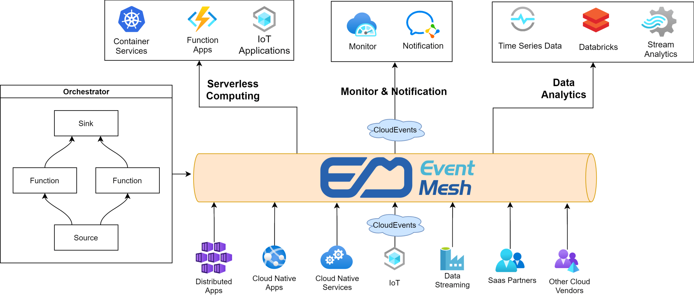

从上面这张图可以看出，EventMesh 可以接入的应用有很多：分布式应用、云原生应用和服务、IoT设备、数据流、云合作伙伴以及其他云厂商。通过标准的CloudEvent协议接入到EventMesh，通过这种事件驱动的架构，可以提高应用的弹性伸缩能力，因为它们借助 EventMesh 实现了通信的解耦。

EventMesh 内部具有 Orchestrator (编排器) 的能力，可以自定义数据源触发器以及实时处理函数，对于其他接收到的事件，Orchestrator 可以路由到上面这些服务，包括无服务的计算（像容器、函数、IoT应用）、监控或通知类服务、数据分析类服务。

#### 3.2 事件驱动 WebHook

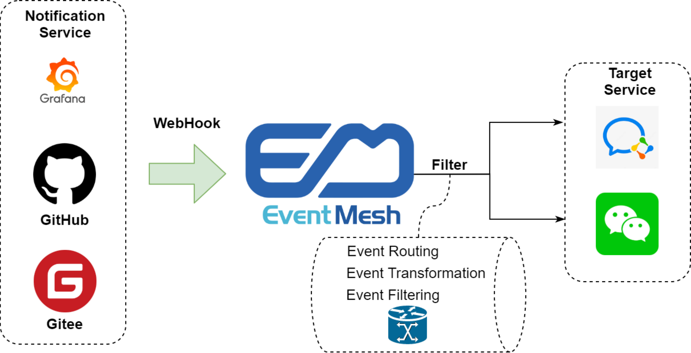 

举个例子，比如在Github 上提了一个 PR，其实都是可以配置这种 WebHook的，其实就是类似这种旁路消息的通知机制，有任何的变动，都会推送过来。对于通知服务来讲，它并不关注推送的目标是谁，并且也不关注产生的事件是如何使用的活着被谁使用的，它只关注产生事件就好。

那基于这样的场景接入到 EventMesh 的话，那 EventMesh 其实具备事件路由、事件转换、事件过滤的能力，可以基于这样的事件去配置相应的规则，比如正向过滤、排除过滤。

### 四. EventMesh架构

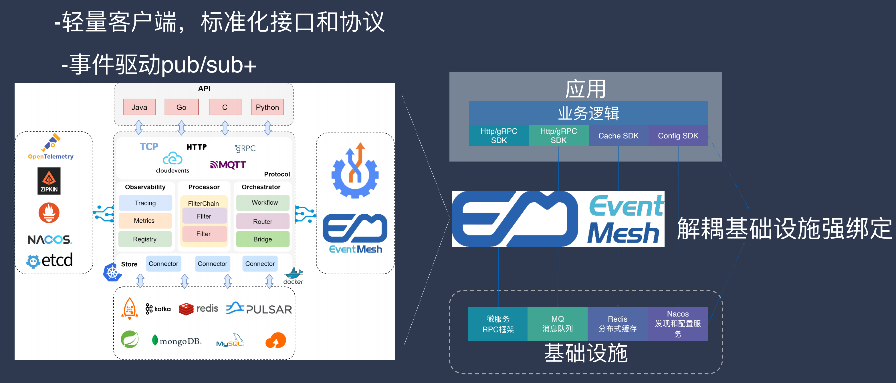

EventMesh 本身对外提供了轻量级客户段、标准化接口和协议。EventMesh的定位是基于应用与基础设施的中间层。应用通过轻量级客户端可以接入EventMesh，进而实现与基础设施强绑定的解耦。

上图的左边部分就是EventMesh内部的一个架构，EventMesh对外提供了不同类型的API，包括 Java、Go、C、Python等。左边最中间这部分其实是EventMesh的运行时状态，它本身支持集群化 Gateway 的方式部署，同时也支持容器化 Sidecar 的方式部署。

EventMesh 内部主要分成以下几个部分：协议、可观测性、处理器、编排以及存储。不同的部分都做了插件化处理，像协议部分支持HTTP、TCP、gRPC、MQTT，内部通信的话都会转成 CloudEvents，相当于适配器的功能。

### 五. EventMesh 的相关特性以及应用场景

#### 5.1 EventMesh 插件化设计

SPI（Service Provider Interface）机制

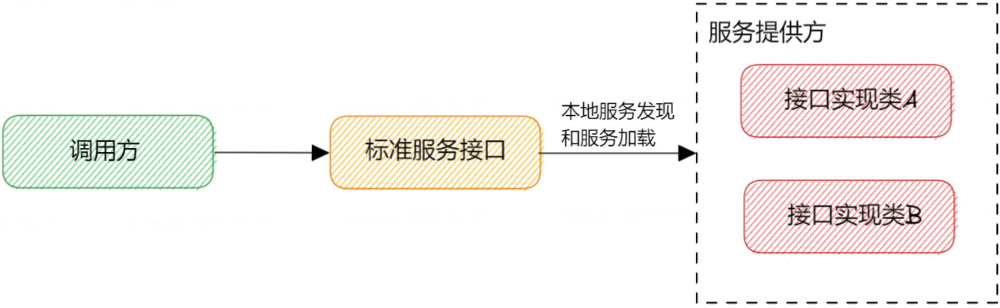

设计思路：遵循开闭原则，面向标准化接口编程 + 策略模式 + 配置文件，将运行时与插件解耦，便于扩展插件，以及运行态动态加载插件。

#### 5.2 Data Mesh

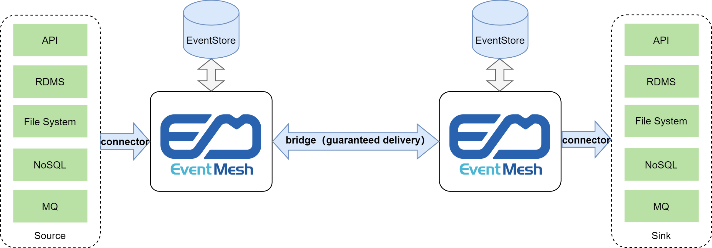

借助 EventMesh 可以将事件源与事件目标进行打通，比如左边的 RDMS 关系型数据库的数据发生了更新，EventMesh 将以通知的形式通知到事件目标比如MQ，这样就可以跨消息中间件、跨存储的一个同步。这里其实借助 EventMesh bridge 的能力，看起来只是像跨组件，但实际上两边的 EventMesh 可能不是一个集群的，它其实可以跨网络，往大的说还可以跨企业之间的联通，以及公有云与私有云的数据交换。

**场景一：跨网络区域流量复制**

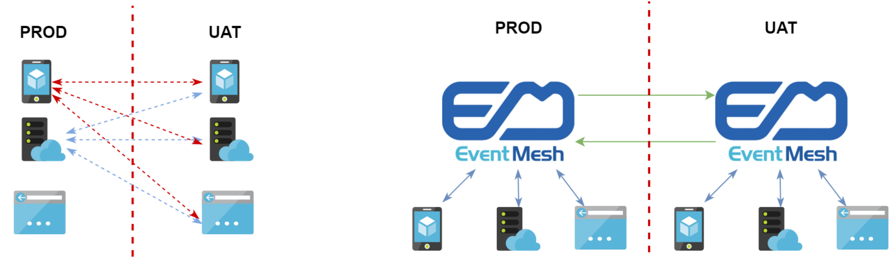

**场景二：跨事件存储数据传输**

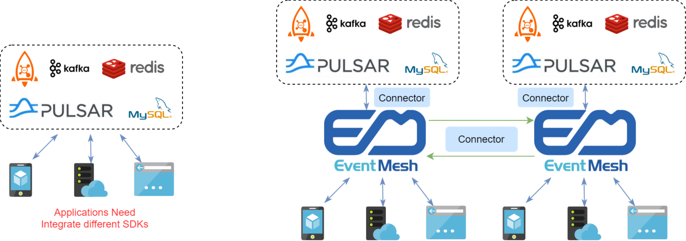

#### 5.3 EventMesh Workflow

**场景：电商场景**

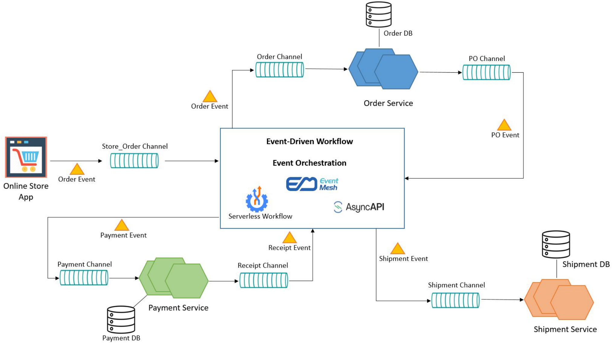

EventMesh 在整个事件驱动的这套系统中，起到的是事件编排的能力，EventMesh 会有无服务计算的工作流引擎，同时配合 AsyncAPI，AsyncAPI 可以定义这些服务节点的描述，Workflow的工作引擎是服务 Serviceless Workflow 规范标准的，通过这种方式可以完成一套工作流的定制与运作。

* online store app service DSL
* Order Service DSL
* Other Servcie DSLs

#### 5.4 EventMesh Workfow Engine

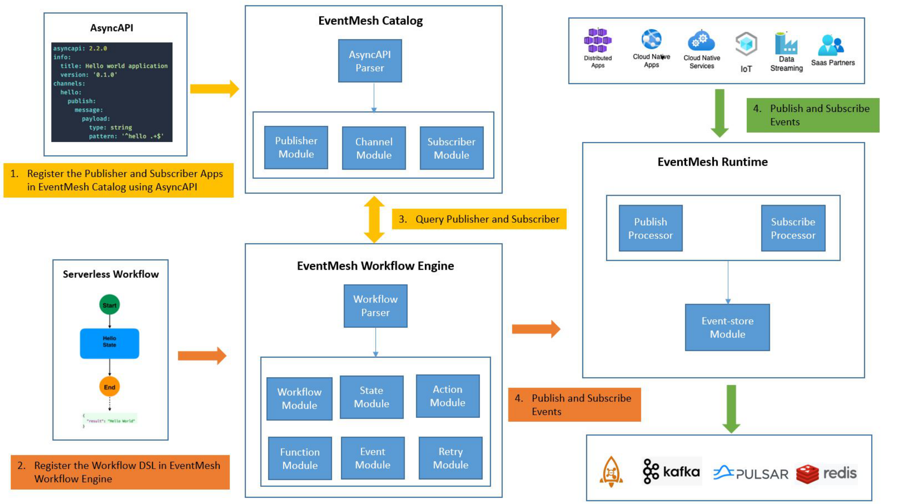

EventMesh Workflow Engine 主要分为三大块：EventMesh Catalog、EventMesh Workflow Engine、EventMesh Runtime。

对于 EventMesh Catalog 而言，其实就是对哪些服务定义了，定义了之后，通过 Catalog 内部的 AsyncAPI 解析器，解析出来 Publisher Module、Channel Module、Subscribe Module，这些节点在下面的工作流 DSL 定义，EventMesh Workflow Engine 解析到 Workflow 节点后，会跟 EventMesh Catalog 有个交互，会查询服务有哪些 Publisher 以及 Subscribe，Engine 这边触发了事件后，会发给 EventMesh Runtime，最后才会推送给下游的应用，整个一套 EventMesh Workflow Engine 是可以实现工作流的流转。

### 六. 总结

* 轻松构建松耦合、分布式事件驱动架构
* 开放兼容、原生支持 CloudEvent SDK 和 API，易于扩展
* 打破数据孤岛，支持企业全链接、数字化、多云协同

### 七. 未来发展和规划

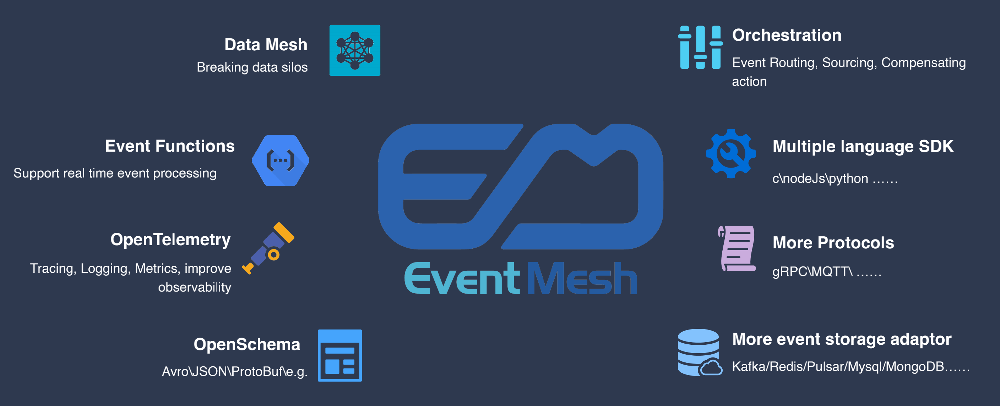