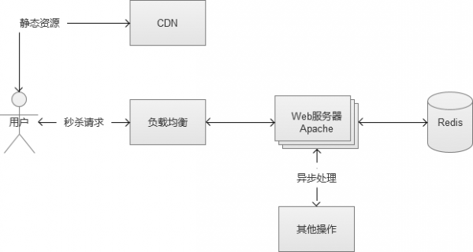

# 什么是高并发？超发的解决思路

原文：https://www.toutiao.com/a6881131466072424972/

## 一. 大规模并发带来的挑战

在过去的工作中，曾经面对过5w每秒的高并发秒杀功能。在这个过程中，整个Web系统遇到了很多的问题和挑战。如果Web系统不做针对性的优化，会轻而易举地陷入到异常状态。现在一起来讨论下，优化的思路和方法啊。

### 1.1 请求接口的合理设计

一个秒杀或者抢购页面，通常分为2个部分：一个是静态的HTML等内容；另一个就是参与秒杀的Web后台请求接口。

通常，静态HTML等内容，是通过CDN的部署，一般压力不大。所以核心瓶颈实际上在后台请求接口上。

这个后端接口，必须能够支持高并发请求，同时，非常重要的一点，必须尽可能“快”，在最短的时间里返回用户的请求结果。为了实现尽可能快这一点，接口的后端存储使用内存级别的操作会更好一点。显然直接面向 MySQL之类的数据库存储是不合适的，如果有这种复杂业务的需求，都建议采用异步写入。

当然，也有一些秒杀和抢购采用“滞后反馈”，就是说秒杀当下不知道结果，一段时间后才可能从页面中看到用户是否秒杀成功。但是，这种属于“偷懒”行为，同时给用户的体验也不好，容易被用户认为是“暗箱操作”。

### 1.2 高并发的挑战：一定要“快”

通常，衡量一个Web系统的吞吐率的指标是QPS（Query Per Second，每秒处理请求数）。解决每秒数万次的高并发场景，这个指标非常关键。举个例子，假设处理一个业务请求平均响应时间为100ms，同时， 系统内有20台Apache的Web服务器，配置MaxClients为500个（表示Apache的最大连接数目）。

那么，这个Web系统的理论峰值QPS为（理想化的计算方式）：
$$
20*500/0.1 = 100000 （10万QPS）
$$
哦？这个系统似乎很强大，1秒钟可以处理完10万的请求，5w/s的秒杀似乎是“纸老虎”哈。实际情况，当然没有这么理想。在高并发的实际场景下，机器都处于高负载的状态，在这个时候平均响应时间会被大大增加。

就Web服务器而言，Apache打开了越多的连接进程，CPU需要处理的上下文切换也越多，额外增加了CPU的消耗，然后就直接导致平均响应时间 增加。因此上述的MaxClient数目，要根据CPU、内存等硬件因素综合考虑，绝对不是越多越好。可以通过Apache自带的abench来测试一 下，取一个合适的值。然后，我们选择内存操作级别的存储的Redis，在高并发的状态下，存储的响应时间至关重要。网络带宽虽然也是一个因素，不过，这种 请求数据包一般比较小，一般很少成为请求的瓶颈。负载均衡成为系统瓶颈的情况比较少，在这里不做讨论哈。

那么问题来了，假设这个系统，在5w/s的高并发状态下，平均响应时间从100ms变为250ms（实际情况，甚至更多）：
$$
20*500/0.25 = 40000 （4万QPS）
$$
于是，这个系统剩下了4w的QPS，面对5w每秒的请求，中间相差了1w。

然后，这才是真正的恶梦开始。举个例子，高速路口，1秒钟来5部车，每秒通过5部车，高速路口运作正常。突然，这个路口1秒钟只能通过4部车，车流量仍然依旧，结果必定出现大塞车。（5条车道忽然变成4条车道的感觉）

同理，某一个秒内，20*500个可用连接进程都在满负荷工作中，却仍然有1万个新来请求，没有连接进程可用，系统陷入到异常状态也是预期之内。

其实在正常的非高并发的业务场景中，也有类似的情况出现，某个业务请求接口出现问题，响应时间极慢，将整个Web请求响应时间拉得很长，逐渐将Web服务器的可用连接数占满，其他正常的业务请求，无连接进程可用。

更可怕的问题是，是用户的行为特点，系统越是不可用，用户的点击越频繁，恶性循环最终导致“雪崩”（其中一台Web机器挂了，导致流量分散到其他正常工作的机器上，再导致正常的机器也挂，然后恶性循环），将整个Web系统拖垮。

### 1.3 重启与过载保护

如果系统发生“雪崩”，贸然重启服务，是无法解决问题的。最常见的现象是，启动起来后，立刻挂掉。这个时候，最好在入口层将流量拒绝，然后再将重启。如果是redis/memcache这种服务也挂了，重启的时候需要注意“预热”，并且很可能需要比较长的时间。

秒杀和抢购的场景，流量往往是超乎系统的准备和想象的。这个时候，过载保护是必要的。如果检测到系统满负载状态，拒绝请求也是一种保护措施。在前端设置过滤是最简单的方式，但是，这种做法是被用户“千夫所指”的行为。更合适一点的是，将过载保护设置在CGI入口层，快速将客户的直接请求返回。

## 二. 作弊手段：进攻和防守

秒杀和抢购收到了“海量”的请求，实际上里面的水分是很大的。不少用户，为了“抢“到商品，会使用“刷票工具”等类型的辅助工具，帮助他们发送尽可能多的请求到服务器。还有一部分高级用户，制作强大的自动请求脚本。这种做法的理由也很简单，就是在参与秒杀和抢购的请求中，自己的请求数目占比越多，成功的概率越高。

这些都是属于“作弊的手段”，不过，有“进攻”就有“防守”，这是一场没有硝烟的战斗哈。

### 2.1 同一个账号，一次性发出多个请求

部分用户通过浏览器的插件或者其他工具，在秒杀开始的时间里，以自己的账号，一次发送上百甚至更多的请求。实际上，这样的用户破坏了秒杀和抢购的公平性。

这种请求在某些没有做数据安全处理的系统里，也可能造成另外一种破坏，导致某些判断条件被绕过。例如一个简单的领取逻辑，先判断用户是否有参与记 录，如果没有则领取成功，最后写入到参与记录中。这是个非常简单的逻辑，但是，在高并发的场景下，存在深深的漏洞。多个并发请求通过负载均衡服务器，分配到内网的多台Web服务器，它们首先向存储发送查询请求，然后，在某个请求成功写入参与记录的时间差内，其他的请求或查询到的结果都是“没有参与记录”。 这里，就存在逻辑判断被绕过的风险。

**应对方案**

在程序入口处，一个账号只允许接受1个请求，其他请求过滤。不仅解决了同一个账号，发送N个请求的问题，还保证了后续的逻辑流程的安全。实现方案， 可以通过Redis这种内存缓存服务，写入一个标志位（只允许1个请求写成功，结合watch的乐观锁的特性），成功写入的则可以继续参加。

或者，自己实现一个服务，将同一个账号的请求放入一个队列中，处理完一个，再处理下一个。

### 2.2 多个账号，一次性发送多个请求

很多公司的账号注册功能，在发展早期几乎是没有限制的，很容易就可以注册很多个账号。因此，也导致了出现了一些特殊的工作室，通过编写自动注册脚 本，积累了一大批“僵尸账号”，数量庞大，几万甚至几十万的账号不等，专门做各种刷的行为（这就是微博中的“僵尸粉“的来源）。举个例子，例如微博中有转发抽奖的活动，如果使用几万个“僵尸号”去混进去转发，这样就可以大大提升中奖的概率。

这种账号，使用在秒杀和抢购里，也是同一个道理。例如，iPhone官网的抢购，火车票黄牛党。

**应对方案**

这种场景，可以通过检测指定机器IP请求频率就可以解决，如果发现某个IP请求频率很高，可以给它弹出一个验证码或者直接禁止它的请求：

1. 弹出验证码，最核心的追求，就是分辨出真实用户。因此，大家可能经常发现，网站弹出的验证码，有些是“鬼神乱舞”的样子， 有时让用户根本无法看清。他们这样做的原因，其实也是为了让验证码的图片不被轻易识别，因为强大的“自动脚本”可以通过图片识别里面的字符，然后让脚本自动填写验证码。实际上，有一些非常创新的验证码，效果会比较好，例如给你一个简单问题让你回答，或者让你完成某些简单操作（例如百度贴吧的验证码）
2. 直接禁止IP，实际上是有些粗暴的，因为有些真实用户的网络场景恰好是同一出口IP的，可能会有“误伤“。但是这一个做法简单高效，根据实际场景使用可以获得很好的效果

### 2.3 多个账号，不同IP发送不同请求

所谓道高一尺，魔高一丈。有进攻，就会有防守，永不休止。这些“工作室”，发现你对单机IP请求频率有控制之后，他们也针对这种场景，想出了他们的“新进攻方案”，就是不断改变IP。

有同学会好奇，这些随机IP服务怎么来的。有一些是某些机构自己占据一批独立IP，然后做成一个随机代理IP的服务，有偿提供给这些“工作 室”使用。还有一些更为黑暗一点的，就是通过木马黑掉普通用户的电脑，这个木马也不破坏用户电脑的正常运作，只做一件事情，就是转发IP包，普通用户的电脑被变成了IP代理出口。通过这种做法，黑客就拿到了大量的独立IP，然后搭建为随机IP服务，就是为了挣钱。

**应对方案**

说实话，这种场景下的请求，和真实用户的行为，已经基本相同了，想做分辨很困难。再做进一步的限制很容易“误伤“真实用户，这个时候，通常只能通过设置业务门槛高来限制这种请求了，或者通过账号行为的”数据挖掘“来提前清理掉它们。

僵尸账号也还是有一些共同特征的，例如账号很可能属于同一个号码段甚至是连号的，活跃度不高，等级低，资料不全等等。根据这些特点，适当设置参与门槛，例如限制参与秒杀的账号等级。通过这些业务手段，也是可以过滤掉一些僵尸号。

### 2.4 火车票的抢购

看到这里，同学们是否明白你为什么抢不到火车票？如果你只是老老实实地去抢票，真的很难。通过多账号的方式，火车票的黄牛将很多车票的名额占据，部分强大的黄牛，在处理验证码方面，更是“技高一筹“。

高级的黄牛刷票时，在识别验证码的时候使用真实的人，中间搭建一个展示验证码图片的中转软件服务，真人浏览图片并填写下真实验证码，返回给中转软件。对于这种方式，验证码的保护限制作用被废除了，目前也没有很好的解决方案。

因为火车票是根据身份证实名制的，这里还有一个火车票的转让操作方式。大致的操作方式，是先用买家的身份证开启一个抢票工具，持续发送请 求，黄牛账号选择退票，然后黄牛买家成功通过自己的身份证购票成功。当一列车厢没有票了的时候，是没有很多人盯着看的，况且黄牛们的抢票工具也很强大，即使让普通购票人看见有退票，也不一定能抢得过他们哈。

最终，黄牛顺利将火车票转移到买家的身份证下。

**解决方案**

并没有很好的解决方案，唯一可以动心思的也许是对账号数据进行“数据挖掘”，这些黄牛账号也是有一些共同特征的，例如经常抢票和退票，节假日异常活跃等等。将它们分析出来，再做进一步处理和甄别。

## 三. 高并发下的数据安全

大家都知道，在多线程写入同一个文件的时候，会存现“线程安全”的问题（多个线程同时运行同一段代码，如果每次运行结果和单线程运行的结果是一 样的，结果和预期相同，就是线程安全的）。如果是MySQL数据库，可以使用它自带的锁机制很好的解决问题，但是，在大规模并发的场景中，是不推荐使用 MySQL的。秒杀和抢购的场景中，还有另外一个问题，就是“超发”。如果在这方面控制不慎，会产生发送过多的情况。大家也曾经听说过，某些电商搞抢购活动，买家成功拍下后，商家却不承认订单有效，拒绝发货。这里的问题，也许并不一定是商家奸诈，而是系统技术层面存在超发风险导致的。

### 3.1 超发的原因

假设某个抢购场景中，假设一共只有100个商品，在最后一刻，已经消耗了99个商品，仅剩最后一个。这个时候，系统发来多个并发请求，这批请求读取到的商品余量都是99个，然后都通过了这一个余量判断，最终导致超发。（同文章前面说的场景）

在上面的这个图中，就导致了并发用户B也“抢购成功”，多让一个人获得了商品。这种场景，在高并发的情况下非常容易出现。

### 3.2 悲观锁思路

解决线程安全的思路很多，可以从“悲观锁”的方向开始讨论。

悲观锁，也就是在修改数据的时候，采用锁定状态，排斥外部请求的修改。遇到加锁的状态，就必须等待。

虽然上述的方案的确解决了线程安全的问题，但是，别忘记，真是的场景是“高并发”。也就是说，会很多这样的修改请求，每个请求都需要等待 “锁”，某些线程可能永远都没有机会抢到这个“锁”，这种请求就会死在那里。同时，这种请求会很多，瞬间增大系统的平均响应时间，结果是可用连接数被耗 尽，系统陷入异常。

### 3.3 FIFO 队列思路

那好，那么稍微修改一下上面的场景，直接将请求放入队列中的，采用FIFO（First Input First Output，先进先出），这样的话，就不会导致某些请求永远获取不到锁。看到这里，是不是有点强行将多线程变成单线程的感觉哈。

然后，现在解决了锁的问题，全部请求采用“先进先出”的队列方式来处理。那么新的问题来了，高并发的场景下，因为请求很多，很可能一瞬间将队列内存“撑爆”，然后系统又陷入到了异常状态。或者设计一个极大的内存队列，也是一种方案。但是，系统处理完一个队列内请求的速度根本无法和疯狂涌入队列中的数目相比。也就是说，队列内的请求会越积累越多，最终Web系统平均响应时候还是会大幅下降，系统还是陷入异常。

### 3.4 乐观锁思路

这个时候，就可以讨论一下“乐观锁”的思路了。乐观锁，是相对于“悲观锁”采用更为宽松的加锁机制，大都是采用带版本号 （Version）更新。实现就是，这个数据所有请求都有资格去修改，但会获得一个该数据的版本号，只有版本号符合的才能更新成功，其他的返回抢购失败。 这样的话，就不需要考虑队列的问题，不过，它会增大CPU的计算开销。但是，综合来说，这是一个比较好的解决方案。

有很多软件和服务都“乐观锁”功能的支持，例如Redis中的watch就是其中之一。通过这个实现，我们保证了数据的安全。

## 四. 小结

互联网正在高速发展，使用互联网服务的用户越多，高并发的场景也变得越来越多。电商秒杀和抢购，是两个比较典型的互联网高并发场景。虽然解决问题的具体技术方案可能千差万别，但是遇到的挑战却是相似的，因此解决问题的思路也异曲同工。

## 五. 关于并发

通过上面的抢购和秒杀的例子来探讨并发的出现场景及处理高并发的相应技术。

### 5.1 什么是并发？

在互联网时代，所讲的并发、高并发，通常是指并发访问。也就是在某个时间点，有大量（多少个）访问同时到来。（PV（page view）即页面浏览量）

一台服务器在单位时间里能处理的请求越多，服务器的能力越高，也就是服务器并发处理能力越强。服务器的本质工作就是，争取以最快的速度将内核缓冲区中的用户请求数据一个不剩地都拿出来，然后尽快处理，再将响应数据放到一块又能够与发送数据的缓冲区中，接着处理下一拨请求。

### 5.2 衡量服务器并发处理能力指标

高并发相关常用的一些指标有：

* **响应时间**（Response Time）：系统对请求做出响应的时间。例如系统处理一个HTTP请求需要200ms，这个200ms就是系统的响应时间
* **吞吐量**（Throughput）：单位时间内处理的请求数量
* **每秒查询率QPS**（Query Per Second）：每秒响应请求数。在互联网领域，这个指标和吞吐量区分的没有这么明显
* **并发用户数**：同时承载正常使用系统功能的用户数量。例如一个即时通讯系统，同时在线量一定程度上代表了系统的并发用户数

等等。

### 5.3 如何提高服务器的并发处理能力

#### 5.3.1 提高单机性能

1. 提高CPU并发计算能力：

   * 多进程 & 多线程

   * 减少进程切换，使用线程，考虑进程绑定CPU

   * 减少使用不必要的锁，考虑无锁编程

   * 考虑进程优先级

   * 关注系统负载

   * 关注CPU使用率，除了用户空间和内核空间的CPU使用率以外，还要关注I/O wait

2. 减少系统调用

3. 考虑减少内存分配和释放：

   * 改善数据结构和算法复制度
   * 使用内存池
   * 考虑使用共享内存

4. 考虑使用持久连接

5. 改进I/O模型：

   * DMA技术

   * 异步I/O

   * 改进多路I/O就绪通知策略，epoll

   * Sendfile

   * 内存映射（MAPP）

   * 直接I/O

6. 改进服务器并发策略：

   * 一个进程处理一个连接，非阻塞I/O，使用长连接
   * 一个进程处理多个连接，异步I/O,使用长连接

7. 改进硬件环境

#### 5.3.2 分布式开发架构，增加机器数量

其实还可以通过减少无用请求来降低服务器的压力。例如微博的僵尸粉，购票的黄牛。

### 5.4 总结

高并发（High Concurrency）是互联网分布式系统架构设计中必须考虑的因素之一，它通常是指，通过设计保证系统能够同时并行处理很多请求。

提高系统并发能力的方式，方法论上主要有两种：垂直扩展（Scale Up）与水平扩展（Scale Out）。前者垂直扩展可以通过提升单机硬件性能，或者提升单机架构性能，来提高并发性，但单机性能总是有极限的，互联网分布式架构设计高并发终极解决方案还是后者：水平扩展。

互联网分层架构中，各层次水平扩展的实践又有所不同：

1. 反向代理层可以通过“DNS轮询”的方式来进行水平扩展
2. 站点层可以通过nginx来进行水平扩展
3. 服务层可以通过服务连接池来进行水平扩展
4. 数据库可以按照数据范围，或者数据哈希的方式来进行水平扩展

各层实施水平扩展后，能够通过增加服务器数量的方式来提升系统的性能，做到理论上的性能无限。

## 六. 多线程和并发的关系

### 6.1 多线程

1. Java在语言层面支持多线程。多线程开发难度降低了很多
2. Java的多线程是一种编程思想，一个程序执行之后就成为一个进程，所谓的多线程就是在一个进程中有多个线程存在，在宏观上是多个线程同时运行，可以使进程同时完成多件事，微观上是cpu在多个线程之间切换，在某一时刻还是执行一个线程

### 6.2 并发

1. 并发一般指 "并发访问"，如若干应用程序从不同的客户端同时访问同一个服务器端的数据库，服务器应用一定的承受能力处理并发的请求，并发请求被进程或是进程里面的线程处理，并发访问用并发编程处理其实最好的解决办法就是多线程
2. 并发编程是多线程编程的一种应用
3. 无论你是做web开发，还是数据库开发，还是桌面开发，都会用到多线程的
4. 因为有并发的这个实际的需求，所以出现了多线程

### 6.3 多线程与并发的关系

1. 高并发不是JAVA的专有的东西，是语言无关的广义的，为提供更好互联网服务而提出的概念。

   举个极端的例子，就是100个人，1人分配1台web服务器，那么服务器资源是他们独占的，他们不需要抢占服务器资源，100个请求被100台服务器并行处理，速度必定很快，这就是高并发。当然这是不可能的，但是，我们总是努力去做，让少量的服务器也能达到近似的能力。这就需要服务器的HTML画面，后台业务逻辑，db数据存取等等细节上的处理都达到一个并行的极致，以此来实现整个服务器对所有请求的高并行。这是战略上的并行。

   多线程只是为了达到高并发目的，在某个细节点上，为实现某并发功能而采用的一种具体的实现方法，这种功能也可以由多进程实现，当然，也可以由多进程，多线程一起实现。这是战术上的并行。

   那么可以说，高并发是目的，多线程是某种手段（不是唯一的），高并发可以由多线程实现，但是多线程不代表就是高并发。

2. 并发与多线程之间的关系就是目的与手段之间的关系

   并发（Concurrent）的反面是串行。串行好比多个车辆行驶在一股车道上，它们只能“鱼贯而行”。而并发好比多个车辆行驶在多股车道上，它们可以“并驾齐驱”。

   并发的极致就是并行（Parallel）。

   多线程就是将原本可能是串行的计算“改为”并发（并行）的一种手段、途径或者模型。因此，有时也称多线程编程为并发编程。

   当然，目的与手段之间常常是一对多的关系。并发编程还有其他的实现途径，例如函数式（Functional programming）编程。多线程编程往往是其他并发编程模型的基础，所以多线程编程的重要性不言而喻。

综合上面几点可以看出：

并发，就是服务器同时处理多个请求的能力，而处理并发的最好的办法，就是采用多线程。cpu快速调用不同的就绪队列，看起来好像是同步进行，实际还是一个线程一个线程的处理的，但这样，就大大提高了服务器的效率，减少了线程的等待时间。

即可以这么理解：多线程是处理高并发的一种编程方法。即并发需要用多线程实现。

当有海量的请求时，服务器没有连接的进程可用，系统就会产生异常。

## 七. 多线程使用场景

### 7.1 多线程使用场景

1. 如果做 java web方面开发的话几乎用不到多线程！因为有多线程的地方 servlet 容器或者其他开发框架都已经实现掉了！

   一般在网络应用程序中使用多线程的地方非常多！另外，拷贝文件使用多线程，是没有用的！以多线程来提高效率的场景一般在 CPU 计算型，而不是在 IO 读写型。CPU 可以会有多个核心并行处理计算，但是磁盘 IO 就没这功能了，磁头只有一个，根本不可能靠多线程提高效率！一般来说，磁盘 IO 的并发能力为 0，也就是说无法支持并发！网络 IO 的话由于带宽的限制的，使用多线程处理最多也只能达到带宽的极值。对于磁盘 IO 来说，多线程可以用于一个线程专门用于读写文件，其他的线程用于对读取数据进行处理，这样才有可能更好地利用 CPU 资源。如果仅仅是单纯的文件复制，使用多线程操作的话，会使用磁头在磁盘上不停地进行寻道操作，使得效率更为低下！

2. 压力测试时，会用到多线程

3. 服务器编程时，会用到多线程

4. 使用监听器时，可能会用到多线程

5. 跑 Job 时，可能会用到多线程

6. 还有一种极为普遍的使用多线程的场景是UI编程，一般UI界面绘制于主线程。为了不阻塞主线程让用户体验更流畅，需要创建单独的线程处理耗时操作，处理完了再更新主界面，典型的案例就是android应用开发

7. 一些C/S模式比如说网络游戏（基于socket协议）一般在服务器那边处理的时候一个客户端，一个线程；还有就是一些银行软件，用到了线程同步等等

### 7.2 高并发事件的出现场景

1. 服务器在每秒内处理请求数是一定，当访问量太大时，没有多余的进程来处理这些请求，就会造成系统的瘫痪。系统崩溃，例如前段时间微博的瘫痪，就是短时间内流量太大了，导致系统处于异常状态，页面无法显示，用户无法登陆等；电商中抢购，秒杀中出现超发的情况，多个用户同时购买同一物品，访问修改同一数据等情况
2. 由于购票、查询和浏览的数量激增，12306网站每天访问量比平时增长数十倍，经常出现登录难的现象，近日甚至出现了付款不出票、系统干脆瘫痪的情况。网络订票原本是一项便民利民的措施，却由于铁道部未正确预估网站并发情况、技术支持不足而导致相反的结果。IT业界人士纷纷指出，12306网站瘫痪最大的原因是“技术之罪”。并针对高并发网站引发的技术考验，纷纷献技献策、展开讨论，提出了很多具指导意义的技术解决方案
3. 此次12306网站难登录并瘫痪是系统架构规划的问题，导致不能有效支持大并发量集中访问。同时，12306在IT管理上也有问题，未能进行有效的压力测试和运行模拟

### 7.3 高并发下出现的超发问题的解决方案

#### 7.3.1 电商项目中的场景

1. 在点击购物车的提交订单按钮时，会判断库存是否足够，不足，会拒绝提交订单

2. 当库存只有一件时，两个客户，或多个客户经过在购物车提交订单判断，在订单页面进行支付时判断，同时都满足了购买一件产品的需求，那么，让谁购买成功？岂不是多个用户同时都支付了这同一件商品？这种情况就是超发，下面将解决高并发下的这种超发的问题

3. 例子：

   假设库存有6个。有A、B两个客户。A购买1个；B客户购买6个：

   1. 在点击提交订单时，两者同时判断库存满足，进入到订单界面
   2. 然后 A先支付完成，在支付时，减少库存（此时做判断，如果库存足够，支付成功，否则支付失败）--->PS：跟12306购票系统相似
   3. 然后B慢一步也进入到支付，判断，此时库存只有5个，不让支付，支付失败
   4. 如果两者同时进行支付呢？怎么改变库存，让谁购买成功？这就涉及到了加锁，同步的问题。下面就讨论这个问题的解决方案

#### 7.3.2 超发的解决思路

一般意义上的**加锁**指两个层面：

* 代码层面。如java中的同步锁，典型的就是同步关键字synchronized ；

* 数据库层面。如悲观锁（物理锁）和乐观锁。

##### 7.3.2.1 悲观锁

解决线程安全的思路很多，可以从“悲观锁”的方向开始讨论。悲观锁，也就是在修改数据的时候，采用锁定状态，排斥外部请求的修改。遇到加锁的状态，就必须等待。虽然上述的方案的确解决了线程安全的问题，但是，别忘记，我们的场景是“高并发”。也就是说，会很多这样的修改请求，每个请求都需要等待“锁”，某些线程可能永远都没有机会抢到这个“锁”，这种请求就会死在那里。同时，这种请求会很多，瞬间增大系统的平均响应时间，结果是可用连接数被耗尽,系统陷入异常。

悲观锁：通过数据库的 forupdate 字段实现加锁。for update要放到mysql的事务中，即begin和commit中，否则则不起作用。

##### 7.3.2.2 FIFO队列

那好，那么稍微修改一下上面的场景，直接将请求放入队列中的，采用FIFO（First Input First Output，先进先出），这样的话，就不会导致某些请求永远获取不到锁。看到这里，是不是有点强行将多线程变成单线程的感觉哈。

然后，现在解决了锁的问题，全部请求采用“先进先出”的队列方式来处理。那么新的问题来了，高并发的场景下，因为请求很多，很可能一瞬间将队列内存“撑爆”，然后系统又陷入到了异常状态。或者设计一个极大的内存队列，也是一种方案，但是，系统处理完一个队列内请求的速度根本无法和疯狂涌 入队列中的数目相比。也就是说，队列内的请求会越积累越多，最终Web系统平均响应时候还是会大幅下降，系统还是陷入异常。

##### 7.3.2.3 乐观锁

这个时候，就可以讨论一下“乐观锁”的思路了。乐观锁，是相对于“悲观锁”采用更为宽松的加锁机制，大都是采用带版本号（Version）更新。实现就是，这个数据所有请求都有资格去修改，但会获得一个该数据的版本号，只有版本号符合的才能更新成功，其他的返回抢购失败。这样的话，我们就不需要考虑队列的问题，不过，它会增大CPU的计算开销。但是，综合来说，这是一个比较好的解决方案。有很多软件和服务都“乐观锁”功能的支持，例如Redis中的watch就是其中之一。通过这个实现，保证了数据的安全。

举例：

> 修改版本号，version。
>
> 假设数据库中帐户信息表中有一个 version字段，当前值为 1 ；而当前帐户余额字段（ balance ）为 $100 。
>
> 1. 操作员 A 此时将其读出（ version=1 ），并从其帐户余额中扣除 $50（100-50）
>
> 2. 在操作员 A 操作的过程中，操作员 B 也读入此用户信息（ version=1 ），并 从其帐户余额中扣除 $20 （100-20 ）。
>
> 3. 操作员 A完成了修改工作，将数据版本号加一（ version=2 ），连同帐户扣 除后余额（ balance=$50 ），提交至数据库更新，此时由于
>    提交数据版本大 于数据库记录当前版本，数据被更新，数据库记录 version 更新为 2 
>
> 4. 操作员 B 完成了操作，也将版本号加一（ version=2 ）试图向数据库提交数据（ balance=$80 ），但此时比对数据库记录版本时发现，
>    操作员 B提交的 数据版本号为 2 ，数据库记录当前版本也为 2 ，不满足“ 提交版本必须大于记 录当前版本才能执行更新 “ 的乐观锁策略，
>    因此，操作员 B 的提交被驳回。 这样，就避免了操作员 B 用基于version=1 的旧数据修改的结果覆盖操作员 A 的操作结果的可能。

从上面的例子可以看出，乐观锁机制避免了长事务中的数据库加锁开销（操作员 A和操作员 B 操作过程中，都没有对数据库数据加锁），大大提升了大并发量下的系统整体性能表现。

*问题：如果两个人同时提交事务呢？*

#### 7.3.3 数据库相关

## 八. 对对线程、高并发的理解

### 8.1 对多线程、高并发的了解

### 8.2 实际编码

