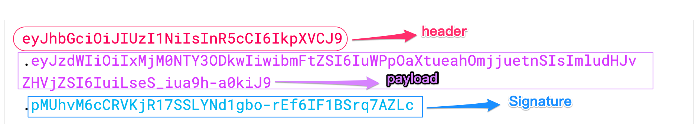

# JWT，你必须了解的认证登录方案

原文：https://xie.infoq.cn/article/6b40282148451df8073209a8d

JWT 全称是 JSON Web Token，是目前非常流行的跨域认证解决方案，在单点登录场景中经常使用到。

JWT 就是一种Cookie-Session改造版的具体实现，让你省去自己造轮子的时间，JWT 还有个好处，那就是你可以不用在服务端存储认证信息（比如 token），完全由客户端提供，服务端只要根据 JWT 自身提供的解密算法就可以验证用户合法性，而且这个过程是安全的。

如果你是刚接触 JWT，最有疑问的一点可能就是： JWT 为什么可以完全依靠客户端(比如浏览器端)就能实现认证功能，认证信息全都存在客户端，怎么保证安全性？

## JWT数据结构

JWT 最后的形式就是个字符串，它由**头部**、**载荷**与**签名**这三部分组成，中间以「**.**」分隔。像下面这样：

### 头部

### 载荷

### 签名

### 使用方式

### 如何保证安全

### 别人拿走了还安全吗

### 一个问题

## 常用的JWT库

