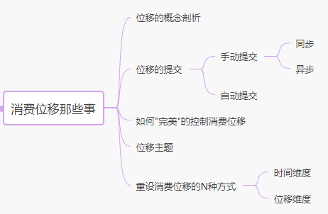

# 消费位移

原文：https://www.cnblogs.com/liuyanling/p/13149400.html


Kafka 中的**位移**是一个极为重要的概念，因为数据的一致性、准确性是一个很重要的议题，所有的消费者都不希望消息重复消费或者丢失。而**消费者位移**就是控制消费进度的大佬。一下就是这篇文章的内容提要：



## 概念剖析

### Kafka的两种位移

关于位移（Offset），其实在 Kafka 中有两种：

* **分区位移**：生产者向分区写入消息，每条消息在分区中的位置信息由一个叫做 offset 的数据来表征。假设一个生产者向一个空的分区写入 10 条消息，那么这 10 条消息的位移依次是 0、1、2、…… 9
* **消费位移**：消费者需要记录消费进度，即消费到了哪个主题哪个分区的哪个位置上，这就是**消费位移**（consume offset）

注意，这里的“消费位移”与上面所说的消息在分区上的位移（分区位移）完全不是一个概念。上面的“位移”表征的是分区内的消息位置，它是不变的。即一旦消息被成功写入到一个分区上，它的位移就是固定的了。而消费位移则不同，它相当于一个指针，它随着消费的变化而变化，表示消费者消费消息的指示器。

### 消费位移

消费位移，记录的是 Consumer 要消费的下一条消息的位移。<font color='red'>**切记，是下一条消息的位移**</font>，不是最新消费消息的位移。

假设一个分区中有10条消息，位移分别是 0 到 9。某个 Consumer 应用已消费了 5 条消息，这就说明该 Consumer 消费位移为 0 到 4 的 5 条数据，此时 Consumer 的位移是 5，指向了吓一跳的位移。

至于为什么要消费位移，很好理解。当 Consumer 发生故障重启之后，就能从 Kafka 中读取之前提交的位移值，然后从相应的位移处继续消费，从而避免了整个消费过程重来一遍。类似于书签，可以快速定位到上次读书的位置，从而继续往下读。

那么，Kafka 如何记录、保存、管理这个消费位移的呢？


## 位移的提交

每个Consumer 需要上报自己针对每个patition的消费位移数据。这个汇报的过程称为位移提交。因为 Consumer 能够同时消费多个分区的数据，所以**消费位移的提交实际上是在分区粒度**上进行的，即 Consumer 需要为分配给它的每个分区提交自己的消费位移数据。

鉴于消费位移提交甚至是位移管理对 Consumer 端的巨大影响，Kafka Consumer API 提供了多种提交位移的方案。每一种都有各自的用途。

```java
void commitSync(Duration timeout);
void commitSync(Map<TopicPartition, OffsetAndMetadata> offsets);
void commitSync(final Map<TopicPartition, OffsetAndMetadata> offsets, final Duration timeout);
void commitAsync();
void commitAsync(OffsetCommitCallback callback);
void commitAsync(Map<TopicPartition, OffsetAndMetadata> offsets, OffsetCommitCallback callback);
```

先粗略的总结一下：消费位移提交分为**自动提交**和**手动提交**。而手动提交又分为同步提交和异步提交（从上面的 API 也看得出来，分成了同步和异步）。

### 自动提交

当消费者配置了 ***enable.auto.commit=true*** 时，表示消费者自动提交消费位移。

自动提交消费位移是发生在什么时候呢？

***auto.commit.interval.ms*** 默认值是 *50000ms*，即 Kafka 每隔 5s 会自动提交一次消费位移。自动消费位移提交的动作是在 ***poll()*** 方法的逻辑里完成的。在每次真正向服务端发起拉取请求之前会检查是否可以进行消费位移提交。如果可以，那么就会提交上一次轮询的位移。假如消费数据量特别大，可以设置得短一点儿。

越简单的东西功能越不足。自动提交消费位移省事的同时，肯定也带来了一些问题。自动提交带来重复消费和消息丢失的问题：

* **重复消费**：在默认的情况下，Consumer 每 5 秒自动提交一次位移。假设提交位移之后的 3秒 发生了 Rebalance 操作。在 Rebalance 之后，所有 Consumer 从上一次提交的位移处继续消费，但该位移已经是 3秒 前的位移数据了，故在 Rebalance 发生前 3秒 消费的数据都要重新再消费一次。虽然可以通过减少 ***auto.commit.interval.ms***  的值来提高提交频率，但这么做只能缩小重复消费的窗口，不可能完全消除。
* **消息丢失**：假设拉取了100 条消息，正在处理第 50 条消息的时候，到达了自动提交窗口期，自动提交线程将拉取到的每个分区的最大消息位移进行提交。如果此时消费服务挂了，剩下的 50条消息并没有被处理，但提交了最大位移。重启后就从 101 条消息开始消费，发生了 51 - 100 条消息丢失

### 手动提交

当消费者配置了 ***enable.auto.commit=false*** 时，表示消费者采用手动提交消费位移。

用户必须在适当的时机（一般是处理完业务逻辑后），手动的调用相关的 API 来完成消费位移的提交。下面的代码是一个示例，当业务逻辑返回 true 之后，再手动提交位移：

```java
while (true) {
     try {
         ConsumerRecords<String, String> consumerRecords = 
               consumer
                 .poll(Duration
                       .ofMinutes(KafkaConfig.pollTimeoutOfMinutes));
         if (!consumerRecords.isEmpty()) {
             for (ConsumerRecord<String, String> record : consumerRecords) {
                 KafkaMessage kafkaMessage = 
                     JSON.parseObject(record.value(),KafkaMessage.class);
                 // 处理业务
                 boolean handleResult = handle(kafkaMessage);
                 if (handleResult) {
                     log.info(" handle success, kafkaMessage={}" ,kafkaMessage);
                 } else {
                     log.info(" handle failed, kafkaMessage={}" ,kafkaMessage);
                 }
             }
             // 所有的消息都处理完成了，手动提交offset - 同步方式
             consumer.commitSync(Duration.ofMinutes(KafkaConfig.pollTimeoutOfMinutes));
         } 
     } catch (Exception e) {
         log.info("kafka consume error." ,e);
     }
 }
```

手动提交明显能解决消息丢失的问题，因为是在处理完**所有消息**的业务逻辑之后再提交的。但是，假如此时消费服务挂了，消息并未处理结束，那么重启之后还是会重复消费。

Kafka 对于业务层面的失败导致消费未被消费成功，是无法处理的。因为业务层的逻辑太多变化，而 Kafka 并不会去处理业务次相关的东西。只能消费者自己解决，做好日志记录等。

目前为止，**手动提交消费位移解决了消息丢失问题，但是不能解决重复消费问题**。

### 同步提交

上面的示例代码采用**同步提交**的方式。此时，Consumer 的进程会被阻塞，等待 Broker 返回提交结果。同步模式下，提交失败的时候一直尝试提交，直到遇到无法重试的情况下才会结束。

在任何系统中，因为程序而非资源限制而导致的阻塞都可能是系统的瓶颈，会影响整个应用程序的 TPS。当然，可以选择拉长提交间隔，但这样做的后果是 Consumer 的提交频率下降，在下次 Consumer 重启回来后，会有更多的消息被重复消费。因此，为了了解这些不足，Kafka还提供了异步提交的方式。

### 异步提交

异步提交会立即返回，不会阻塞，因此不影响 Consumer 应用的 TPS。由于它是异步的，**Kafka 提供了回调函数**，用于实现提交之后（成功或者失败）的逻辑。比如记录日志，异常处理等等。下面代码展示了调用 *commitAsync()* 的方法：

```java
consumer.commitAsync((offsets, exception) -> {
 if (exception != null)
     handleException(exception);
 });
```

但是**异步提交有一个问题：它没有重试机制** 。只能说一般情况下，不进行重试也不会有太大问题，因为如果提交失败是因为临时问题导致的，那么后续的提交总会有成功的。所以消息也是不会丢失和重复消费的。

假如这是发生在关闭消费者或者再均衡（Rebalance）的最有一次提交呢？那就要确保能够提交成功。因此，组合使用 commitAsync() 和 commitSync() 是最佳的方式：

```java
try {
    while (true) {
        ConsumerRecords<String, String> consumerRecords = 
            consumer
               .poll(Duration
                  .ofMinutes(KafkaConfig.pollTimeoutOfMinutes));
        if (!consumerRecords.isEmpty()) {
             for (ConsumerRecord<String, String> record : consumerRecords) {
                KafkaMessage kafkaMessage = 
                    JSON.parseObject(record.value(), KafkaMessage.class);
                boolean handleResult = handle(kafkaMessage);             
             }
             //先来一次异步提交位移               
             consumer.commitAsync((offsets, exception) -> {
             if (exception != null)
                 handleException(exception);
             });
           
        }
    }
} catch (Exception e) {
    System.out.println("kafka consumer error:" + e.toString());
} finally {
    try {
        //最后同步提交位移
        consumer.commitSync();
    } finally {
        consumer.close();
    }
}
```


## 让位移条更加灵活和可控

上面的Demo代码，实际上是存在如下问题的：

* 所有的提交，都是提交 ***poll***  方法返回的所有的消息的位移（类似于批量提交）。poll 方法一次返回 1000 条消息，则一次性的提交 1000 条消息的位移。如果处理过程中出现了问题，位移就没法提交了，下次会重复消费已经处理过的消息。此时，可以自己控制提交的粒度，比如每处理 100 条提交一次，分10次提交。那么如何做呢？

  可以通过 ***commitSync<Map<TopicPartition, OffsetAndMetadata>)***  和 ***commitAsync<Map<TopicPartition, OffsetAndMetadata>)***  对位移进行精确的控制。

* **poll 和 commit 方法对于普通的开发而言是一个黑盒**，无法精确的掌控消费的具体位置，即不知道挑的是哪个partition的offset，也不知道offset的具体值。如何破？

  可以通过 ***record.topic()*** 获取 topic 信息， ***record.partition()*** 获取分区信息， ***record.offset() + 1*** 获取位移信息（*消费位移是指向下一条消费的位置，所以+1*）

* 开发人员如何自己管理 offer ？自己管理offset，更加保险、安全。把 offset 存入自己的数据库中，当 consumer 重启之后可以精准的从数据库读取最后的 offset ，就不存在丢失或者重复消费了。如何做呢？ 

  通过使用 ***consumer.seek( offset_value)***  方法指定从某个位移开始消费，而这个offset_value 就存在自己的数据库中

综上几个优化点，可以给出一个比较靠谱的解决方案：**联合异步提交和同步提交，对处理过程中所有的异常都进行处理。细粒度的控制消费位移的提交，并且把消费位移信息记录到自己的数据库中，重启consumer应用时，从数据库读取offset的值。**

这个逻辑已经抽象成了下面的抽象类，可以直接集成使用：

```java
public abstract class PrefectCosumer {
    private Map<TopicPartition, OffsetAndMetadata> offsets = new HashMap<>();
    int count = 0;
    public final void consume() {
        Properties properties = PropertiesConfig.getConsumerProperties();
        properties.put("group.id", getGroupId());
        Consumer<String, String> consumer = new KafkaConsumer<>(properties);
        consumer.subscribe(getTopics());
        consumer.poll(0);
        // 把offset记录到数据库中 从指定的offset处消费 
        consumer.partitionsFor(getTopics()).stream().map(info ->
        new TopicPartition(getTopics(), info.partition()))
        .forEach(tp -> {
               consumer.seek(tp, JdbcUtils.queryOffset().get(tp.partition()));   
         });
        try {
            while (true) {
                ConsumerRecords<String, String> consumerRecords = 
                    consumer.poll(Duration.ofMinutes(KafkaConfig.pollTimeoutOfMinutes));
                if (!consumerRecords.isEmpty()) {
                    for (ConsumerRecord<String, String> record : consumerRecords) {

                        KafkaMessage kafkaMessage = 
                            JSON.parseObject(record.value(), KafkaMessage.class);
                        boolean handleResult = handle(kafkaMessage);
                        if (handleResult) {
                            // 注意：提交的是下一条消息的位移。所以OffsetAndMetadata 对象时，
                            // 必须使用当前消息位移加 1。
                            offsets.put(new TopicPartition(record.topic(), 
                                                           record.partition()),
                                    new OffsetAndMetadata(record.offset() + 1));

                            // 细粒度控制提交 每10条提交一次offset
                            if (count % 10 == 0) {
                                // 异步提交offset
                                consumer.commitAsync(offsets, (offsets, exception) -> {
                                    if (exception != null) {
                                        handleException(exception);
                                    }
                                    // 将消费位移再记录一份到数据库中
                                    offsets.forEach((k, v) -> {
                                        String s = "insert into kafka_offset( +
                                            "`topic`,`group_id`,`partition_id`,`offset`) " +
                                            values" +
                                                " ('" + k.topic() + "','" + 
                                            getGroupId() + "'," + 
                                            k.partition() + "," + v.offset() + ")" +
                                                " on duplicate key update " +
                                            " offset=values(offset);";
                                        JdbcUtils.insertTable(s);
                                    });
                                });
                            }
                            count++;
                        } else {         
                            System.out.println("消费消息失败 kafkaMessage={}" + getTopics() +
                                               getGroupId() + kafkaMessage.toString());                         
                        }
                    }
                }
            }
        } catch (Exception e) {
            System.out.println("kafka consumer error:" + e.toString());
        } finally {
            try {
                // 最后一次提交 使用同步提交offset
                consumer.commitSync();
            } finally {
                consumer.close();
            }
        }
    }
    
    /**
     * 具体的业务逻辑
     *
     * @param kafkaMessage
     * @return
     */
    public abstract boolean handle(KafkaMessage kafkaMessage);

    public abstract List<String> getTopics();

    public abstract String getGroupId();

    void handleException(Exception e) {
        //异常处理
    }
}
```


## 控制位移提交的N种方式

自己控制位移，使用seek方法可以指定offset消费。那到底怎么控制位移？怎么重设消费组位移？seek是什么？现在就来仔细说说。

并不是所有的消息队列都可以重设消费者组位移达到重新消费的目的。比如传统的RabbitMq，它们处理消息是一次性的，即一旦消息被成功消费，就会被删除。而Kafka消费消息是可以重演的，因为它是基于日志结构（log-based）的消息引擎，消费者在消费消息时，仅仅是从磁盘文件上读取数据而已，所以消费者不会删除消息数据。同时，由于位移数据是由消费者控制的，因此它能够很容易地修改位移的值，实现重复消费历史数据的功能。

了解如何重设位移是很重要的。假设这么一个场景，已经消费了1000条消息后，发现处理逻辑错了，所以需要重新消费一下，可是位移已经提交了，到底该怎么重新消费这1000条呢？？假设想从某个时间点开始消费，又该如何处理呢？

首先说个误区：`auto.offset.reset=earliest/latest`这个参数大家都很熟悉，但是初学者很容易误会它。大部分朋友都觉得在任何情况下把这两个值设置为`earliest`或者`latest` ，消费者就可以从最早或者最新的offset开始消费,但实际上并不是那么回事,他们生效都有一个前提条件,那就是对于同一个groupid的消费者,如果这个topic某个分区有已经提交的offset,那么无论是把auto.offset.reset=earliest还是latest,都将失效,**消费者会从已经提交的offset开始消费**。因此这个参数并不能解决用户想重设消费位移的需求。

kafka有七种控制消费组消费offset的策略，主要分为**位移维度**和**时间维度**，包括：

* **位移维度**：这是指根据位移值来重设。也就是说，直接把消费者的位移值重设成给定的位移值。包括Earliest/Latest/Current/Specified-Offset/Shift-By-N策略
* **时间维度**：可以给定一个时间，让消费者把位移调整成大于该时间的最小位移；也可以给出一段时间间隔，比如 30 分钟前，然后让消费者直接将位移调回 30 分钟之前的位移值。包括DateTime和Duration策略

说完了重设策略，就来看一下具体应该如何实现，可以从两个角度，API方式和命令行方式。

### 重设位移的方法之 API 方式

API方式只要记住用seek方法就可以了，包括seek，seekToBeginning 和 seekToEnd。

```java
void seek(TopicPartition partition, long offset);    
void seek(TopicPartition partition, OffsetAndMetadata offsetAndMetadata);    
void seekToBeginning(Collection<TopicPartition> partitions);    
void seekToEnd(Collection<TopicPartition> partitions);    
```

从方法签名可以看出`seekToBeginning`和`seekToEnd`是可以一次性重设n个分区的位移，而seek 只允许重设指定分区的位移，即为每个分区都单独设置位移，因为不难得出，如果要自定义每个分区的位移值则用seek，如果希望kafka帮你批量重设所有分区位移，比如从最新数据消费或者从最早数据消费，那么用seekToEnd和seekToBeginning。

### Earliest策略：从最早的数据开始消费

从主题当前最早位移处开始消费。这个最早位移不一定就是0，因为很久远的消息会被 Kafka 自动删除，主要取决于删除配置。

代码如下：

```java
Properties properties = PropertiesConfig.getConsumerProperties();
properties.put("group.id", getGroupId());
Consumer<String, String> consumer = new KafkaConsumer<>(properties);
consumer.subscribe(getTopics());
consumer.poll(0); // 会阻塞，直到获得所需的元数据
consumer.seekToBeginning(
consumer.partitionsFor(getTopics()).stream().map(partitionInfo ->
   new TopicPartition(getTopics(), partitionInfo.partition()))
   .collect(Collectors.toList()));
```

首先是构造 Consumer 对象，这样可以通过 partitionsFor 获取到分区的信息，然后就可以构造出 TopicParttion 集合，传递给 seekToBeginning 方法。注意：需要用 ***consumer.poll(0)***， 而**不能**用 ***consumer.poll(Duration.ofMillis(0))***

在 ***poll(0)*** 中 consumer 会一直阻塞直到它成功获取了所需的元数据信息，之后它才会发起 fetch 请求去获取数据。而 ***poll(Duration)*** 会把元数据获取计算入整个超时时间。由于本例中使用的是 0， 即瞬间超时，因此 consumer 根本无法再这么短的时间内连接上 coodinator，所以只能赶在超时前返回一个空集合。

### Latest策略：从最新的数据开始消费

```java
consumer.seekToEnd(
       consumer.partitionsFor(getTopics().get(0))
                 .stream()
                 .map(partitionInfo ->
            new TopicPartition(getTopics().get(0), 
                               partitionInfo.partition()))
              .collect(Collectors.toList()));
```

### Current 策略：从当前已经提交的offset处消费

```java
consumer.partitionsFor(getTopics().get(0)).stream().map(info ->
        new TopicPartition(getTopics().get(0), info.partition()))
        .forEach(tp -> {
            long committedOffset = consumer.committed(tp).offset();
            consumer.seek(tp, committedOffset);
        });
```

### Special-Offset策略：从制定的 offset 处消费

该策略使用的方法和current策略一样，区别在于，current策略是直接从kafka元信息中读取中已经提交的offset值，而special策略需要用户自己为每一个分区指定offset值，我们一般是把offset记录到数据库中然后可以从数据库去读取这个值。

```java
consumer.partitionsFor(getTopics().get(0)).stream().map(info ->
                new TopicPartition(getTopics().get(0), 
                                   info.partition()))
                .forEach(tp -> {
                    try {
                        consumer.seek(tp, 
                               JdbcUtils.queryOffset()
                                      .get(tp.partition()));
                    } catch (SQLException e) {
                        e.printStackTrace();
                    }
                });
```

以上演示了用API方式重设位移，演示了四种常见策略的代码，另外三种没有演示，一方面是大同小异，另一方面在实际生产中，用API的方式不太可能去做时间维度的重设，而基本都是用命令行方式。


## 提交的位移都去哪儿了？

通过上面的介绍，已经搞懂了位移提交的方方面面。那么提交的位移保存在哪儿了呢？Kafak 把位移保存在了一个叫做 ***_consumer_offsets*** 的内部主题中，叫做“位移主题”。	

注意：老版本的 Kafka 其实就是把位移保存在 ZooKeeper 中的，但是 ZK 并不适合这种高频写的场景，所以新版已经改进了这个方案，直接保存到 Kafka内部。毕竟 Kafka 本身更适合高频写入的场景，并且 Kafka 也可以保证高可用性和高持久性。

既然它也是主题（Topic），那么离不开分区和副本这两个机制。***_consumer_offsets*** 这个主题并不需要手动去创建，而是 Kafka 自动创建的。分区的数量取决于 Broker 端惨数 ***offsets.topic.num.partitions***，默认是 50 个分区，而副本参数取决于 ***offsets.topic.replication.factor***， 默认是3。

既然也是主题，肯定也是会有消息，那么消息格式是什么样的呢？参考前面手动设计将位移写入数据库的方案，保存了 ***topic, group_id, partition, offset*** 四个字短。topic, group_id, partition 无疑是数据表中的联合主键，而 offset 是不断更新的。所以，Kafka 的位移主题的消息也是类似的设计。Key 也是这三个字短，而消息体则复杂很多，可以简单的理解为就是 offset 的值。

既然是主题，也肯定有删除策略，否则消息会无限膨胀。但是，位移主题的删除策略和其他主题删除策略不大一样。普通主题的删除是可以通过配置删除时间、或者大小的，而位移主题删除，叫做 **Compaction**。Kafka 使用 Compact 策略来删除主题位移中的过期消息对于同一个 Key 的两条消息 M1 和 M2，如果 M1 的发送时间早于 M2， 那么 M1 就是过期消息。Compact 的过程就是扫描日志的所有消息，剔除那些过期的消息，然后把剩下的消息整理在一起。

Kafka 提供了专门的后台线程定期的巡检待 Compact 的主题，看看是否存在满足条件的可删除数据。这个后台线程叫做 Log Cleaner。很多实际生产环境中都出现过位移主题无限膨胀占用过多磁盘空间的问题。如果遇到这类问题，可以检查一下 Log Cleaner 线程的状态，通常都是这个线程挂掉导致的。

## 总结

Kafka 的位移是个极其重要的概念，控制者消费进度，也控制着消费的准确性，完整性。为了保证消息不重复和不丢失，最好做到以下几点：

* 手动提交位移
* 手动提交有异步提交和同步提交两种方式，各有利弊，所以可以结合起来使用
* 细粒度的控制消费位移的提交，可以避免重复消费的问题
* 保守的将消费位移再记录到了数据库中，重启消费端应用时可以从数据库读取位移