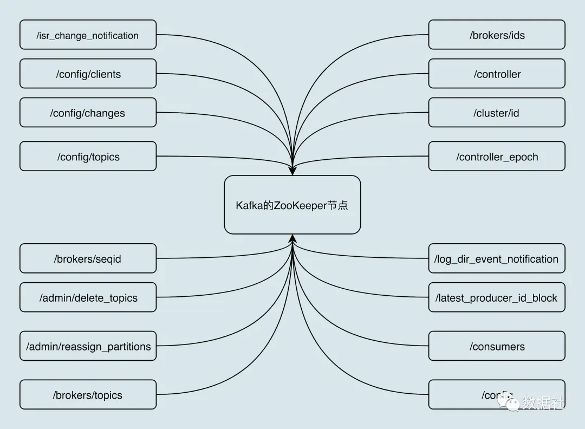
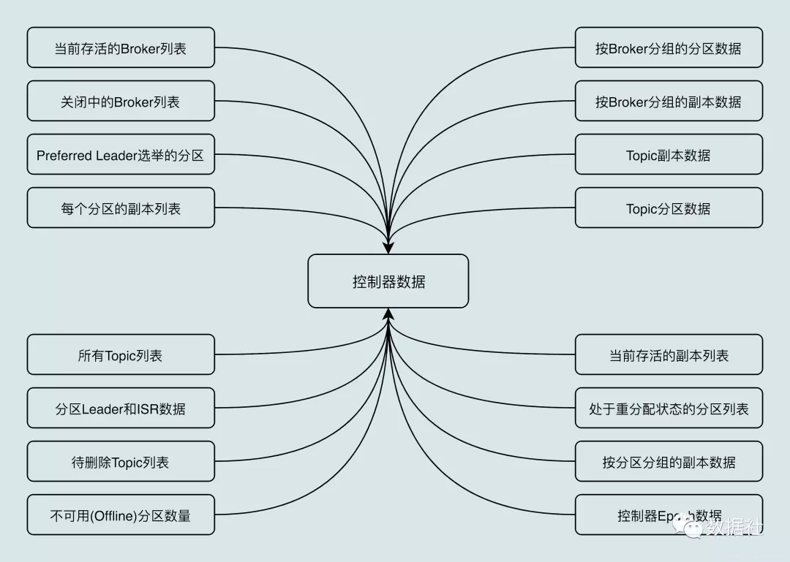
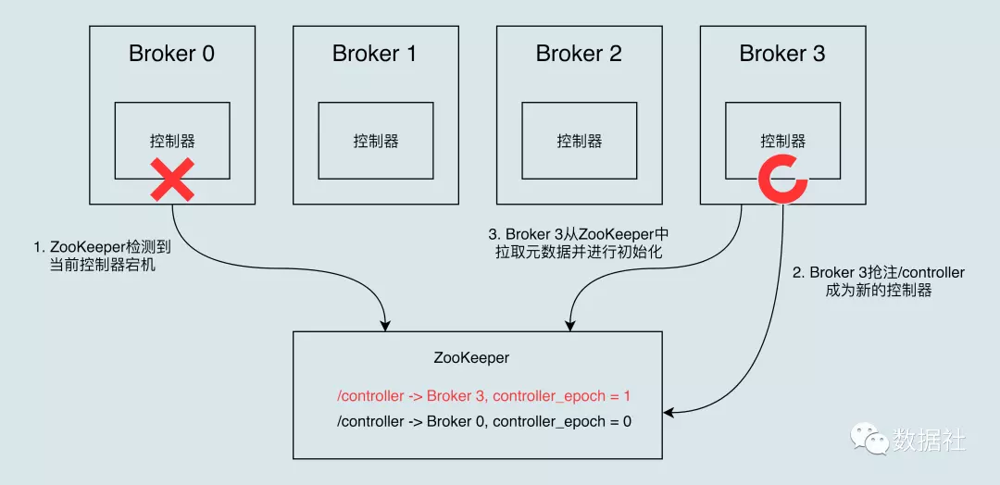
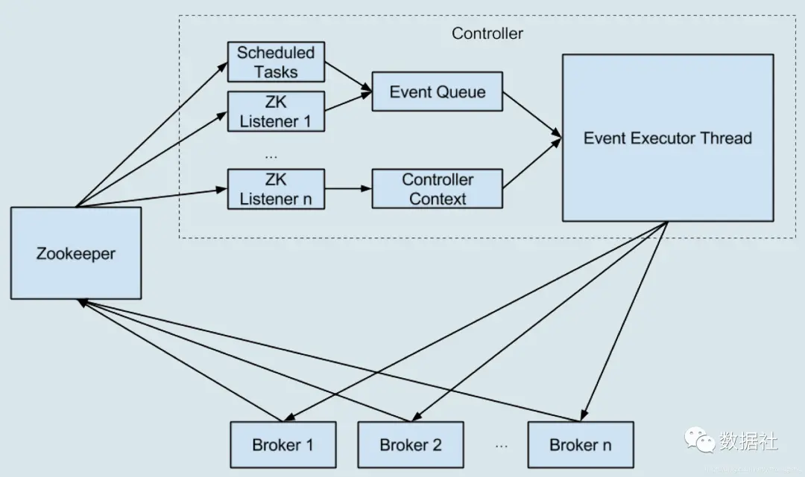

# Kafka的控制器controller详解

原文：https://www.cnblogs.com/qinchaofeng/p/13706965.html

## 一 控制器简介

​        控制器组件（Controller），是 Apache Kafka 的核心组件。它的主要作用是在 Apache ZooKeeper 的帮助下，管理和协调整个 Kafka 集群。集群中任意一台 Broker 都能充当控制器的角色，但是，**在运行过程中，只能有一个 Broker 称为控制器**，行使其管理和协调的职责。换句话说，每个正常运行的 Kafka 集群，在任意时刻都有且只有一个控制器。

​        官网上有个名为 activeController 的JMX 指标，可以帮助实时监控控制器的存活状态。这个 JMX 指标非常关键，在实际运维操作过程中，一定要实时查看这个指标的值。

​        下面介绍控制器（Controller）的内部原理和运行机制。

## 二 控制器的原理和内部运行机制

### 2.1 ZooKeeper 介绍

​        开始之前，需要先介绍 Apache ZooKeeper，因为控制器是重度依赖ZooKeeper的。因此，有必要花一些时间学习下 ZooKeeper。

​        ZooKeeper 是**一个提供高可靠性的分布式协调服务框架**。它使用的数据模型类似于文件系统的树形结构，根目录也是以 “/” 开始。该结构上的每个节点被称为 ***znode***，用来保存一些元数据协调信息。如果以 znode 持久化来划分，znode 可以分为“***持久性 znode***” 和“***临时性 znode***”。持久性 znode 不会因为 ZooKeeper 集群重启而消失，而临时 znode 则与创建该 znode 的ZooKeeper 会话绑定，一定会话结束，该节点会被自动删除。

​        ZooKeeper 赋予客户端监控 znode 变更的能力，即所谓的 watch 通知功能。一旦 znode 节点被创建、删除、子节点数量发生变化，亦或是 znode 所存的数据本身变更，ZooKeeper 会通过节点变更监听器（ChangeHandler）的方式显式通知客户端。

​        依托于这些功能，ZooKeeper 常被用来实现集群成员管理、分布式锁、领导者选举等功能。Kafka 控制器大量使用 watch 功能实现对集群的协调管理。下图，展示的是 Kafka 在 ZooKeeper 中创建的 znode 分布。暂时不用去理解每个 znode 的作用，但大致能体会到 Kafka 对 ZooKeeper 的依赖。

### 2.2 控制器是如何被选出来的

​        那么控制器是如何被选出来的呢？前面提过，每台 Broker 都能充当控制器，那么，当集群启动后，Kafka 会怎么确认控制器位于哪台 Broker 呢？

​        实际上，Broker 启动时，会尝试去 ZooKeeper 中创建 /controller 节点。**Kafka 当前选举控制器的原则是：第一个成功创建 /controller 节点的 Broker 会被指定为控制器**。

### 2.2  控制器的作用

​        **控制器是起协调作用的组件**。那么，协调作用到底指的是什么呢？大致可以分为以下5种协调作用。

####  2.2.1 主题管理

​        **创建、删除、增加分区**

​        这里的主题管理，就是指控制器完成对 kafka 主题的创建、删除以及分区增加的操作。换句话说，当执行kafka-topics脚本时，大部分的后台工作都是控制器来完成的。*详细了解 kafka-topics 脚本*

#### 2.2.2 分区重分配

​        分区重分配主要是指：*kafka-reassign-partitions* 脚本提供的对已有主题分区进行细粒度的分配功能。这部分功能也是控制器实现的。

#### 2.2.3 Preferred 领导者选举

​        Preferred 领导者选举主要是 Kafka 为了避免部分 Broker 负载过重而提供的一种换 Leader 的方案。

#### 2.2.4 集群成员管理

​        这是 Controller 提供的第四类功能，包括自动检测新增 Broker、Broker 主动关闭及被动宕机。这种自动检测是依赖于前面提到的 Watch 功能和 ZooKeeper 临时节点组合实现的。

​        比如：控制器组件会利用 Watch 机制检查 ZooKeeper 的 /brokers/ids 节点下的字节点数量变更。目前，**当有新 Broker 启动后，它会在 /brokers 下创建专属的 znode 节点。一旦创建完毕，ZooKeeper 会通过 Watch 机制将消息通知推送给控制器**，这样，控制器就能自动地感知到这个变化，进而开启后续的新增 Broker 作业。

​        侦测 Broker 存活性则是依赖于刚刚提到的另一个机制：临时节点。每个 Broker 启动后，会在 /brokers/ids 下创建一个临时 znode。当 Broker 宕机或主动关闭后，该 Broker 与 ZooKeeper 的会话结束，这个 znode 会被自动删除。同理，ZooKeeper 的 Watch 机制将这一变更推送给控制器，这样，控制器就能知道有 Broker 关闭或者宕机了，从而进行“善后”处理。

#### 2.2.5 数据服务

​        控制器的最大一类工作，就是向其他 Broker 提供数据服务。**控制器上保存了最全的集群元数据信息**，其他所有 Broker 会定期接收控制器发来的元数据更新请求，从而更新其内存中的缓存数据。

### 2.3 控制器保存了什么数据

​        图中，几乎把能想到的所有 Kafka 集群的数据都囊括进来了。这里比较重要的数据有：

* **所有主题信息**。包括具体的分区信息，比如领导者副本是谁，ISR 集合中有哪些副本等
* **所有Broker信息**。包括当前都有哪些运行中的 Broker，哪些正在关闭中的 Broker 等
* **所有涉及运维任务的分区**。包括当前正在进行 Preferred 领导者选举以及分区重分配的分区列表。

​        值得注意的，**这些数据其实在 ZooKeeper 中也保存了一份**。每当控制器初始化时，它都会从 ZooKeeper 上读取对应的元数据并填充到自己的缓存中。有了这些数据，控制器就能对外提供数据服务了。这里的对外主要是指对其他 Broker 而言，控制器通过向这些 Broker 发送请求的方式将这些数据同步到其他 Broker 上。

### 2.4 控制器故障转移

​        前面强调过，**在 Kafka 集群运行过程中，只能有一台 Broker 充当控制器的角色**，那么就存在单点失效（Single Point of Failure）的风险，Kafka 是如何应对单点失效的呢？答案就是：为控制器提供故障转移功能，也就是所谓的 Failover。

> ​        *故障转移指的是，当运行中的控制器突然宕机或意外终止时，Kafka 能够快速地感知到，并立即启动备用控制器来替代之前失败的控制器。这个过程被称为Failover，该过程时自动完成的，无需手动干预。*

​        最开始时，Broker 0 是控制器。当 Broker 0 宕机后，ZooKeeper 通过 watch 机制感知到并删除了 /controller 临时节点。之后，所有存活的 Broker 开始竞选新的控制器身份。 Broker 3 最终赢得了选举，成功地在 ZooKeeper 上重建了 /controller 节点。之后， Broker 3 会从 Zookeeper 中读取集群元数据信息，并初始化到自己的缓存中。至此，控制器的 Failover 完成，可以行使正常的工作职责。

### 2.5 控制器内部设计原理

​        在 Kafka 0.11 版本之前，控制器的设计是相当繁琐的，代码更是有些混乱，这就导致社区中很多控制器方面的 bug 都无法修复。控制器是多线程的设计，会在内部创建很多个线程。比如，控制器需要为每个 Broker 都创建一个对应的 Socket 连接，然后再创建一个专属的线程，用于向这些 Broker 发送特定请求。如果集群中的 Broker 数量很多，那么控制器端需要创建的线程就会很多。另外，控制器连接着 ZooKeeper 的会话，也会创建单独的线程来处理 Watch 机制的通知回调。除了这些线程，控制器还会为主题删除创建额外的 I/O 线程。

​        比起多线程的设计，更糟糕的是，这些线程还会访问共享的控制器缓存数据。多线程访问共享可变数据是维护线程安全最大的难题。为了保护数据安全性，控制器不得不在代码中大量使用 ReentrantLock 同步机制，这就进一步拖慢了整个控制器的处理速度。

​        鉴于这些原因，社区于 **0.11 版本**重构了控制器的底层设计，最大的改进就是，**把多线程的方案改成了单线程加事件队列的方案**。下面是社区的一张设计示意图：

​        从图中可以看到，引入了**事件处理线程**，统一处理各种控制器事件，然后控制器将原来执行的操作全部建模成一个个独立的事件，发送到专属的事件队列中，供此线程消费。这就是所谓的 “**单线程 + 队列**”的实现方式。

​        值得注意的是，这里的单线程不代表之前提到的所有线程都会被“干掉”，***控制器只是把缓存状态变更方面的工作*** 委托给了这个线程而已。

​        这个方案的最大好处在于，控制器缓存中保存的状态只被一个线程处理，因此不再需要重量级的线程同步机制来维护线程安全，Kafka 不用再担心多线程并发访问的问题，非常利于社区定位和诊断控制器的各种问题。

​        控制器的**第二个改进**就是，**将之前同步操作 ZooKeeper 全部改成了异步操作**。ZooKeeper 本身的 API 提供了同步写和异步写两种方式。之前控制器操作 ZooKeeper 使用的是同步 API，数据量大时，ZooKeeper 成为了瓶颈。改成异步后，ZooKeeper的写入提升了10倍。

## 三 社区工作

​        除了以上这些，社区最近又发布了一个重大的改进！之前 Broker 对接收的所有请求都是一视同仁的，不会区别对待。这种设计对于控制器发送的请求非常不公平，因为这类请求应该有更高的优先级。

​        举个简单的例子，假设我们删除了某个主题，那么控制器就会给该主题所有副本所在的 Broker 发送一个名为StopReplica的请求。如果此时 Broker 上存有大量积压的 Produce 请求，那么这个 StopReplica 请求只能排队等。如果这些 Produce 请求就是要向该主题发送消息的话，这就显得很讽刺了：主题都要被删除了，处理这些 Produce 请求还有意义吗？此时最合理的处理顺序应该是，赋予 StopReplica 请求更高的优先级，使它能够得到抢占式的处理。

​        这在 2.2 版本之前是做不到的。不过自 2.2 开始，Kafka 正式支持这种不同优先级请求的处理。简单来说，Kafka 将控制器发送的请求与普通数据类请求分开，实现了控制器请求单独处理的逻辑。鉴于这个改进还是很新的功能，具体的效果我们就拭目以待吧。

​        当你觉得控制器组件出现问题时，比如主题无法删除了，或者重分区 hang 住了，你不用重启 Kafka Broker 或控制器。有一个简单快速的方式是，去 ZooKeeper 中手动删除 /controller 节点。具体命令是 rmr /controller。这样做的好处是，既可以引发控制器的重选举，又可以避免重启 Broker 导致的消