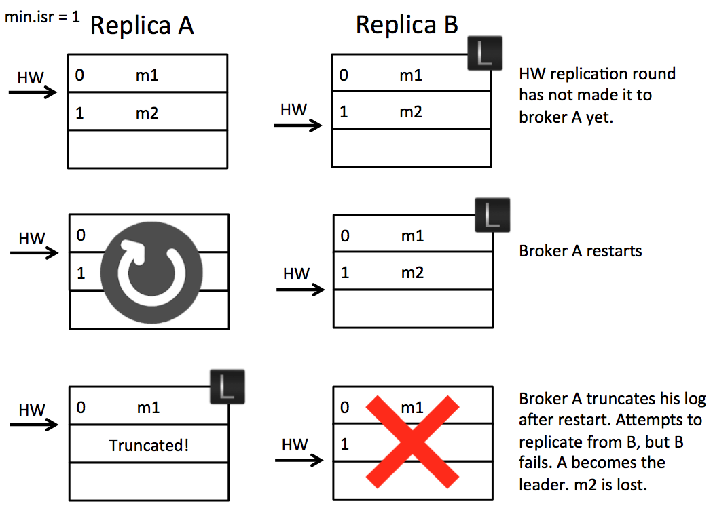
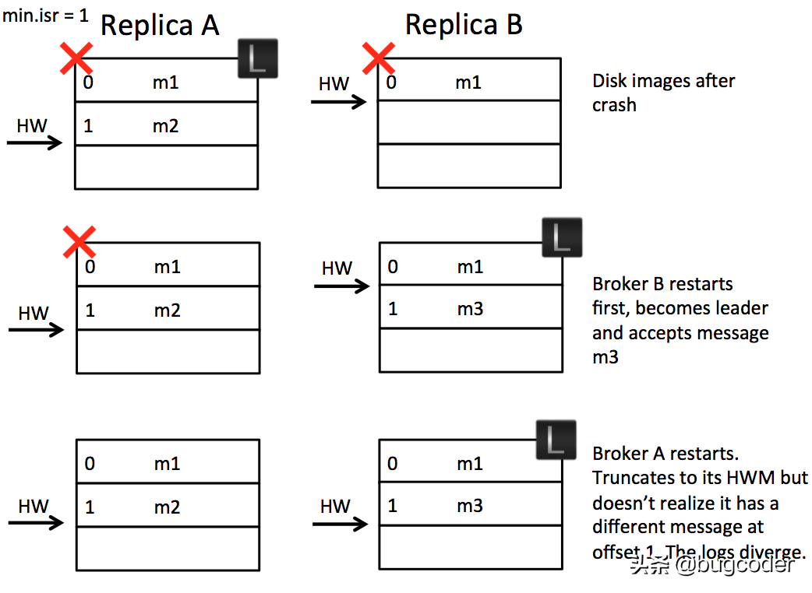
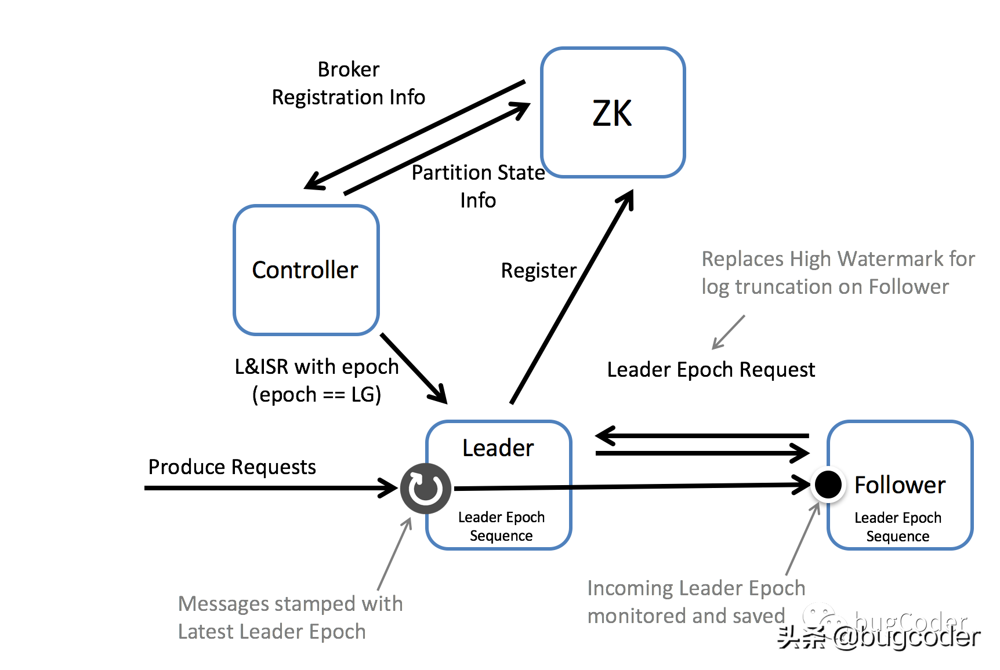
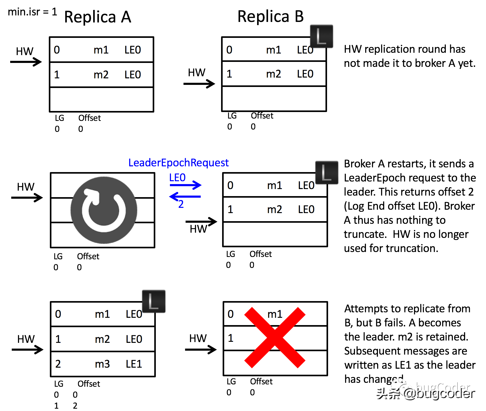
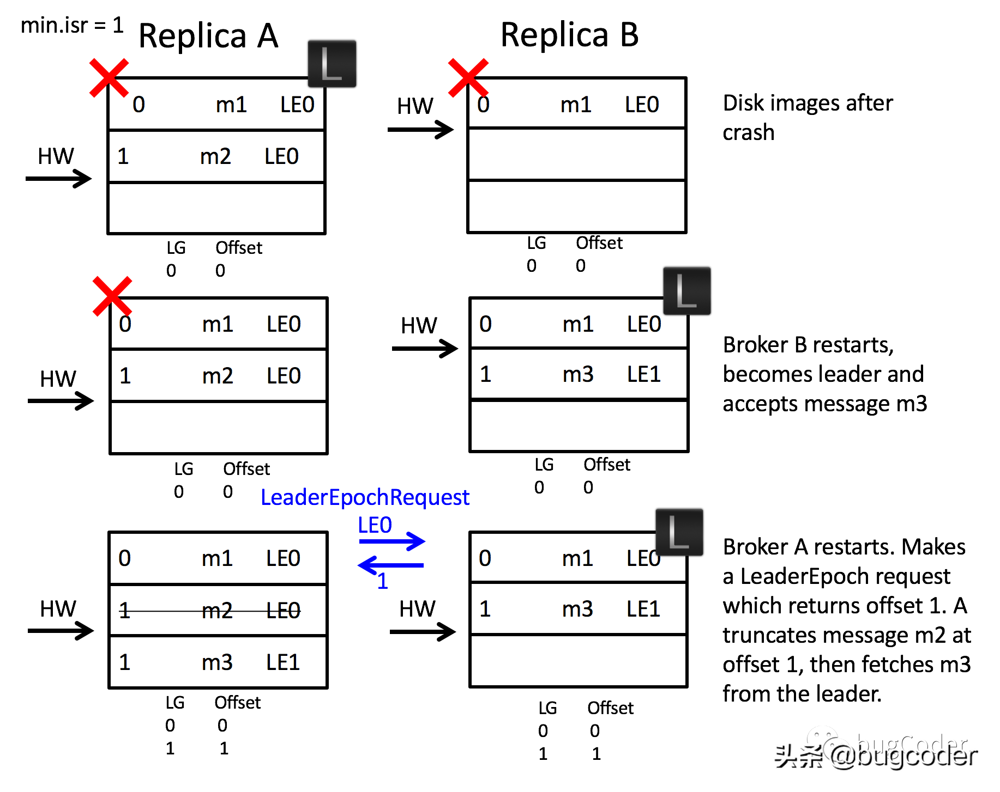

# kafka副本同步leader epoch机制

原文：https://www.toutiao.com/a7004066699720950302/

## 术语

* **Leader Epoch**：一个32位**单调递增**的数字，代表每一个Leader副本时代，**存储于每一条信息**
* **Leader Epoch Start Offset**：每一个 Leader 副本时代的**第一条**信息的位移
* **Leader Epoch Sequence File**：一个序列文件，每一个 Leader 副本时代，Leader Epoch Start offset的变化记录存储在该文件中
* **Leader Epoch Request**：follower 副本通过该请求获取Leader副本的第一条信息的位移，如果Leader副本所在分区不存在序列文件，获取的是Leader副本的Log End Offset

## 动机

​        在原来的副本同步（复制）机制中，使用HW高水位来进行日志的截断，**某些情况下会导致数据的丢失和数据不一致问题**。

## 场景1:消息丢失

​        Kafka 中的复制协议大体有两个阶段。**第一阶段**：follower 副本从 Leader 副本同步数据，它取到了 m2 这条消息；**第二阶段**：在下一轮的RPC调用中 follower 会确认收到了 m2 这条消息，假定其他的 follower 副本也都确认成功收到了这条消息，Leader 副本才会更新其高水位HW，并且会在 follower 再次从 Leader 副本同步获取数据的时候会把这个高水位值放在请求响应中回传给 follower 副本。由此可以看出，**Leader 副本控制着高水位 HW 的进度**，并且会在随后的RPC调用中回传给 follower 副本。

​        复制协议还包含一个阶段，就是在 follower 副本初始化的时候，follower 副本会先根据其记录的高水位HW来进行日志的阶段（截断？），用来保证数据的同步，然后再去同步Leader 副本。这一步会出现一个bug情况：在同步的过程中，如果由于 follower 变成了 Leader副本，由于日志的截断操作，可能会导致消息的丢失。

### 例子

​        假设有两个 Brokers， Broker A 和 Broker B，当前 Broker B 所在的副本是Leader副本，follower 副本A 从Leader B获取到消息 m2，但是还没有向 Leader B 确认 m2 已提交（**第二阶段还未发生**，第二阶段 follower 副本会确认提交 m2，并且更新自己的高水位 HW）。在此时， **follower 副本A重启了**，重启以后初始化的时候，又会先根据其记录的高水位 HW 来进行日志的阶段，用来保证数据的同步，然后再去同步 Leader 副本B 获取数据。好巧的是，**此时 Leader 副本B 所在的 Broker 又不幸宕机了**，follower 副本A 经过选举变成了 Leader 副本A，那这个 m2 消息就永久的丢失了。

​        这个消息丢失问题的根源，就是 follower副本额外花费了一轮的 RPC 来更新自己的高水位 HW 值。在这个二阶段的间隙，如果遇到了 Leader 副本的更换，follower 会在执行日志截断时丢失数据。

​        考虑几种简单的方案来解决这个问题：一种是 Leader 副本等待 follower 副本更新完其高水位 HW 值，然后再去更新 Leader 自己所管理的高水位HW。但这会额外增加一轮 RPC 调用；另一种是从 Leader副本同步获取数据之前不执行日志的阶段操作，这应该有效，但是它又会出现别的问题。看下面的例子。

## 场景2：不同副本上的消息错乱

​        假设还是存在场景1 中的两个副本，由于停电导致两个副本都停掉了。不幸的是，不同机器上的日志会出现错乱不一致的问题，甚至在最坏的情况下，副本同步会卡住。

​        有一个潜在的问题是，Kafka 是异步刷盘的，这意味着，每一次 crash 以后，不同分区副本上存在着任意数量的消息。机器恢复后，任何一个副本都可能成为 Leader 副本。如果称为 Leader 副本所在的机器上存储的消息是最少的，那么就会丢失一些数据。

​        当 follower 副本B 从Leader 副本A 同步获取数据 m2 时，两个 Broker 都宕机了，follower 副本B 所在的机器先重启成功并且 follower 副本B 成为了 Leader 副本，并且开始接受新的消息 m3，并且更新了自身的高水位 HW 值。 后来 Broker A 也重启成功了，其所在的副本变成了 follower 副本 A，follower 副本A 初始化开始根据Leader的高水位执行日志的截断操作，因为此时两副本的高水位一样， follower副本 A 不需要截断，最终导致两个副本上的消息出现了错乱不一致的问题。

## 解决方案

​        通过引入**Leader Epoch** 的概念来解决这两个问题。为每一个 Leader 副本时代分配一个标识符，然后由领导将其添加到每个消息中。每个副本都会保留一个 ***[ LeaderEpoch => StartOffet ]*** 向量，用来标识消息在领导者时代的变化。当 follower副本需要截断日志时，这个向量会替代高水位作为其截断操作的参照数据。follower 副本会从Leader副本所有的Leader Epoch 向量集合中获取一个合适的 Leader Epoch，用来截断那些在 Leader 副本中不存在的数据。领导者副本可以根据 Leader Epoch 有效的告诉追随者副本需要截取到哪个偏移量。

​        可以通过这个 Leader Epoch 方来来。

### 解决场景 1 的问题

​        在场景 1 中，当 follower 副本A 重启后，它会向 Leader 副本B 发送一个 ***LeaderEpochRequest*** 请求，来获取自身所处的 Leader Epoch 最新的偏移量是多少，因为 follower A 和 Leader B 所处的时代不同（Leader Epoch 编码都是0），Leader B 会返回自己的 LEO，也就是 ***2*** 给 follower A。请注意，与高水位不同的是，follower 副本上的 offset 值是 0， follower 副本不会截断任何消息，m2 得以保留不会丢失。当 follower A 选为 Leader的时候就保留了所有已提交的日志，日志丢失的问题得到了解决。

### 解决场景2 的问题

​        开始的时候， 副本A 是 Leader 副本，当两个 Broker 在崩溃后重启后， Broker B 先成功重启，follower B 成为了 Leader B。 它会开启一个新的领导者纪元 ***LE1***，开始接受消息 m3。然后 Broker A 由成功重启，此时副本A自然成为了 follower 副本A，接着它会向 Leader B 发送一个 ***LeaderEpochRequest*** 请求，用来确定自己应该处于哪个领导者时代，Leader B 会返回 ***LE1*** 时代的第一个位移，这里返回的是 1 （也就是 m3 所在的位移）。follower B 收到这个响应以后会根据这个位移 1 来截取日志，它知道了应该遗弃掉 m2，从位移 1 开始同步获取日志。

## 拟议的变更

### Leader Epoch

​        领导者拥有 Leader Epoch 的概念，它是一个 32 字节编号，由 Controll二 管理，存储在 Zookeeper 的 PartitionStateInfo 中，并作为 ***LeaderAndIsrRequest*** 的一部分传递给每个新的领导者。建议，在接受生产请求的领导者上用 LeaderEpoch 标记每条消息。这个 LeaderEpoch 编号通过复制协议传播，用于替换高水位，作为消息截取的参考点。此过程采用如下的形式：

### 步骤

1. 改进消息格式，使每个消息都携带一个 **4 字节的 Leader Epoch 编号**
2. 在每个日志目录中，创建一个新的 **Leader Epoch Sequence 文件**，在其中存储 Leader Epoch 的序列和该时期产生的消息的起始偏移量。它缓存在每个副本中，也缓存在内存中
3. 当一个副本成为领导者时，它首先将新 Leader Epoch 和该副本的日志结束偏移量添加到 Leader Epoch Sequence 文件的末尾并刷新到磁盘。产生给领导者的每个新消息集都标有新的领导者纪元
4. 当副本成为跟随这是，它会执行一下步骤：
   1. 如果需要的话，从 Leader Epoch Sequence 文件中恢复所有 LeaderEpoch
   2. 向 Leader 副本所在的分区发送一个新的 LeaderEpoch 请求。该请求包括 follower 的 Leader Epoch Sequence 中最新的 Leader Epoch
   3. Leader 副本使用该 LeaderEpoch 的 LastOffset 进行响应。如果 follower 副本请求中的 Leader Epoch 与 Leader 副本所在的 Leader Epoch相同的话，也就是在同一个时代，Leader副本使用 LastOffset 进行响应，否则的话，Leader副本会在所有的 LeaderEpoch 集合中，选择第一个比 follower 请求中的 Leader Epoch 大的向量集（也就是在集合中选一个比请求打的最小值），并把该向量集中的起始偏移量 start offset 响应给 follower副本
   4. 如果跟随者的所有 LeaderEpoch 集合向量中，有任何一个起始偏移量大于从领导者返回的 LastOffset，follower 副本都会将其最后一个 Last Epoch 序列重置为领导者的 LastOffset 并刷新 Leader Epoch 序列文件
   5. follower 副本将其本地日志截断到领导者的 LastOffset
   6. follower 副本开始从 Leader 副本那里同步获取数据
      1. follower 副本在获取数据过程中，如果看到消息集的 LeaderEpoch 大于其当前最新的 LeaderEpoch，则将获取到的新的 LeaderEpoch 和起始偏移量添加到其 LeaderEpochSequence 文件中，并刷新到磁盘
      2. follower 副本会持续将获取的数据附加到其本地日志中

​        *说明：为了向后兼容，在步骤4.3中，如果 Leader 找不到 LastOffset（例如，Leader 还没有开始跟踪 Leader Epoch），follower副本将使用原来的方式，通过高水位进行日志截断。*