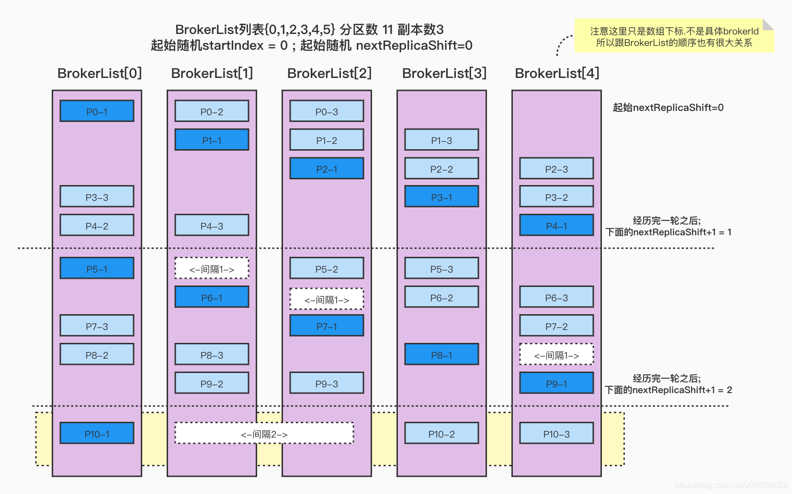
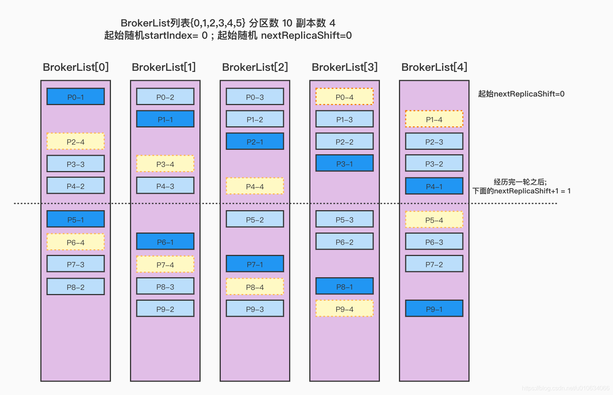

# kafka分区副本的分配规则

 原文：https://blog.csdn.net/u010634066/article/details/117753504


## 一、源码分析

​        创建 Topic 的源码入口是  <font color='red'> ***AdminManager.createTopics()*** </font>

​        以下只列出了分区分配相关代码，其他的省略：

```scala
def createTopics(timeout: Int,
                   validateOnly: Boolean,
                   toCreate: Map[String, CreatableTopic],
                   includeConfigsAndMetatadata: Map[String, CreatableTopicResult],
                   responseCallback: Map[String, ApiError] => Unit): Unit = {

    // 1. map over topics creating assignment and calling zookeeper
    val brokers = metadataCache.getAliveBrokers.map { b => kafka.admin.BrokerMetadata(b.id, b.rack) }
   
    val metadata = toCreate.values.map(topic =>
      try {    
        val assignments = if (topic.assignments().isEmpty) {
          AdminUtils.assignReplicasToBrokers(
            brokers, resolvedNumPartitions, resolvedReplicationFactor)
        } else {
          val assignments = new mutable.HashMap[Int, Seq[Int]]
          // Note: we don't check that replicaAssignment contains unknown brokers - unlike in add-partitions case,
          // this follows the existing logic in TopicCommand
          topic.assignments.asScala.foreach {
            case assignment => assignments(assignment.partitionIndex()) =
              assignment.brokerIds().asScala.map(a => a: Int)
          }
          assignments
        }
        trace(s"Assignments for topic $topic are $assignments ")
    
  }
```

​        以上有两种方式，一种是没有指定分区分配的情况也就是没有使用参数 <font color='red'> *--replica-assignment* </font>; 另一种是自己指定分区分配。

### 1.1 自定义指定分区分配规则

​        从源码中得知，会把指定的规则进行了包装，注意它并没有去检查指定的Broker是否存在。

### 1.2 自动分配

​        使用 ***AdminUtils.assignReplicasToBrokers***


1. 参数检查：分区数 > 0； 副本数 > 0；副本数 <= Broker 数（如果自己未定义会直接使用Broker中个配置）
2. 根据是否有机架信息来进行不同方式的分配
3. 要么整个集群都有机架信息，要么整个集群都没有机架信息；否则抛出异常

**副本分配的几个原则：**

1. 将副本平均分布在所有的 Broker 上
2. partition 的多个副本应该分配在不同的 Broker 上
3. 如果所有的 Broker 有机架信息的话，partition 的副本应该分配到不同的机架上

#### 1.2.1 无机架方式分配

***AdminUtils.assignReplicasToBrokersRackUnaware***

```scala
/**
 * 副本分配时，有三个原则：
 *   1. 将副本平均分布在所有的 Broker 上
 *   2. partition 的多个副本应该分配在不同的 Broker 上
 *   3. 如果所有的 Broker 有机架信息的话，partition 的副本应该分配到不同的机架上
 * 
 * 为了实现上面的目标，在没有机架感知的情况下，应该按照下面两个原则分配 replica：
 *   1. 从 broker.list 随机选择一个 Broker，使用 round-robin 算法分配每个 partition 的第一个副本
 *   2. 对于这个 partition 的其他副本，逐渐增加 Broker.id 来选择 replica 的分配
 */
private def assignReplicasToBrokersRackUnaware(nPartitions: Int,
                                                 replicationFactor: Int,
                                                 brokerList: Seq[Int],
                                                 fixedStartIndex: Int,
                                                 startPartitionId: Int): Map[Int, Seq[Int]] = {
    val ret = mutable.Map[Int, Seq[Int]]()
    // 这里是上一层传递过了所有存活的 Broker 列表的ID
    val brokerArray = brokerList.toArray
    // 默认随机选一个 index 开始
    val startIndex = if (fixedStartIndex >= 0) fixedStartIndex else rand.nextInt(brokerArray.length)
    // 默认从 0 这个分区开始
    var currentPartitionId = math.max(0, startPartitionId)
    var nextReplicaShift = if (fixedStartIndex >= 0) fixedStartIndex else rand.nextInt(brokerArray.length)
    for (_ <- 0 until nPartitions) {
      if (currentPartitionId > 0 && (currentPartitionId % brokerArray.length == 0))
        nextReplicaShift += 1
      val firstReplicaIndex = (currentPartitionId + startIndex) % brokerArray.length
      val replicaBuffer = mutable.ArrayBuffer(brokerArray(firstReplicaIndex))
      for (j <- 0 until replicationFactor - 1)
        replicaBuffer += brokerArray(replicaIndex(firstReplicaIndex, nextReplicaShift, j, brokerArray.length))
      ret.put(currentPartitionId, replicaBuffer)
      currentPartitionId += 1
    }
    ret
  }

  // 主要的计算间隔数的方法
  private def replicaIndex(firstReplicaIndex: Int, secondReplicaShift: Int, replicaIndex: Int, nBrokers: Int): Int = {
    val shift = 1 + (secondReplicaShift + replicaIndex) % (nBrokers - 1)
    (firstReplicaIndex + shift) % nBrokers
  }
```

1. 从 broker.list 随机选择一个 Broker，使用 round-robin 算法分配每个 partition 的第一个副本
2. 对于这个 partition 的其他副本，逐渐增加 Broker.id 来选择 replica 的分配
3. 对于副本分配来说，每经历一次 Broke 的遍历，则第一个副本跟后面的副本直接的间隔 +1

​        从代码和描述来看，不太好理解。通过下图可能更容易理解。在代码中增加一些日志：


然后写段单元测试，执行一下，看看分配过程。

##### 情形一

​        Broker 列表 {0,1,2,3,4} 分区数 10，副本数 3，起始随机 BrokerId = 0，起始随机 nextReplicaShift = 0

```scala
@Test
def testReplicaAssignment2(): Unit = {
  val borkerMetadatas = (0 to 4).map(new BrokerMetadata(_, None))
  AdminUtils.assignReplicasToBrokers(brokerMetadatas, 10, 3, 0)
}
```

输出：

```shell
起始随机startIndex:0;起始随机nextReplicaShift：0
(p-0,ArrayBuffer(0, 1, 2))
(p-1,ArrayBuffer(1, 2, 3))
(p-2,ArrayBuffer(2, 3, 4))
(p-3,ArrayBuffer(3, 4, 0))
(p-4,ArrayBuffer(4, 0, 1))
变更nextReplicaShift:1
(p-5,ArrayBuffer(0, 2, 3))
(p-6,ArrayBuffer(1, 3, 4))
(p-7,ArrayBuffer(2, 4, 0))
(p-8,ArrayBuffer(3, 0, 1))
(p-9,ArrayBuffer(4, 1, 2))
```

图形化所示：


上面分配的情况，一行一行看，每次都是先把每个分区的副本分配好的：

1. 最开始的时候，随机一个 Broker 作为第一个来接受P0。这里假设随机到了 *broker-0*，所以第一个 *P0* 在 broker-0上，那么第二个 *p0-2* 的位置跟 *nextReplicaShit* 有关，这个值也是随机的，这里假设随机的起始值也是 *0*，这个值的意思可以简单的理解为：第一个副本和第二个副本的间隔
2. 因为 *nextReplicaShit = 0*， 所以 p0 的分配分别在 *{0, 1, 2}*
3. 然后再分配后面的分区，分区的第一个副本位置都是按照 broker 顺序遍历的
4. 直到这一次的 broker 遍历完了，那么就要重头再进行遍历了。同时，*nextReplicaShit = nextReplicaShit + 1 = 1*
5. p5 - 1 在 broker-0 上，然后 p5 - 2 间隔 nextReplicaShit = 1 个位置，所以 p5 - 2 这个时候在 broker-2 上，p5 - 3 则在 p5 - 2 基础上顺推一位就行了。如果顺推的位置上已经有了副本，则继续顺推到没有当前分区副本的 Broker
6. 如果分区过多，有可能 nextReplicaShift 就变的挺大，在算第一个跟第二个副本的间隔的时候，不用把第一个副本算进去

​        假如下面开始是 5，其中经历过的间隔就是 （1 -> 2 -> 3 -> 4 -> 1），所以 pn - 2 就落在了 BrokerList[ 2 ] 上了。如图：


##### 情形二

​        Broker 列表 {0, 1, 2, 3, 4} 分区数 11， 副本数 3， 起始随机 BrokerId = 0，起始随机 nextReplicaShift = 0

​        在上面基础上，在增加一个分区，会如何分配呢？结果如下：

```shell
起始随机startIndex:0;起始随机nextReplicaShift：0
(p-0,ArrayBuffer(0, 1, 2))
(p-1,ArrayBuffer(1, 2, 3))
(p-2,ArrayBuffer(2, 3, 4))
(p-3,ArrayBuffer(3, 4, 0))
(p-4,ArrayBuffer(4, 0, 1))
变更nextReplicaShift:1
(p-5,ArrayBuffer(0, 2, 3))
(p-6,ArrayBuffer(1, 3, 4))
(p-7,ArrayBuffer(2, 4, 0))
(p-8,ArrayBuffer(3, 0, 1))
(p-9,ArrayBuffer(4, 1, 2))
变更nextReplicaShift:2
(p-10,ArrayBuffer(0, 3, 4))
(p-11,ArrayBuffer(1, 4, 0))
```



##### 情形三

​        Broker列表{0,1,2,3,4} 分区数 10 副本数4 起始随机BrokerId=0; 起始随机nextReplicaShift=0

​        结果如下：

```shell
起始随机startIndex:0;起始随机nextReplicaShift：0
(p-0,ArrayBuffer(0, 1, 2, 3))
(p-1,ArrayBuffer(1, 2, 3, 4))
(p-2,ArrayBuffer(2, 3, 4, 0))
(p-3,ArrayBuffer(3, 4, 0, 1))
(p-4,ArrayBuffer(4, 0, 1, 2))
变更nextReplicaShift:1
(p-5,ArrayBuffer(0, 2, 3, 4))
(p-6,ArrayBuffer(1, 3, 4, 0))
(p-7,ArrayBuffer(2, 4, 0, 1))
(p-8,ArrayBuffer(3, 0, 1, 2))
(p-9,ArrayBuffer(4, 1, 2, 3))
```



​        看到这里，在上面的副本=3的基础上，新增了一个副本=4，原有的分配都基本没有变化，只是在之前的分配基础上，按照顺序再新增一个副本，见上图**浅黄色区域**，如果想缩小副本数量也是同样的道理。

​        上面预设的 *nextReplicaShift = 0* ，并且 BrokerList 顺序也是 {0, 1, 2, 3, 4}，这样的情况理解起来稍微容易点儿，但是在实际的分配过程中，这个 BrokerList 并不是总是按照顺序来的，很多情况下都是乱序的，所以<font color='red'>**排列的位置是按照 BrokerList 的下标**</font>来进行的。

##### 情形四

​        Broker列表{0,1,2,3,4} 分区数 10 副本数3 起始随机BrokerId=0; 起始随机nextReplicaShift=3


1. 注意 BrokerList 列表离元素的顺序，会影响分配结果，这里分析的分配是指列表的顺序，不是 Broker 的 ID
2. nextReplicaShift 是第一个分区副本跟第二个副本间隔的 Broker 的数量，后面的副本则与上一个副本顺推就行，如果顺推遇到已经存在的副本，则再顺推
3. 通过这里，也可以看出，同一个副本不可能在同一个 Broker 中存在

#### 1.2.2 有机架方式分配

```scala
private def assignReplicaToBrokersRackAware(nPartitions: Int,
                                               replicationFactor: Int,
                                               brokerMetadatas: Seq[BrokerMetadata],
                                               fixedStartIndex: Int,
                                               startPartitionId: Int): Map[Int, Seq[Int]] = {
    val brokerRackMap = brokerMetadatas.collect { case BrokerMetadata(id, Some(rack)) =>
      id -> rack
    }.toMap
    val numRacks = brokerRackMap.values.toSet.size
    val arrangedBrokerList = getRackAlternatedBrokerList(brokerRackMap)
    val numBrokers = arrangedBrokerList.size
    val ret = mutable.Map[Int, Seq[Int]]()
    val startIndex = if (fixedStartIndex >= 0) fixedStartIndex else rand.nextInt(arrangedBrokerList.size)
    var currentPartitionId = math.max(0, startPartitionId)
    var nextReplicaShift = if (fixedStartIndex >= 0) fixedStartIndex else rand.nextInt(arrangedBrokerList.size)
    for (_ <- 0 until nPartitions) {
      if (currentPartitionId > 0 && (currentPartitionId % arrangedBrokerList.size == 0))
        nextReplicaShift += 1
      val firstReplicaIndex = (currentPartitionId + startIndex) % arrangedBrokerList.size
      val leader = arrangedBrokerList(firstReplicaIndex)
      val replicaBuffer = mutable.ArrayBuffer(leader)
      val racksWithReplicas = mutable.Set(brokerRackMap(leader))
      val brokersWithReplicas = mutable.Set(leader)
      var k = 0
      for (_ <- 0 until replicationFactor - 1) {
        var done = false
        while (!done) {
          val broker = arrangedBrokerList(replicaIndex(firstReplicaIndex, nextReplicaShift * numRacks, k, arrangedBrokerList.size))
          val rack = brokerRackMap(broker)
          // Skip this borker if 
          //   1. there is already a broker in the same rack that has assigned a replica AND 
          //      there is one or more racks that do not have any replica, or
          //   2. the broker has already assigned a replica AND there is one or more brokers
          //      that do not have replica assigned
          if ((!racksWithReplicas.contains(rack) || racksWithReplicas.size == numRacks)
              && (!brokersWithReplicas.contains(broker) || brokersWithReplicas.size == numBrokers)) {
            replicaBuffer += broker
            racksWithReplicas += rack
            brokersWithReplicas += broker
            done = true
          }
          k += 1
        }
      }
      ret.put(currentPartitionId, replicaBuffer)
      currentPartitionId += 1
    }
    ret
  }
```

### 1.3 分区扩容分配

​        扩容的过程是不会对之前的分区副本有所改动的,但是你新增的分区并不是会按照之前的策略再进行分配

​       ***AdminZKClient.addPartitions***

```Scala
val proposedAssignmentForNewPartitions = replicaAssignment.getOrElse {
  val startIndex = math.max(0, allBrokers.indexWhere(_.id >= existingAssignmentPartition0.head))
  AdminUtils.assignReplicasToBrokers(allBrokers, partitionsToAdd, existingAssignmentPartition0.size, startIndex, existingAssignment.size)
}
```

看代码，startIndex 获取的是 *partition-0*  的第一个副本，allBrokers 也是按照顺序排序好的 {0, 1, 2, 3, ...}， startPartition=当前分区数

​        例如，有个 topic， 2 分区，3副本，分配情况：

```shell
起始随机startIndex:0currentPartitionId:0;起始随机nextReplicaShift：2;brokerArray:ArrayBuffer(0, 1, 4, 2, 3)
(p-0,ArrayBuffer(0, 2, 3))
(p-1,ArrayBuffer(1, 3, 0))
```

​        先来计算一下，第 3 个分区如果同样条件的话，应该分配到哪里。

​        先确定一下分配当时的 BrokerList ，按照顺序的关系 0 -> 2 -> 3, 1 -> 3 -> 0 ，至少可以画出下面的图：


​        又根据 2 -> 3 (2 的下一个是3)，3 -> 0（ 3 的下一个是 0）这样的关系可知：


> ​        又要满足 0 -> 2 和 1 -> 3 的跨度要满足一致（当然，说的是同一个遍历范围内 currentPartitionId / brokerArray.length 相等），又要满足 0 -> 1 是连续的，那么 Broker 4 只能放在 1-2 之间了（正常分配的时候，每个分区的第一个副本都是按照 brokerList 顺序下去的，比如 P1(0,2,3)， P2(1,3,0)，那么 0 -> 1 之间肯定是连续的）。


结果算出来是 BrokerList={0, 1, 4, 2, 3} ，和代码输出的是相符的。

那么同样可以计算出来, startIndex=0;(P1的第一个副本id在BrokerList中的索引位置，刚好是索引0，起始随机 nextReplicaShift = 2（P1 0->2 中间隔了1->4>2 ）)

指定这些，就可以算出来新增一个分区P3的位置了吧?
P3（4,0,1）

然后执行新增一个分区脚本之后,并不是按照上面分配之后的 {4,0,1} ; 而是如下

```shell
起始随机startIndex:0 currentPartitionId:2;起始随机nextReplicaShift：0;brokerArray:ArrayBuffer(0, 1, 2, 3, 4)
(p-2,ArrayBuffer(2, 3, 4))
```

## 二、源码总结

## 三、Q&A

### 3.1 BrokerList 顺序是由什么决定的

1. 创建 Topic 的时候，使用的 *metadataCache.getAliveBrokers* 是一个无序的 map 对象
2. 新增分区的时候，是将 BrokerList 作了排序
3. 执行分区副本重分配任务，也是将 BrokerList 做了排序

### 3.2 startIndex和nextReplicaShi为啥要用随机值

​        之所以 **startIndex** 选择随机产生，是因为这样可以在多个主题的情况下尽可能地均匀分布分区副本。如果这里固定为一个特定值，那么每次的第一个副本都是在这个 broker 上，进而导致少数几个 broker 所分配到的分区副本过多而其余 broker 分配到的分区副本过少，最终导致负载不均衡。尤其是某些主题的副本数和分区数都比较少，甚至都为 1 的情况下，所有的副本都落到了那个指定 broker 上。与此同时，在分配时位移量 nextReplicaShit 也可以更好地使分区副本分配得更加均匀。

