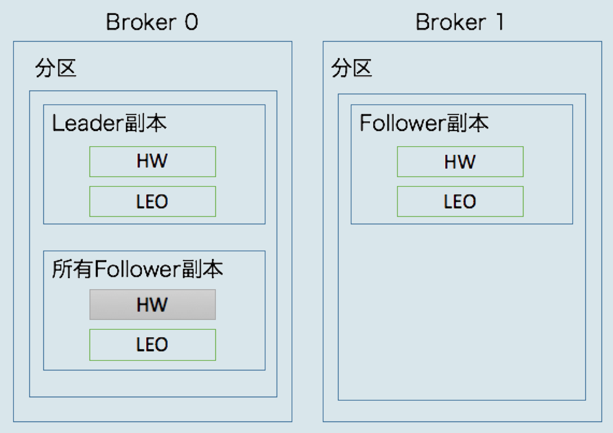
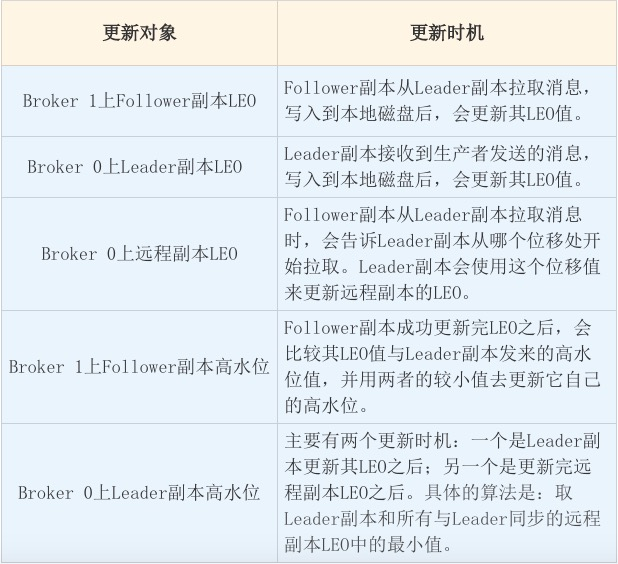
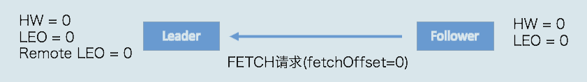
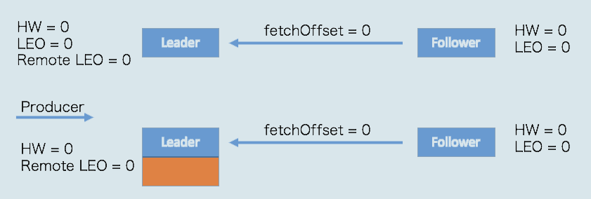
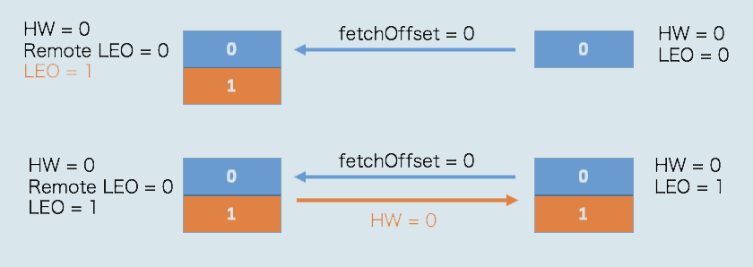
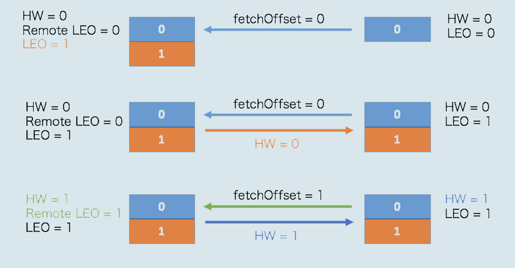
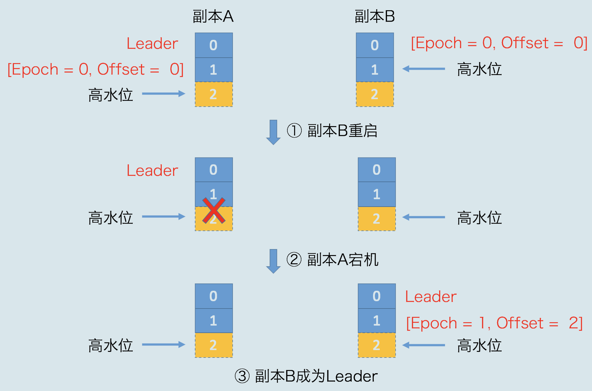

# Kafka详解(十): 高水位和Leader Epoch详解

原文：https://blog.csdn.net/fedorafrog/article/details/104100235

## 1. 高水位

### 1.1 高水位的作用

​        在Kafka中，高水位的作用主要有两个：

* 定义消息可见性，即用来标识分区下的哪些消息是可以被消费者消费的
* 帮助Kafka完成副本同步

​        下图展示了多个与高水位相关的Kafka术语：

​        假设这是某个分区 **Leader 副本**的高水位图。首先，请注意图中的“已提交消息”和“未提交消息”。在分区高水位以下的消息被认为是已提交消息，反之就是未提交消息。

​        "**已提交**"，就是当前位置的消息**至少**已经同步到了一个 follower 副本中了。

​        **消费者只能消费已提交消息，**即图中位移小于8的所有消息。注意，这里不讨论Kafka事务，因为事务机制会影响消费者所能看到的消息范围，它不只是简单依赖高水位来判断，它依靠一个名为***LSO（Log Stable Offset）***的位移值来判断事务型消费者的可见性。

​        另外，**位移值等于高水位的消息也属于未提交信息。** 也就是说，高水位上的消息是不能被消费者消费的。

### 1.2 Log End Offset

​        ***Log End Offset (LEO)*** 表示副本写入下一条消息的位移值（*即：当前这个位置没有数据*）。注意，数字15所在的方框是虚线，这说明，这个副本当前只有15条消息，位移值是从0 到14， 下一条新消息的位移值是15。显然，介于高水位和LEO之间的消息就属于未提交消息。这也从侧面说明了一个事实：**同一个副本对象，其高水位值不会大于LEO值**。

​        **高水位和LEO是副本对象的两个重要属性**。Kafka所有副本都有对应的高水位和LEO值，而不仅仅是Leader副本。只不过Leader副本比较特殊，Kafka 使用 Leader 副本的高水位来定义所在分区的高水位。换句话说，**分区的高水位就是其Leader 副本的高水位。**

## 2. 高水位和LEO更新机制

​        每个副本对象都保存了一组高水位值和LEO值，但实际上，***在 Leader 副本所在的Broker上，还保存了其他 Follower 副本的 HW 和 LEO 值***。如下图所示：

​        如上图所示，Broker 0 上保存了某分区的Leader副本和所有Follower副本的LEO值，而Broker 1 上仅仅保存了该分区的某个 Follower 副本。Kafka把 Broker 0 上保存的这些 Follower 副本又称为**远程副本（Remote Replica）**。 Kafka副本机制在运行过程中，会更新 Broker 1 上Follower副本的 高水位值 和 LEO值，同时也会更新 Broker 0 上 Leader 副本的 ***高水位值*** 和 ***LEO*** 以及 *所有远程副本的 **LEO** 值*，但它**不会**更新远程副本的高水位值，也就是在图中标记为灰色的部分。

​        保存远程副本的作用主要是帮助 Leader 副本确定其高水位，也就是分区高水位。下图是副本同步机制：

### 2.1 Leader副本保持同步

​        与 Leader 副本保持同步的判断条件有两个：

* 该远程 Follower 副本在 ISR 中
* 该远程 Follower 副本 LEO 值落后于 Leader 副本 LEO值的时间，不超过 Broker端参数 replica.lag.time.max.ms 的值（默认10秒）

#### 2.1.1 副本如何进入 ISR

​        每个分区都有一个 ISR ( *in-sync Replica* ) 列表，用于维护所有同步的、可用的副本。**首领副本必然是同步副本**，而对于跟随者副本来说，它需要满足以下条件才能被认为是同步副本：

1. 与 ZooKeeper 之间有一个活跃的会话，即必须定时向 ZooKeeper 发送心跳
2. 在规定的时间内从 Leader 副本那里低延迟地获取过消息

​        如果 follower 副本不能满足上面两个条件，就会从 ISR 中踢出，直到满足条件了才会被再次加入。

### 2.2 更新机制

#### 2.2.1 Leader副本

​        **处理生产者请求的逻辑如下：**

1. 写入消息到本地磁盘
2. 更新分区高水位值
   1. 获取 Leader 副本所在Broker端保存的**所有远程副本** LEO 值（ $LEO_1， LEO_2，...， LEO_n$ ）
   2. 获取 Leader 副本**高水位值**： $currentHW$
   3. 更新 $ currentHW = max \left ( currentHW, min \left ( LEO_1， LEO_2，...， LEO_n \right ) \right ) $

​        **处理 Follower 副本拉取消息的逻辑：**

1. 读取磁盘（或页缓存）中的消息数据
2. 使用 Follower 副本发送请求中的位移值更新远程副本LEO 值
3. 更新分区高水位值（与处理生产者请求步骤相同）

#### 2.2.2 Follower 副本

​        **从Leader 拉取消息的处理逻辑如下：**

1. 写入消息到本地磁盘
2. 更新 LEO 值，更新 高水位值
   1. 获取 Leader 发送的高水位值： $currentHW$
   2. 获取步骤2中更新过的LEO值： $currentLEO$
   3. 更新高水位为 $currentHW = min(currentHW, currentLEO)$

## 3. 副本同步全流程

​        当生产者发送一条消息时， Leader 和 Follower 副本对应的高水位时怎么被更新的呢？

​        首先是初始状态。下面这张图中的 remote LEO 就是刚才的远程副本的 LEO 值。在初始状态时，所有值都是0:

当生产者给主题分区发送一条消息后，状态更新为：

此时，***Leader 副本成功将消息写入了本地磁盘，故 LEO 值被更新为 1***。

​        Follower更次尝试从Leader 拉取消息。和之前不同的是，这次有消息可以拉取了，因此状态进一步变更为：

​        这时，Follower 副本也成功地更新 LEO 为 1。此时，Leader 和 Follower 副本的 LEO 都是1， 但各自的高水位依然是 0，还没有被更新。它们的***高水位值需要在下一轮的拉取中被更新***，如下图所示：

​        在新一轮的拉取请求中，由于位移值是 0 的消息已经拉取成功，因此 Follower 副本这次请求拉取的是***位移值= 1*** 的消息。 ***Leader 副本接收到此请求后，更新远程副本 LEO 为 1， 然后更新Leader 高水位为 1***  *(先更新 remote LEO，然后再更新 HW )*  。做完这些之后，它会将当前已经更新过的高水位值 1 发送给 Follower 副本。 Follower 副本接收到以后，也将自己的高水位值更新成 1。至此，一次完整的消息同步周期就结束了。事实上，Kafka就是利用这样的机制，实现了 Leader 和 Follower 副本之间的同步。

## 4. Leader Epoch 

​        从刚才的分析中，***Follower 副本的高水位更新需要一轮额外的拉取请求才能实现***。如果把上面那个例子扩展到多个 Follower 副本，情况可能更糟，也许需要多轮拉取请求。也就是说，Leader 副本高水位更新和 Follower 副本高水位更新在时间上是存在错配的。这种错配是很多“数据丢失”或“数据不一致”问题的根源。基于此，社区在 0.11 版本正式引入了 Leader Epoch 概念，来规避因高水位更新错配导致的各种不一致问题。

​        所谓 Leader Epoch，我们大致可以认为是 Leader 版本。它由两部分数据组成：

1. **Epoch**：***一个单调增加的版本号***。每当副本领导权发生变更时，都会增加该版本号。小版本号的Leader被认为是过期的Leader，不能再行使Leader权力
2. **起始位移** ( Start Offset )：Leader 副本在**该 Epoch 值上**写入的首条信息的位移

​        举个例子。假设现在有两个 Leader Epoch<0,0> 和 <1, 120> ，那么第一个 Leader Epoch 表示版本号是0，这个版本的Leader 从位移 0 开始保存消息，一共保存了 120 条消息。之后，Leader 发生了变更，版本号增加到 1，新版本的起始位移是 120。

​        Kafka Broker 会在内存中为每个分区都缓存 Leader Epoch数据，同时它还会定期地将这些信息持久化到一个***checkpoint 文件***中。当Leader 副本写入消息到磁盘时，Broker 会尝试更新这部分缓存。如果该Leader是首次写入消息，那么Broker会向缓存中增加一个Leader Epoch条目，否则就不做更新。这样，每次有Leader变更时，新的Leader副本会查询这部分缓存，取出对应的Leader Epoch 的起始位移，以避免数据丢失和不一致的情况。

​        接下来看一个实际例子，它展示的是Leader Epoch 是如何防止数据丢失的。

​        引入 Leader Epoch 机制后，Follower 副本B 重启回来后，需要向 A 发送一个特殊的请求去获取 Leader 的 LEO值。在这个例子中，该值为 2。 当获知到 Leader LEO=2 后，B 发现该 LEO 值不比它自己的LEO值小，而且缓存中也没有保存任何起始位移值 >2 的Epoch 条目，因此 B 无需执行任何日志截断操作。这是对高水位机制的一个明显改进，即副本是否执行日志截断不再依赖于高水位进行判断。

​        现在，副本 A 宕机了，B 成为 Leader。同样地，当 A 重启回来后，执行与 B 相同的逻辑判断，发现也不用执行日志截断，至此位移值为 1 的那条消息在两个副本中均得到保留。后面当生产者程序向 B 写入新消息时，副本 B 所在的 Broker 缓存中，会生成新的 Leader Epoch 条目：[Epoch=1, Offset=2]。之后，副本 B 会使用这个条目帮助判断后续是否执行日志截断操作。这样，通过 Leader Epoch 机制，Kafka 完美地规避了这种数据丢失场景。

​        注：*所谓截断，就是offset的值高于高水位值的日志都舍去*

