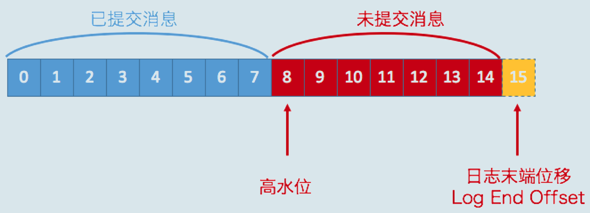

# 高水位和Leader Epoch详解

原文：https://blog.csdn.net/fedorafrog/article/details/104100235

## 1. 高水位

### 1.1 高水位的作用

​        在Kafka中，高水位的作用主要有两个：

* 定义消息可见性，即用来标识分区下的哪些消息是可以被消费者消费的
* 帮助Kafka完成副本同步

​        下图展示了多个与高水位相关的Kafka术语：

​        假设这是某个分区Leader副本的高水位图。首先，请注意图中的“已提交消息”和“未提交消息”。在分区高水位以下的消息被认为是已提交消息，反之就是未提交消息。

​        **消费者只能消费已提交消息，**即图中位移小于8的所有消息。注意，这里不讨论Kafka事务，因为事务机制会影响消费者所能看到的消息范围，它不只是简单依赖高水位来判断，它依靠一个名为***LSO（Log Stable Offset）***的位移值来判断事务型消费者的可见性。

​        另外，**位移值等于高水位的消息也属于未提交信息。** 也就是说，高水位上的消息是不能被消费者消费的。

### 1.2 Log End Offset

​        ***Log End Offset (LEO)*** 表示副本写入下一条消息的位移值。注意，数字15所在的方框是虚线，这说明，这个副本当前只有15条消息，位移值是从0 到14， 下一条新消息的位移值是15.显然，介于高水位和LEO之间的消息就属于未提交消息。这也从侧面说明了一个事实：**同一个副本对象，其高水位值不会大于LEO值**。

​        **高水位和LEO是副本对象的两个重要属性**。Kafka所有副本都有对应的高水位和LEO值，而不仅仅是Leader副本。只不过Leader副本比较特殊，Kafka使用Leader副本的高水位来定义所在分区的高水位。换句话说，**分区的高水位就是其Leader副本的高水位。**

## 2. 高水位和LEO更新机制

## 3. 副本同步全流程

## 4. Leader Epoch 

