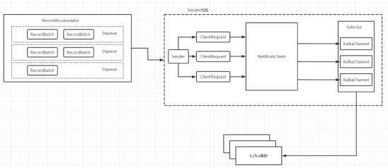
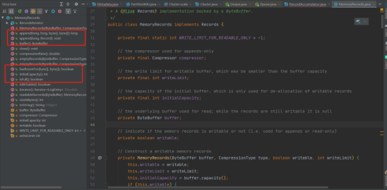

# Kafka 元数据以及消息封装

原文：https://www.toutiao.com/i6999399562205037093/?tt_from=weixin&utm_campaign=client_share&wxshare_count=1&timestamp=1629680897&app=news_article&utm_source=weixin&utm_medium=toutiao_ios&use_new_style=1&req_id=20210823090816010135165073382F0860&share_token=C1E50D28-157F-4108-B341-9BBFE3A08D69&group_id=6999399562205037093


Kafka 发送消息时， KafkaProducer 要将此消息追加到指定 Topic 的某个分区的 Leader 副本中，**首先**需要知道 Topic 的分区数量，经过留由后确定目标分区，**之后** KafkaProducer 需要知道目标分区的 Leader 副本所在服务器的地址、端口等信息，才能建立连接，将消息发送到 Kafka 中。因此，**在KafkaProducer 中维护了 Kafka 集群的元数据**，这些元数据记录了：某个 Topic 中有哪几个分区、每个分区的 Leader 副本分布在哪个节点上、Follower 副本分布在哪些节点上、哪些副本在 ISR 集合中以及这些节点的网络地址、端口。

## 1 元数据

关于Kafka 的元数据信息，可以从以下几个核心类入手：Node、TopicPartition、PartitionInfo、MetaData、Cluster。

### 1.1 Node

代表集群的节点，包含域名、主机IP、端口、机架等信息：

```java
/**
 * Information about a kafka node
 *
 */
public class Node {
    private static final Node NO_NODE = new Node(-1, "", -1);
    // id 编号，这个编号是配置参数的时候指定的 broker ID
    private final int id;
    private final String idString;
    // 主机名
    private final String host;
    // 端口号，默认是9092
    private final int port;
    //机架
    private final String rack;
    ...
  }
```


### 1.2 TopicPartition

代表 Kafka 中某个 Topic 的分区映射，主要由主题（topic）名和各分区编号组成。

```java
package org.apache.kafka.common;
import java.io.Serializable;

/**
 * A topic name and partition number
 */
public final class TopicPartition implements Serializable {
  private int hash = 0;
  // 分区编号
  private final int partition;
  // topic的名称
  private final String topic;
  ...
}
```


### 1.3 PartitionInfo

主要阐述了集群主题和分区的映射信息，包括分区的 leader 和 replica 分布情况等。比如某个 topic 在集群中的分区和副本所在的位置。

```java
package org.apache.kafka.common;

public class PartitionInfo {
  // 主题
  private final String topic;
  // 分区编号
  private final int partition;
  
  // leader partition 在哪台服务器上
  private final Node leader;
  
  // 这个分区的所有的replica都在哪些节点上
  private final Node[] replicas;
  
  // ISR 列表
  private final Node[] inSyncReplicas;
  
  public PartitionInfo(String topic, in partition, Node leader, Node[] replicas, Node[] inSyncReplicas) {
    this.topic = topic;
    this.partition = partition;
    this.leader = leader;
    this.replicas = replicas;
    this.inSyncReplicas = inSyncReplicas;
  }
  .... // more getter
}
```


### 1.4 Cluster

代表 Kafka 集群节点、主题和分区的组成信息：

```java
/**
 * A representation of a subset of the nodes, topics, and partitions in the
 * Kafka cluster
 */
public final class Cluster {
  private final boolean isBootstrapConfigured;
  
  // Kafka 集群节点信息列表
  private final List<Node> nodes;
  
  // 没有授权的topic
  private final Set<String> unauthorizedTopics;
  
  // 内部主题，主要针对 Kakfa Stream 应用程序执行时的内部主题
  // 例如：状态存储的更改日志主题。这些主题由应用程序创建，仅供流应用程序使用
  private final Set<String> internalTopics;
  
  // 用于记录 TopicPartition 和 PartitionInfo 的映射关系
  private final Map<TopicPartition, PartitionInfo> partitionsByTopicPartition;
  
  // 用于记录 Topic 和 PartitionInfo 的映射关系
  private final Map<String, List<PartitionInfo>> partitionsByTopic;
  
  // 一个 Topic 对应哪些可用 partition， topic 和 PartitionInfo的映射关系
  private final Map<String, List<PartitionInfo>> availablePartitionsByTopic;
  
  // 一台服务器上有哪些 partiton， Node 与 PartitionInfo 的映射关系
  private final Map<Integer, List<PartitionInfo>> partitionsByNode;
  
  // 服务器编号 和 服务器 对应的关系，方便按照 broker Id 索引
  private final Map<Integer, Node> nodesById;
  // Kafka 集群的 ID 信息
  private final ClusterResource clusterResource;
  
  ... // 省略其他内容
}
```


### 1.5 MetaData

在 Cluster 类的基础上进一步做了封装，包含了集群信息最后的更新时间、版本号以及是否需要等待更新等信息。

```java
public final class Metadata {
  // 过期时间，5分钟
  private static final long TOPIC_EXPIRY_MS = 5 * 60 * 1000;
  
  // 过期值
  private static final long TOPIC_EXPIRY_NEEDS_UPDATE = -1L;
  
  // 两个更新元数据的请求的最小的时间间隔，默认值是100ms
  private final long refreshBackoffMs;
  
  // 多久自动更新一次元数据，默认值是 5 分钟 更新一次
  private final long metadataExpireMs;
  
  // 对于 producer 端， 元数据是有版本好的。每次跟新元数据，都会修改一下版本号
  private int version;
  
  // 上一次更新元数据的时间
  private long lastRefreshMs;
  
  // 上一次成功更新元数据的时间。
  // 正常情况下，如果每次更新都成功，该值和 lastRefreshMs 相同
  private long lastSuccessfulRefreshMs;
  
  // Kafka集群本身的元数据
  private Cluster cluster;
  
  // 是否更新元数据的标识
  private boolean needUpdate;
  
  // 记录当前已有的 topic
  private final Map<String, Long> topics;
  
  // 用于监听 MetaData 更新的监听器集合
  private final List<Listener> listeners;
  
  // 集群资源监听器
  private final ClusterResourceListeners clusterResourceListeners;
  
  // 是否需要更新全部 topic 的元数据信息
  private boolean needMetadataForAllTopics;
  
  // 是否允许 topic 过期
  private final boolean topicExpiryEnabled;
  
  /**
   * Create a metadata instance with reasonable defaults
   */
  public Metadata() {
      this(100L, 60 * 60 * 1000L);
  }
  public Metadata(long refreshBackoffMs, long metadataExpireMs) {
        this(refreshBackoffMs, metadataExpireMs, false, 
             new ClusterResourceListeners());
  }
  /**
     * Create a new Metadata instance
     * @param refreshBackoffMs The minimum amount of time that must expire between metadata refreshes to avoid busy
     *        polling
     * @param metadataExpireMs The maximum amount of time that metadata can be retained without refresh
     * @param topicExpiryEnabled If true, enable expiry of unused topics
     * @param clusterResourceListeners List of ClusterResourceListeners which will receive metadata updates.
     */
    public Metadata(long refreshBackoffMs, long metadataExpireMs, boolean topicExpiryEnabled, ClusterResourceListeners clusterResourceListeners) {
        this.refreshBackoffMs = refreshBackoffMs;
        this.metadataExpireMs = metadataExpireMs;
        this.topicExpiryEnabled = topicExpiryEnabled;
        this.lastRefreshMs = 0L;
        this.lastSuccessfulRefreshMs = 0L;
        this.version = 0;
        this.cluster = Cluster.empty();
        this.needUpdate = false;
        this.topics = new HashMap<>();
        this.listeners = new ArrayList<>();
        this.clusterResourceListeners = clusterResourceListeners;
        this.needMetadataForAllTopics = false;
    }
    /**
     * Get the current cluster info without blocking
     */
    public synchronized Cluster fetch() {
        return this.cluster;
    }
    ........
}
```

​        Kafka 在发送消息的过程中，很重要的一点就是消息的封装、消息的请求和分发。



​        大致的流程如下：

* ProducerInterceptor 对消息进行拦截
* Serializer 对消息的 Key 和 value 进行序列化
* Partitioner 对消息进行分发到对应的 Partition
* RecordAccumulator 负责收集消息并封装成批次，通过批量发送消息
* Sender 为实际发送的线程，负责从 RecordAccumulator 获取消息
* 构建 ClientRequest 请求
* 将 ClientRequest 请求发送给 NetworkClient 组件
* NetworkClient 组件将 ClientRequest 请求放入 KafkaChannel 缓存区
* 执行网络 I/O，发送请求
* 收到响应，调用 ClientRequest 的回调函数 onComplete

## 2 消息封装

这里就是介绍 ***RecordAccumulator*** 对象。先来介绍这个类，通过该类的注释可以看到，该类的本质就是用于收集消息的队列，底层实现是 MemoryRecords。

```java
/**
 * This class acts as a queue that accumulates records into 
 * "org.apache.kafka.common.record.MemoryRecords" instances to be sent
 * to the server.
 *
 * The accumulator uses a bounded amount of memory and append calls
 * will block when that momory is exhausted, unless this behavior is 
 * explicitly disabled.
 */
public final class RecordAccumulator {
  
  private volatile boolean closed;
  // 使用原子类，消息封装过程中会涉及到线程安全
  private final AtomicInteger flushesInProgress;
  private final AtomicInteger appendsInProgress;
  
  // 消息批次大小
  private final int batchSize;
  
  // 消息压缩类型，支持 GZip，snappy，lz4
  private final CompressionType compression;  
  private final long lingerMs;
  private final long retryBackoffMs;
  private final BufferPool free;
  private final Time time;
  
  // 一个消息批次包括TopicPartition 分区 和 Deque<RecordBatch> 队列
  private final ConcurrentMap<TopicPartition, Deque<RecordBatch>> batches;
  private final IncompleteRecordBatches incomplete;
  private final Set<TopicPartition> muted;
  private int drainInex;
  ......
}
```

​       Kafka 有两种发送消息的方式，分别是同步和异步。基本使用到的都是异步发送，主线程通过调用 *KafkaProducer.send()* 方法将消息缓存在 RecordAccumulator，到达一定条件之后就会唤起 Sender 线程发送消息。RecordAccumulator 包含了这样一种数据结构 *ConcurrentMap<TopicPartition, Deque<RecordBatch>> batches* ，以 TopicPartition 作为 Key， Deque 作为 Value， Deque 中存放了 RecordBatch。如上图所示，每个 RecordBatch 就是一个 MemoryRecords 对象。下面了解一下MemoryRecords对象。

### 2.1 MemoryRecords

```java
public class MemoryRecords implements Records {
  private final static int WRITE_LIMIT_FOR_READABLE_ONLY = -1;
  
  // 压缩消息数据，并写入到buffer
  private final Compressor compressor;
  
  // 表示 buffer 中最多可以写入的字节数据大小
  private final int writeLimit;
  
  // buffer 初始化大小
  private final int initialCapacity;
  
  // 用于保存消息数据的缓冲区
  private ByteBuffer buffer;
  
  // 用于表示 MemoryRecords 的读写模型，默认是只读
  private boolean writable;
  ......
}
```

MemoryRecords 有几个重要的方法，可以去了解一下。



其中：

* **buffer**：用于保存消息数据的 Java NIO ByteBUffer
* **writeLimit**：记录buffer字段最多可以写入多少个字节的数据
* **compressor**：压缩器，对消息数据进行压缩，将压缩后的数据输出到buffer
* **writable**：此 MemoryRecords 对象是只读的模式，还是可写模式。在 MemoryRecords 发送前，会将其设置成只读模式

### 2.2 RecordBatch

现在聊聊RecordBatch。其实，上面提到的**每个**RecordBatch就是**一个** MemoryRecord。

```java
/**
 * A batch of records that is or will be sent.
 * 最终被发送出去的消息对象
 * 这个类不是线程安全的，在修改的时候，需要使用同步锁。
 */
public final class RecordBatch {
  // 用于记录保存的 record 数量
  public int recordCount = 0;
  
  // 最大 Record 的字节数
  public int maxRecordSize = 0;
  
  // 尝试发送 RecordBatch 的次数
  public volatile int attempts = 0;
  
  // 创建时间
  public final long createdMs;  
  public long drainedMs;
  
  // 最后一次尝试发送的时间
  public long lastAttemptMs;
  
  // 真正存储数据的地方。-- 也是为啥说RecordBatch就是一个MemoryRecord
  public final MemoryRecords records;
  
  // 每当 RecordBatch 中缓存的消息都会发送给此TopicPartition
  public final TopicPartition topicPartition;
  
  // ProduceRequestResult 类型，表示RecordBatch状态的Future对象
  public final ProduceRequestResult produceFuture;
  
  // 最后一次向 RecordBatch 追加消息的时间
  public long lastAppendTime;
  
  // Thunk 对象的集合
  private final List<Thunk> thunks;
  
  // 用来记录消息在 RecordBatch 中的偏移量
  private long offsetCounter = 0L;
  
  // 是否正在重试。 如果 RecordBatch 中的数据发送失败，则会重试发送
  private boolean retry;
  ......
}
```

从上面的流程图可以看到，将消息封装成一个一个的 RecordBatch之后，放到 Deque队列中，一个 RecordAccumulator 由一个至多个的 Dequeue 组成，这样可以减少通信成本，批量发送消息，从而也能提高吞吐量。

