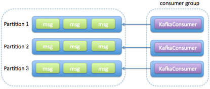
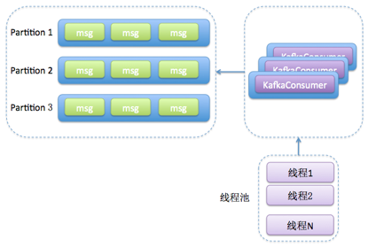
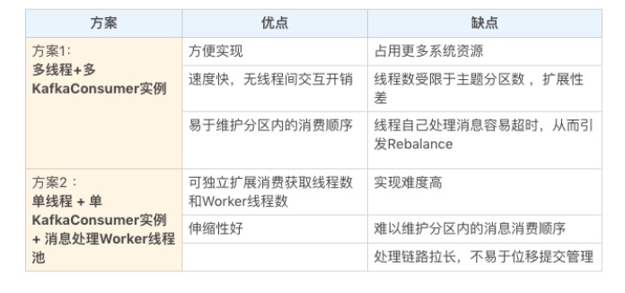

# Kafka详解(四)：多线程消费者实践

原文：https://blog.csdn.net/fedorafrog/article/details/103975311


## 1. Kafka Java Comsumer设计原理

Kafka Java Consumer采用的是**双线程设计，即将用户主线程和心跳线程分开**。

所谓用户主线程，就是你启动 Consumer 应用程序 main 方法的那个线程，而新引入的心跳线程（Heartbeat Thread）只负责定期给对应的 Broker 机器发送心跳请求，以标识消费者应用的存活性（liveness）。引入这个心跳线程还有一个目的，那就是期望它能将心跳频率与主线程调用 KafkaConsumer.poll 方法的频率分开，从而解耦真实的消息处理逻辑与消费者组成员存活性管理。

单线程 Consumer 的优点主要有：

- 能够较好的实现**非阻塞式**的消息获取
- 能够简化Consumer端的设计

## 2. 多线程方案

### 2.1 多个 Kafka Consumer 实例

消费者程序启动多个线程，每个线程维护专属的 KafkaConsumer 实例，**负责完整的消息获取、消息处理流程**。下图所示：



#### 2.1.1 方案优点

- 实现起来简单，因为它比较符合目前我们使用 Consumer API 的习惯。我们在写代码的时候，使用多个线程并在每个线程中创建专属的 KafkaConsumer 实例就可以了。
- 多个线程之间彼此没有任何交互，省去了很多保障线程安全方面的开销。
- 由于每个线程使用专属的 KafkaConsumer 实例来执行消息获取和消息处理逻辑，因此，Kafka 主题中的每个分区都能保证只被一个线程处理，这样就很容易实现分区内的消息消费顺序。这对在乎事件先后顺序的应用场景来说，是非常重要的优势。

#### 2.1.2 方案缺点

- 每个线程都维护自己的 KafkaConsumer 实例，必然会占用更多的系统资源，比如内存、TCP 连接等。在资源紧张的系统环境中，方案 1 的这个劣势会表现得更加明显。
- 这个方案能使用的线程数受限于 Consumer 订阅主题的总分区数。在一个消费者组中，每个订阅分区都只能被组内的一个消费者实例所消费。假设一个消费者组订阅了 100 个分区，那么方案 1 最多只能扩展到 100 个线程，多余的线程无法分配到任何分区，只会白白消耗系统资源。当然了，这种扩展性方面的局限可以被多机架构所缓解。除了在一台机器上启用 100 个线程消费数据，也可以选择在 100 台机器上分别创建 1 个线程，效果是一样的。因此，如果机器资源很丰富，这个劣势就不足为虑了。
- 每个线程完整地执行消息获取和消息处理逻辑。一旦消息处理逻辑很重，造成消息处理速度慢，就很容易出现不必要的 Rebalance，从而引发整个消费者组的消费停滞。这个劣势一定要注意。

#### 2.1.3 方案主题代码

```java
public class KafkaConsumerRunner implements Runnable {
     private final AtomicBoolean closed = new AtomicBoolean(false);
     private final KafkaConsumer consumer;  // 消费者，每个线程专属的 consumer 实例
 
     public void run() {
         try {
             consumer.subscribe(Arrays.asList("topic"));
             while (!closed.get()) {
                 // 获取消息
                 ConsumerRecords records = consumer.poll(Duration.ofMillis(10000));
                 //  执行消息处理逻辑
                 // .... 省略消息处理业务的代码
             }
         } catch (WakeupException e) {
             // Ignore exception if closing
             if (!closed.get()) throw e;
         } finally {
             consumer.close();
         }
     }
 
     // Shutdown hook which can be called from a separate thread
     public void shutdown() {
         closed.set(true);
         consumer.wakeup();
     }
}
```

这段代码创建了一个 Runnable 类，表示执行消费获取和消费处理的逻辑。每个 KafkaConsumerRunner 类都会创建一个专属的 KafkaConsumer 实例（第三行）。在实际应用中，可以创建多个 KafkaConsumerRunner 实例，并依次执行启动它们，以实现方案 1 的多线程架构。

### 2.2 一个 Kafka Consumer 实例

消费者程序使用单或多线程获取消息，同时创建多个消费线程执行消息处理逻辑。获取消息的线程可以是一个，也可以是多个，每个线程维护专属的 KafkaConsumer 实例，处理消息则交由特定的线程池来做，从而**实现消息获取与消息处理的真正解耦**。具体架构如下图所示：



#### 2.2.1 方案优点

方案 2 将任务切分成了消息获取和消息处理两个部分，分别由不同的线程处理它们。比起方案 1，方案 2 的最大优势就在于它的高伸缩性，就是说可以独立地调节消息获取的线程数，以及消息处理的线程数，而不必考虑两者之间是否相互影响。如果消费获取速度慢，那么增加消费获取的线程数即可；如果是消息的处理速度慢，那么增加 Worker 线程池线程数即可。

#### 2.2.2 方案缺点

- 它的实现难度要比方案 1 大得多，毕竟它有两组线程，你需要分别管理它们。
- 因为该方案将消息获取和消息处理分开了，也就是说获取某条消息的线程不是处理该消息的线程，因此**无法保证分区内的消费顺序**。举个例子，比如在某个分区中，消息 1 在消息 2 之前被保存，那么 Consumer 获取消息的顺序必然是消息 1 在前，消息 2 在后，但是，后面的 Worker 线程却有可能先处理消息 2，再处理消息 1，这就破坏了消息在分区中的顺序。还是那句话，如果你在意 Kafka 中消息的先后顺序，方案 2 的这个劣势是致命的。
- 方案 2 引入了多组线程，使得整个消息消费链路被拉长，最终导致正确位移提交会变得异常困难，结果就是可能会出现消息的重复消费。如果你在意这一点，那么我不推荐你使用方案 2。

#### 2.2.3 方案代码

```java
private final KafkaConsumer<String, String> consumer; //消息消费者，用于获取消息，不处理消息涉及的业务
private ExecutorService executors; // 处理消息关联的业务的执行者（线程）
...
 
 
private int workerNum = ...;
executors = new ThreadPoolExecutor(
  workerNum, workerNum, 0L, TimeUnit.MILLISECONDS,
  new ArrayBlockingQueue<>(1000), 
  new ThreadPoolExecutor.CallerRunsPolicy());
 
 
...
while (true)  {
  ConsumerRecords<String, String> records = 
    consumer.poll(Duration.ofSeconds(1)); // 消费者拉取消息
  for (final ConsumerRecord record : records) {
    executors.submit(new Worker(record)); // 提交给执行线程执行业务
  }
}
...
```

这段代码最重要的地方是最后一行：当 Consumer 的 poll 方法返回消息后，由专门的线程池来负责处理具体的消息。调用 poll 方法的主线程不负责消息处理逻辑，这样就实现了方案 2 的多线程架构。

## 3. 总结

总体来说，这两种方案都会创建多个线程，这些线程都会参与到消息的消费过程中，但各自的思路是不一样的。

打个比方。比如一个完整的消费者应用程序要做的事情是 1、2、3、4、5，那么方案 1 的思路是粗粒度化的工作划分，也就是说方案 1 会创建多个线程，每个线程完整地执行 1、2、3、4、5，以实现并行处理的目标，它不会进一步分割具体的子任务；而方案 2 则更细粒度化，它会将 1、2 分割出来，用单线程（也可以是多线程）来做，对于 3、4、5，则用另外的多个线程来做。

以下表格是这两种方案的优缺点总结。


