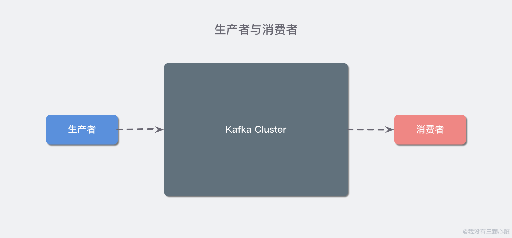
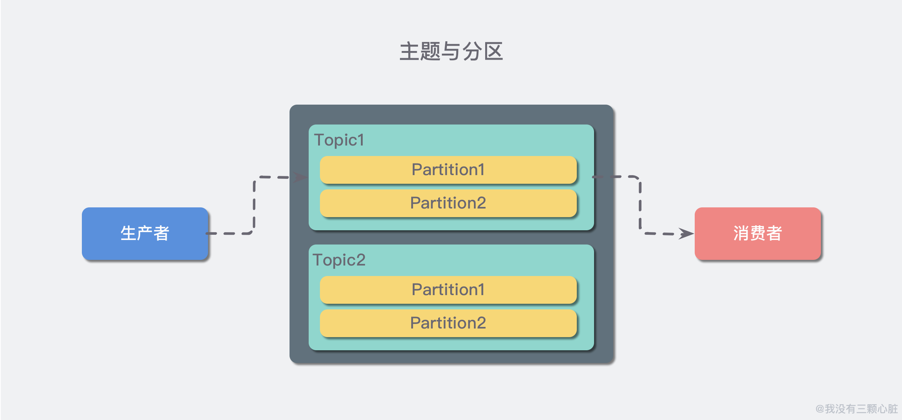
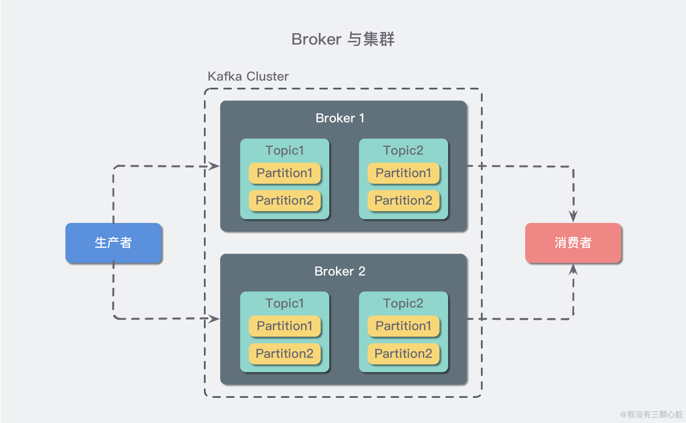

# Kafka 的四个基础概念

原文：https://www.toutiao.com/a6752734834449187336/

**活动流数据**是几乎所有站点在对其网站使用情况做报表时都要用到的数据中最常规的部分。活动数据包括：页面访问量（Page View，PV）、被查看内容方面的信息以及搜索情况等内容。这种数据通常的处理方式是：先把各种活动以日志的形式写入某种文件，然后周期性地对这些文件进行统计分析。**运营数据**指的是服务器的性能数据（CPU、IO使用率、请求时间、服务日志等等数据）。运营数据的统计方法种类繁多。

## 一. Kafka 简介

Kafka 是一种分布式的，基于发布/订阅的消息系统。主要设计目标：

* 以时间复杂度为 $O(1)$ 的方式提供消息持久化能力，即使对 TB 级以上的数据也能保证常数时间复杂度的访问性能
* 高吞吐率。即使在非常廉价的商用机器上也能做到单机支持每秒 100K 条以上的消息的传输
* 支持 Kafka Server 键的消息分区，以及分布式消费，同时**保证每个 Partition 内的消息顺序**传输
* 同时支持离线数据处理和实时数据处理
* Scal Out：支持在线水平扩展

## 二. Kafka 基础概念

### 2.1 生产者与消费者

对于 Kafka 来说，客户端有两种基本类型：**生产者**（Producer）和**消费者**（Consumer）。除此之外，还有用来做数据集成的 Kafka Connect API 和流式处理的 Kafka Streams 等高阶客户端，但这些高阶客户端底层依然是生产者和消费者API，它们只不过是在上层做了封装。

这很容易理解，生产者（也称为发布者）创建消息，而消费者（也称为订阅者）负责消费or读取消息。

### 2.2 主题与分区

在 Kafka 中，消息以**主题**（Topic）来分类，每一个主题都对应一个“**消息队列**”，这有点儿类似于数据库中的表。但是，如果把所有同类的消息都塞入到一个“中心”队列中，势必缺少可伸缩性，无论是生产者/消费者数据的增加，还是消息数量的增加，都可能耗尽系统的性能或存储。

所以Kafka 引入了 **分区**（Partition）的概念，把数据分别存储在不同的分区中，实现对主题的**水平扩展**。

### 2.3 Broker 和集群

一个 Kafka 服务器也称为 Broker，它接受生产者发送的消息并存入磁盘。Broker 同时服务器消费者拉取分区消息的请求，返回目前已经提交的消息。使用特定的机器硬件，一个 Broker 每秒可以处理成千上万的分区和百万量级的消息。

若干个 Broker 组成一个**集群**（Cluster），其中集群内某个 Broker 会成为集群控制器（Cluster Contoller），它负责管理集群，包括分配分区到 Broker、监控 Broker 故障等。在集群内，一个分区由一个 Broker 负责，这个 Broker 也称为这个分区的 Leader；当然一个分区可以被复制到多个 Broker 上来实现冗余，这样当存在 Broker 故障时可以将其分区重新分配到其他 Broker 来负责。下图是一个示意图：

Kafka 的一个关键性质是日志保留（retention），**可以配置主题的消息保留策略**，譬如只保留一段时间的日志或者只保留特定大小的日志。当超过这些限制时，老的消息会被删除。也可以针对某个主题单独设置消息国旗策略，这样对于不同应用可以实现个性化。

### 2.4 多集群

随着业务发展，可能需要多个集群，通常处于以下几个原因：

* 基于数据的隔离
* 基于安全的隔离
* 多数据中心（容灾）

当构建多个数据中心时，常常需要实现消息互通。例如：假设用户修改了个人资料，那么后续的请求无论被哪个数据中心处理，这个更新都需要反映出来。又或者，多个数据中心的数据需要汇总到一个总控中心来做数据分析。

上面说的分区复制冗余机制，只是适用于同一个 Kafka 集群内部。**对于多个 Kafka 集群消息同步可以使用 Kafka 提供的 MirrorMaker 工具**。本质上来说，MirrorMaker 只是一个 Kafka 消费者和生产者，并使用了一个队列连接起来而已。它从一个集群中消费消息，然后往另一个集群生产消息。