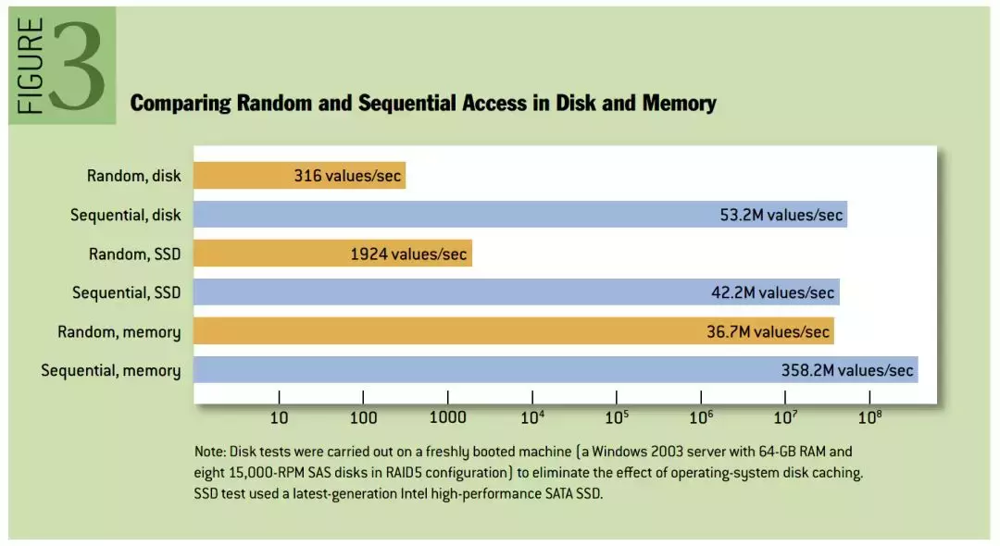

# 挖掘 Kafka的底层原理 - 三个关注点

原文：https://www.toutiao.com/a6718537748367540749/?log_from=3eb13fb8d19bc8_1632445335281

​        Kafak 既能做消息中间件削峰解耦，又能做实时流处理，数据业务两手抓。**Kafka 的核心思想：所有的消息以 “有序日志” 的方式存储，生产者将消息发不到末端（可理解为追加），消费者从某个逻辑位按序拉取。**

## 一. 消息中间件角色

​        在选择消息中间件时，主要关注的点有以下三个：**性能、可靠性、顺序性**

### 1.1 性能

​        关于 Kafka 的高性能，主要是因为它在实现上利用了操作系统一些底层的优化技术。下图高度概括了Kafka高性能的几个技术要点：

#### 1.1.1 零拷贝

​        这是 Kafak 在消费者端的优化，通过下面两张图来比较一下传统方式与零拷贝方式的差异：

* **传统方式**

  

* **零拷贝方式**

  

​        从上面的图中可以看出，**零拷贝**省略了拷贝到用户缓冲的步骤，通过文件描述符，直接从内核空间将数据复制到网卡接口。

#### 1.1.2 顺序写入

​        写入消息时，采用文件追加的方式，并且**不允许修改**已经写入的消息。于是写入磁盘的方式是顺序写入。通常认为的基于磁盘读写性能比较差，指的是基于磁盘的随机读写。实际上，基于磁盘的顺序读写，性能接近于内存的随机读写。下面是性能对比：

#### 1.1.3 内存映射

​        用户空间的一段内存区域映射到**内核空间**，无论是内核空间或用户空间对这段内存区域的修改，都可以直接映射到另一个区域。

* **优势**：如果内核态和用户态在大量的数据传输，效率是非常高的
* **原因**：概括来讲，传统方式为 ***read()*** 系统调用，进行了两次数据拷贝；内存映射方式为 ***mmap()*** 系统调用，只进行了一次数据拷贝

#### 1.1.4 批量压缩

* **生产者**：批量发送消息集
* **消费者**：主动拉取数据，同样采用批量拉取的方式

### 1.2 可靠性

​        Kafka 的 **副本机制** 是保证其可靠性的核心。

​        关于副本机制，可以将它理解为 ***Leader - Follower*** 机制，就是多个服务器中有相同数据的多个副本，并且**划分的粒度是分区**。这样的策略就有以下几个问题必须解决：

* 副本之间如何同步？
  * **ISR机制**：Leader 动态维护一个 ***ISR*** ( *In-Sync Replica* ) 列表
* Leader故障时，如何选举新的Leader？
  * 引入 ZooKeeper，它是 Kafka 实现副本机制的前提。Broker、Topics、Partitions 的元信息存储在 ZooKeeper 中，Leader 发生故障时，从ISR集合中进行选举新的 Leader

​        **request.required.acks** 来设置数据的可靠性：

| 值   | 含义                         | 可靠性                 |
| ---- | ---------------------------- | ---------------------- |
| 0    | 发送即可，不管是否成功写入   | 会丢失数据             |
| 1    | Leader 写成功即可            | 主动切换时可能丢失数据 |
| -1   | ISR 中所有机器写成功才算成功 | 不会丢失数据           |

​        分区机制和副本机制的知识点：

### 1.3 顺序性

​        顺序性保证，主要依赖于 **分区机制 + 偏移量**。

​        在了解分区之前，先来解释一下相关的概念以及它们之间的联系：

* **服务器**（**Broker**）：一个独立的Kafka 服务器
* **主题**（**Topic**）：消费的逻辑分类，**可以跨多个 Broker**
* **分区**（**Partition**）：消息的物理分类，**基本的存储单元**

​        下图是这些概念之间的关系：

​        那么，为什么分区机制可以保证消息的顺序性呢？

* Kafka 可以保证一个分区内消息是**有序且不可变**的
* **生产者**：
  * Kafka 的消息是一个**键值对**，通过设置键值，指定消息被发送到特定主题的特定分区
  * 通过设置 Key，将同一类型的消息，发送到同一个分区，就可以保证消息的有序性
* **消费者**：消费者需要通过保存**偏移量**，来记录自己消费到哪个位置。在 0.10 版之前，偏移量保存在 ZK 中，后来版本保存在名为 ***_consumeroffsets*** 的 topic 中

## 二. 流处理

​        在 0.10 版以后，Kafka 内置了流处理框架API - Kafka Stream，一个基于 Kafak 的流式处理类库。至此，Kafka也就随之发展成为一个囊括消息系统、存储系统、流处理系统的**中央式的流处理平台**。

​        与已有的Spark Streaming平台不同的是，Spark Streaming或Flink是一个系统架构，而Kafka Streams属于一个库。

- **Kafka Streams**：适合”Kafka --> Kafka“场景
- **Spark Streaming**：适合”Kafka --> 数据库” 或 “Kafka --> 数据科学模型” 场景